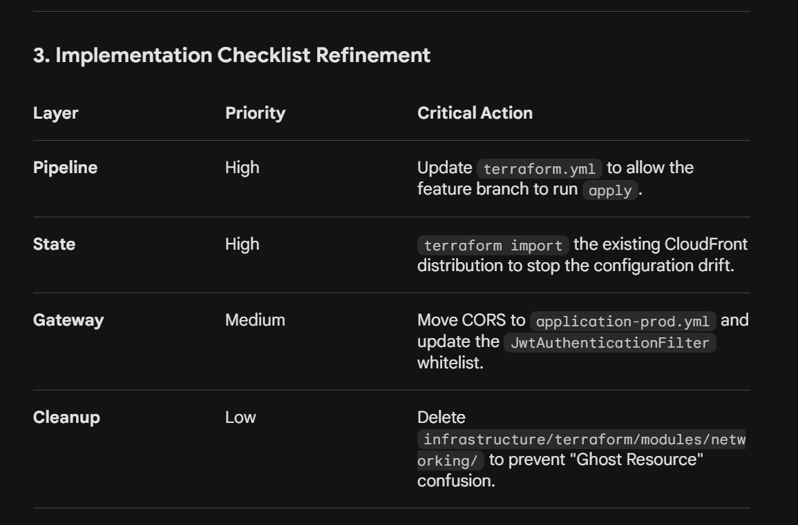

1. Analysis of the Findings
   Symptom 1: The "S3 Deep Link" Problem
   Your diagnosis of the /login vs. login.html mismatch is spot on. Since Next.js is in output: "export" mode, S3 treats the bucket as a flat file store.

The Gap: You correctly identified that the CloudFront Function meant to handle the internal rewrite is likely not deployed or not associated with the distribution currently receiving traffic.

The Drift: Your point about the terraform.yml being gated to main while you work on architecture/cloud-native-extraction is the "smoking gun" for why your infra changes haven't reached production.

Symptom 2: CORS Lockdown
The 403 on POST /api/auth/login is a classic Spring Security CORS failure.

The Cause: Since you aren't passing NEXT_PUBLIC_API_BASE_URL, the browser uses the same origin (https://vibhanshu-ai-portfolio.dev). Because the SecurityConfig.java only permits localhost, the preflight or the request itself is being rejected before it even hits your business logic.

Symptom 3 & 4: The Latent Blockers
JWT Filter: You’ve correctly anticipated the "Next Failure" pattern. Even if CORS is fixed, the JwtAuthenticationFilter will try to extract a token from a login request that (by definition) doesn't have one yet.

X-Origin-Verify: This is a critical security sync. If the Lambda expects this header but the (manually created) CloudFront distribution isn't sending it, the Gateway will reject everything.

2. Strategic Feedback on the Remediation Plan
   On "Import vs. Replace" (Stream A)
   I strongly recommend Importing (Option 1). If you replace the distribution, you may run into "Domain Name Already Exists" errors if you try to assign the same alias to a new distribution before the old one is fully deleted or the alias is removed.

On CORS (Stream C)
Instead of just adding the production domain, consider if you want to support Preview environments in the future. Using a regex or a comma-separated list in your application-prod.yml via @Value is the right move for flexibility.

A Small Warning: The S3 Sync
When you apply the CloudFront fix (setting default_root_object = ""), ensure your CloudFront Function handles the root path / correctly to point to index.html. If the function logic only looks for missing extensions, it might inadvertently break the home page if not carefully scripted.

Summary
The RCA is technically sound and logically structured. The most immediate "win" will be bringing the existing distribution under Terraform control; without that, none of your code-level fixes in the infra modules will actually take effect.

Does the current CloudFront Function logic handle the mapping of / to index.html, or is that still relying on the default_root_object?