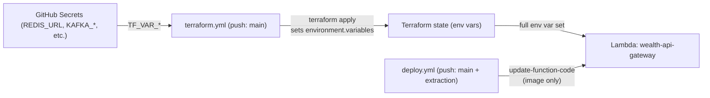

span

---

todos:

- id: "tf-vars"
  content: "Add `redis_url` and `kafka_*` variables to `infrastructure/terraform/variables.tf` and `infrastructure/terraform/modules/compute/variables.tf` (sensitive where appropriate)"
  status: pending
- id: "tf-locals"
  content: "Add `local.runtime_secrets` in `modules/compute/main.tf`; flip `common_env.SPRING_PROFILES_ACTIVE` to `prod,aws`"
  status: pending
- id: "tf-merge"
  content: "Merge `local.runtime_secrets` into env for all four `aws_lambda_function.*` resources"
  status: pending
- id: "tf-main"
  content: "Pass new variables through `infrastructure/terraform/main.tf` module \"compute\" call"
  status: pending
- id: "tf-tfvars-example"
  content: "Update `terraform.tfvars.example` and `localstack.tfvars` with new variables"
  status: pending
- id: "tfyml-env"
  content: "Add `TF_VAR_redis_url`, `TF_VAR_kafka_*` to `.github/workflows/terraform.yml` env block"
  status: pending
- id: "deploy-remove-env-step"
  content: "Delete the `Update Lambda function configuration (api-gateway runtime)` step from `.github/workflows/deploy.yml`"
  status: pending
- id: "deploy-dual-branch"
  content: "Change `deploy.yml` trigger to `push: branches: [main, architecture/cloud-native-extraction]`"
  status: pending
- id: "deploy-comments"
  content: "Update `deploy.yml` header comment block to document new ownership model (Terraform owns env vars)"
  status: pending
- id: "sync-lambda-remove"
  content: "Remove `--lambda` branch from `scripts/sync-secrets.sh`; update usage docs"
  status: pending
- id: "env-example-doc"
  content: "Update `.env.secrets.example` header to remove `--lambda` reference"
  status: pending
- id: "gitignore"
  content: "Add `.env.secrets`, `app-inspect.jar` (and safety globs) to `.gitignore`"
  status: pending
- id: "bootstrap-whitespace"
  content: "Discard uncommitted whitespace-only change in `infrastructure/terraform/bootstrap/main.tf`"
  status: pending
- id: "assert-plan"
  content: "Review / update `infrastructure/terraform/scripts/assert_plan.py` if it asserts on env-var set"
  status: pending
- id: "docs"
  content: "Append follow-up section to `docs/changes/CHANGES_PHASE3_INFRA_SUMMARY_19042026.md` (RCA, ownership topology, deprecation)"
  status: pending
- id: "verify"
  content: "(Post-merge) Verify live Lambda via `aws lambda get-function-configuration`, CloudWatch `INIT_REPORT`, and `/actuator/health`"
  status: pending
  isProject: false

---

## Context

- Four fixes already landed on both `main` and `architecture/cloud-native-extraction` (identical heads): LWA rename (`d91a4da` / `fbc3ef1`), `REDIS_URL` fallback (`aa1f129` / `fc715b9`), `.dockerignore` (`079920a` / `5dda746`), `cd.yml` disable (`e688aed` / `1dc1e29`).
- Root cause of the missing `REDIS_URL` on live Lambda: commit `2d06599` ("feat(infra): align CD with Image Lambda", Made-with: Cursor) rewrote `deploy.yml`'s env block from a `cat <<EOF` heredoc (Kiro's `9f9e112`) to a `jq -n` builder and silently dropped `REDIS_URL`, `KAFKA_*`, and `SPRING_DATASOURCE_*` from the `Variables` map. `aws lambda update-function-configuration` performs a full replace, so every `deploy.yml` run wipes them.
- `scripts/sync-secrets.sh` correctly pushes `REDIS_URL` to GitHub Actions secrets via `gh secret set -f`, but **no workflow reads `secrets.REDIS_URL` and maps it to the Lambda**, and its own `--lambda` JSON (`sync-secrets.sh:79-95`) also omits it. Terraform never had `REDIS_URL` either.

## Ownership topology (target)



After this change, `deploy.yml` only updates the image; `terraform.yml` owns the full `Variables` map. No more overwrites.

## Phase A — Terraform owns runtime env vars

**`infrastructure/terraform/modules/compute/variables.tf`** — add:

- `variable "redis_url"` (sensitive)
- `variable "kafka_bootstrap_servers"`, `variable "kafka_sasl_username"` (sensitive), `variable "kafka_sasl_password"` (sensitive) — include now so we never repeat this cycle for Kafka

**`infrastructure/terraform/modules/compute/main.tf`** — extend `locals`:

```hcl
locals {
  common_env = {
    JAVA_TOOL_OPTIONS            = "-XX:+TieredCompilation -XX:TieredStopAtLevel=1"
    SPRING_PROFILES_ACTIVE       = "prod,aws"
    AWS_LAMBDA_EXEC_WRAPPER      = "/opt/bootstrap"
    PORT                         = "8080"
    AWS_LWA_ASYNC_INIT           = "true"
    AWS_LWA_READINESS_CHECK_PATH = "/actuator/health"
  }

  runtime_secrets = {
    REDIS_URL               = var.redis_url
    KAFKA_BOOTSTRAP_SERVERS = var.kafka_bootstrap_servers
    KAFKA_SASL_USERNAME     = var.kafka_sasl_username
    KAFKA_SASL_PASSWORD     = var.kafka_sasl_password
  }

  api_gateway_container_env = {
    JAVA_TOOL_OPTIONS            = local.common_env.JAVA_TOOL_OPTIONS
    SPRING_PROFILES_ACTIVE       = local.common_env.SPRING_PROFILES_ACTIVE
    AWS_LWA_ASYNC_INIT           = "true"
    AWS_LWA_READINESS_CHECK_PATH = "/actuator/health"
  }
}
```

Changes to profile: flip `common_env.SPRING_PROFILES_ACTIVE` from `"aws"` to `"prod,aws"` to match what `deploy.yml` was setting (so removing the overwrite doesn't regress profile loading).

Merge `runtime_secrets` into each function's `environment.variables`:

- `aws_lambda_function.api_gateway`: `merge(local.api_gateway_container_env, local.runtime_secrets, { SERVER_PORT = "8080", PORT = "8080", PORTFOLIO_SERVICE_URL = ..., MARKET_DATA_SERVICE_URL = ..., INSIGHT_SERVICE_URL = ..., AUTH_JWK_URI = var.auth_jwk_uri, CLOUDFRONT_ORIGIN_SECRET = var.cloudfront_origin_secret })` — keeps the existing shape, just adds `local.runtime_secrets`.
- `aws_lambda_function.portfolio`: `merge(local.common_env, local.runtime_secrets, { SPRING_DATASOURCE_URL = var.postgres_connection_string })`.
- `aws_lambda_function.market_data`: `merge(local.common_env, local.runtime_secrets, { SPRING_DATA_MONGODB_URI = var.mongodb_connection_string })`.
- `aws_lambda_function.insight`: `merge(local.common_env, local.runtime_secrets)`.

**`infrastructure/terraform/variables.tf`** — add the same four variables.
**`infrastructure/terraform/main.tf`** — pass them through to `module "compute"`.
**`infrastructure/terraform/terraform.tfvars.example`** / `localstack.tfvars` — document placeholders (localstack uses `redis://localhost:6379`, empty kafka values).

## Phase B — `terraform.yml` wires GitHub secrets into TF_VARs

`.github/workflows/terraform.yml` env block: append

```yaml
TF_VAR_redis_url: ${{ secrets.REDIS_URL }}
TF_VAR_kafka_bootstrap_servers: ${{ secrets.KAFKA_BOOTSTRAP_SERVERS }}
TF_VAR_kafka_sasl_username: ${{ secrets.KAFKA_SASL_USERNAME }}
TF_VAR_kafka_sasl_password: ${{ secrets.KAFKA_SASL_PASSWORD }}
```

`scripts/assert_plan.py` — update the allow-list / expected-env assertions if it introspects Lambda env vars.

## Phase C — `deploy.yml` becomes image-only + dual-branch

- Remove the entire `Update Lambda function configuration (api-gateway runtime)` step (lines 137–176) and its `jq`/`aws lambda update-function-configuration` logic. Drop the `PORTFOLIO_SERVICE_URL`, `MARKET_DATA_SERVICE_URL`, `INSIGHT_SERVICE_URL`, `AUTH_JWK_URI`, `CLOUDFRONT_ORIGIN_SECRET` env references on that step.
- Keep: `Build and push backend image`, the `LastUpdateStatus` wait loop, and `Update Lambda function image`.
- Change trigger to:

```yaml
on:
  push:
    branches:
      - main
      - architecture/cloud-native-extraction
```

- Update the comment block at the top of `deploy.yml` to record that env vars are now owned by `terraform.yml` and list the removed GitHub secrets that are no longer consumed here.

## Phase D — Decommission `sync-secrets.sh --lambda`

- Remove the `--lambda` branch (lines 65–126) entirely. It is now a foot-gun: any direct `update-function-configuration` will drift from Terraform-managed state.
- Keep the `gh secret set -f` path; update the usage comment to:

> "Env vars on live Lambdas are owned by Terraform. Set them as GitHub Actions secrets via this script; they will be applied on the next `terraform.yml` run from `main`."

- Update `.env.secrets.example` comment at the top to remove the `--lambda` reference.

## Phase E — Hygiene

- `.gitignore`: add `.env.secrets` and `app-inspect.jar` (and `*.env.secrets` for safety). Currently only `.env` and `*.env.local` are ignored.
- Decide on the uncommitted whitespace-only change in `infrastructure/terraform/bootstrap/main.tf` — recommend discarding (`git restore`) since it's noise.

## Phase F — Post-merge verification (manual, post-execution)

Run against live `wealth-mgmt-backend-lambda` in `ap-south-1` after `main` merge triggers both workflows:

```bash
# 1. Env vars fully Terraform-managed (REDIS_URL present, no drift)
aws lambda get-function-configuration --function-name wealth-mgmt-backend-lambda \
  --query 'Environment.Variables' --output json

# 2. No Extension.Crash in the latest init phase
aws logs tail /aws/lambda/wealth-mgmt-backend-lambda --since 5m \
  --filter-pattern "INIT_REPORT"

# 3. End-to-end readiness via the Function URL /actuator/health
curl -sS "$(terraform -chdir=infrastructure/terraform output -raw api_gateway_function_url)actuator/health"
```

Expected: `INIT_REPORT Status: success`, `Max Memory Used` >> 4 MB (a fully-loaded Spring Boot context is typically 400–800 MB), `/actuator/health` returns `{"status":"UP"}`.

## Phase G — Documentation

Append a new section to `docs/changes/CHANGES_PHASE3_INFRA_SUMMARY_19042026.md` (or a new `CHANGES_PHASE3_INFRA_SUMMARY_19042026-followup.md`) covering:

- Regression RCA for commit `2d06599` (env vars dropped in `jq` rewrite).
- New ownership topology (Mermaid from above).
- Deprecation of `sync-secrets.sh --lambda`.
- Dual-branch trigger rationale (work happens on `architecture/cloud-native-extraction` and is periodically copied to `main`; both must deploy to avoid breakage at merge time).

## Out of scope / follow-ups

- Kafka certificate issue (pre-existing, tracked separately — section 4 of the existing changelog).
- Per-service `deploy.yml` pipelines for `portfolio-service` / `market-data-service` / `insight-service` (currently only api-gateway has an image deploy path; the others are Zip/Layer-style in Terraform).
- Uncommitted whitespace-only diff in `infrastructure/terraform/bootstrap/main.tf` — handled in Phase E; no code impact.

## Risk notes

- Any existing manual `aws lambda update-function-configuration` values (including the hand-set `REDIS_URL`) will be reconciled to the Terraform-declared state on the next `terraform.yml` run. Ensure `REDIS_URL` is in GitHub Secrets (it is, per `.env.secrets`) before merging.
- Terraform apply will drop the `AWS_LAMBDA_EXEC_WRAPPER=/opt/bootstrap` entry from api-gateway (it's already absent in the container-env local) — this is correct for the Image Lambda + LWA sidecar pattern and matches current behaviour.
- First `terraform apply` after this change will show an `environment.variables` diff for all four functions; review the plan output in `assert_plan.py` and the PR artifact before merging.
