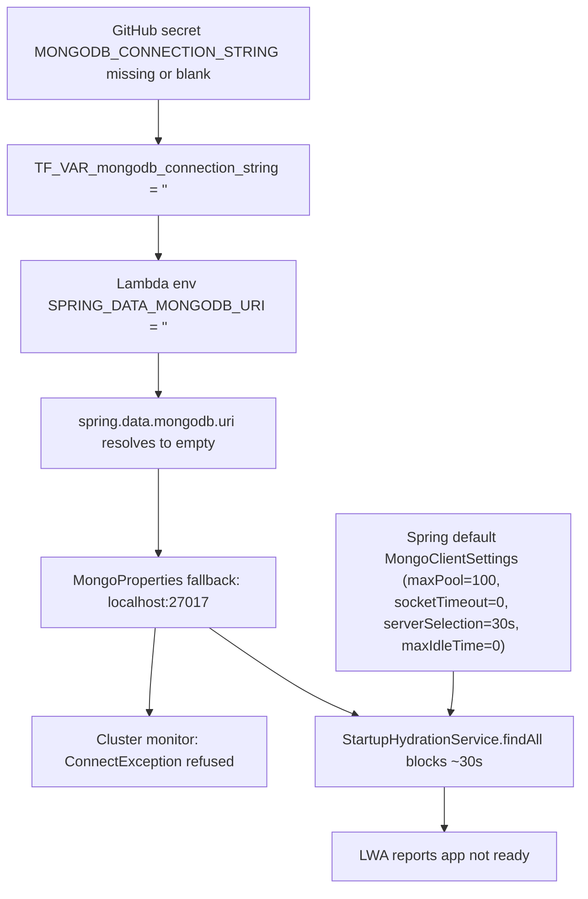

<!-- 429d07a1-c1e6-4733-b847-c1e20bbeef9e -->
---
todos:
  - id: "tf-validation"
    content: "Add URI validation to mongodb_connection_string variable in infrastructure/terraform/variables.tf and modules/compute/variables.tf"
    status: pending
  - id: "restore-secret"
    content: "Restore/verify MONGODB_CONNECTION_STRING GitHub secret, then re-run terraform.yml to refresh aws_lambda_function.market_data env"
    status: pending
  - id: "remove-localhost-default"
    content: "Move the localhost:27017 default from application.yml to a new application-local.yml so non-local deployments never silently fall back"
    status: pending
  - id: "mongo-config-bean"
    content: "Add market-data-service/src/main/java/com/wealth/market/MongoConfig.java with MongoClientSettingsBuilderCustomizer (maxSize=5, minSize=0, maxIdleTime=30s, connectTimeout=5s, readTimeout=10s, serverSelectionTimeout=5s) under @Profile(\"aws\") plus a startup URI assertion"
    status: pending
  - id: "decouple-hydration"
    content: "Convert StartupHydrationService from ApplicationRunner to ApplicationListener<ApplicationReadyEvent> so Mongo latency cannot block LWA readiness"
    status: pending
  - id: "expose-mongo-metrics"
    content: "Expose mongodb pool metrics via management.endpoints.web.exposure.include in application-prod.yml for observability"
    status: pending
  - id: "verify-deployment"
    content: "Post-deploy: confirm env var value, cluster hosts in logs, INFRA-OK MongoDB ping, and that LWA readiness no longer warns"
    status: pending
isProject: false
---
## Root Cause Analysis

### Primary root cause — URI resolves to empty, driver falls back to `localhost:27017`

- The log shows the driver was built with `hosts=[localhost:27017], credential=null, sslSettings={enabled=false}` — that is identical to the literal default baked into `application.yml`:

```8:8:market-data-service/src/main/resources/application.yml
      uri: ${SPRING_DATA_MONGODB_URI:mongodb://localhost:27017/market_db}
```

- Under `prod,aws` profiles, the active URI comes from `application-prod.yml`, which deliberately has no placeholder default:

```13:18:market-data-service/src/main/resources/application-prod.yml
  data:
    mongodb:
      # Terraform injects SPRING_DATA_MONGODB_URI into the Lambda environment.
      # Docker Compose uses SPRING_DATA_MONGODB_URI (base application.yml) for local dev.
      uri: ${SPRING_DATA_MONGODB_URI}
      auto-index-creation: false
```

- Terraform is the sole owner of that env var on Lambda:

```255:263:infrastructure/terraform/modules/compute/main.tf
  environment {
    variables = merge(local.common_env, local.runtime_secrets, {
      SPRING_DATA_MONGODB_URI = var.mongodb_connection_string
      AWS_LWA_READINESS_CHECK_PATH = "/actuator/health/liveness"
    })
  }
```

and `var.mongodb_connection_string` is plumbed from the GitHub secret `MONGODB_CONNECTION_STRING` in `.github/workflows/terraform.yml:31`.

- Spring Boot's `MongoProperties` treats an empty `spring.data.mongodb.uri` as "not set" and falls back to host/port defaults (`localhost:27017`). That is exactly the observed behaviour — confirming the Lambda is running with an empty `SPRING_DATA_MONGODB_URI`. Most likely the repo/environment's `MONGODB_CONNECTION_STRING` GitHub secret is missing or blank for this environment, so Terraform wired `""` into the Lambda.

### Secondary root cause — client not tuned for serverless, masks and amplifies the first issue

The `MongoClientSettings` printed in the log (`maxSize=100`, `minSize=0`, `maxConnectionIdleTimeMS=0`, `socketTimeoutMS=0`, `serverSelectionTimeoutMS=30000 ms`, `connectTimeoutMS=10000 ms`) are Spring Boot defaults. None of the `mongodb-connection` skill's serverless recommendations are applied. The comment in `application-prod.yml` acknowledges the gap ("requires a MongoClientSettingsBuilderCustomizer bean (see MongoConfig if needed)") but no such bean exists in `market-data-service`.

### Why LWA keeps logging "app is not ready after Nms"

`StartupHydrationService` is an `ApplicationRunner` and runs before `ApplicationReadyEvent`:

```57:65:market-data-service/src/main/java/com/wealth/market/StartupHydrationService.java
    private void runHydration() {
        List<AssetPrice> assets;
        try {
            assets = assetPriceRepository.findAll();
        } catch (Exception e) {
            log.warn("StartupHydrationService: failed to load asset prices from MongoDB — skipping hydration. Cause: {}",
                    e.getMessage());
            return;
        }
```

With `serverSelectionTimeoutMS=30000`, `findAll()` blocks ~30 s waiting for a server it can never find (because the target is `localhost:27017` inside the Lambda container), LWA polls `/actuator/health/liveness` every ~1–2 s but Spring has not yet published actuator endpoints → `app is not ready after 4000ms / 6000ms`. The Mongo health indicator is already disabled in `application-aws.yml`, so that is not contributing — the delay is pure driver timeout multiplied by startup-time I/O.

### RCA dependency chain



## Fix Plan

### Fix 1 — Restore the injected URI (infrastructure)

Verify and restore the `MONGODB_CONNECTION_STRING` GitHub Actions secret, then re-apply Terraform so the Lambda environment carries a real URI. Also harden the variable so a blank value never silently deploys again.

- In `infrastructure/terraform/variables.tf`, strengthen `variable "mongodb_connection_string"` with a validation block:

```hcl
variable "mongodb_connection_string" {
  type      = string
  sensitive = true
  validation {
    condition     = can(regex("^mongodb(\\+srv)?://", var.mongodb_connection_string))
    error_message = "mongodb_connection_string must be a valid mongodb:// or mongodb+srv:// URI."
  }
}
```

- Mirror the same validation in `infrastructure/terraform/modules/compute/variables.tf`.
- After pushing the fix, re-run `terraform.yml` in GitHub Actions (or `tf-apply.ps1` locally with `.env.secrets` loaded) to re-apply `aws_lambda_function.market_data` so the env var is re-populated.

### Fix 2 — Fail-fast placeholder in the prod profile (defence in depth)

Keep prod fail-fast but make the misconfiguration visible at startup instead of silently falling back to `localhost`. In `market-data-service/src/main/resources/application-prod.yml:16` replace `${SPRING_DATA_MONGODB_URI}` with a required placeholder that also rejects blanks — Spring Boot honours SpEL `#{T(...).hasText(...)}` patterns, but the simplest and most idiomatic change is to assert non-empty at startup via a small `@Configuration` check (see Fix 3). Also remove the silent `localhost` fallback from `application.yml` so the fallback only applies under the `local` profile:

- Move the current `${SPRING_DATA_MONGODB_URI:mongodb://localhost:27017/market_db}` default to a new `application-local.yml` and keep `application.yml` as `uri: ${SPRING_DATA_MONGODB_URI}`. This prevents any non-`local` deployment from ever silently using `localhost:27017`.

### Fix 3 — Add a Lambda-tuned `MongoClientSettingsBuilderCustomizer`

Per `.agents/skills/mongodb-connection/SKILL.md` "Scenario: Serverless Environments", introduce a new `MongoConfig` bean in `market-data-service/src/main/java/com/wealth/market/MongoConfig.java` that is active only under the `aws` profile:

```java
@Configuration
@Profile("aws")
class MongoConfig {

    @Bean
    MongoClientSettingsBuilderCustomizer lambdaMongoClientCustomizer() {
        return builder -> builder
                .applyToConnectionPoolSettings(pool -> pool
                        .maxSize(5)
                        .minSize(0)
                        .maxConnectionIdleTime(30, TimeUnit.SECONDS))
                .applyToSocketSettings(socket -> socket
                        .connectTimeout(5, TimeUnit.SECONDS)
                        .readTimeout(10, TimeUnit.SECONDS))
                .applyToClusterSettings(cluster -> cluster
                        .serverSelectionTimeout(5, TimeUnit.SECONDS));
    }

    @Bean
    ApplicationRunner mongoUriAssertion(@Value("${spring.data.mongodb.uri:}") String uri) {
        return args -> {
            if (uri == null || uri.isBlank() || uri.startsWith("mongodb://localhost")) {
                throw new IllegalStateException(
                        "spring.data.mongodb.uri is empty or points to localhost under aws profile — " +
                        "SPRING_DATA_MONGODB_URI is not being injected by Terraform.");
            }
        };
    }
}
```

Rationale, keyed to the skill's serverless table:

- `maxSize=5`: each warm Lambda instance has its own pool; 3–5 is the skill's recommended ceiling.
- `minSize=0`: Lambda instances are short-lived; avoid maintaining unused connections.
- `maxConnectionIdleTime=30s`: release unused connections quickly between invocations.
- `connectTimeout=5s` and `serverSelectionTimeout=5s`: fail fast so startup hydration cannot stall for 30 s again; well within the "set to a value greater than the longest network latency to a member of the set" guidance for Atlas.
- `readTimeout=10s`: non-zero per skill ("Use socketTimeoutMS to ensure that sockets are always closed"); tuned for short OLTP reads done by the hydration/refresh jobs.

### Fix 4 — Don't block startup on MongoDB

Move `StartupHydrationService` off the `ApplicationRunner` path so Mongo outages can never push LWA past its readiness budget. Either:

- Change `class StartupHydrationService implements ApplicationRunner` → `implements ApplicationListener<ApplicationReadyEvent>` so it fires AFTER the actuator is up (LWA will have marked the instance ready), OR
- Keep `ApplicationRunner` but wrap `assetPriceRepository.findAll()` in `CompletableFuture.runAsync(...)` so the main thread returns immediately.

The first option is preferred — it matches the pattern already used by `InfrastructureHealthLogger` in the same module and guarantees LWA readiness is decoupled from Mongo reachability.

### Fix 5 — Add connection-pool monitoring (skill guidance)

Enable the MongoDB driver's CMAP event telemetry so pool exhaustion / churn is observable in CloudWatch. `io.micrometer.core.instrument.binder.mongodb.MongoMetricsConnectionPoolListener` is already registered (visible in the log). Expose the resulting metrics by adding `mongodb` to `management.endpoints.web.exposure.include` in `application-prod.yml` and adding a CloudWatch alarm on `mongodb.driver.pool.checkedout` / `mongodb.driver.pool.size` (tracked separately in infra).

## Verification

1. After restoring the secret and re-applying Terraform: `aws lambda get-function-configuration --function-name wealth-market-data-service --query 'Environment.Variables.SPRING_DATA_MONGODB_URI'` must return the Atlas URI (not empty, not localhost).
2. Invoke the Lambda and confirm the `org.mongodb.driver.cluster` log now shows `hosts=[<atlas-host>:27017]` and `credential=MongoCredential{...}`.
3. Confirm `[INFRA-OK] MongoDB — ping succeeded` from `InfrastructureHealthLogger` in CloudWatch.
4. Confirm LWA no longer logs "app is not ready after Nms" beyond the first 2–3 probes.
5. Run `./gradlew :market-data-service:test` — existing Testcontainers tests continue to pass (the new `MongoConfig` is `@Profile("aws")`-gated, so tests are unaffected).