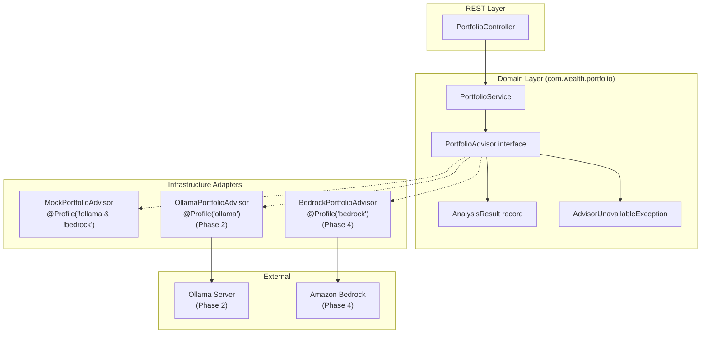
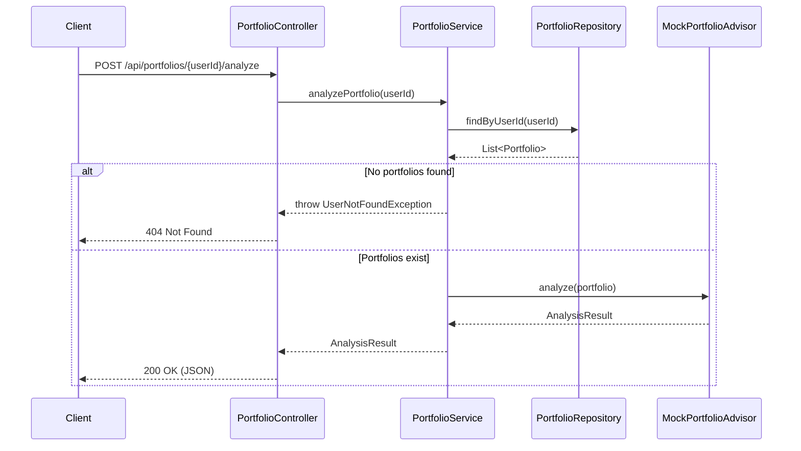

# Design Document: AI Portfolio Advisor

## Overview

This feature adds AI-powered portfolio analysis to the `portfolio-service` through a hexagonal architecture pattern that mirrors the existing `FxRateProvider` / `StaticFxRateProvider` design. A `PortfolioAdvisor` domain port interface in `com.wealth.portfolio` abstracts all AI concerns, while profile-scoped adapters provide concrete implementations: `MockPortfolioAdvisor` (default/CI), `OllamaPortfolioAdvisor` (local inference), and `BedrockPortfolioAdvisor` (AWS production).

The feature delivers three AI capabilities across phased implementation:

1. **Phase 1 — Foundation & Mock Strategy** (this implementation focus): `PortfolioAdvisor` interface, `AnalysisResult` record, `MockPortfolioAdvisor`, REST endpoint at `/api/portfolios/{userId}/analyze`, `AdvisorUnavailableException`, and unit tests. No Spring AI dependencies are added yet.
2. **Phase 2 — Ollama Adapter**: `OllamaPortfolioAdvisor` with Spring AI `ChatClient`, `application-ollama.yml`, system prompt template, JSON response parsing.
3. **Phase 3 — Market Summarizer & Chat Assistant**: Kafka-driven market summary generation, Redis caching, `/api/market/summary` endpoint, `/api/chat` context-aware chat endpoint.
4. **Phase 4 — Bedrock Adapter**: `BedrockPortfolioAdvisor` for AWS production deployment.

### Design Rationale

The port-and-adapter approach was chosen because:

- It matches the established `FxRateProvider` pattern, keeping the codebase consistent
- Domain logic (`PortfolioService`, controllers) never imports AI vendor classes
- Profile-based adapter selection (`@Profile("!ollama & !bedrock")`, `@Profile("ollama")`, `@Profile("bedrock")`) enables zero-config switching between mock, local AI, and cloud AI
- The mock adapter enables fast CI pipelines and local development with no external dependencies

## Architecture

### Component Diagram



### Request Flow (Phase 1)



### Profile Selection Strategy

| Profile Active           | Adapter Bean Created      | Dependencies Required               |
| ------------------------ | ------------------------- | ----------------------------------- |
| (none / default / local) | `MockPortfolioAdvisor`    | Core Java + Spring annotations only |
| `ollama`                 | `OllamaPortfolioAdvisor`  | Spring AI Ollama starter            |
| `bedrock`                | `BedrockPortfolioAdvisor` | Spring AI Bedrock starter           |

## Components and Interfaces

### 1. PortfolioAdvisor (Domain Port)

**Package:** `com.wealth.portfolio`
**Type:** Interface
**Dependencies:** Zero infrastructure dependencies — only `com.wealth.portfolio.Portfolio` and `com.wealth.portfolio.AnalysisResult`

```java
package com.wealth.portfolio;

/**
 * Domain port for AI-powered portfolio analysis.
 *
 * <p>Implementations must be thread-safe. The analyze method accepts a Portfolio
 * entity and returns a structural analysis result. Implementations MUST NOT
 * provide personalised financial advice.
 *
 * <p>If the portfolio has zero holdings, implementations MUST return an
 * AnalysisResult with riskScore 0 and empty lists.
 */
public interface PortfolioAdvisor {

    /**
     * Analyzes the given portfolio and returns risk assessment,
     * concentration warnings, and rebalancing suggestions.
     *
     * @param portfolio the portfolio to analyze (must not be null)
     * @return analysis result (never null)
     * @throws AdvisorUnavailableException if the underlying AI service is unreachable
     */
    AnalysisResult analyze(Portfolio portfolio);
}
```

This mirrors `FxRateProvider` — a single-method domain port with no infrastructure imports.

### 2. AnalysisResult (Domain DTO)

**Package:** `com.wealth.portfolio`
**Type:** Record
**Dependencies:** Core Java only (`java.util.List`)

```java
package com.wealth.portfolio;

import java.util.List;

/**
 * Immutable result of a portfolio analysis.
 *
 * @param riskScore               risk level 1–100 (0 for empty portfolios)
 * @param concentrationWarnings   warnings about over-concentrated positions
 * @param rebalancingSuggestions   actionable rebalancing suggestions (max 3)
 */
public record AnalysisResult(
        int riskScore,
        List<String> concentrationWarnings,
        List<String> rebalancingSuggestions
) {
    public AnalysisResult {
        concentrationWarnings = List.copyOf(concentrationWarnings);
        rebalancingSuggestions = List.copyOf(rebalancingSuggestions);
    }
}
```

The compact constructor creates defensive copies, ensuring immutability.

### 3. MockPortfolioAdvisor (Default Adapter)

**Package:** `com.wealth.portfolio.ai`
**Type:** Class implementing `PortfolioAdvisor`
**Annotations:** `@Service`, `@Profile("!ollama & !bedrock")`
**Dependencies:** Core Java + Spring `@Service` and `@Profile` annotations only

```java
@Service
@Profile("!ollama & !bedrock")
public class MockPortfolioAdvisor implements PortfolioAdvisor {

    @Override
    public AnalysisResult analyze(Portfolio portfolio) {
        if (portfolio.getHoldings().isEmpty()) {
            return new AnalysisResult(0, List.of(), List.of());
        }
        return new AnalysisResult(
            42,
            List.of("Portfolio is concentrated in technology sector (>40% allocation)"),
            List.of(
                "Consider diversifying into bonds or fixed-income assets",
                "Reduce single-stock exposure to below 20% of total portfolio"
            )
        );
    }
}
```

Returns deterministic, hardcoded responses. No network calls, no file I/O, sub-millisecond execution.

### 4. AdvisorUnavailableException

**Package:** `com.wealth.portfolio`
**Type:** Unchecked exception extending `RuntimeException`

```java
package com.wealth.portfolio;

public class AdvisorUnavailableException extends RuntimeException {

    public AdvisorUnavailableException(String message, Throwable cause) {
        super(message, cause);
    }

    public AdvisorUnavailableException(String message) {
        super(message);
    }
}
```

Follows the same pattern as `FxRateUnavailableException` — unchecked, carries a message and optional cause.

### 5. GlobalExceptionHandler Extension

Add a new `@ExceptionHandler` method to the existing `GlobalExceptionHandler`:

```java
@ExceptionHandler(AdvisorUnavailableException.class)
public ResponseEntity<Map<String, Object>> handleAdvisorUnavailable(
        AdvisorUnavailableException ex) {
    return ResponseEntity.status(HttpStatus.SERVICE_UNAVAILABLE).body(Map.of(
            "error", "AI advisor unavailable",
            "retryable", true
    ));
}
```

This mirrors the existing `handleFxRateUnavailable` handler — HTTP 503 with `retryable: true`.

### 6. PortfolioController — Analyze Endpoint

Add a new endpoint to the existing `PortfolioController`:

```java
@PostMapping("/portfolios/{userId}/analyze")
public ResponseEntity<AnalysisResult> analyzePortfolio(@PathVariable String userId) {
    return ResponseEntity.ok(portfolioService.analyzePortfolio(userId));
}
```

**Note on URL pattern:** The requirements specify `/api/portfolios/{userId}/analyze` (plural, with path variable for userId). This differs from the existing `/api/portfolio` (singular, userId in header). The new endpoint uses `@PathVariable` for userId instead of `@RequestHeader`. The controller's `@RequestMapping` base path is `/api/portfolio`, so the new method maps to `/api/portfolio` + `s/{userId}/analyze` — which requires either:

- A separate `@RequestMapping` on the method: `@PostMapping` with full path `/api/portfolios/{userId}/analyze` on a new controller, or
- Adding the endpoint to the existing controller with an explicit path

**Decision:** Add a dedicated `PortfolioAnalyzeController` mapped to `/api/portfolios` to keep the URL scheme clean and avoid path conflicts with the existing `/api/portfolio` controller. This follows separation of concerns — the analyze endpoint has different input semantics (path variable vs header).

```java
@RestController
@RequestMapping("/api/portfolios")
public class PortfolioAnalyzeController {

    private final PortfolioService portfolioService;

    public PortfolioAnalyzeController(PortfolioService portfolioService) {
        this.portfolioService = portfolioService;
    }

    @PostMapping("/{userId}/analyze")
    public ResponseEntity<AnalysisResult> analyzePortfolio(@PathVariable String userId) {
        return ResponseEntity.ok(portfolioService.analyzePortfolio(userId));
    }
}
```

### 7. PortfolioService — analyzePortfolio Method

Add a new method to the existing `PortfolioService`:

```java
@Transactional(readOnly = true)
public AnalysisResult analyzePortfolio(String userId) {
    List<Portfolio> portfolios = portfolioRepository.findByUserId(userId);
    if (portfolios.isEmpty()) {
        throw new UserNotFoundException(userId);
    }
    // Analyze the first portfolio (primary portfolio)
    return portfolioAdvisor.analyze(portfolios.getFirst());
}
```

The `PortfolioAdvisor` is injected via constructor alongside existing dependencies.

### 8. OllamaPortfolioAdvisor (Phase 2 — Future)

**Package:** `com.wealth.portfolio.ai`
**Annotations:** `@Service`, `@Profile("ollama")`
**Dependencies:** Spring AI `ChatClient`

Will use `ChatClient` to send portfolio data with a system prompt constraining the model to structural analysis only. Parses JSON response into `AnalysisResult`. Throws `AdvisorUnavailableException` on parse failures or connectivity issues. Clamps out-of-range `riskScore` values to 1–100.

### 9. BedrockPortfolioAdvisor (Phase 4 — Future)

**Package:** `com.wealth.portfolio.ai`
**Annotations:** `@Service`, `@Profile("bedrock")`
**Dependencies:** Spring AI Bedrock starter

Same contract as `OllamaPortfolioAdvisor` but targeting Amazon Bedrock (Anthropic Claude). Uses the same system prompt template for consistent analysis constraints. Configuration isolated in `application-bedrock.yml`.

### 10. MarketSummarizer (Phase 3 — Future)

**Package:** `com.wealth.portfolio.ai` or `com.wealth.market`
**Type:** Spring `@Service` consuming Kafka `market-prices` events

Batches price update events, sends to `PortfolioAdvisor` (or a dedicated summarization method) for AI summarization, caches result in Redis with configurable TTL. Exposed via `GET /api/market/summary`. Non-blocking Kafka consumer thread.

### 11. ChatController (Phase 3 — Future)

**Package:** `com.wealth.portfolio` or `com.wealth.chat`
**Type:** REST controller at `/api/chat`

Accepts `{ userId, message }`, injects portfolio summary into system prompt context, returns AI response. Returns 503 if AI unavailable, suggests adding holdings if no portfolio data exists.

## Data Models

### AnalysisResult Record

| Field                    | Type           | Constraints                             | Description                                |
| ------------------------ | -------------- | --------------------------------------- | ------------------------------------------ |
| `riskScore`              | `int`          | 0 for empty portfolios, 1–100 otherwise | Overall portfolio risk level               |
| `concentrationWarnings`  | `List<String>` | Immutable, may be empty                 | Warnings about over-concentrated positions |
| `rebalancingSuggestions` | `List<String>` | Immutable, max 3 items, may be empty    | Actionable rebalancing recommendations     |

### Existing Entities Used (No Changes)

- **Portfolio**: `id` (UUID), `userId` (String), `createdAt` (Instant), `holdings` (List\<AssetHolding\>)
- **AssetHolding**: `id` (UUID), `portfolio` (Portfolio), `assetTicker` (String), `quantity` (BigDecimal)

### JSON Response Format — `/api/portfolios/{userId}/analyze`

```json
{
  "riskScore": 42,
  "concentrationWarnings": [
    "Portfolio is concentrated in technology sector (>40% allocation)"
  ],
  "rebalancingSuggestions": [
    "Consider diversifying into bonds or fixed-income assets",
    "Reduce single-stock exposure to below 20% of total portfolio"
  ]
}
```

### JSON Error Response — AdvisorUnavailableException (HTTP 503)

```json
{
  "error": "AI advisor unavailable",
  "retryable": true
}
```

## Correctness Properties

_A property is a characteristic or behavior that should hold true across all valid executions of a system — essentially, a formal statement about what the system should do. Properties serve as the bridge between human-readable specifications and machine-verifiable correctness guarantees._

### Property 1: AnalysisResult invariants hold for any portfolio

_For any_ Portfolio (empty or non-empty), when passed to any `PortfolioAdvisor` implementation, the returned `AnalysisResult` SHALL have:

- `riskScore` of 0 if the portfolio has zero holdings, or `riskScore` in the range [1, 100] if the portfolio has one or more holdings
- `rebalancingSuggestions` with at most 3 items
- Non-null `concentrationWarnings` and `rebalancingSuggestions` lists

**Validates: Requirements 1.3, 1.4, 11.4**

### Property 2: MockPortfolioAdvisor returns non-empty analysis for any non-empty portfolio

_For any_ Portfolio with at least one AssetHolding (regardless of ticker, quantity, or number of holdings), `MockPortfolioAdvisor.analyze()` SHALL return an `AnalysisResult` with `riskScore` > 0, at least one `concentrationWarning`, and at least one `rebalancingSuggestion`.

**Validates: Requirements 2.3, 2.5**

### Property 3: AdvisorUnavailableException preserves message and cause

_For any_ non-null message string and any `Throwable` cause, constructing an `AdvisorUnavailableException(message, cause)` SHALL preserve both: `getMessage()` returns the message and `getCause()` returns the cause.

**Validates: Requirements 9.1**

### Property 4: AnalysisResult JSON round-trip (Phase 2)

_For any_ valid `AnalysisResult` object, serializing to JSON and then parsing back SHALL produce an equivalent `AnalysisResult` with identical `riskScore`, `concentrationWarnings`, and `rebalancingSuggestions`.

**Validates: Requirements 3.5, 9.3**

### Property 5: RiskScore clamping for out-of-range values (Phase 2)

_For any_ integer value returned by an AI model as `riskScore`, the adapter's clamping logic SHALL produce a value equal to `max(1, min(100, value))`.

**Validates: Requirements 9.5**

## Error Handling

### Exception Hierarchy

| Exception                       | HTTP Status | Response Body                                              | Trigger                                        |
| ------------------------------- | ----------- | ---------------------------------------------------------- | ---------------------------------------------- |
| `UserNotFoundException`         | 404         | (empty body)                                               | No portfolios found for userId                 |
| `AdvisorUnavailableException`   | 503         | `{"error": "AI advisor unavailable", "retryable": true}`   | AI service unreachable or unparseable response |
| `MissingRequestHeaderException` | 400         | `{"error": "Required header '...' is missing"}`            | Missing required header (existing)             |
| `FxRateUnavailableException`    | 503         | `{"error": "FX rate unavailable: ...", "retryable": true}` | FX rate lookup failure (existing)              |

### Error Flow

1. **No portfolio found**: `PortfolioService.analyzePortfolio()` throws `UserNotFoundException` → `GlobalExceptionHandler` returns 404
2. **AI adapter failure** (Phase 2+): `OllamaPortfolioAdvisor.analyze()` throws `AdvisorUnavailableException` → `GlobalExceptionHandler` returns 503 with retryable flag
3. **Malformed AI response** (Phase 2+): Adapter catches JSON parse exception, logs raw response at WARN, wraps in `AdvisorUnavailableException`
4. **Out-of-range riskScore** (Phase 2+): Adapter clamps to [1, 100] boundary and logs warning — does NOT throw

### Safety Constraints (Phase 2+)

All AI-backed adapters will use a system prompt containing:

> "Do not provide personalised financial advice. Do not recommend specific securities to buy or sell. Limit analysis to portfolio structure, concentration, and diversification."

This constraint is enforced at the prompt level, not in application code. The mock adapter returns only hardcoded structural analysis text.

## Testing Strategy

### Phase 1 Testing (Foundation — Current Focus)

**Unit Tests (run via `./gradlew test`):**

| Test Class                        | What It Verifies                                                                                                              |
| --------------------------------- | ----------------------------------------------------------------------------------------------------------------------------- |
| `MockPortfolioAdvisorTest`        | Non-empty portfolio → valid AnalysisResult with riskScore > 0, non-empty warnings/suggestions                                 |
| `MockPortfolioAdvisorTest`        | Empty portfolio → riskScore 0, empty lists                                                                                    |
| `MockPortfolioAdvisorTest`        | Deterministic output (same input → same output)                                                                               |
| `PortfolioAnalyzeControllerTest`  | `POST /api/portfolios/{userId}/analyze` → 200 with correct JSON structure                                                     |
| `PortfolioAnalyzeControllerTest`  | Unknown userId → 404                                                                                                          |
| `PortfolioAnalyzeControllerTest`  | `AdvisorUnavailableException` → 503 with `{"error": "AI advisor unavailable", "retryable": true}`                             |
| `AnalysisResultTest`              | Record immutability (defensive copy in compact constructor)                                                                   |
| `AdvisorUnavailableExceptionTest` | Message and cause preservation                                                                                                |
| `NoAiImportsTest`                 | Source files for `PortfolioAdvisor`, `AnalysisResult`, `MockPortfolioAdvisor` contain no Spring AI / Ollama / Bedrock imports |

**Property-Based Tests:**

Property-based testing applies to this feature for the domain logic layer. The `MockPortfolioAdvisor` is a pure function (deterministic, no side effects) and the `AnalysisResult` record has invariants that should hold across all valid inputs.

- Library: JUnit 5 with `@RepeatedTest` for lightweight property simulation, or jqwik for full PBT
- Minimum 100 iterations per property test
- Tag format: `Feature: ai-portfolio-advisor, Property {number}: {property_text}`

| Property   | Test Description                                                                                                  | Iterations |
| ---------- | ----------------------------------------------------------------------------------------------------------------- | ---------- |
| Property 1 | Generate random portfolios (0–10 holdings, random tickers/quantities), verify riskScore range and suggestions cap | 100+       |
| Property 2 | Generate random non-empty portfolios, verify mock returns non-empty warnings and suggestions                      | 100+       |
| Property 3 | Generate random strings and Throwables, verify exception preserves both                                           | 100+       |

**Dual Testing Approach:**

- Unit tests cover specific examples, edge cases (empty portfolio, exact JSON structure), and error paths (404, 503)
- Property tests cover universal invariants across randomized inputs (riskScore range, list constraints, exception construction)
- Together they provide comprehensive coverage without redundancy

### Phase 2+ Testing (Future)

- `OllamaPortfolioAdvisorTest`: Mocked `ChatClient`, verify JSON parsing, error handling, riskScore clamping
- Property 4 (JSON round-trip) and Property 5 (clamping) will be implemented when AI adapters are added
- Integration tests (`@Tag("integration")`) for Ollama connectivity, Kafka consumer, Redis caching
- All integration tests run via `./gradlew integrationTest`, not `./gradlew test`
