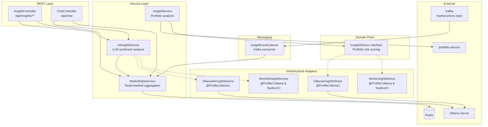
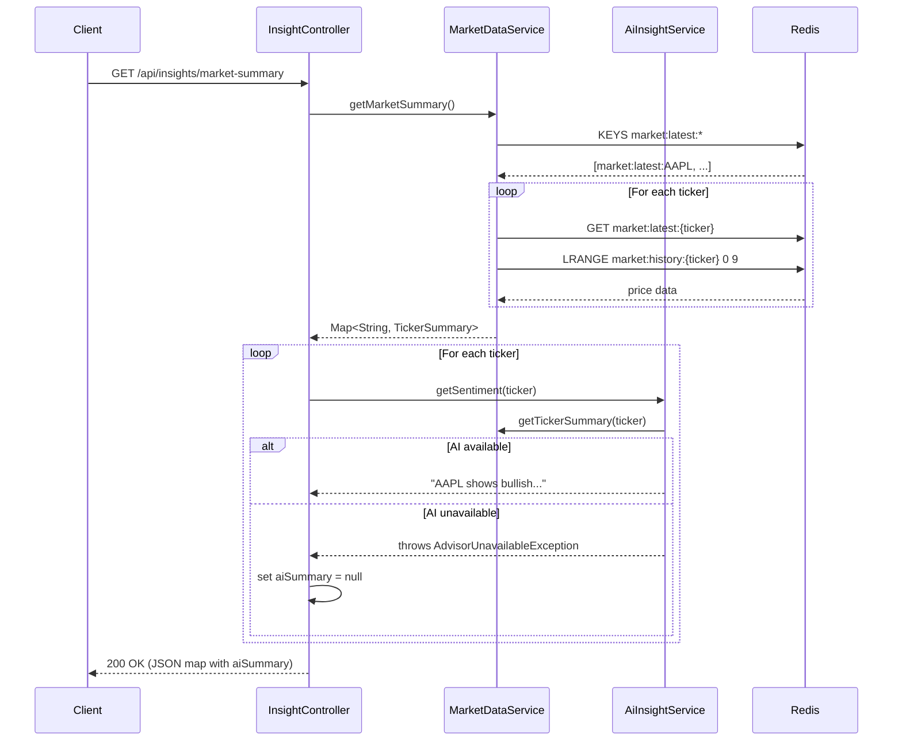
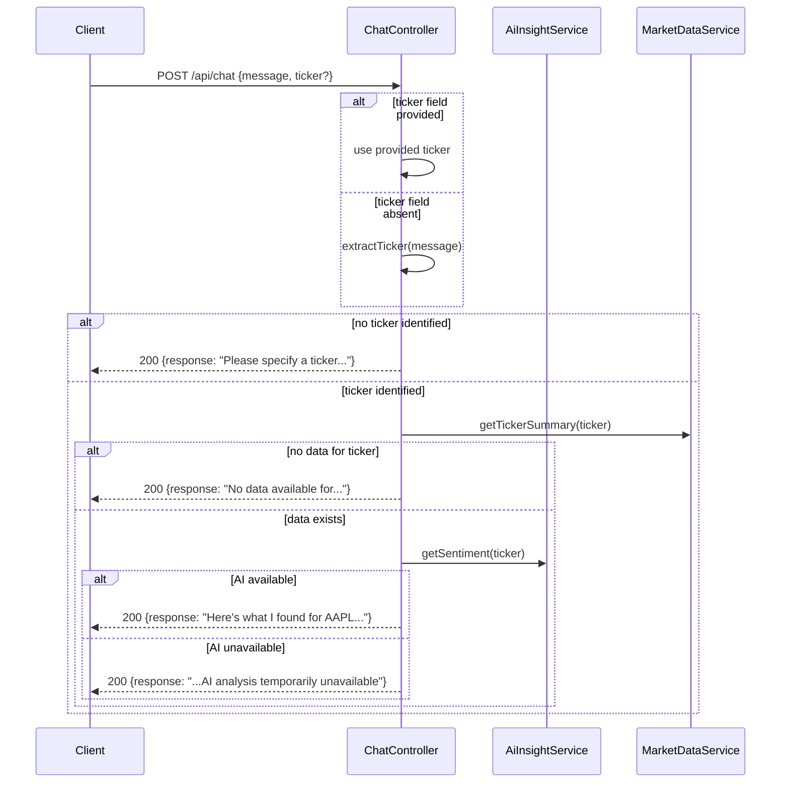

# Design Document: Insight Service — AI Market Analysis & Chat

## Overview

The `insight-service` (`com.wealth.insight`, port 8083) is the platform's hub for market data aggregation, AI-powered sentiment analysis, and conversational chat. This design covers the full feature set across three functional areas:

1. **Market Summarizer** (✅ implemented) — Redis-backed stateful price aggregation with `MarketDataService`, Kafka consumer via `InsightEventListener`, and REST endpoints for all-ticker and per-ticker summaries.
2. **AI Insight Integration** (pending) — `AiInsightService` that retrieves price data from `MarketDataService`, constructs an LLM prompt, and returns a 2-sentence sentiment analysis. Profile-scoped: mock (default/CI) vs Ollama (local inference).
3. **Chat Bot** (pending) — `ChatController` at `POST /api/chat` providing stateless conversational access to market insights with ticker extraction from natural language.

The service follows hexagonal architecture: domain ports (`InsightAdvisor` for portfolio analysis, new `AiInsightService` interface for market sentiment) are decoupled from infrastructure adapters (mock, Ollama). Profile-based selection (`@Profile("!ollama & !bedrock")` vs `@Profile("ollama")`) enables zero-config switching.

A separate `InsightAdvisor` domain port already exists in `com.wealth.insight.advisor` for portfolio-level risk analysis (used by `InsightService` to analyze portfolios fetched from `portfolio-service`). That concern is orthogonal to the market sentiment features designed here.

### Design Rationale

- **Redis for stateful aggregation** — `StringRedisTemplate` with `market:latest:{ticker}` and `market:history:{ticker}` keys provides fast, persistent price storage that survives service restarts. Spring Boot auto-configures the template; no custom `RedisConfig` needed.
- **Profile-scoped AI adapters** — Mock implementation has zero Spring AI dependencies, enabling fast CI. Ollama adapter activates only with the `ollama` profile.
- **Graceful degradation** — AI failures produce `null` `aiSummary` fields rather than 500 errors. Price data is always returned regardless of LLM availability.
- **Stateless chat** — No session management. Each `POST /api/chat` request is independent, simplifying scaling and testing.

## Architecture

### Component Diagram



### Request Flow — Market Summary with AI



### Request Flow — Chat



### Profile Selection Strategy

| Profile Active           | Market Sentiment Adapter | Portfolio Advisor Adapter | Dependencies Required               |
| ------------------------ | ------------------------ | ------------------------- | ----------------------------------- |
| (none / default / local) | `MockAiInsightService`   | `MockInsightAdvisor`      | Core Java + Spring annotations only |
| `ollama`                 | `OllamaAiInsightService` | `OllamaInsightAdvisor`    | Spring AI Ollama starter            |

## Components and Interfaces

### Existing Components (✅ Implemented)

#### 1. MarketDataService

**Package:** `com.wealth.insight`
**Type:** `@Service`
**Dependencies:** `StringRedisTemplate`

Stateful Redis-backed aggregation engine. Maintains two structures per ticker:

- `market:latest:{ticker}` — most recent price (String key-value)
- `market:history:{ticker}` — capped list of last 10 prices (newest at head, trimmed via `LTRIM`)

Key methods:

- `processUpdate(PriceUpdatedEvent)` — stores latest price, prepends to history, trims to 10
- `getMarketSummary()` — returns `Map<String, TickerSummary>` for all tracked tickers
- `calculateTrend(List<BigDecimal>)` — `((newest - oldest) / oldest) * 100`, returns `null` for < 2 points

Safety guards: `parsePrice()` wraps `new BigDecimal()` in try-catch, per-ticker isolation in `getMarketSummary()` loop.

#### 2. InsightEventListener

**Package:** `com.wealth.insight`
**Type:** `@Service` with `@KafkaListener(topics = "market-prices", groupId = "insight-group")`

Kafka consumer that delegates to `MarketDataService.processUpdate()`.

#### 3. InsightController (current state)

**Package:** `com.wealth.insight`
**Type:** `@RestController` at `/api/insights`

Current endpoints:

- `GET /{userId}/analyze` — portfolio analysis via `InsightService`
- `GET /market-summary` — all-ticker market summary via `MarketDataService`

#### 4. InsightAdvisor / MockInsightAdvisor / OllamaInsightAdvisor

**Package:** `com.wealth.insight.advisor` (port), `com.wealth.insight.infrastructure.ai` (adapters)

Existing hexagonal pattern for portfolio-level risk analysis. `InsightAdvisor.analyze(PortfolioDto)` returns `AnalysisResult(riskScore, concentrationWarnings, rebalancingSuggestions)`. Used by `InsightService` for the `/{userId}/analyze` endpoint. **Not modified by this design.**

#### 5. TickerSummary (current state)

**Package:** `com.wealth.insight.dto`

```java
public record TickerSummary(
    String ticker,
    BigDecimal latestPrice,
    List<BigDecimal> priceHistory,
    BigDecimal trendPercent
) {}
```

### New Components

#### 6. Extended TickerSummary

Add `aiSummary` field to the existing record:

```java
public record TickerSummary(
    String ticker,
    BigDecimal latestPrice,
    List<BigDecimal> priceHistory,
    BigDecimal trendPercent,
    String aiSummary  // nullable — null when AI unavailable
) {}
```

The `MarketDataService.buildTickerSummary()` method will be updated to accept an optional `aiSummary` parameter (or a new overload/builder). The controller is responsible for populating `aiSummary` by calling `AiInsightService`.

#### 7. AiInsightService (Interface)

**Package:** `com.wealth.insight`
**Type:** Interface (domain port for market sentiment)

```java
public interface AiInsightService {
    /**
     * Returns a 2-sentence sentiment analysis for the given ticker.
     *
     * @param ticker the ticker symbol
     * @return plain-text sentiment summary
     * @throws AdvisorUnavailableException if the LLM is unreachable
     */
    String getSentiment(String ticker);
}
```

This is a separate port from `InsightAdvisor` — it serves market-level sentiment, not portfolio-level risk scoring.

#### 8. MockAiInsightService

**Package:** `com.wealth.insight.infrastructure.ai`
**Type:** `@Service`, `@Profile("!ollama & !bedrock")`
**Dependencies:** Core Java + Spring annotations only (zero Spring AI imports)

```java
@Service
@Profile("!ollama & !bedrock")
public class MockAiInsightService implements AiInsightService {

    @Override
    public String getSentiment(String ticker) {
        return "%s is showing Neutral sentiment. No significant price movement detected.".formatted(ticker);
    }
}
```

Deterministic, sub-millisecond, no network calls. Response always contains the ticker symbol and "Neutral" sentiment.

#### 9. OllamaAiInsightService

**Package:** `com.wealth.insight.infrastructure.ai`
**Type:** `@Service`, `@Profile("ollama")`
**Dependencies:** Spring AI `ChatClient`

```java
@Service
@Profile("ollama")
public class OllamaAiInsightService implements AiInsightService {

    private static final String SYSTEM_PROMPT = """
        You are a market analyst. Given a ticker symbol, its recent price history, \
        and trend percentage, provide exactly 2 sentences: first categorize the sentiment \
        as Bullish, Bearish, or Neutral, then briefly explain why based on the data. \
        Respond in plain text only.""";

    private final ChatClient chatClient;
    private final MarketDataService marketDataService;

    // constructor injection...

    @Override
    public String getSentiment(String ticker) {
        TickerSummary summary = marketDataService.getTickerSummary(ticker);
        String userPrompt = buildPrompt(ticker, summary);
        try {
            String response = chatClient.prompt()
                .system(SYSTEM_PROMPT)
                .user(userPrompt)
                .call()
                .content();
            if (response == null || response.isBlank()) {
                throw new AdvisorUnavailableException("LLM returned empty response for " + ticker);
            }
            return response;
        } catch (AdvisorUnavailableException e) {
            throw e;
        } catch (Exception e) {
            throw new AdvisorUnavailableException("LLM unavailable for " + ticker, e);
        }
    }
}
```

The `buildPrompt()` method constructs a user message containing the ticker, price history list, and trend percent.

#### 10. MarketDataService — New Public Method

Expose `buildTickerSummary()` as a public method (or add a new `getTickerSummary(String ticker)` method) so that both the controller and `OllamaAiInsightService` can fetch data for a single ticker:

```java
public TickerSummary getTickerSummary(String ticker) {
    return buildTickerSummary(ticker);
}
```

This also serves the per-ticker endpoint (Requirement 3).

#### 11. InsightController — New Endpoints

Add to the existing controller:

```java
@GetMapping("/market-summary/{ticker}")
public ResponseEntity<?> getTickerSummary(@PathVariable String ticker) {
    TickerSummary summary = marketDataService.getTickerSummary(ticker);
    if (summary == null || summary.latestPrice() == null) {
        return ResponseEntity.status(HttpStatus.NOT_FOUND)
            .body(Map.of("error", "Ticker not found"));
    }
    String aiSummary = getAiSummaryOrNull(ticker);
    TickerSummary enriched = withAiSummary(summary, aiSummary);
    return ResponseEntity.ok(enriched);
}
```

The existing `getMarketSummary()` method will be updated to enrich each `TickerSummary` with `aiSummary`, catching `AdvisorUnavailableException` per-ticker and setting `aiSummary` to `null` on failure.

#### 12. ChatController

**Package:** `com.wealth.insight`
**Type:** `@RestController` at `/api/chat`

```java
@RestController
@RequestMapping("/api/chat")
public class ChatController {

    private final MarketDataService marketDataService;
    private final AiInsightService aiInsightService;

    @PostMapping
    public ResponseEntity<ChatResponse> chat(@RequestBody ChatRequest request) {
        String ticker = resolveTicker(request);
        if (ticker == null) {
            return ResponseEntity.ok(new ChatResponse(
                "I couldn't identify a ticker symbol. Could you specify one? (e.g., AAPL, MSFT)"));
        }

        TickerSummary summary = marketDataService.getTickerSummary(ticker);
        if (summary == null || summary.latestPrice() == null) {
            return ResponseEntity.ok(new ChatResponse(
                "I don't have any data for %s right now.".formatted(ticker)));
        }

        try {
            String sentiment = aiInsightService.getSentiment(ticker);
            return ResponseEntity.ok(new ChatResponse(buildConversationalResponse(ticker, summary, sentiment)));
        } catch (AdvisorUnavailableException e) {
            return ResponseEntity.ok(new ChatResponse(
                buildConversationalResponse(ticker, summary, null)
                + " (AI analysis is temporarily unavailable.)"));
        }
    }

    private String resolveTicker(ChatRequest request) {
        if (request.ticker() != null && !request.ticker().isBlank()) {
            return request.ticker().toUpperCase();
        }
        return extractTicker(request.message());
    }
}
```

#### 13. Ticker Extraction Logic

Extracted as a package-private utility method (or static helper) for testability:

```java
static String extractTicker(String message) {
    if (message == null || message.isBlank()) return null;

    Set<String> stopWords = Set.of("I", "A", "THE", "HOW", "IS", "IT", "DO",
        "WHAT", "ARE", "IN", "ON", "AT", "TO", "FOR", "OF", "AND", "OR",
        "MY", "ME", "SO", "IF", "UP", "BY", "AN", "AS", "BE", "WE", "HE",
        "NO", "AM", "HAS", "HAD", "WAS", "BUT", "NOT", "YOU", "ALL", "CAN",
        "HER", "HIS", "ONE", "OUR", "OUT", "WHO", "DID", "GET", "HIM",
        "LET", "SAY", "SHE", "TOO", "USE", "DOES", "DOING", "ABOUT", "GOING");

    String[] tokens = message.split("\\s+");
    for (String token : tokens) {
        String cleaned = token.replaceAll("[^A-Za-z]", "").toUpperCase();
        if (cleaned.length() >= 1 && cleaned.length() <= 5
                && cleaned.matches("[A-Z]+")
                && !stopWords.contains(cleaned)) {
            return cleaned;
        }
    }
    return null;
}
```

#### 14. ChatRequest / ChatResponse DTOs

**Package:** `com.wealth.insight.dto`

```java
public record ChatRequest(String message, String ticker) {}
public record ChatResponse(String response) {}
```

`message` is required, `ticker` is optional. Jackson handles null/absent fields naturally with records.

#### 15. Gateway Route for `/api/chat`

The existing gateway route `/api/insights/**` does not cover `/api/chat`. A new route predicate is needed in `api-gateway/src/main/resources/application.yml`:

```yaml
- id: insight-chat
  uri: ${INSIGHT_SERVICE_URL:http://localhost:8083}
  predicates:
    - Path=/api/chat/**
```

## Data Models

### TickerSummary (Extended)

| Field          | Type               | Nullable | Description                                                   |
| -------------- | ------------------ | -------- | ------------------------------------------------------------- |
| `ticker`       | `String`           | No       | Asset ticker symbol (e.g., "AAPL")                            |
| `latestPrice`  | `BigDecimal`       | Yes      | Most recent price from Redis                                  |
| `priceHistory` | `List<BigDecimal>` | No       | Last 10 prices (newest first), may be empty                   |
| `trendPercent` | `BigDecimal`       | Yes      | `((newest - oldest) / oldest) * 100`, null if < 2 data points |
| `aiSummary`    | `String`           | Yes      | 2-sentence AI sentiment, null if AI unavailable               |

### ChatRequest

| Field     | Type     | Required | Description                                   |
| --------- | -------- | -------- | --------------------------------------------- |
| `message` | `String` | Yes      | Natural language question from the user       |
| `ticker`  | `String` | No       | Explicit ticker symbol (overrides extraction) |

### ChatResponse

| Field      | Type     | Description                                     |
| ---------- | -------- | ----------------------------------------------- |
| `response` | `String` | Conversational plain-text wrapping insight data |

### Redis Key Schema (Existing)

| Key Pattern               | Type   | Description                      |
| ------------------------- | ------ | -------------------------------- |
| `market:latest:{ticker}`  | String | Most recent price for the ticker |
| `market:history:{ticker}` | List   | Sliding window of last 10 prices |

### JSON Response Examples

**GET /api/insights/market-summary**

```json
{
  "AAPL": {
    "ticker": "AAPL",
    "latestPrice": 178.5,
    "priceHistory": [178.5, 177.2, 176.8, 175.9],
    "trendPercent": 1.48,
    "aiSummary": "AAPL is showing Bullish sentiment. The stock has gained 1.48% over the recent window."
  }
}
```

**GET /api/insights/market-summary/AAPL**

```json
{
  "ticker": "AAPL",
  "latestPrice": 178.5,
  "priceHistory": [178.5, 177.2, 176.8, 175.9],
  "trendPercent": 1.48,
  "aiSummary": "AAPL is showing Bullish sentiment. The stock has gained 1.48% over the recent window."
}
```

**POST /api/chat** (request)

```json
{ "message": "How is AAPL doing?" }
```

**POST /api/chat** (response)

```json
{
  "response": "Here's what I found for AAPL: the latest price is $178.50 with a trend of +1.48%. AAPL is showing Bullish sentiment. The stock has gained 1.48% over the recent window."
}
```

**HTTP 503 — AdvisorUnavailableException**

```json
{
  "error": "AI advisor unavailable",
  "retryable": true
}
```

## Correctness Properties

_A property is a characteristic or behavior that should hold true across all valid executions of a system — essentially, a formal statement about what the system should do. Properties serve as the bridge between human-readable specifications and machine-verifiable correctness guarantees._

### Property 1: Sliding window never exceeds configured size

_For any_ sequence of `PriceUpdatedEvent` messages for the same ticker (regardless of count, price values, or ordering), the history list in Redis SHALL never contain more than 10 entries, and the most recently processed price SHALL be at the head of the list.

**Validates: Requirements 1.2**

### Property 2: Price parsing safety — malformed values never throw

_For any_ string value (including null, blank, whitespace-only, non-numeric, or special characters), the `parsePrice()` method SHALL either return a valid `BigDecimal` or `null`, and SHALL never throw an exception.

**Validates: Requirements 1.5**

### Property 3: Trend calculation correctness

_For any_ list of at least 2 `BigDecimal` prices where the oldest price is non-zero, `calculateTrend()` SHALL return `((first - last) / last) * 100` rounded to 2 decimal places. For lists with fewer than 2 elements or where the oldest price is zero, it SHALL return `null`.

**Validates: Requirements 2.3, 2.4**

### Property 4: Prompt construction includes all required data

_For any_ ticker symbol and `TickerSummary` with non-null price data, the prompt constructed by `OllamaAiInsightService.buildPrompt()` SHALL contain the ticker symbol string, at least one price value from the history, and the trend percent value.

**Validates: Requirements 4.3**

### Property 5: Mock sentiment contains ticker and Neutral category

_For any_ non-null ticker symbol string, `MockAiInsightService.getSentiment()` SHALL return a string that contains the ticker symbol and the word "Neutral".

**Validates: Requirements 5.2**

### Property 6: Graceful degradation preserves price data on AI failure

_For any_ `TickerSummary` with valid price data, when the `AiInsightService` throws `AdvisorUnavailableException`, the enriched response SHALL still contain the original `ticker`, `latestPrice`, `priceHistory`, and `trendPercent` values unchanged, with `aiSummary` set to `null`, and the HTTP status SHALL be 200.

**Validates: Requirements 6.4, 9.1**

### Property 7: Ticker extraction finds known tickers in arbitrary text

_For any_ known ticker symbol (1-5 uppercase alphabetic characters, not in the stop-word list) embedded in an arbitrary string of surrounding text, `extractTicker()` SHALL return that ticker symbol.

**Validates: Requirements 8.1, 8.2, 11.7**

### Property 8: Ticker extraction selects the first valid ticker

_For any_ message containing two or more valid ticker symbols (not in the stop-word list), `extractTicker()` SHALL return the ticker that appears first in the message text.

**Validates: Requirements 8.3**

### Property 9: Stop-word filtering prevents false ticker matches

_For any_ message composed entirely of words from the stop-word list (e.g., "I", "A", "THE", "HOW", "IS"), `extractTicker()` SHALL return `null`.

**Validates: Requirements 8.4**

## Error Handling

### Exception Hierarchy

| Exception                     | HTTP Status | Response Body                                            | Trigger                                            |
| ----------------------------- | ----------- | -------------------------------------------------------- | -------------------------------------------------- |
| `AdvisorUnavailableException` | 503         | `{"error": "AI advisor unavailable", "retryable": true}` | LLM unreachable or empty response (unhandled path) |
| `PortfolioNotFoundException`  | 404         | `{"error": "..."}`                                       | No portfolio found for userId                      |
| Ticker not found (per-ticker) | 404         | `{"error": "Ticker not found"}`                          | No Redis data for requested ticker                 |

### Graceful Degradation Strategy

The system uses a layered approach to error handling:

1. **AI failure during market-summary** — `InsightController` catches `AdvisorUnavailableException` per-ticker in the enrichment loop. Sets `aiSummary` to `null` for that ticker. Other tickers are unaffected. HTTP 200 always returned with price data.

2. **AI failure during chat** — `ChatController` catches `AdvisorUnavailableException` and returns a `ChatResponse` with the price data plus a note that AI analysis is temporarily unavailable. HTTP 200 always returned.

3. **AI failure unhandled** — If `AdvisorUnavailableException` escapes to `GlobalExceptionHandler`, it returns HTTP 503 with `{"error": "AI advisor unavailable", "retryable": true}`. This is the safety net for code paths that don't explicitly catch.

4. **Redis failure** — `MarketDataService` does NOT catch Redis connection exceptions. They propagate to Spring Boot's health check infrastructure, correctly reflecting degraded state. The controller's existing try-catch on `getMarketSummary()` returns HTTP 500 for unexpected errors.

5. **Malformed Redis data** — `parsePrice()` returns `null` for unparseable values. Per-ticker try-catch in `getMarketSummary()` isolates failures so one bad ticker doesn't crash the entire response.

6. **Chat with no ticker** — Returns a friendly prompt asking the user to specify a ticker. No error status code.

7. **Chat with unknown ticker** — Returns a message indicating no data is available. No error status code.

## Testing Strategy

### Property-Based Testing

Property-based testing applies to this feature for the pure logic layer. The ticker extraction function, trend calculation, price parsing, and mock sentiment generation are all pure functions with clear input/output behavior and large input spaces.

- **Library:** jqwik (JUnit 5 compatible PBT library for Java)
- **Minimum iterations:** 100 per property test
- **Tag format:** `Feature: ai-portfolio-advisor, Property {number}: {property_text}`

| Property   | Test Target                            | What It Generates                                                   | Iterations |
| ---------- | -------------------------------------- | ------------------------------------------------------------------- | ---------- |
| Property 1 | `MarketDataService.processUpdate()`    | Random sequences of PriceUpdatedEvents (1-50 events, random prices) | 100+       |
| Property 2 | `MarketDataService.parsePrice()`       | Random strings: nulls, blanks, numbers, garbage, unicode            | 100+       |
| Property 3 | `MarketDataService.calculateTrend()`   | Random BigDecimal lists (0-20 elements, various magnitudes)         | 100+       |
| Property 4 | `OllamaAiInsightService.buildPrompt()` | Random ticker symbols and TickerSummary data                        | 100+       |
| Property 5 | `MockAiInsightService.getSentiment()`  | Random ticker symbol strings (1-5 uppercase chars)                  | 100+       |
| Property 6 | `InsightController` enrichment         | Random TickerSummary data with mocked AI failure                    | 100+       |
| Property 7 | `extractTicker()`                      | Known tickers embedded in random surrounding text                   | 100+       |
| Property 8 | `extractTicker()`                      | Messages with 2+ valid tickers at random positions                  | 100+       |
| Property 9 | `extractTicker()`                      | Messages composed only of stop-list words                           | 100+       |

### Unit Tests (Example-Based)

| Test Class                   | What It Verifies                                                                    |
| ---------------------------- | ----------------------------------------------------------------------------------- |
| `InsightControllerTest`      | `GET /market-summary` → 200 with correct JSON structure                             |
| `InsightControllerTest`      | `GET /market-summary` with empty Redis → 200 with `{}`                              |
| `InsightControllerTest`      | `GET /market-summary/{ticker}` → 200 with correct TickerSummary for known ticker    |
| `InsightControllerTest`      | `GET /market-summary/{ticker}` → 404 for unknown ticker                             |
| `InsightControllerTest`      | AI failure during enrichment → 200 with `aiSummary: null`                           |
| `AiInsightServiceTest`       | Mock implementation returns deterministic 2-sentence string with ticker and Neutral |
| `AiInsightServiceTest`       | Ollama implementation constructs correct prompt (mocked ChatClient)                 |
| `AiInsightServiceTest`       | Ollama implementation throws `AdvisorUnavailableException` on empty LLM response    |
| `ChatControllerTest`         | Request with explicit `ticker` → conversational response with ticker data           |
| `ChatControllerTest`         | Request with ticker in message (no `ticker` field) → extracts and responds          |
| `ChatControllerTest`         | Request with no identifiable ticker → prompt to specify                             |
| `ChatControllerTest`         | Request with unknown ticker → "no data available" response                          |
| `ChatControllerTest`         | AI failure during chat → response with "temporarily unavailable" note               |
| `TickerExtractionTest`       | Stop words filtered: "How is the market" → null                                     |
| `TickerExtractionTest`       | Valid extraction: "How is AAPL doing" → "AAPL"                                      |
| `TickerExtractionTest`       | Multiple tickers: "Compare AAPL and MSFT" → "AAPL" (first wins)                     |
| `GlobalExceptionHandlerTest` | `AdvisorUnavailableException` → 503 with `{"error": ..., "retryable": true}`        |

### Integration Tests (`@Tag("integration")`)

Run via `./gradlew :insight-service:integrationTest`, not `./gradlew test`.

| Test Class                              | What It Verifies                                                     |
| --------------------------------------- | -------------------------------------------------------------------- |
| `MarketDataServiceIntegrationTest`      | Redis read/write round-trip with Testcontainers Redis                |
| `InsightEventListenerIntegrationTest`   | Kafka → InsightEventListener → MarketDataService → Redis pipeline    |
| `OllamaAiInsightServiceIntegrationTest` | Ollama connectivity and response parsing (requires `ollama` profile) |

### Dual Testing Approach

- **Unit tests** catch specific examples, edge cases (empty Redis, unknown ticker, AI failure), and error paths (404, 503)
- **Property tests** verify universal invariants across randomized inputs (sliding window size, trend formula, ticker extraction correctness)
- Together they provide comprehensive coverage: unit tests for concrete scenarios, property tests for general correctness across the input space
