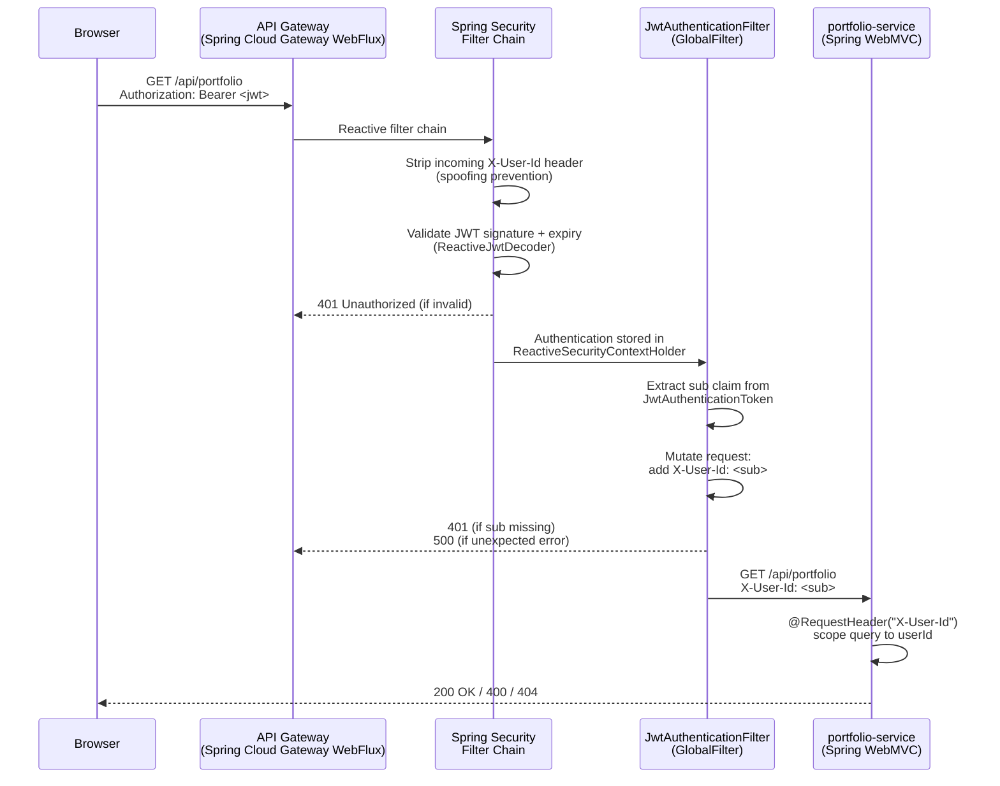
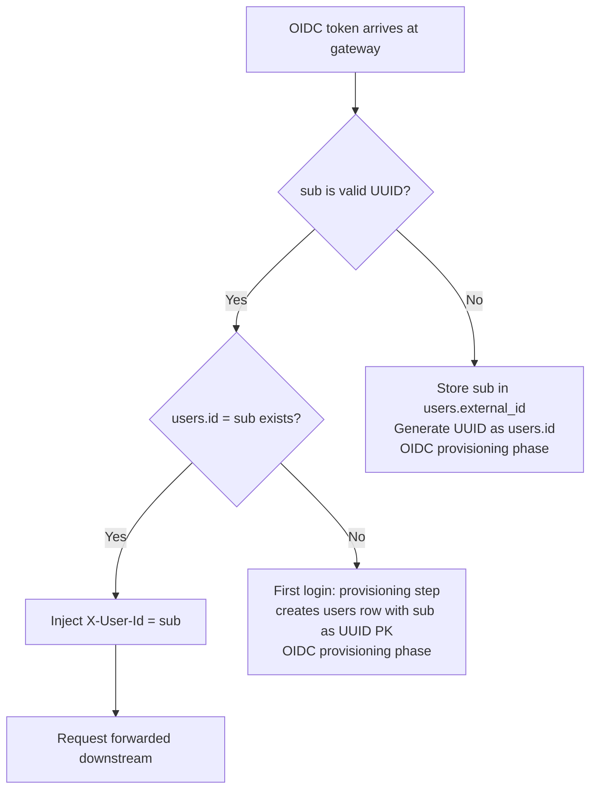

# Design Document — Authentication & Identity Layer (Phase 1: Backend)

## Overview

This document covers the backend-only Phase 1 design for the Authentication & Identity Layer.
The scope is limited to two modules:

- **`api-gateway`** — Spring Security Reactive filter chain, JWT validation, `X-User-Id` injection
- **`portfolio-service`** — controller updates to consume `X-User-Id` header

The design follows the **"Bouncer" pattern**: the API Gateway is the sole JWT validation point.
Downstream services receive the verified user identity via the `X-User-Id` HTTP header and never
parse JWTs or import Spring Security. Profile switching between `local` (HMAC-SHA256) and `aws`
(RS256 via JWK URI) requires zero Java code changes — configuration only.

---

## Architecture

### High-Level Request Flow



### Component Diagram

```mermaid
graph TB
    subgraph api-gateway
        SC[SecurityWebFilterChain<br/>ServerHttpSecurity]
        JD_L[LocalJwtDecoderConfig<br/>@Profile local<br/>NimbusReactiveJwtDecoder.withSecretKey]
        JD_A[AwsJwtDecoderConfig<br/>@Profile aws<br/>NimbusReactiveJwtDecoder.withJwkSetUri]
        JF[JwtAuthenticationFilter<br/>GlobalFilter + Ordered]
        RL[GatewayRateLimitConfig<br/>userOrIpKeyResolver]
    end

    subgraph portfolio-service
        PC[PortfolioController<br/>@RequestHeader X-User-Id]
        PSC[PortfolioSummaryController<br/>@RequestHeader X-User-Id]
        EH[GlobalExceptionHandler<br/>@RestControllerAdvice]
    end

    SC -->|uses| JD_L
    SC -->|uses| JD_A
    JF -->|reads| SC
    RL -->|reads X-User-Id| JF
    JF -->|injects X-User-Id| PC
    JF -->|injects X-User-Id| PSC
```

### Profile Strategy

| Concern                | `local` profile                            | `aws` profile                              |
| ---------------------- | ------------------------------------------ | ------------------------------------------ |
| JWT algorithm          | HMAC-SHA256 (HS256)                        | RS256                                      |
| Key source             | `AUTH_JWT_SECRET` env var                  | JWK URI from `AUTH_JWK_URI` env var        |
| Decoder bean           | `NimbusReactiveJwtDecoder.withSecretKey()` | `NimbusReactiveJwtDecoder.withJwkSetUri()` |
| Rate limit backing     | Redis (Docker Compose / Testcontainers)    | Profile-configured (application-aws.yml)   |
| Code changes to switch | None — profile only                        | None — profile only                        |

---

## Components and Interfaces

### 1. api-gateway: Gradle Dependency Changes

Add to `api-gateway/build.gradle`:

```groovy
dependencies {
    implementation 'org.springframework.cloud:spring-cloud-starter'
    implementation 'org.springframework.cloud:spring-cloud-starter-gateway-server-webflux'
    implementation 'org.springframework.boot:spring-boot-starter-data-redis-reactive'
    implementation 'org.springframework.boot:spring-boot-starter-actuator'
    // Brings in spring-security-oauth2-resource-server, spring-security-oauth2-jose (Nimbus),
    // and spring-webflux security integration. No separate spring-boot-starter-security needed.
    implementation 'org.springframework.boot:spring-boot-starter-oauth2-resource-server'

    testImplementation 'org.testcontainers:testcontainers'
    // JWT minting for tests only — NOT on production classpath
    testImplementation 'io.jsonwebtoken:jjwt-api:0.12.6'
    testRuntimeOnly    'io.jsonwebtoken:jjwt-impl:0.12.6'
    testRuntimeOnly    'io.jsonwebtoken:jjwt-jackson:0.12.6'
}
```

**Rationale:** `spring-boot-starter-oauth2-resource-server` transitively provides
`spring-security-oauth2-resource-server`, `spring-security-oauth2-jose` (Nimbus JOSE+JWT), and
the WebFlux security integration. The `jjwt` dependency is `testImplementation` only — it never
appears in the production artifact, satisfying Requirement 11.3.

---

### 2. api-gateway: Security Filter Chain

**Class:** `com.wealth.gateway.SecurityConfig`
**Location:** `api-gateway/src/main/java/com/wealth/gateway/SecurityConfig.java`

```java
@Configuration
@EnableWebFluxSecurity
public class SecurityConfig {

    @Bean
    SecurityWebFilterChain springSecurityFilterChain(
            ServerHttpSecurity http,
            ReactiveJwtDecoder jwtDecoder) {

        return http
            .csrf(ServerHttpSecurity.CsrfSpec::disable)          // stateless JWT API
            .formLogin(ServerHttpSecurity.FormLoginSpec::disable)
            .httpBasic(ServerHttpSecurity.HttpBasicSpec::disable)
            .authorizeExchange(exchanges -> exchanges
                .pathMatchers("/actuator/**").permitAll()         // health/metrics open
                .pathMatchers("/api/**").authenticated()          // all API routes require JWT
                .anyExchange().authenticated()
            )
            .oauth2ResourceServer(oauth2 -> oauth2
                .jwt(jwt -> jwt.decoder(jwtDecoder))
            )
            .build();
    }
}
```

**Key decisions:**

- CSRF disabled — stateless JWT API, no session cookies on the gateway
- Form login and HTTP Basic disabled — Bearer token only
- `/actuator/**` open — health probes must not require auth
- `/api/**` requires authentication — covers all routed paths
- `oauth2ResourceServer` with JWT decoder — Spring Security handles 401 for invalid/missing tokens
  before the `GlobalFilter` runs

---

### 3. api-gateway: Profile-Conditional JWT Decoder Configuration

**Class:** `com.wealth.gateway.JwtDecoderConfig`
**Location:** `api-gateway/src/main/java/com/wealth/gateway/JwtDecoderConfig.java`

```java
@Configuration
public class JwtDecoderConfig {

    /**
     * Local profile: HMAC-SHA256 symmetric decoder.
     * Key is read from ${auth.jwt.secret} — injected from AUTH_JWT_SECRET env var.
     * Startup fails fast if the property is blank (validated by @Value binding).
     */
    @Bean
    @Profile("local")
    ReactiveJwtDecoder localJwtDecoder(
            @Value("${auth.jwt.secret}") String secret) {

        if (secret == null || secret.isBlank()) {
            throw new IllegalStateException(
                "AUTH_JWT_SECRET must not be blank under the 'local' profile. " +
                "Set the AUTH_JWT_SECRET environment variable.");
        }
        SecretKeySpec key = new SecretKeySpec(
            secret.getBytes(StandardCharsets.UTF_8), "HmacSHA256");
        return NimbusReactiveJwtDecoder.withSecretKey(key)
            .macAlgorithm(MacAlgorithm.HS256)
            .build();
    }

    /**
     * AWS profile: RS256 asymmetric decoder via JWK URI.
     * NimbusReactiveJwtDecoder caches the JWK set and refreshes on key rotation automatically.
     */
    @Bean
    @Profile("aws")
    ReactiveJwtDecoder awsJwtDecoder(
            @Value("${auth.jwk-uri}") String jwkUri) {

        return NimbusReactiveJwtDecoder.withJwkSetUri(jwkUri)
            .jwsAlgorithm(SignatureAlgorithm.RS256)
            .build();
    }
}
```

**Fail-fast behaviour:** Under the `local` profile, if `AUTH_JWT_SECRET` is absent or blank,
the `IllegalStateException` is thrown during context refresh — the application fails to start
with a descriptive message (Requirement 8.4). The secret is never logged (Requirement 8.5).

---

### 4. api-gateway: JwtAuthenticationFilter (GlobalFilter)

**Class:** `com.wealth.gateway.JwtAuthenticationFilter`
**Location:** `api-gateway/src/main/java/com/wealth/gateway/JwtAuthenticationFilter.java`

```java
@Component
public class JwtAuthenticationFilter implements GlobalFilter, Ordered {

    private static final Logger log =
        LoggerFactory.getLogger(JwtAuthenticationFilter.class);
    private static final String X_USER_ID = "X-User-Id";

    /**
     * Runs after Spring Security (which validates the JWT) but before routing.
     * HIGHEST_PRECEDENCE + 1 ensures Spring Security's WebFilter runs first.
     */
    @Override
    public int getOrder() {
        return Ordered.HIGHEST_PRECEDENCE + 1;
    }

    @Override
    public Mono<Void> filter(ServerWebExchange exchange, GatewayFilterChain chain) {
        // Step 1: Strip any caller-supplied X-User-Id (spoofing prevention)
        ServerWebExchange sanitised = exchange.mutate()
            .request(r -> r.headers(h -> h.remove(X_USER_ID)))
            .build();

        // Step 2: Extract Authentication from reactive security context
        return ReactiveSecurityContextHolder.getContext()
            .map(SecurityContext::getAuthentication)
            .cast(JwtAuthenticationToken.class)
            .flatMap(token -> {
                // Step 3: Extract sub claim
                String sub = token.getToken().getClaimAsString("sub");
                if (sub == null || sub.isBlank()) {
                    log.debug("JWT accepted but sub claim is missing or blank");
                    sanitised.getResponse().setStatusCode(HttpStatus.UNAUTHORIZED);
                    return sanitised.getResponse().setComplete();
                }
                // Step 4: Inject X-User-Id header
                ServerWebExchange mutated = sanitised.mutate()
                    .request(r -> r.headers(h -> h.set(X_USER_ID, sub)))
                    .build();
                return chain.filter(mutated);
            })
            .onErrorResume(ClassCastException.class, ex -> {
                // Non-JWT authentication type — treat as unauthenticated
                sanitised.getResponse().setStatusCode(HttpStatus.UNAUTHORIZED);
                return sanitised.getResponse().setComplete();
            })
            .onErrorResume(Exception.class, ex -> {
                // Unexpected exception — log at ERROR, return 500
                log.error("Unexpected error in JwtAuthenticationFilter", ex);
                sanitised.getResponse().setStatusCode(HttpStatus.INTERNAL_SERVER_ERROR);
                return sanitised.getResponse().setComplete();
            });
    }
}
```

**Design notes:**

- Spring Security's `oauth2ResourceServer` filter runs before this `GlobalFilter` and handles
  401 for missing/invalid/expired JWTs. By the time this filter runs, the `Authentication` is
  already validated and stored in `ReactiveSecurityContextHolder`.
- The filter strips `X-User-Id` unconditionally before any other logic — even unauthenticated
  requests have the header stripped (Requirement 12.1).
- The raw JWT token value is never logged. Only `sub` (at DEBUG) may be logged (Requirement 8.5).
- `Ordered.HIGHEST_PRECEDENCE + 1` places this filter immediately after Spring Security's
  `WebFilter` (which runs at `HIGHEST_PRECEDENCE`) but before Spring Cloud Gateway's routing
  filters.

---

### 5. api-gateway: Rate Limiter Key Resolver Update

**Class:** `com.wealth.gateway.GatewayRateLimitConfig` (updated)

The bean is renamed from `ipKeyResolver` to `userOrIpKeyResolver`. The `KeyResolver` reads the
authenticated user identity directly from `exchange.getPrincipal()` — which is populated by
Spring Security's `WebFilter` before any `GlobalFilter` runs — rather than from the `X-User-Id`
header. This eliminates any filter-ordering race condition: Spring Security's authentication
completes before the `RequestRateLimiter` `GatewayFilter` executes, so `getPrincipal()` is
always populated for authenticated requests.

The `resolveKey` static method retains two parameters (`forwardedFor`, `remoteHost`) for the
unauthenticated fallback path and remains a pure function suitable for unit testing.

```java
@Configuration
public class GatewayRateLimitConfig {

    @Bean
    KeyResolver userOrIpKeyResolver() {
        return exchange -> exchange.getPrincipal()
            .map(principal -> {
                // Authenticated: use the sub claim as the rate-limit key
                if (principal instanceof JwtAuthenticationToken jwtToken) {
                    String sub = jwtToken.getToken().getClaimAsString("sub");
                    if (sub != null && !sub.isBlank()) {
                        return sub.trim();
                    }
                }
                // Fallback to IP-based key for unauthenticated or non-JWT principals
                return resolveClientIp(exchange);
            })
            .defaultIfEmpty(resolveClientIp(exchange)); // no principal → unauthenticated
    }

    private String resolveClientIp(ServerWebExchange exchange) {
        var forwardedFor = exchange.getRequest().getHeaders().getFirst("X-Forwarded-For");
        var remoteAddress = exchange.getRequest().getRemoteAddress();
        String remoteHost = (remoteAddress != null && remoteAddress.getAddress() != null)
            ? remoteAddress.getAddress().getHostAddress()
            : null;
        return resolveKey(forwardedFor, remoteHost);
    }

    /**
     * Pure IP-based key-resolution logic — package-private for unit testing.
     * Called when no authenticated principal is available.
     *
     * @param forwardedFor value of X-Forwarded-For header, or null
     * @param remoteHost   remote address host string, or null
     * @return non-null, non-empty rate-limit key
     */
    static String resolveKey(String forwardedFor, String remoteHost) {
        if (forwardedFor != null && !forwardedFor.isBlank()) {
            var comma = forwardedFor.indexOf(',');
            return (comma >= 0 ? forwardedFor.substring(0, comma) : forwardedFor).trim();
        }
        if (remoteHost != null && !remoteHost.isBlank()) {
            return remoteHost;
        }
        return "anonymous";
    }
}
```

**Why `getPrincipal()` is race-condition-free:** Spring Security's `SecurityWebFilterChain`
runs as a `WebFilter` at `WebFilterChainProxy` order, which executes before Spring Cloud
Gateway's `GlobalFilter` chain. The `RequestRateLimiter` is a `GatewayFilter` that runs inside
the routing phase — after all `WebFilter`s have completed. Therefore `exchange.getPrincipal()`
is always resolved by the time the `KeyResolver` is invoked.

**Impact on existing tests:** `GatewayRateLimitConfigTest` requires minimal changes:

- The `resolveKey` signature is **unchanged** (still two parameters: `forwardedFor`, `remoteHost`)
- Existing test cases remain valid as-is
- The bean smoke test `ipKeyResolver()` becomes `userOrIpKeyResolver()`
- New test cases added for the `getPrincipal()` path (requires a mock `ServerWebExchange` with a `JwtAuthenticationToken` principal)

---

### 6. portfolio-service: Controller Changes

#### PortfolioController

Route changes from `GET /api/portfolio/{userId}` to `GET /api/portfolio`.
The `{userId}` path variable is removed; identity comes exclusively from `X-User-Id`.

```java
@RestController
@RequestMapping("/api/portfolio")
public class PortfolioController {

    private final PortfolioService portfolioService;

    public PortfolioController(PortfolioService portfolioService) {
        this.portfolioService = portfolioService;
    }

    /**
     * Returns all portfolios belonging to the authenticated user.
     * userId is extracted from the X-User-Id header injected by the API Gateway JWT filter.
     *
     * 200 OK  — list of portfolios (empty list if user has no portfolios)
     * 400     — X-User-Id header missing (MissingRequestHeaderException → GlobalExceptionHandler)
     * 404     — userId not found in users table
     */
    @GetMapping
    public ResponseEntity<List<PortfolioResponse>> getPortfolios(
            @RequestHeader("X-User-Id") String userId) {
        return ResponseEntity.ok(portfolioService.getByUserId(userId));
    }
}
```

#### PortfolioSummaryController

The `@RequestParam(defaultValue = "user-001")` is removed; identity comes from `X-User-Id`.

```java
@RestController
@RequestMapping("/api/portfolio")
public class PortfolioSummaryController {

    private final PortfolioService portfolioService;

    public PortfolioSummaryController(PortfolioService portfolioService) {
        this.portfolioService = portfolioService;
    }

    /**
     * Returns a lightweight portfolio summary for the authenticated user.
     * userId is extracted from the X-User-Id header injected by the API Gateway JWT filter.
     *
     * 200 OK  — portfolio summary DTO
     * 400     — X-User-Id header missing
     * 404     — userId not found in users table
     */
    @GetMapping("/summary")
    public ResponseEntity<PortfolioSummaryDto> getSummary(
            @RequestHeader("X-User-Id") String userId) {
        return ResponseEntity.ok(portfolioService.getSummary(userId));
    }
}
```

**API Gateway route update:** The `portfolio-service` route predicate in `application.yml`
remains `Path=/api/portfolio/**` — no change needed since the path prefix is unchanged.

---

### 7. portfolio-service: Global Exception Handler

**Class:** `com.wealth.portfolio.GlobalExceptionHandler`
**Location:** `portfolio-service/src/main/java/com/wealth/portfolio/GlobalExceptionHandler.java`

```java
@RestControllerAdvice
public class GlobalExceptionHandler {

    /**
     * Handles missing required request headers (e.g. X-User-Id not present).
     * This indicates the request bypassed the API Gateway — return 400 with a clear message.
     */
    @ExceptionHandler(MissingRequestHeaderException.class)
    public ResponseEntity<Map<String, String>> handleMissingHeader(
            MissingRequestHeaderException ex) {
        return ResponseEntity.badRequest().body(
            Map.of("error", "Required header '" + ex.getHeaderName() + "' is missing"));
    }
}
```

The response body format is `{"error": "Required header 'X-User-Id' is missing"}`.

---

### 8. portfolio-service: Flyway Seed Migration

**File:** `portfolio-service/src/main/resources/db/migration/V4__seed_local_dev_user.sql`

```sql
-- Seed a fixed local development user so integration tests and local dev
-- can use a known UUID as the sub_claim in JWTs.
-- Uses ON CONFLICT DO NOTHING to make this migration idempotent.
INSERT INTO users (id, email, created_at)
VALUES (
    '00000000-0000-0000-0000-000000000001',
    'dev@local',
    NOW()
)
ON CONFLICT DO NOTHING;
```

**Design notes:**

- UUID `00000000-0000-0000-0000-000000000001` is the canonical `sub_claim` for all local dev
  JWTs and integration tests.
- `ON CONFLICT DO NOTHING` makes the migration safe to re-run and idempotent.
- This migration runs under all profiles (including `aws`) — the seed user is harmless in
  production since it has no password and cannot authenticate via OIDC without a matching
  external identity.

---

### 9. api-gateway: TestJwtFactory

**Class:** `com.wealth.gateway.TestJwtFactory`
**Location:** `api-gateway/src/test/java/com/wealth/gateway/TestJwtFactory.java`

```java
/**
 * Test utility for minting HMAC-SHA256 signed JWTs.
 * Resides exclusively in src/test/java — never included in production artifacts.
 */
public final class TestJwtFactory {

    private TestJwtFactory() {}

    /**
     * Mints a compact JWT string signed with HMAC-SHA256.
     *
     * @param sub    the sub claim value (typically a UUID string)
     * @param expiry duration from now until expiry; use negative duration for expired tokens
     * @param secret the HMAC-SHA256 signing secret (must match api-gateway's configured secret)
     * @return compact JWT string (header.payload.signature)
     */
    public static String mint(String sub, Duration expiry, String secret) {
        Instant now = Instant.now();
        return Jwts.builder()
            .subject(sub)
            .issuedAt(Date.from(now))
            .expiration(Date.from(now.plus(expiry)))
            .signWith(Keys.hmacShaKeyFor(secret.getBytes(StandardCharsets.UTF_8)),
                      Jwts.SIG.HS256)
            .compact();
    }
}
```

**Dependency:** `io.jsonwebtoken:jjwt-api` + `jjwt-impl` + `jjwt-jackson` at `testImplementation`
scope only (see Gradle dependency changes above). This satisfies Requirement 11.3 — no JWT
library on the production classpath.

---

## Data Models

### users table (existing — no schema change)

```sql
CREATE TABLE users (
    id         UUID        PRIMARY KEY,
    email      VARCHAR     NOT NULL UNIQUE,
    created_at TIMESTAMPTZ NOT NULL
);
```

The `id` column is the UUID that maps to the JWT `sub_claim`. No schema changes are required
for Phase 1 — the existing table structure already supports the identity contract.

### Identity propagation contract

```
JWT payload:
{
  "sub": "00000000-0000-0000-0000-000000000001",  ← UUID matching users.id
  "iat": 1700000000,
  "exp": 1700003600
}

HTTP header injected by JwtAuthenticationFilter:
X-User-Id: 00000000-0000-0000-0000-000000000001
```

---

## YAML Configuration Changes

### application.yml additions

```yaml
auth:
  jwt:
    secret: ${AUTH_JWT_SECRET:} # local profile only — blank triggers startup failure
  jwk-uri: ${AUTH_JWK_URI:} # aws profile only
```

Both properties use empty-string defaults so the file parses under all profiles. The
`JwtDecoderConfig` beans perform explicit blank-checks and throw `IllegalStateException` at
startup if the required value is missing for the active profile.

### application-local.yml additions

```yaml
auth:
  jwt:
    secret: ${AUTH_JWT_SECRET:local-dev-secret-change-me-min-32-chars}
```

The fallback value satisfies Requirement 8.2 (Docker Compose dev without manual env var
injection) while being clearly labelled as a placeholder. The secret is never logged.

### application-aws.yml (new file)

```yaml
auth:
  jwk-uri: ${AUTH_JWK_URI}
```

No default — `AUTH_JWK_URI` must be explicitly set in the AWS deployment environment.
This satisfies Requirement 8.3.

### api-gateway/src/main/resources/application-local.yml (key-resolver rename)

```yaml
spring:
  data:
    redis:
      host: localhost
      port: 6379
  cloud:
    gateway:
      server:
        webflux:
          default-filters:
            - name: RequestRateLimiter
              args:
                key-resolver: "#{@userOrIpKeyResolver}" # renamed from ipKeyResolver
                redis-rate-limiter.replenishRate: 20
                redis-rate-limiter.burstCapacity: 40
                redis-rate-limiter.requestedTokens: 1

auth:
  jwt:
    secret: ${AUTH_JWT_SECRET:local-dev-secret-change-me-min-32-chars}
```

### api-gateway/src/test/resources/application-local.yml (key-resolver rename)

```yaml
spring:
  cloud:
    gateway:
      server:
        webflux:
          default-filters:
            - name: RequestRateLimiter
              args:
                key-resolver: "#{@userOrIpKeyResolver}" # renamed from ipKeyResolver
                redis-rate-limiter.replenishRate: 1
                redis-rate-limiter.burstCapacity: 3
                redis-rate-limiter.requestedTokens: 1

auth:
  jwt:
    secret: test-secret-for-integration-tests-min-32-chars
```

---

## AWS Profile: OIDC Sub-to-User Mapping Strategy

Under the `aws` profile, the OIDC provider's `sub` claim is an opaque string whose format
depends on the provider (e.g. Cognito issues UUIDs; Auth0 issues `auth0|<id>` strings).

**Phase 1 constraint:** The `sub` claim from the OIDC provider MUST be a UUID that matches a
`users.id` row. Enforcement is via the portfolio-service 404 response — if the `sub` does not
match a `users` row, the request returns 404.

**Mapping approach (to be implemented in the OIDC provisioning phase):**



**Known constraint:** For Phase 1, the `sub` claim MUST be a UUID. If the chosen OIDC provider
issues non-UUID `sub` values (e.g. Auth0's `auth0|xxx` format), a provisioning layer must map
the external `sub` to a generated UUID before the identity contract can be satisfied. This is
documented as a Phase 2 concern.

---

## Correctness Properties

_A property is a characteristic or behavior that should hold true across all valid executions of a system — essentially, a formal statement about what the system should do. Properties serve as the bridge between human-readable specifications and machine-verifiable correctness guarantees._

The following properties are derived from the acceptance criteria in `requirements.md`. Each is
universally quantified and implemented using standard JUnit 5 `@ParameterizedTest` with
`@CsvSource` or `@MethodSource` — no additional testing libraries required.

---

### Property 1: JWT Round-Trip (mint → validate → X-User-Id == sub)

_For any_ non-null, non-blank UUID string `sub`, a JWT minted by `TestJwtFactory` with
`sub_claim = sub` and a future expiry duration, when sent to the API Gateway with a valid
`Authorization: Bearer` header, the `X-User-Id` header forwarded to the downstream service
SHALL equal `sub`.

**Validates: Requirements 4.2, 4.11, 9.3, 9.4, 13.1**

---

### Property 2: Expired JWT Always Rejected

_For any_ UUID string `sub` and any expiry duration strictly in the past (negative offset from
now), a JWT minted by `TestJwtFactory` with that past expiry SHALL be rejected by the
JWT_Filter with HTTP 401, regardless of the `sub_claim` value.

**Validates: Requirements 4.5, 9.5, 13.3**

---

### Property 3: Tampered Signature Always Rejected

_For any_ valid JWT string, if any single byte in the signature segment (the third `.`-delimited
part) is modified (flipped, incremented, or replaced), the JWT_Filter SHALL return HTTP 401.

**Validates: Requirements 4.4, 13.2**

---

### Property 4: Wrong Signing Key Always Rejected

_For any_ JWT signed with any HMAC-SHA256 key that differs from the key configured in the
API Gateway, the JWT_Filter SHALL return HTTP 401.

**Validates: Requirements 13.8**

---

### Property 5: Spoofing Prevention — Injected Value Overrides Caller Header

_For any_ valid JWT with `sub_claim = sub` and any arbitrary string `spoofed` supplied as the
`X-User-Id` header by the caller, the `X-User-Id` header received by the downstream service
SHALL equal `sub` (from the JWT), not `spoofed`.

**Validates: Requirements 4.12, 12.1, 12.2**

---

### Property 6: Missing Authorization Header Always Returns 401

_For any_ HTTP request to any `/api/**` route that carries no `Authorization` header, the
API Gateway SHALL return HTTP 401 and SHALL NOT forward the request to any downstream service.

**Validates: Requirements 4.3**

---

### Property 7: Missing X-User-Id Header in Downstream Always Returns 400

_For any_ HTTP request that reaches `portfolio-service` without an `X-User-Id` header, the
service SHALL return HTTP 400 with a structured error body containing the header name.

**Validates: Requirements 6.5**

---

### Property 8: Rate Limit Key Is Deterministic and User-Distinct

_For any_ non-blank `sub` claim on a `JwtAuthenticationToken` principal, `userOrIpKeyResolver`
SHALL return that `sub` value as the rate-limit key.
_For any_ two distinct `sub` values `a` and `b` where `a ≠ b`, the keys resolved for principals
with those sub values SHALL not be equal.
_For any_ fixed `(forwardedFor, remoteHost)` pair, calling `resolveKey` twice SHALL return the
same value (idempotence / pure function).

**Validates: Requirements 5.1, 5.3, 5.4, 13.4, 13.6**

---

### Property 9: Filter Idempotence — Header Injection Is Stable

_For any_ valid JWT with `sub_claim = sub`, applying the `JwtAuthenticationFilter` logic twice
to the same request (i.e. stripping then re-injecting `X-User-Id`) SHALL produce
`X-User-Id = sub` — the same value as a single application.

**Validates: Requirements 13.7**

---

## Error Handling

### api-gateway error responses

| Condition                      | HTTP Status | Handler                                   |
| ------------------------------ | ----------- | ----------------------------------------- |
| No `Authorization` header      | 401         | Spring Security `oauth2ResourceServer`    |
| Invalid JWT signature          | 401         | Spring Security `oauth2ResourceServer`    |
| Expired JWT                    | 401         | Spring Security `oauth2ResourceServer`    |
| JWT missing `sub` claim        | 401         | `JwtAuthenticationFilter`                 |
| Unexpected exception in filter | 500         | `JwtAuthenticationFilter.onErrorResume`   |
| Rate limit exceeded            | 429         | Spring Cloud Gateway `RequestRateLimiter` |

Spring Security's default `BearerTokenAuthenticationEntryPoint` returns a `WWW-Authenticate`
header on 401 responses. No custom error body is added at the gateway level — downstream
clients should treat 401 as "re-authenticate".

### portfolio-service error responses

| Condition                           | HTTP Status | Handler                                          |
| ----------------------------------- | ----------- | ------------------------------------------------ |
| `X-User-Id` header missing          | 400         | `GlobalExceptionHandler.handleMissingHeader`     |
| `userId` not found in `users` table | 404         | Existing service layer (returns empty or throws) |

**404 handling note:** `PortfolioService.getByUserId` currently returns an empty list when no
portfolios exist for a user — it does not validate that the `userId` corresponds to a `users`
row. To satisfy Requirement 6.6, the service layer must be updated to check `users` table
existence and throw a `UserNotFoundException` (mapped to 404) when the UUID is not found.
This is a targeted addition to `PortfolioService` and `GlobalExceptionHandler`.

---

## Testing Strategy

### Approach

Unit tests cover specific examples, edge cases, and error conditions using standard JUnit 5
`@ParameterizedTest` with `@CsvSource` or `@MethodSource`. No additional property-based testing
libraries (e.g. jqwik) are introduced — the existing JUnit 5 + Gradle setup is sufficient.

---

### Test Classes

#### `GatewayRateLimitConfigTest` (updated unit test)

Existing unit tests require minimal changes — the `resolveKey` static method signature is
**unchanged** (still two parameters: `forwardedFor`, `remoteHost`), so all existing test cases
remain valid. Updates needed:

- Bean smoke test: `ipKeyResolver()` → `userOrIpKeyResolver()`
- New test cases for the `getPrincipal()` path using a mock `ServerWebExchange` with a
  `JwtAuthenticationToken` principal:
  - Authenticated principal with valid `sub` → returns `sub`
  - Authenticated principal with blank `sub` → falls back to IP resolution
  - No principal (unauthenticated) → falls back to IP resolution
  - `resolveKey` idempotence: same inputs always return same output (`@ParameterizedTest @CsvSource`)

#### `JwtFilterIntegrationTest`

```
Class:       com.wealth.gateway.JwtFilterIntegrationTest
Annotations: @Tag("integration"), @Testcontainers, @SpringBootTest(webEnvironment = RANDOM_PORT),
             @ActiveProfiles("local")
Uses:        WebTestClient, Redis via Testcontainers (reuse pattern from RateLimitingIntegrationTest)
```

Test cases:

| #   | Scenario                                                 | Expected                                                |
| --- | -------------------------------------------------------- | ------------------------------------------------------- |
| 1   | Valid JWT with known `sub`                               | Non-401 response; downstream receives `X-User-Id = sub` |
| 2   | No `Authorization` header                                | 401                                                     |
| 3   | Expired JWT                                              | 401                                                     |
| 4   | Tampered signature (flip last byte of signature segment) | 401                                                     |
| 5   | Valid JWT, `sub` claim omitted                           | 401                                                     |
| 6   | Spoofed `X-User-Id` header, no JWT                       | 401                                                     |
| 7   | Authenticated request                                    | Rate limit key in Redis equals `sub` claim, not IP      |

The test uses a WireMock stub (or a minimal `@RestController` in the test context) to capture
the `X-User-Id` header forwarded by the gateway, enabling assertion of the round-trip property.

#### `JwtFilterPropertyTest`

```
Class:       com.wealth.gateway.JwtFilterPropertyTest
Framework:   JUnit 5 @ParameterizedTest with @CsvSource / @MethodSource
Annotations: @Tag("integration"), @ActiveProfiles("local")
```

Properties implemented as parameterised tests:

| Property                   | Test mechanism                                                 | Assertion                                    |
| -------------------------- | -------------------------------------------------------------- | -------------------------------------------- |
| P1: Round-trip             | `@MethodSource` — list of representative UUID sub values       | `X-User-Id == sub`                           |
| P2: Expired JWT            | `@MethodSource` — list of past expiry offsets (-1s, -1h, -1d)  | HTTP 401                                     |
| P3: Tampered signature     | `@MethodSource` — flip first, middle, last byte of sig segment | HTTP 401                                     |
| P4: Wrong key              | `@CsvSource` — representative wrong secrets                    | HTTP 401                                     |
| P8: resolveKey idempotence | `@CsvSource` — representative (xff, ip) pairs                  | `resolveKey(f,i) == resolveKey(f,i)`         |
| P9: Filter idempotence     | `@MethodSource` — representative UUID sub values               | Second application produces same `X-User-Id` |

Properties P3 and P4 use `TestJwtFactory.mint` to produce a valid JWT, then mutate it before
sending. Properties P2, P3, P4 do not require a running downstream service — the gateway
returns 401 before routing.

#### `PortfolioControllerTest` (portfolio-service unit test, updated)

- Remove tests for `GET /api/portfolio/{userId}` path variable
- Add tests for `GET /api/portfolio` with `X-User-Id` header
- Add test: missing `X-User-Id` header → 400 with structured error body
- Add test: `X-User-Id` with unknown UUID → 404

#### `PortfolioSummaryControllerTest` (portfolio-service unit test, updated)

- Remove tests for `@RequestParam userId` with default `"user-001"`
- Add tests for `@RequestHeader("X-User-Id")` extraction
- Add test: missing `X-User-Id` header → 400

### Integration Test Infrastructure

Integration tests in `api-gateway` reuse the Testcontainers Redis pattern from
`RateLimitingIntegrationTest`:

```java
@Container
static final GenericContainer<?> redis =
    new GenericContainer<>(DockerImageName.parse("redis:7-alpine"))
        .withExposedPorts(6379);

@DynamicPropertySource
static void redisProperties(DynamicPropertyRegistry registry) {
    registry.add("spring.data.redis.host", redis::getHost);
    registry.add("spring.data.redis.port", () -> redis.getMappedPort(6379));
}
```

The `auth.jwt.secret` property is set via `@DynamicPropertySource` or the test
`application-local.yml` to `test-secret-for-integration-tests-min-32-chars`, matching the
secret used by `TestJwtFactory` in all integration tests.

### Test Execution

```bash
# Fast unit tests (no Testcontainers)
./gradlew :api-gateway:test
./gradlew :portfolio-service:test

# Integration tests (Testcontainers — Redis for gateway, Postgres for portfolio-service)
./gradlew :api-gateway:integrationTest
./gradlew :portfolio-service:integrationTest

# All checks
./gradlew check
```
