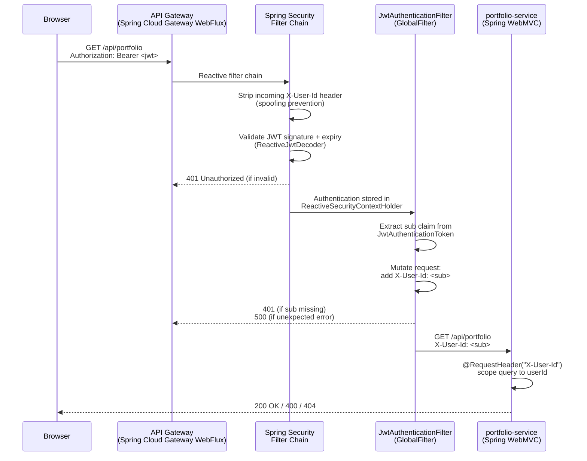
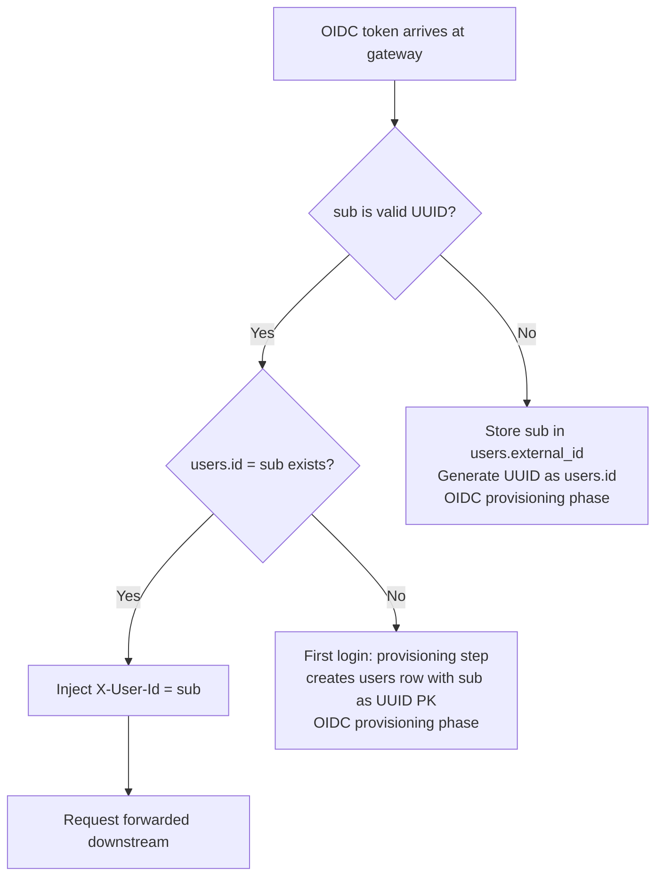
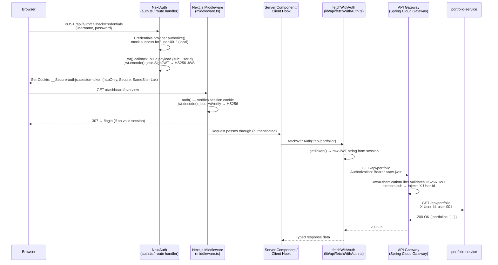
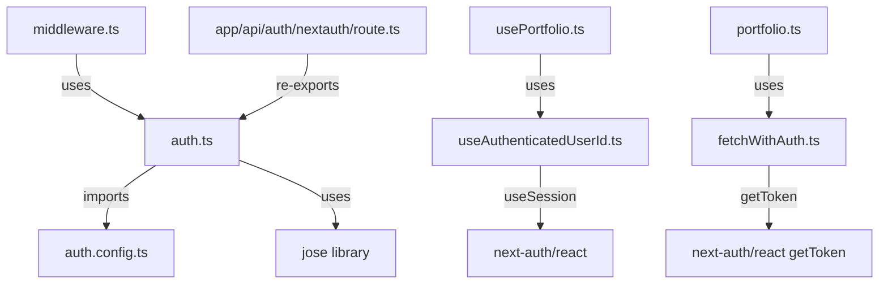

# Design Document — Authentication & Identity Layer (Phase 1: Backend)

## Overview

This document covers the backend-only Phase 1 design for the Authentication & Identity Layer.
The scope is limited to two modules:

- **`api-gateway`** — Spring Security Reactive filter chain, JWT validation, `X-User-Id` injection
- **`portfolio-service`** — controller updates to consume `X-User-Id` header

The design follows the **"Bouncer" pattern**: the API Gateway is the sole JWT validation point.
Downstream services receive the verified user identity via the `X-User-Id` HTTP header and never
parse JWTs or import Spring Security. Profile switching between `local` (HMAC-SHA256) and `aws`
(RS256 via JWK URI) requires zero Java code changes — configuration only.

---

## Architecture

### High-Level Request Flow



### Component Diagram

```mermaid
graph TB
    subgraph api-gateway
        SC[SecurityWebFilterChain<br/>ServerHttpSecurity]
        JD_L[LocalJwtDecoderConfig<br/>@Profile local<br/>NimbusReactiveJwtDecoder.withSecretKey]
        JD_A[AwsJwtDecoderConfig<br/>@Profile aws<br/>NimbusReactiveJwtDecoder.withJwkSetUri]
        JF[JwtAuthenticationFilter<br/>GlobalFilter + Ordered]
        RL[GatewayRateLimitConfig<br/>userOrIpKeyResolver]
    end

    subgraph portfolio-service
        PC[PortfolioController<br/>@RequestHeader X-User-Id]
        PSC[PortfolioSummaryController<br/>@RequestHeader X-User-Id]
        EH[GlobalExceptionHandler<br/>@RestControllerAdvice]
    end

    SC -->|uses| JD_L
    SC -->|uses| JD_A
    JF -->|reads| SC
    RL -->|reads X-User-Id| JF
    JF -->|injects X-User-Id| PC
    JF -->|injects X-User-Id| PSC
```

### Profile Strategy

| Concern                | `local` profile                            | `aws` profile                              |
| ---------------------- | ------------------------------------------ | ------------------------------------------ |
| JWT algorithm          | HMAC-SHA256 (HS256)                        | RS256                                      |
| Key source             | `AUTH_JWT_SECRET` env var                  | JWK URI from `AUTH_JWK_URI` env var        |
| Decoder bean           | `NimbusReactiveJwtDecoder.withSecretKey()` | `NimbusReactiveJwtDecoder.withJwkSetUri()` |
| Rate limit backing     | Redis (Docker Compose / Testcontainers)    | Profile-configured (application-aws.yml)   |
| Code changes to switch | None — profile only                        | None — profile only                        |

---

## Components and Interfaces

### 1. api-gateway: Gradle Dependency Changes

Add to `api-gateway/build.gradle`:

```groovy
dependencies {
    implementation 'org.springframework.cloud:spring-cloud-starter'
    implementation 'org.springframework.cloud:spring-cloud-starter-gateway-server-webflux'
    implementation 'org.springframework.boot:spring-boot-starter-data-redis-reactive'
    implementation 'org.springframework.boot:spring-boot-starter-actuator'
    // Brings in spring-security-oauth2-resource-server, spring-security-oauth2-jose (Nimbus),
    // and spring-webflux security integration. No separate spring-boot-starter-security needed.
    implementation 'org.springframework.boot:spring-boot-starter-oauth2-resource-server'

    testImplementation 'org.testcontainers:testcontainers'
    // JWT minting for tests only — NOT on production classpath
    testImplementation 'io.jsonwebtoken:jjwt-api:0.12.6'
    testRuntimeOnly    'io.jsonwebtoken:jjwt-impl:0.12.6'
    testRuntimeOnly    'io.jsonwebtoken:jjwt-jackson:0.12.6'
}
```

**Rationale:** `spring-boot-starter-oauth2-resource-server` transitively provides
`spring-security-oauth2-resource-server`, `spring-security-oauth2-jose` (Nimbus JOSE+JWT), and
the WebFlux security integration. The `jjwt` dependency is `testImplementation` only — it never
appears in the production artifact, satisfying Requirement 11.3.

---

### 2. api-gateway: Security Filter Chain

**Class:** `com.wealth.gateway.SecurityConfig`
**Location:** `api-gateway/src/main/java/com/wealth/gateway/SecurityConfig.java`

```java
@Configuration
@EnableWebFluxSecurity
public class SecurityConfig {

    @Bean
    SecurityWebFilterChain springSecurityFilterChain(
            ServerHttpSecurity http,
            ReactiveJwtDecoder jwtDecoder) {

        return http
            .csrf(ServerHttpSecurity.CsrfSpec::disable)          // stateless JWT API
            .formLogin(ServerHttpSecurity.FormLoginSpec::disable)
            .httpBasic(ServerHttpSecurity.HttpBasicSpec::disable)
            .authorizeExchange(exchanges -> exchanges
                .pathMatchers("/actuator/**").permitAll()         // health/metrics open
                .pathMatchers("/api/**").authenticated()          // all API routes require JWT
                .anyExchange().authenticated()
            )
            .oauth2ResourceServer(oauth2 -> oauth2
                .jwt(jwt -> jwt.decoder(jwtDecoder))
            )
            .build();
    }
}
```

**Key decisions:**

- CSRF disabled — stateless JWT API, no session cookies on the gateway
- Form login and HTTP Basic disabled — Bearer token only
- `/actuator/**` open — health probes must not require auth
- `/api/**` requires authentication — covers all routed paths
- `oauth2ResourceServer` with JWT decoder — Spring Security handles 401 for invalid/missing tokens
  before the `GlobalFilter` runs

---

### 3. api-gateway: Profile-Conditional JWT Decoder Configuration

**Class:** `com.wealth.gateway.JwtDecoderConfig`
**Location:** `api-gateway/src/main/java/com/wealth/gateway/JwtDecoderConfig.java`

```java
@Configuration
public class JwtDecoderConfig {

    /**
     * Local profile: HMAC-SHA256 symmetric decoder.
     * Key is read from ${auth.jwt.secret} — injected from AUTH_JWT_SECRET env var.
     * Startup fails fast if the property is blank (validated by @Value binding).
     */
    @Bean
    @Profile("local")
    ReactiveJwtDecoder localJwtDecoder(
            @Value("${auth.jwt.secret}") String secret) {

        if (secret == null || secret.isBlank()) {
            throw new IllegalStateException(
                "AUTH_JWT_SECRET must not be blank under the 'local' profile. " +
                "Set the AUTH_JWT_SECRET environment variable.");
        }
        SecretKeySpec key = new SecretKeySpec(
            secret.getBytes(StandardCharsets.UTF_8), "HmacSHA256");
        return NimbusReactiveJwtDecoder.withSecretKey(key)
            .macAlgorithm(MacAlgorithm.HS256)
            .build();
    }

    /**
     * AWS profile: RS256 asymmetric decoder via JWK URI.
     * NimbusReactiveJwtDecoder caches the JWK set and refreshes on key rotation automatically.
     */
    @Bean
    @Profile("aws")
    ReactiveJwtDecoder awsJwtDecoder(
            @Value("${auth.jwk-uri}") String jwkUri) {

        return NimbusReactiveJwtDecoder.withJwkSetUri(jwkUri)
            .jwsAlgorithm(SignatureAlgorithm.RS256)
            .build();
    }
}
```

**Fail-fast behaviour:** Under the `local` profile, if `AUTH_JWT_SECRET` is absent or blank,
the `IllegalStateException` is thrown during context refresh — the application fails to start
with a descriptive message (Requirement 8.4). The secret is never logged (Requirement 8.5).

---

### 4. api-gateway: JwtAuthenticationFilter (GlobalFilter)

**Class:** `com.wealth.gateway.JwtAuthenticationFilter`
**Location:** `api-gateway/src/main/java/com/wealth/gateway/JwtAuthenticationFilter.java`

```java
@Component
public class JwtAuthenticationFilter implements GlobalFilter, Ordered {

    private static final Logger log =
        LoggerFactory.getLogger(JwtAuthenticationFilter.class);
    private static final String X_USER_ID = "X-User-Id";

    /**
     * Runs after Spring Security (which validates the JWT) but before routing.
     * HIGHEST_PRECEDENCE + 1 ensures Spring Security's WebFilter runs first.
     */
    @Override
    public int getOrder() {
        return Ordered.HIGHEST_PRECEDENCE + 1;
    }

    @Override
    public Mono<Void> filter(ServerWebExchange exchange, GatewayFilterChain chain) {
        // Step 1: Strip any caller-supplied X-User-Id (spoofing prevention)
        ServerWebExchange sanitised = exchange.mutate()
            .request(r -> r.headers(h -> h.remove(X_USER_ID)))
            .build();

        // Step 2: Extract Authentication from reactive security context
        return ReactiveSecurityContextHolder.getContext()
            .map(SecurityContext::getAuthentication)
            .cast(JwtAuthenticationToken.class)
            .flatMap(token -> {
                // Step 3: Extract sub claim
                String sub = token.getToken().getClaimAsString("sub");
                if (sub == null || sub.isBlank()) {
                    log.debug("JWT accepted but sub claim is missing or blank");
                    sanitised.getResponse().setStatusCode(HttpStatus.UNAUTHORIZED);
                    return sanitised.getResponse().setComplete();
                }
                // Step 4: Inject X-User-Id header
                ServerWebExchange mutated = sanitised.mutate()
                    .request(r -> r.headers(h -> h.set(X_USER_ID, sub)))
                    .build();
                return chain.filter(mutated);
            })
            .onErrorResume(ClassCastException.class, ex -> {
                // Non-JWT authentication type — treat as unauthenticated
                sanitised.getResponse().setStatusCode(HttpStatus.UNAUTHORIZED);
                return sanitised.getResponse().setComplete();
            })
            .onErrorResume(Exception.class, ex -> {
                // Unexpected exception — log at ERROR, return 500
                log.error("Unexpected error in JwtAuthenticationFilter", ex);
                sanitised.getResponse().setStatusCode(HttpStatus.INTERNAL_SERVER_ERROR);
                return sanitised.getResponse().setComplete();
            });
    }
}
```

**Design notes:**

- Spring Security's `oauth2ResourceServer` filter runs before this `GlobalFilter` and handles
  401 for missing/invalid/expired JWTs. By the time this filter runs, the `Authentication` is
  already validated and stored in `ReactiveSecurityContextHolder`.
- The filter strips `X-User-Id` unconditionally before any other logic — even unauthenticated
  requests have the header stripped (Requirement 12.1).
- The raw JWT token value is never logged. Only `sub` (at DEBUG) may be logged (Requirement 8.5).
- `Ordered.HIGHEST_PRECEDENCE + 1` places this filter immediately after Spring Security's
  `WebFilter` (which runs at `HIGHEST_PRECEDENCE`) but before Spring Cloud Gateway's routing
  filters.

---

### 5. api-gateway: Rate Limiter Key Resolver Update

**Class:** `com.wealth.gateway.GatewayRateLimitConfig` (updated)

The bean is renamed from `ipKeyResolver` to `userOrIpKeyResolver`. The `KeyResolver` reads the
authenticated user identity directly from `exchange.getPrincipal()` — which is populated by
Spring Security's `WebFilter` before any `GlobalFilter` runs — rather than from the `X-User-Id`
header. This eliminates any filter-ordering race condition: Spring Security's authentication
completes before the `RequestRateLimiter` `GatewayFilter` executes, so `getPrincipal()` is
always populated for authenticated requests.

The `resolveKey` static method retains two parameters (`forwardedFor`, `remoteHost`) for the
unauthenticated fallback path and remains a pure function suitable for unit testing.

```java
@Configuration
public class GatewayRateLimitConfig {

    @Bean
    KeyResolver userOrIpKeyResolver() {
        return exchange -> exchange.getPrincipal()
            .map(principal -> {
                // Authenticated: use the sub claim as the rate-limit key
                if (principal instanceof JwtAuthenticationToken jwtToken) {
                    String sub = jwtToken.getToken().getClaimAsString("sub");
                    if (sub != null && !sub.isBlank()) {
                        return sub.trim();
                    }
                }
                // Fallback to IP-based key for unauthenticated or non-JWT principals
                return resolveClientIp(exchange);
            })
            .defaultIfEmpty(resolveClientIp(exchange)); // no principal → unauthenticated
    }

    private String resolveClientIp(ServerWebExchange exchange) {
        var forwardedFor = exchange.getRequest().getHeaders().getFirst("X-Forwarded-For");
        var remoteAddress = exchange.getRequest().getRemoteAddress();
        String remoteHost = (remoteAddress != null && remoteAddress.getAddress() != null)
            ? remoteAddress.getAddress().getHostAddress()
            : null;
        return resolveKey(forwardedFor, remoteHost);
    }

    /**
     * Pure IP-based key-resolution logic — package-private for unit testing.
     * Called when no authenticated principal is available.
     *
     * @param forwardedFor value of X-Forwarded-For header, or null
     * @param remoteHost   remote address host string, or null
     * @return non-null, non-empty rate-limit key
     */
    static String resolveKey(String forwardedFor, String remoteHost) {
        if (forwardedFor != null && !forwardedFor.isBlank()) {
            var comma = forwardedFor.indexOf(',');
            return (comma >= 0 ? forwardedFor.substring(0, comma) : forwardedFor).trim();
        }
        if (remoteHost != null && !remoteHost.isBlank()) {
            return remoteHost;
        }
        return "anonymous";
    }
}
```

**Why `getPrincipal()` is race-condition-free:** Spring Security's `SecurityWebFilterChain`
runs as a `WebFilter` at `WebFilterChainProxy` order, which executes before Spring Cloud
Gateway's `GlobalFilter` chain. The `RequestRateLimiter` is a `GatewayFilter` that runs inside
the routing phase — after all `WebFilter`s have completed. Therefore `exchange.getPrincipal()`
is always resolved by the time the `KeyResolver` is invoked.

**Impact on existing tests:** `GatewayRateLimitConfigTest` requires minimal changes:

- The `resolveKey` signature is **unchanged** (still two parameters: `forwardedFor`, `remoteHost`)
- Existing test cases remain valid as-is
- The bean smoke test `ipKeyResolver()` becomes `userOrIpKeyResolver()`
- New test cases added for the `getPrincipal()` path (requires a mock `ServerWebExchange` with a `JwtAuthenticationToken` principal)

---

### 6. portfolio-service: Controller Changes

#### PortfolioController

Route changes from `GET /api/portfolio/{userId}` to `GET /api/portfolio`.
The `{userId}` path variable is removed; identity comes exclusively from `X-User-Id`.

```java
@RestController
@RequestMapping("/api/portfolio")
public class PortfolioController {

    private final PortfolioService portfolioService;

    public PortfolioController(PortfolioService portfolioService) {
        this.portfolioService = portfolioService;
    }

    /**
     * Returns all portfolios belonging to the authenticated user.
     * userId is extracted from the X-User-Id header injected by the API Gateway JWT filter.
     *
     * 200 OK  — list of portfolios (empty list if user has no portfolios)
     * 400     — X-User-Id header missing (MissingRequestHeaderException → GlobalExceptionHandler)
     * 404     — userId not found in users table
     */
    @GetMapping
    public ResponseEntity<List<PortfolioResponse>> getPortfolios(
            @RequestHeader("X-User-Id") String userId) {
        return ResponseEntity.ok(portfolioService.getByUserId(userId));
    }
}
```

#### PortfolioSummaryController

The `@RequestParam(defaultValue = "user-001")` is removed; identity comes from `X-User-Id`.

```java
@RestController
@RequestMapping("/api/portfolio")
public class PortfolioSummaryController {

    private final PortfolioService portfolioService;

    public PortfolioSummaryController(PortfolioService portfolioService) {
        this.portfolioService = portfolioService;
    }

    /**
     * Returns a lightweight portfolio summary for the authenticated user.
     * userId is extracted from the X-User-Id header injected by the API Gateway JWT filter.
     *
     * 200 OK  — portfolio summary DTO
     * 400     — X-User-Id header missing
     * 404     — userId not found in users table
     */
    @GetMapping("/summary")
    public ResponseEntity<PortfolioSummaryDto> getSummary(
            @RequestHeader("X-User-Id") String userId) {
        return ResponseEntity.ok(portfolioService.getSummary(userId));
    }
}
```

**API Gateway route update:** The `portfolio-service` route predicate in `application.yml`
remains `Path=/api/portfolio/**` — no change needed since the path prefix is unchanged.

---

### 7. portfolio-service: Global Exception Handler

**Class:** `com.wealth.portfolio.GlobalExceptionHandler`
**Location:** `portfolio-service/src/main/java/com/wealth/portfolio/GlobalExceptionHandler.java`

```java
@RestControllerAdvice
public class GlobalExceptionHandler {

    /**
     * Handles missing required request headers (e.g. X-User-Id not present).
     * This indicates the request bypassed the API Gateway — return 400 with a clear message.
     */
    @ExceptionHandler(MissingRequestHeaderException.class)
    public ResponseEntity<Map<String, String>> handleMissingHeader(
            MissingRequestHeaderException ex) {
        return ResponseEntity.badRequest().body(
            Map.of("error", "Required header '" + ex.getHeaderName() + "' is missing"));
    }
}
```

The response body format is `{"error": "Required header 'X-User-Id' is missing"}`.

---

### 8. portfolio-service: Flyway Seed Migration

**File:** `portfolio-service/src/main/resources/db/migration/V4__seed_local_dev_user.sql`

```sql
-- Seed a fixed local development user so integration tests and local dev
-- can use a known UUID as the sub_claim in JWTs.
-- Uses ON CONFLICT DO NOTHING to make this migration idempotent.
INSERT INTO users (id, email, created_at)
VALUES (
    '00000000-0000-0000-0000-000000000001',
    'dev@local',
    NOW()
)
ON CONFLICT DO NOTHING;
```

**Design notes:**

- UUID `00000000-0000-0000-0000-000000000001` is the canonical `sub_claim` for all local dev
  JWTs and integration tests.
- `ON CONFLICT DO NOTHING` makes the migration safe to re-run and idempotent.
- This migration runs under all profiles (including `aws`) — the seed user is harmless in
  production since it has no password and cannot authenticate via OIDC without a matching
  external identity.

---

### 9. api-gateway: TestJwtFactory

**Class:** `com.wealth.gateway.TestJwtFactory`
**Location:** `api-gateway/src/test/java/com/wealth/gateway/TestJwtFactory.java`

```java
/**
 * Test utility for minting HMAC-SHA256 signed JWTs.
 * Resides exclusively in src/test/java — never included in production artifacts.
 */
public final class TestJwtFactory {

    private TestJwtFactory() {}

    /**
     * Mints a compact JWT string signed with HMAC-SHA256.
     *
     * @param sub    the sub claim value (typically a UUID string)
     * @param expiry duration from now until expiry; use negative duration for expired tokens
     * @param secret the HMAC-SHA256 signing secret (must match api-gateway's configured secret)
     * @return compact JWT string (header.payload.signature)
     */
    public static String mint(String sub, Duration expiry, String secret) {
        Instant now = Instant.now();
        return Jwts.builder()
            .subject(sub)
            .issuedAt(Date.from(now))
            .expiration(Date.from(now.plus(expiry)))
            .signWith(Keys.hmacShaKeyFor(secret.getBytes(StandardCharsets.UTF_8)),
                      Jwts.SIG.HS256)
            .compact();
    }
}
```

**Dependency:** `io.jsonwebtoken:jjwt-api` + `jjwt-impl` + `jjwt-jackson` at `testImplementation`
scope only (see Gradle dependency changes above). This satisfies Requirement 11.3 — no JWT
library on the production classpath.

---

## Data Models

### users table (existing — no schema change)

```sql
CREATE TABLE users (
    id         UUID        PRIMARY KEY,
    email      VARCHAR     NOT NULL UNIQUE,
    created_at TIMESTAMPTZ NOT NULL
);
```

The `id` column is the UUID that maps to the JWT `sub_claim`. No schema changes are required
for Phase 1 — the existing table structure already supports the identity contract.

### Identity propagation contract

```
JWT payload:
{
  "sub": "00000000-0000-0000-0000-000000000001",  ← UUID matching users.id
  "iat": 1700000000,
  "exp": 1700003600
}

HTTP header injected by JwtAuthenticationFilter:
X-User-Id: 00000000-0000-0000-0000-000000000001
```

---

## YAML Configuration Changes

### application.yml additions

```yaml
auth:
  jwt:
    secret: ${AUTH_JWT_SECRET:} # local profile only — blank triggers startup failure
  jwk-uri: ${AUTH_JWK_URI:} # aws profile only
```

Both properties use empty-string defaults so the file parses under all profiles. The
`JwtDecoderConfig` beans perform explicit blank-checks and throw `IllegalStateException` at
startup if the required value is missing for the active profile.

### application-local.yml additions

```yaml
auth:
  jwt:
    secret: ${AUTH_JWT_SECRET:local-dev-secret-change-me-min-32-chars}
```

The fallback value satisfies Requirement 8.2 (Docker Compose dev without manual env var
injection) while being clearly labelled as a placeholder. The secret is never logged.

### application-aws.yml (new file)

```yaml
auth:
  jwk-uri: ${AUTH_JWK_URI}
```

No default — `AUTH_JWK_URI` must be explicitly set in the AWS deployment environment.
This satisfies Requirement 8.3.

### api-gateway/src/main/resources/application-local.yml (key-resolver rename)

```yaml
spring:
  data:
    redis:
      host: localhost
      port: 6379
  cloud:
    gateway:
      server:
        webflux:
          default-filters:
            - name: RequestRateLimiter
              args:
                key-resolver: "#{@userOrIpKeyResolver}" # renamed from ipKeyResolver
                redis-rate-limiter.replenishRate: 20
                redis-rate-limiter.burstCapacity: 40
                redis-rate-limiter.requestedTokens: 1

auth:
  jwt:
    secret: ${AUTH_JWT_SECRET:local-dev-secret-change-me-min-32-chars}
```

### api-gateway/src/test/resources/application-local.yml (key-resolver rename)

```yaml
spring:
  cloud:
    gateway:
      server:
        webflux:
          default-filters:
            - name: RequestRateLimiter
              args:
                key-resolver: "#{@userOrIpKeyResolver}" # renamed from ipKeyResolver
                redis-rate-limiter.replenishRate: 1
                redis-rate-limiter.burstCapacity: 3
                redis-rate-limiter.requestedTokens: 1

auth:
  jwt:
    secret: test-secret-for-integration-tests-min-32-chars
```

---

## AWS Profile: OIDC Sub-to-User Mapping Strategy

Under the `aws` profile, the OIDC provider's `sub` claim is an opaque string whose format
depends on the provider (e.g. Cognito issues UUIDs; Auth0 issues `auth0|<id>` strings).

**Phase 1 constraint:** The `sub` claim from the OIDC provider MUST be a UUID that matches a
`users.id` row. Enforcement is via the portfolio-service 404 response — if the `sub` does not
match a `users` row, the request returns 404.

**Mapping approach (to be implemented in the OIDC provisioning phase):**



**Known constraint:** For Phase 1, the `sub` claim MUST be a UUID. If the chosen OIDC provider
issues non-UUID `sub` values (e.g. Auth0's `auth0|xxx` format), a provisioning layer must map
the external `sub` to a generated UUID before the identity contract can be satisfied. This is
documented as a Phase 2 concern.

---

## Correctness Properties

_A property is a characteristic or behavior that should hold true across all valid executions of a system — essentially, a formal statement about what the system should do. Properties serve as the bridge between human-readable specifications and machine-verifiable correctness guarantees._

The following properties are derived from the acceptance criteria in `requirements.md`. Each is
universally quantified and implemented using standard JUnit 5 `@ParameterizedTest` with
`@CsvSource` or `@MethodSource` — no additional testing libraries required.

---

### Property 1: JWT Round-Trip (mint → validate → X-User-Id == sub)

_For any_ non-null, non-blank UUID string `sub`, a JWT minted by `TestJwtFactory` with
`sub_claim = sub` and a future expiry duration, when sent to the API Gateway with a valid
`Authorization: Bearer` header, the `X-User-Id` header forwarded to the downstream service
SHALL equal `sub`.

**Validates: Requirements 4.2, 4.11, 9.3, 9.4, 13.1**

---

### Property 2: Expired JWT Always Rejected

_For any_ UUID string `sub` and any expiry duration strictly in the past (negative offset from
now), a JWT minted by `TestJwtFactory` with that past expiry SHALL be rejected by the
JWT_Filter with HTTP 401, regardless of the `sub_claim` value.

**Validates: Requirements 4.5, 9.5, 13.3**

---

### Property 3: Tampered Signature Always Rejected

_For any_ valid JWT string, if any single byte in the signature segment (the third `.`-delimited
part) is modified (flipped, incremented, or replaced), the JWT_Filter SHALL return HTTP 401.

**Validates: Requirements 4.4, 13.2**

---

### Property 4: Wrong Signing Key Always Rejected

_For any_ JWT signed with any HMAC-SHA256 key that differs from the key configured in the
API Gateway, the JWT_Filter SHALL return HTTP 401.

**Validates: Requirements 13.8**

---

### Property 5: Spoofing Prevention — Injected Value Overrides Caller Header

_For any_ valid JWT with `sub_claim = sub` and any arbitrary string `spoofed` supplied as the
`X-User-Id` header by the caller, the `X-User-Id` header received by the downstream service
SHALL equal `sub` (from the JWT), not `spoofed`.

**Validates: Requirements 4.12, 12.1, 12.2**

---

### Property 6: Missing Authorization Header Always Returns 401

_For any_ HTTP request to any `/api/**` route that carries no `Authorization` header, the
API Gateway SHALL return HTTP 401 and SHALL NOT forward the request to any downstream service.

**Validates: Requirements 4.3**

---

### Property 7: Missing X-User-Id Header in Downstream Always Returns 400

_For any_ HTTP request that reaches `portfolio-service` without an `X-User-Id` header, the
service SHALL return HTTP 400 with a structured error body containing the header name.

**Validates: Requirements 6.5**

---

### Property 8: Rate Limit Key Is Deterministic and User-Distinct

_For any_ non-blank `sub` claim on a `JwtAuthenticationToken` principal, `userOrIpKeyResolver`
SHALL return that `sub` value as the rate-limit key.
_For any_ two distinct `sub` values `a` and `b` where `a ≠ b`, the keys resolved for principals
with those sub values SHALL not be equal.
_For any_ fixed `(forwardedFor, remoteHost)` pair, calling `resolveKey` twice SHALL return the
same value (idempotence / pure function).

**Validates: Requirements 5.1, 5.3, 5.4, 13.4, 13.6**

---

### Property 9: Filter Idempotence — Header Injection Is Stable

_For any_ valid JWT with `sub_claim = sub`, applying the `JwtAuthenticationFilter` logic twice
to the same request (i.e. stripping then re-injecting `X-User-Id`) SHALL produce
`X-User-Id = sub` — the same value as a single application.

**Validates: Requirements 13.7**

---

## Error Handling

### api-gateway error responses

| Condition                      | HTTP Status | Handler                                   |
| ------------------------------ | ----------- | ----------------------------------------- |
| No `Authorization` header      | 401         | Spring Security `oauth2ResourceServer`    |
| Invalid JWT signature          | 401         | Spring Security `oauth2ResourceServer`    |
| Expired JWT                    | 401         | Spring Security `oauth2ResourceServer`    |
| JWT missing `sub` claim        | 401         | `JwtAuthenticationFilter`                 |
| Unexpected exception in filter | 500         | `JwtAuthenticationFilter.onErrorResume`   |
| Rate limit exceeded            | 429         | Spring Cloud Gateway `RequestRateLimiter` |

Spring Security's default `BearerTokenAuthenticationEntryPoint` returns a `WWW-Authenticate`
header on 401 responses. No custom error body is added at the gateway level — downstream
clients should treat 401 as "re-authenticate".

### portfolio-service error responses

| Condition                           | HTTP Status | Handler                                          |
| ----------------------------------- | ----------- | ------------------------------------------------ |
| `X-User-Id` header missing          | 400         | `GlobalExceptionHandler.handleMissingHeader`     |
| `userId` not found in `users` table | 404         | Existing service layer (returns empty or throws) |

**404 handling note:** `PortfolioService.getByUserId` currently returns an empty list when no
portfolios exist for a user — it does not validate that the `userId` corresponds to a `users`
row. To satisfy Requirement 6.6, the service layer must be updated to check `users` table
existence and throw a `UserNotFoundException` (mapped to 404) when the UUID is not found.
This is a targeted addition to `PortfolioService` and `GlobalExceptionHandler`.

---

## Testing Strategy

### Approach

Unit tests cover specific examples, edge cases, and error conditions using standard JUnit 5
`@ParameterizedTest` with `@CsvSource` or `@MethodSource`. No additional property-based testing
libraries (e.g. jqwik) are introduced — the existing JUnit 5 + Gradle setup is sufficient.

---

### Test Classes

#### `GatewayRateLimitConfigTest` (updated unit test)

Existing unit tests require minimal changes — the `resolveKey` static method signature is
**unchanged** (still two parameters: `forwardedFor`, `remoteHost`), so all existing test cases
remain valid. Updates needed:

- Bean smoke test: `ipKeyResolver()` → `userOrIpKeyResolver()`
- New test cases for the `getPrincipal()` path using a mock `ServerWebExchange` with a
  `JwtAuthenticationToken` principal:
  - Authenticated principal with valid `sub` → returns `sub`
  - Authenticated principal with blank `sub` → falls back to IP resolution
  - No principal (unauthenticated) → falls back to IP resolution
  - `resolveKey` idempotence: same inputs always return same output (`@ParameterizedTest @CsvSource`)

#### `JwtFilterIntegrationTest`

```
Class:       com.wealth.gateway.JwtFilterIntegrationTest
Annotations: @Tag("integration"), @Testcontainers, @SpringBootTest(webEnvironment = RANDOM_PORT),
             @ActiveProfiles("local")
Uses:        WebTestClient, Redis via Testcontainers (reuse pattern from RateLimitingIntegrationTest)
```

Test cases:

| #   | Scenario                                                 | Expected                                                |
| --- | -------------------------------------------------------- | ------------------------------------------------------- |
| 1   | Valid JWT with known `sub`                               | Non-401 response; downstream receives `X-User-Id = sub` |
| 2   | No `Authorization` header                                | 401                                                     |
| 3   | Expired JWT                                              | 401                                                     |
| 4   | Tampered signature (flip last byte of signature segment) | 401                                                     |
| 5   | Valid JWT, `sub` claim omitted                           | 401                                                     |
| 6   | Spoofed `X-User-Id` header, no JWT                       | 401                                                     |
| 7   | Authenticated request                                    | Rate limit key in Redis equals `sub` claim, not IP      |

The test uses a WireMock stub (or a minimal `@RestController` in the test context) to capture
the `X-User-Id` header forwarded by the gateway, enabling assertion of the round-trip property.

#### `JwtFilterPropertyTest`

```
Class:       com.wealth.gateway.JwtFilterPropertyTest
Framework:   JUnit 5 @ParameterizedTest with @CsvSource / @MethodSource
Annotations: @Tag("integration"), @ActiveProfiles("local")
```

Properties implemented as parameterised tests:

| Property                   | Test mechanism                                                 | Assertion                                    |
| -------------------------- | -------------------------------------------------------------- | -------------------------------------------- |
| P1: Round-trip             | `@MethodSource` — list of representative UUID sub values       | `X-User-Id == sub`                           |
| P2: Expired JWT            | `@MethodSource` — list of past expiry offsets (-1s, -1h, -1d)  | HTTP 401                                     |
| P3: Tampered signature     | `@MethodSource` — flip first, middle, last byte of sig segment | HTTP 401                                     |
| P4: Wrong key              | `@CsvSource` — representative wrong secrets                    | HTTP 401                                     |
| P8: resolveKey idempotence | `@CsvSource` — representative (xff, ip) pairs                  | `resolveKey(f,i) == resolveKey(f,i)`         |
| P9: Filter idempotence     | `@MethodSource` — representative UUID sub values               | Second application produces same `X-User-Id` |

Properties P3 and P4 use `TestJwtFactory.mint` to produce a valid JWT, then mutate it before
sending. Properties P2, P3, P4 do not require a running downstream service — the gateway
returns 401 before routing.

#### `PortfolioControllerTest` (portfolio-service unit test, updated)

- Remove tests for `GET /api/portfolio/{userId}` path variable
- Add tests for `GET /api/portfolio` with `X-User-Id` header
- Add test: missing `X-User-Id` header → 400 with structured error body
- Add test: `X-User-Id` with unknown UUID → 404

#### `PortfolioSummaryControllerTest` (portfolio-service unit test, updated)

- Remove tests for `@RequestParam userId` with default `"user-001"`
- Add tests for `@RequestHeader("X-User-Id")` extraction
- Add test: missing `X-User-Id` header → 400

### Integration Test Infrastructure

Integration tests in `api-gateway` reuse the Testcontainers Redis pattern from
`RateLimitingIntegrationTest`:

```java
@Container
static final GenericContainer<?> redis =
    new GenericContainer<>(DockerImageName.parse("redis:7-alpine"))
        .withExposedPorts(6379);

@DynamicPropertySource
static void redisProperties(DynamicPropertyRegistry registry) {
    registry.add("spring.data.redis.host", redis::getHost);
    registry.add("spring.data.redis.port", () -> redis.getMappedPort(6379));
}
```

The `auth.jwt.secret` property is set via `@DynamicPropertySource` or the test
`application-local.yml` to `test-secret-for-integration-tests-min-32-chars`, matching the
secret used by `TestJwtFactory` in all integration tests.

### Test Execution

```bash
# Fast unit tests (no Testcontainers)
./gradlew :api-gateway:test
./gradlew :portfolio-service:test

# Integration tests (Testcontainers — Redis for gateway, Postgres for portfolio-service)
./gradlew :api-gateway:integrationTest
./gradlew :portfolio-service:integrationTest

# All checks
./gradlew check
```

---

## Phase 2: Frontend Auth Implementation

### Overview

Phase 2 wires Auth.js (NextAuth v5) into the Next.js 16 App Router frontend so that every
browser session is backed by a real JWT that the API Gateway can validate. The key constraint
is **JWT compatibility**: NextAuth encrypts session tokens as JWE by default, but the API
Gateway expects a plain JWS signed with HMAC-SHA256 using `AUTH_JWT_SECRET`. This section
designs the custom `jwt.encode`/`jwt.decode` callbacks that bypass JWE and issue a standard
HS256-signed token, how that raw token is surfaced in the session object, and how all
TanStack Query hooks are updated to derive `userId` from the session rather than a hardcoded
fallback.

---

### Architecture

#### End-to-End Request Flow



#### Component Dependency Graph



---

### Components and Interfaces

#### 1. `frontend/src/auth.config.ts` — Base NextAuth Configuration

This file holds the configuration that is safe to import in both the Edge runtime (middleware)
and the Node.js runtime. It must not import Node.js-only modules.

```typescript
import type { NextAuthConfig } from "next-auth";
import Credentials from "next-auth/providers/credentials";

export const authConfig: NextAuthConfig = {
  pages: {
    signIn: "/login",
  },

  // Route protection: runs on every request matched by middleware
  callbacks: {
    authorized({ auth, request: { nextUrl } }) {
      const isLoggedIn = !!auth?.user;
      const isDashboard = nextUrl.pathname.startsWith("/");
      const isLoginPage = nextUrl.pathname === "/login";
      const isAuthApi = nextUrl.pathname.startsWith("/api/auth");

      // Always allow the auth API routes through
      if (isAuthApi) return true;
      // Redirect unauthenticated users to /login for all dashboard routes
      if (!isLoggedIn && !isLoginPage) {
        return Response.redirect(new URL("/login", nextUrl));
      }
      // Redirect already-authenticated users away from /login
      if (isLoggedIn && isLoginPage) {
        return Response.redirect(new URL("/overview", nextUrl));
      }
      return true;
    },
  },

  providers: [
    Credentials({
      name: "Credentials",
      credentials: {
        username: { label: "Username", type: "text" },
        password: { label: "Password", type: "password" },
      },
      async authorize(credentials) {
        // Local dev: mock a successful login for "user-001".
        // No real DB lookup — keeps local development frictionless.
        // TODO (aws profile): replace with real DB lookup against users table.
        if (
          credentials?.username === "user-001" &&
          credentials?.password === "password"
        ) {
          return { id: "user-001", name: "Dev User", email: "dev@local" };
        }
        return null;
      },
    }),
  ],
};
```

**Key decisions:**

- `pages.signIn = "/login"` ensures NextAuth redirects to the existing login route.
- The `authorized` callback runs in the Edge runtime via middleware — no DB access here.
- The mock `authorize` for `"user-001"` is intentionally simple; the `aws` profile will
  replace this with a real lookup without changing the callback signature.

---

#### 2. `frontend/src/auth.ts` — NextAuth Initialization with Custom JWT Encoding

This is the critical file that overrides NextAuth's default JWE encryption with a plain
HS256-signed JWS compatible with the API Gateway.

```typescript
import NextAuth from "next-auth";
import { authConfig } from "./auth.config";
import { SignJWT, jwtVerify } from "jose";
import type { JWT } from "next-auth/jwt";

const secret = new TextEncoder().encode(process.env.AUTH_JWT_SECRET);

export const { handlers, auth, signIn, signOut } = NextAuth({
  ...authConfig,

  session: {
    strategy: "jwt",
  },

  callbacks: {
    // Populate the JWT payload with the user's id as the `sub` claim.
    // This runs when a session is created or refreshed.
    async jwt({ token, user }) {
      if (user?.id) {
        token.sub = user.id;
      }
      return token;
    },

    // Expose the raw JWT string in the session so client code can attach it
    // as a Bearer token. The `accessToken` field carries the signed JWS string.
    async session({ session, token }) {
      session.user.id = token.sub ?? "";
      // Surface the raw token string for use in Authorization headers.
      // Cast needed because NextAuth's Session type doesn't include accessToken by default.
      (session as { accessToken?: string }).accessToken = token.__rawJwt as
        | string
        | undefined;
      return session;
    },
  },

  jwt: {
    // Override NextAuth's default JWE encryption.
    // Issue a plain HS256-signed JWS that the API Gateway can verify directly.
    async encode({ token }): Promise<string> {
      const payload = { ...token } as Record<string, unknown>;
      const jwt = await new SignJWT(payload)
        .setProtectedHeader({ alg: "HS256" })
        .setIssuedAt()
        .setExpirationTime("1h")
        .sign(secret);
      // Stash the raw JWT string back into the token for the session callback.
      if (token) token.__rawJwt = jwt;
      return jwt;
    },

    async decode({ token }): Promise<JWT | null> {
      if (!token) return null;
      try {
        const { payload } = await jwtVerify(token, secret, {
          algorithms: ["HS256"],
        });
        return payload as JWT;
      } catch {
        return null;
      }
    },
  },
});
```

**Why this works:**

- `SignJWT` from `jose` produces a compact JWS (`header.payload.signature`) — the exact format
  the Spring `NimbusReactiveJwtDecoder.withSecretKey()` expects.
- `jwtVerify` from `jose` validates the same format on decode, keeping NextAuth's internal
  session verification consistent.
- The `__rawJwt` field is a private stash on the `token` object (not part of the JWT payload
  sent to the gateway) used to thread the signed string through to the `session` callback.
- `secret` is derived from `AUTH_JWT_SECRET` — the same env var used by the API Gateway —
  so the token is accepted without any key distribution problem.

**TypeScript module augmentation** — add to `frontend/src/types/next-auth.d.ts`:

```typescript
import type { DefaultSession } from "next-auth";

declare module "next-auth" {
  interface Session {
    user: {
      id: string;
    } & DefaultSession["user"];
    accessToken?: string;
  }
}

declare module "next-auth/jwt" {
  interface JWT {
    sub?: string;
    __rawJwt?: string;
  }
}
```

---

#### 3. `frontend/src/app/api/auth/[...nextauth]/route.ts` — Route Handler

```typescript
import { handlers } from "@/auth";

export const { GET, POST } = handlers;
```

This is the standard NextAuth v5 App Router route handler. No custom logic needed here —
all configuration lives in `auth.ts`.

---

#### 4. `frontend/src/middleware.ts` — Route Protection

```typescript
import { auth } from "@/auth";

// The `auth` export from NextAuth v5 can be used directly as middleware.
// It calls the `authorized` callback defined in auth.config.ts on every matched request.
export default auth;

export const config = {
  // Match all routes except Next.js internals and static assets.
  // The authorized callback handles the /login ↔ /dashboard redirect logic.
  matcher: ["/((?!_next/static|_next/image|favicon.ico).*)"],
};
```

**Note:** Because `auth.config.ts` is imported by middleware and middleware runs on the Edge
runtime, `auth.config.ts` must not import any Node.js-only modules (e.g. `bcrypt`, `pg`).
The `jose` library used in `auth.ts` is Node.js-only, so `auth.ts` is NOT imported by
middleware — only `auth.config.ts` is.

---

#### 5. `frontend/src/lib/api/fetchWithAuth.ts` — Authenticated Fetch Wrapper (new file)

This wrapper centralises Bearer token attachment so no individual API function needs to
know about NextAuth internals.

```typescript
import { getServerSession } from "next-auth";
import { auth } from "@/auth";

/**
 * Authenticated fetch for use in Server Components and Route Handlers.
 * Retrieves the current session, extracts the raw JWT, and attaches it
 * as an Authorization: Bearer header.
 *
 * For Client Components, use the `fetchWithAuthClient` variant below,
 * which reads the token from the useSession hook via a passed-in token string.
 */
export async function fetchWithAuth<T>(
  path: string,
  init?: RequestInit,
): Promise<T> {
  const session = await auth();
  const token = (session as { accessToken?: string } | null)?.accessToken;

  const headers: HeadersInit = {
    "Content-Type": "application/json",
    ...(init?.headers ?? {}),
    ...(token ? { Authorization: `Bearer ${token}` } : {}),
  };

  const response = await fetch(path, {
    method: "GET",
    ...init,
    headers,
    cache: "no-store",
  });

  if (!response.ok) {
    throw new Error(`Request failed (${response.status}) for ${path}`);
  }

  return (await response.json()) as T;
}

/**
 * Client-side variant: accepts the raw JWT string from useSession().
 * Used by TanStack Query hooks running in Client Components.
 *
 * @param path    API path (e.g. "/api/portfolio")
 * @param token   Raw JWT string from session.accessToken
 * @param init    Optional fetch init overrides
 */
export async function fetchWithAuthClient<T>(
  path: string,
  token: string,
  init?: RequestInit,
): Promise<T> {
  const response = await fetch(path, {
    method: "GET",
    ...init,
    headers: {
      "Content-Type": "application/json",
      ...(init?.headers ?? {}),
      Authorization: `Bearer ${token}`,
    },
    cache: "no-store",
  });

  if (!response.ok) {
    throw new Error(`Request failed (${response.status}) for ${path}`);
  }

  return (await response.json()) as T;
}
```

**Design rationale — two variants:**

- `fetchWithAuth` (server-side): calls `auth()` directly, suitable for Server Components and
  API Route Handlers where the session is available server-side.
- `fetchWithAuthClient` (client-side): accepts the token as a parameter, suitable for
  TanStack Query `queryFn` callbacks running in Client Components where `auth()` cannot be
  called. The token is passed in from `useSession().data.accessToken`.

---

#### 6. `frontend/src/lib/api/portfolio.ts` — Updated to Use `fetchWithAuthClient`

The private `fetchJson` helper is replaced by `fetchWithAuthClient`. All exported functions
gain a `token` parameter:

```typescript
import { fetchWithAuthClient } from "@/lib/api/fetchWithAuth";

// Internal helper — thin wrapper that passes the token through
async function fetchJson<T>(path: string, token: string): Promise<T> {
  return fetchWithAuthClient<T>(path, token);
}

export async function fetchPortfolio(
  userId: string,
  token: string,
): Promise<PortfolioResponseDTO> {
  /* ... */
}

export async function fetchPortfolioPerformance(
  userId: string,
  days: number,
  token: string,
): Promise<PortfolioPerformanceDTO> {
  /* ... */
}

export async function fetchAssetAllocation(
  userId: string,
  token: string,
): Promise<AssetAllocationDTO> {
  /* ... */
}
```

The `userId` default parameter `= "user-001"` is removed from all exported functions.
The `token` parameter is required — callers (the hooks) are responsible for providing it.

Similarly, `frontend/src/lib/apiService.ts` is updated:

```typescript
export function fetchPortfolioSummary(
  userId: string,
  token: string,
): Promise<PortfolioSummaryDTO> {
  const params = new URLSearchParams({ userId });
  return fetchWithAuthClient<PortfolioSummaryDTO>(
    `/api/portfolio/summary?${params.toString()}`,
    token,
  );
}
```

---

#### 7. `frontend/src/lib/hooks/useAuthenticatedUserId.ts` — New Hook

```typescript
"use client";

import { useSession } from "next-auth/react";

export interface AuthenticatedUser {
  userId: string;
  token: string;
  status: "authenticated" | "loading" | "unauthenticated";
}

/**
 * Returns the authenticated user's ID (sub claim) and raw JWT token.
 * Components and hooks must check `status` before issuing API requests.
 *
 * - status === "loading"         → session is being fetched; do not render or fetch
 * - status === "unauthenticated" → no session; redirect handled by middleware
 * - status === "authenticated"   → userId and token are safe to use
 */
export function useAuthenticatedUserId(): AuthenticatedUser {
  const { data: session, status } = useSession();

  if (status === "authenticated" && session?.user?.id && session?.accessToken) {
    return {
      userId: session.user.id,
      token: session.accessToken,
      status: "authenticated",
    };
  }

  return { userId: "", token: "", status };
}
```

**Contract:**

- `userId` is the `sub` claim from the JWT — matches `users.id` in the database.
- `token` is the raw HS256-signed JWS string — ready to attach as `Authorization: Bearer`.
- Callers must guard on `status !== "authenticated"` before using `userId` or `token`.

---

#### 8. `frontend/src/lib/hooks/usePortfolio.ts` — Updated to Remove Hardcoded Defaults

```typescript
"use client";

import { useQuery } from "@tanstack/react-query";
import {
  fetchPortfolio,
  fetchPortfolioPerformance,
  fetchAssetAllocation,
} from "@/lib/api/portfolio";
import { fetchPortfolioSummary } from "@/lib/apiService";
import { useAuthenticatedUserId } from "@/lib/hooks/useAuthenticatedUserId";

export const portfolioKeys = {
  all: (userId: string) => ["portfolio", userId] as const,
  performance: (userId: string, days: number) =>
    ["portfolio", userId, "performance", days] as const,
  allocation: (userId: string) => ["portfolio", userId, "allocation"] as const,
  summary: (userId: string) => ["portfolio", "summary", userId] as const,
};

export function usePortfolio() {
  const { userId, token, status } = useAuthenticatedUserId();
  return useQuery({
    queryKey: portfolioKeys.all(userId),
    queryFn: () => fetchPortfolio(userId, token),
    enabled: status === "authenticated",
    staleTime: 30_000,
    refetchInterval: 60_000,
  });
}

export function usePortfolioPerformance(days = 30) {
  const { userId, token, status } = useAuthenticatedUserId();
  return useQuery({
    queryKey: portfolioKeys.performance(userId, days),
    queryFn: () => fetchPortfolioPerformance(userId, days, token),
    enabled: status === "authenticated",
    staleTime: 60_000,
  });
}

export function useAssetAllocation() {
  const { userId, token, status } = useAuthenticatedUserId();
  return useQuery({
    queryKey: portfolioKeys.allocation(userId),
    queryFn: () => fetchAssetAllocation(userId, token),
    enabled: status === "authenticated",
    staleTime: 60_000,
  });
}

export function usePortfolioSummary() {
  const { userId, token, status } = useAuthenticatedUserId();
  return useQuery({
    queryKey: portfolioKeys.summary(userId),
    queryFn: () => fetchPortfolioSummary(userId, token),
    enabled: status === "authenticated",
    staleTime: 30_000,
    retry: 1,
  });
}
```

**Key changes from current state:**

- All `userId = "user-001"` default parameters removed.
- All hooks call `useAuthenticatedUserId()` internally — callers no longer pass `userId`.
- `enabled: status === "authenticated"` prevents any API request when there is no session.
- `portfolioKeys` is unchanged in shape — it still takes `userId` as a parameter, ensuring
  cache entries remain scoped per user.

---

### JWT Strategy

#### Why JWE Must Be Bypassed

NextAuth v5 defaults to encrypting the session token as a **JWE** (JSON Web Encryption,
`alg: "dir"`, `enc: "A256CBC-HS512"`). A JWE is opaque — the API Gateway cannot read it
without the encryption key, and Spring Security's `NimbusReactiveJwtDecoder` does not support
JWE decryption. The API Gateway expects a **JWS** (JSON Web Signature) — a token whose
payload is Base64-encoded and readable, with only the signature providing integrity.

#### How the Override Works

```
NextAuth jwt.encode() callback
  └─ jose.SignJWT(payload)
       .setProtectedHeader({ alg: "HS256" })
       .setIssuedAt()
       .setExpirationTime("1h")
       .sign(secret)                    ← secret = AUTH_JWT_SECRET bytes
  └─ returns compact JWS: "header.payload.signature"

NextAuth jwt.decode() callback
  └─ jose.jwtVerify(token, secret, { algorithms: ["HS256"] })
  └─ returns decoded payload as JWT object (or null on failure)
```

The `jose` library is already a transitive dependency of `next-auth` — no new package
installation is required.

#### Token Lifecycle

```
1. User logs in → authorize() returns { id: "user-001", ... }
2. jwt() callback: token.sub = "user-001"
3. encode() callback: SignJWT({ sub: "user-001", iat, exp }) → JWS string
4. JWS stored in __Secure-authjs.session-token cookie (httpOnly, Secure, SameSite=Lax)
5. On each request: decode() callback: jwtVerify(cookie) → { sub: "user-001", ... }
6. session() callback: session.user.id = "user-001"; session.accessToken = <JWS string>
7. useSession() in client → { data: { user: { id: "user-001" }, accessToken: "<JWS>" } }
8. fetchWithAuthClient(path, token) → fetch(path, { Authorization: "Bearer <JWS>" })
9. API Gateway: NimbusReactiveJwtDecoder.withSecretKey(AUTH_JWT_SECRET) validates JWS
10. JwtAuthenticationFilter: extracts sub → injects X-User-Id: user-001
```

#### Surfacing the Raw Token in the Session

The `__rawJwt` field is written to the `token` object inside `encode()` and read back in the
`session()` callback. This is necessary because NextAuth does not expose the encoded token
string directly in the `session` callback — only the decoded payload is available. The stash
pattern avoids a second `SignJWT` call in the `session` callback.

The `accessToken` field on the session is typed via module augmentation in
`frontend/src/types/next-auth.d.ts` (see Components section above).

---

### Environment Variables

#### `.env.local` (committed as template, actual values gitignored)

```bash
# Shared with API Gateway — MUST match AUTH_JWT_SECRET in api-gateway config
AUTH_JWT_SECRET=local-dev-secret-change-me-min-32-chars

# NextAuth internal secret — used for CSRF token and other NextAuth internals.
# Different from AUTH_JWT_SECRET. Generate with: openssl rand -base64 32
NEXTAUTH_SECRET=replace-with-output-of-openssl-rand-base64-32

# Required by NextAuth v5 in production; can be omitted in local dev
# NEXTAUTH_URL=http://localhost:3000
```

#### Runtime-injected (never committed)

| Variable          | Where set                        | Purpose                                      |
| ----------------- | -------------------------------- | -------------------------------------------- |
| `AUTH_JWT_SECRET` | Docker Compose env / AWS Secrets | HS256 signing key shared with API Gateway    |
| `NEXTAUTH_SECRET` | Docker Compose env / AWS Secrets | NextAuth CSRF and internal encryption secret |

#### AWS Profile additions (future)

```bash
AUTH_OIDC_CLIENT_ID=<cognito-app-client-id>
AUTH_OIDC_CLIENT_SECRET=<cognito-app-client-secret>
AUTH_OIDC_ISSUER=https://cognito-idp.<region>.amazonaws.com/<user-pool-id>
```

**Important:** `AUTH_JWT_SECRET` must be identical between the Next.js container and the
`api-gateway` container. In Docker Compose, both services should reference the same env var
from a shared `.env` file or `environment:` block.

---

### Correctness Properties (Phase 2)

These properties extend the Phase 1 correctness properties defined above.

---

#### Property P10: Session Token Round-Trip (encode → cookie → decode → sub)

_For any_ user ID string `id` returned by `authorize()`, the JWT produced by the `encode`
callback SHALL be decodable by the `decode` callback using the same `AUTH_JWT_SECRET`, and
the decoded payload's `sub` claim SHALL equal `id`.

**Validates: Requirements 3.5, 13.5**

---

#### Property P11: Unauthenticated Hooks Do Not Issue Requests

_For any_ render of `usePortfolio`, `usePortfolioPerformance`, `useAssetAllocation`, or
`usePortfolioSummary` where `useAuthenticatedUserId()` returns `status !== "authenticated"`,
TanStack Query SHALL NOT call the `queryFn` (i.e. no `fetch` call is made to any `/api/*`
endpoint).

**Validates: Requirement 3.3**

---

#### Property P12: Bearer Header Always Present on Authenticated API Calls

_For any_ call to `fetchWithAuthClient(path, token)` where `token` is a non-empty string,
the outgoing `fetch` request SHALL include an `Authorization` header with value
`"Bearer " + token`.

_For any_ call to `fetchWithAuthClient(path, token)` where `token` is an empty string,
the function SHALL still include the header (with value `"Bearer "`) — callers are
responsible for ensuring `status === "authenticated"` before calling.

**Validates: Requirement 1.4**

---

#### Property P13: Cache Keys Are User-Scoped

_For any_ two distinct authenticated user IDs `a` and `b` where `a ≠ b`,
`portfolioKeys.all(a)` SHALL NOT deep-equal `portfolioKeys.all(b)`, and TanStack Query
SHALL maintain separate cache entries for each.

**Validates: Requirement 3.4**

---

#### Property P14: useAuthenticatedUserId Returns sub from Session

_For any_ active NextAuth session where `session.user.id = id` and
`session.accessToken = token`, `useAuthenticatedUserId()` SHALL return
`{ userId: id, token: token, status: "authenticated" }`.

**Validates: Requirements 3.1, 3.5, 13.5**

---

### Testing Strategy

#### Unit Tests with Vitest + MSW

All hook tests live alongside the hooks or in `frontend/src/test/`. The MSW server is already
configured in `frontend/src/test/msw/server.ts`.

##### Mocking NextAuth Session in Tests

Use `vi.mock("next-auth/react")` to control the session state:

```typescript
import { vi } from "vitest";
import { useSession } from "next-auth/react";

vi.mock("next-auth/react", () => ({
  useSession: vi.fn(),
  SessionProvider: ({ children }: { children: React.ReactNode }) => children,
}));

// In each test:
vi.mocked(useSession).mockReturnValue({
  data: {
    user: { id: "user-001", name: "Dev User", email: "dev@local" },
    accessToken: "eyJhbGciOiJIUzI1NiJ9.test.sig",
    expires: new Date(Date.now() + 3600_000).toISOString(),
  },
  status: "authenticated",
  update: vi.fn(),
});
```

##### `useAuthenticatedUserId` Tests

```
File: frontend/src/lib/hooks/useAuthenticatedUserId.test.ts

Test cases:
  ✓ returns { userId, token, status: "authenticated" } when session is active
  ✓ returns { userId: "", token: "", status: "loading" } when session is loading
  ✓ returns { userId: "", token: "", status: "unauthenticated" } when no session
  ✓ userId equals session.user.id (sub claim round-trip)
  ✓ token equals session.accessToken
```

##### `usePortfolio` Hook Tests

```
File: frontend/src/lib/hooks/usePortfolio.test.ts

Setup:
  - Wrap in <QueryClientProvider> + <SessionProvider>
  - MSW handler intercepts GET /api/portfolio and asserts Authorization header

Test cases:
  ✓ does NOT call /api/portfolio when status === "unauthenticated"
  ✓ does NOT call /api/portfolio when status === "loading"
  ✓ calls /api/portfolio with Authorization: Bearer <token> when authenticated
  ✓ query key includes userId — separate cache entries for different users
  ✓ returns data from MSW handler when authenticated
```

##### MSW Handler Updates

Update `frontend/src/test/msw/handlers.ts` to assert the `Authorization` header and return
user-scoped data:

```typescript
import { http, HttpResponse } from "msw";

export const handlers = [
  http.get("/api/portfolio", ({ request }) => {
    const auth = request.headers.get("Authorization");
    if (!auth?.startsWith("Bearer ")) {
      return new HttpResponse(null, { status: 401 });
    }
    return HttpResponse.json({ portfolioId: "p-001", holdings: [] });
  }),

  http.get("/api/portfolio/summary", ({ request }) => {
    const auth = request.headers.get("Authorization");
    if (!auth?.startsWith("Bearer ")) {
      return new HttpResponse(null, { status: 401 });
    }
    const url = new URL(request.url);
    const userId = url.searchParams.get("userId") ?? "user-001";
    return HttpResponse.json({
      userId,
      portfolioCount: 1,
      totalHoldings: 4,
      totalValue: 284531.42,
    });
  }),
];
```

##### `fetchWithAuthClient` Unit Tests

```
File: frontend/src/lib/api/fetchWithAuth.test.ts

Test cases:
  ✓ attaches Authorization: Bearer <token> header on every call
  ✓ throws on non-ok response (4xx, 5xx)
  ✓ returns parsed JSON on 200 OK
  ✓ passes through additional RequestInit options (method, body, etc.)
```

#### Test Execution

```bash
# Run all frontend unit tests (single run, no watch)
cd frontend && npm run test

# Run a specific test file
cd frontend && npx vitest run src/lib/hooks/usePortfolio.test.ts
```

No new test infrastructure is required — Vitest, Testing Library, and MSW are already
installed as dev dependencies.
