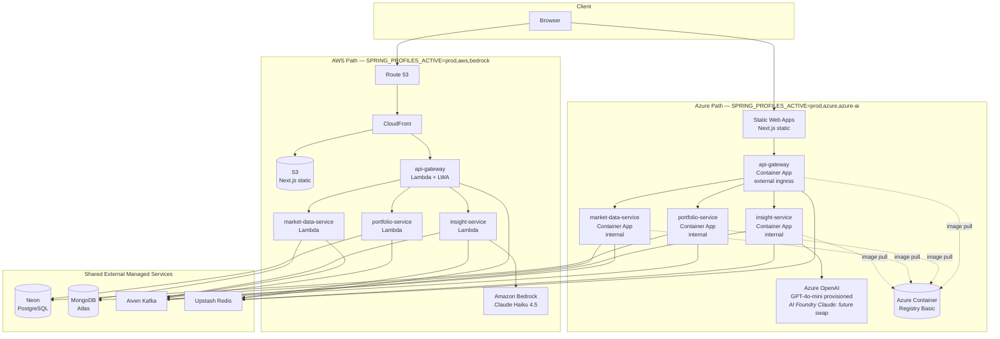
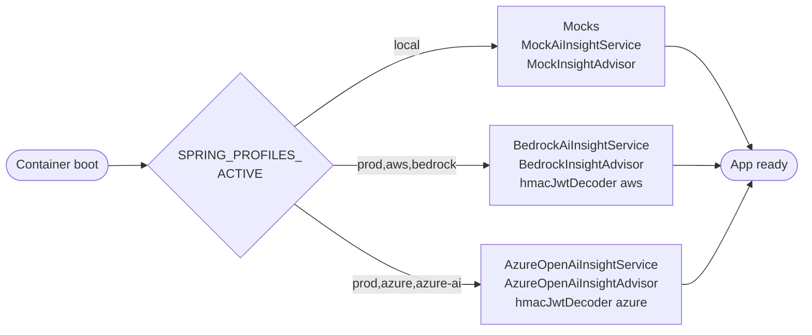
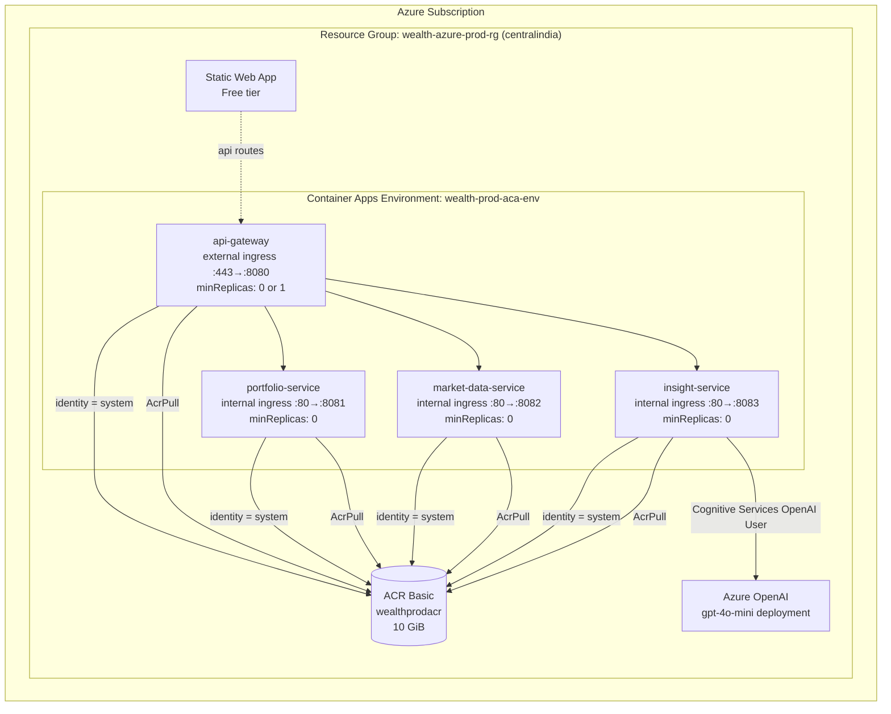
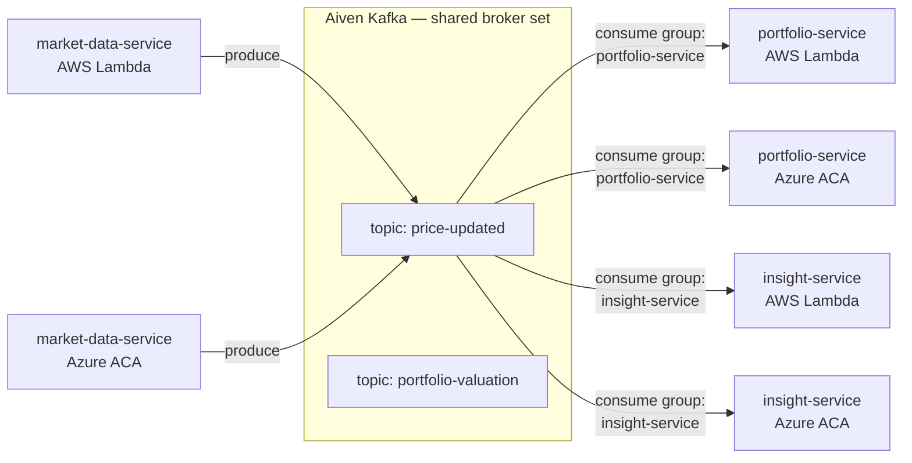

# Azure Container Apps Deployment — Design

**Spec:** `azure-container-apps-deployment`
**Workflow:** Design-First (HLD + LLD)
**Source analysis:** `docs/analysis/azure-container-migration-analysis.md` (validated)
**Constraint:** Additive. Zero AWS code removed. Existing Lambda deployment remains fully functional via Spring profile switching.

---

## 1. Overview

Add Azure Container Apps (ACA) as a supported deployment target alongside the existing AWS Lambda deployment. A runtime instance activates exactly one cloud path via `SPRING_PROFILES_ACTIVE`:

- `prod,aws,bedrock` → Lambda + Amazon Bedrock
- `prod,azure,azure-ai` → ACA + Azure OpenAI
- `local` → Mocks (unchanged)

The application layer changes are contained to four `@Profile` annotation edits, one preservation test update, two new Azure AI adapter classes, one new AI-provider profile-validator class (see §3.5a), five new YAML files, and two `build.gradle` dependencies. Everything else is new infrastructure (separate Terraform root, new Dockerfiles, new GitHub Actions).

### 1.1 Goals

- Support ACA as an additive deployment target.
- Preserve all AWS behaviors exactly. Existing Lambda deploys continue to work.
- Keep the hexagonal boundary clean — no Azure SDK imports inside domain/service packages.
- Make profile mutual exclusion explicit so misconfiguration fails fast, not silently.
- Keep monthly cost within the $0–$10 budget (~$5–$6 scale-to-zero; ~$7–$9 with one warm api-gateway replica).

### 1.2 Non-goals

- Running both clouds simultaneously for the same consumer group on Aiven Kafka (see §2.4).
- Moving external data services (Neon, Atlas, Aiven, Upstash) to Azure-native equivalents.
- Frontend rewrite — Static Web Apps hosts the existing Next.js static export unchanged.
- GraalVM native image. Out of scope; AOT + jlink already applied.

---

## 2. High-Level Design

### 2.1 System Context Diagram

Two independent delivery paths share the same external data plane.



### 2.2 Profile Activation Flow

Three profile axes control bean wiring. They are independent; the runtime activates exactly one meaningful combination per deploy.



**Guard summary after this spec lands:**

| Bean / Class | Profile expression | Notes |
|---|---|---|
| `JwtDecoderConfig.hmacJwtDecoder` | `{"local","aws","azure"}` | **Widened (G1).** Exactly one `ReactiveJwtDecoder` registered in all three target environments. |
| `MockAiInsightService` | `!bedrock & !azure-ai` | **Widened (G2).** Active in `local`; inactive when either real adapter is selected. |
| `MockInsightAdvisor` | `!bedrock & !azure-ai` | **Widened (G2).** Same as above. |
| `BedrockAiInsightService` | `bedrock` | Unchanged. |
| `BedrockInsightAdvisor` | `bedrock` | Unchanged. |
| `AzureOpenAiInsightService` | `azure-ai` | **New.** Mirrors Bedrock pair. |
| `AzureOpenAiInsightAdvisor` | `azure-ai` | **New.** Mirrors Bedrock pair. |
| `InfrastructureHealthLogger` (insight-service) | `{"aws","azure"}` | **Widened (G17).** Startup `[INFRA-OK]`/`[INFRA-FAIL]` log lines retained on Azure. |

The `bedrock` and `azure-ai` profiles are mutually exclusive at runtime by convention — enforced by deployment tooling (Terraform sets `SPRING_PROFILES_ACTIVE` per cloud). See correctness property P1.

### 2.3 ACA Component Diagram (Single Environment)



**Key ACA facts encoded in the diagram:**

- Internal DNS always listens on **port 80**; the env ingress maps `port 80 → targetPort` per app. Caller URLs use the bare app name: `http://portfolio-service`, not `:8081`.
- Each Container App has a **system-assigned** managed identity. `AcrPull` must be assigned to that identity on the ACR — otherwise revision activation fails with `UNAUTHORIZED: authentication required`.
- Only `insight-service` needs the `Cognitive Services OpenAI User` role (Managed Identity auth for Azure OpenAI).
- Only `api-gateway` has external ingress. The three downstreams are `ingress.external = false`.

### 2.4 Kafka Event Topology — Single-Cloud-Per-Deploy

**Decision:** One cloud consumes from Aiven Kafka at any given time. The active-cloud deployment switches by flipping DNS / the Static Web App's API route.



**Why single-cloud-per-deploy:**

- Both clouds' `portfolio-service` instances share the same `spring.kafka.consumer.group-id`, so Kafka treats them as consumers in one group. Running both simultaneously splits partitions between consumers across the two clouds — **each partition is still processed exactly once total**, but processing is assigned arbitrarily between clouds by Kafka's partition-assignment strategy, producing unpredictable cross-cloud request flow. For a single-user portfolio workload the ambiguity is not worth the complexity.
- Producing from both clouds concurrently is safe (Kafka producers don't coordinate), but duplicates the upstream price fetch traffic against Yahoo/Alpha Vantage.
- Standard pattern: **Azure = DR / evaluation target**. AWS remains primary. Switch by changing `SPRING_PROFILES_ACTIVE` and the Static Web App's proxy target; shut down the inactive side's Container Apps (scale-to-zero already does this naturally; Terraform can optionally set `minReplicas = 0` + `maxReplicas = 0` for explicit shutdown).

**Consumer-group-id convention (enforced by `application-prod.yml`, unchanged):**

```yaml
spring:
  kafka:
    consumer:
      group-id: portfolio-service   # or insight-service
```

No cloud suffix. If future work needs both clouds consuming in parallel (A/B validation), introduce `group-id: portfolio-service-${CLOUD:aws}` via env var; out of scope here.

### 2.5 Configuration Isolation Model

Each service's Spring configuration is a base + profile-overlay stack. The overlays never collide because `aws` and `azure` profiles are mutually exclusive at the deployment layer.

| File | Activation | Purpose | Cloud |
|---|---|---|---|
| `application.yml` | Always | Base config, env-var substitution for all URLs and secrets | Shared |
| `application-local.yml` | `local` | Docker Compose URLs, localhost ports, dev secrets | Local |
| `application-prod.yml` | `prod` | Cloud-agnostic production defaults | Shared |
| `application-aws.yml` | `aws` | Lambda-specific: health-indicator suppression, FX provider URL, Caffeine cache | AWS |
| `application-bedrock.yml` | `bedrock` | Bedrock Converse SDK region/creds + model + `spring.ai.model.chat: bedrock-converse` | AWS (insight-service only) |
| **`application-azure.yml`** (new, 4 files) | `azure` | ACA-specific: Redis health suppression, FX URL, cache type, CORS origin | Azure |
| **`application-azure-ai.yml`** (new, 1 file) | `azure-ai` | Azure OpenAI endpoint + deployment + auth + `spring.ai.model.chat: azure-openai` | Azure (insight-service only) |

**Invariants:**

- `application-aws.yml` and `application-azure.yml` are mutually exclusive at runtime. The deployment tooling sets one or the other, never both.
- `application-bedrock.yml` and `application-azure-ai.yml` are mutually exclusive at runtime (P1).
- No `localhost` values in any `prod`, `aws`, `azure`, `bedrock`, or `azure-ai` file. All URLs resolve from env vars with no localhost fallback.

---

## 3. Low-Level Design

### 3.1 G1 — `JwtDecoderConfig` profile widening + preservation test update

**File:** `api-gateway/src/main/java/com/wealth/gateway/JwtDecoderConfig.java`

```diff
     @Bean
-    @Profile({"local", "aws"})
+    @Profile({"local", "aws", "azure"})
     ReactiveJwtDecoder hmacJwtDecoder(@Value("${auth.jwt.secret}") String secret) {
         byte[] secretBytes = secret == null ? new byte[0] : secret.getBytes(StandardCharsets.UTF_8);
         if (secretBytes.length < 32) {
             throw new IllegalStateException(
-                    "AUTH_JWT_SECRET must be at least 32 bytes for HS256 under local/aws profiles.");
+                    "AUTH_JWT_SECRET must be at least 32 bytes for HS256 under local/aws/azure profiles.");
         }
```

**File:** `api-gateway/src/test/java/com/wealth/gateway/PreservationPropertyTest.java` (same task; cannot merge G1 without this)

```diff
     @Test
     void jwtDecoderConfigHasCorrectProfileAnnotations() throws Exception {
         Class<?> configClass = JwtDecoderConfig.class;

         Method hmacMethod = configClass.getDeclaredMethod("hmacJwtDecoder", String.class);
         Profile hmacProfile = hmacMethod.getAnnotation(Profile.class);
         assertThat(hmacProfile)
                 .as("hmacJwtDecoder must be annotated with @Profile")
                 .isNotNull();
         assertThat(hmacProfile.value())
-                .as("hmacJwtDecoder must be scoped to local and aws profiles")
-                .containsExactly("local", "aws");
+                .as("hmacJwtDecoder must be scoped to local, aws, and azure profiles")
+                .containsExactlyInAnyOrder("local", "aws", "azure");
     }
```

`containsExactlyInAnyOrder` replaces `containsExactly` because `@Profile.value()` order is not semantically significant.

### 3.2 G2 — Mock guards widening

**File:** `insight-service/src/main/java/com/wealth/insight/infrastructure/ai/MockAiInsightService.java`

```diff
 @Service
-@Profile("!bedrock")
+@Profile("!bedrock & !azure-ai")
 public class MockAiInsightService implements AiInsightService {
```

**File:** `insight-service/src/main/java/com/wealth/insight/infrastructure/ai/MockInsightAdvisor.java`

```diff
 @Service
-@Profile("!bedrock")
+@Profile("!bedrock & !azure-ai")
 public class MockInsightAdvisor implements InsightAdvisor {
```

**Javadoc update (same file):** change `"Default mock adapter — active whenever the bedrock profile is not enabled."` to `"Default mock adapter — active whenever neither bedrock nor azure-ai profile is enabled."` for both classes.

### 3.3 G17 — `InfrastructureHealthLogger` widening (insight-service)

**File:** `insight-service/src/main/java/com/wealth/insight/InfrastructureHealthLogger.java`

```diff
 @Component
-@Profile("aws")
+@Profile({"aws", "azure"})
 class InfrastructureHealthLogger implements ApplicationListener<ApplicationReadyEvent> {
```

> **Note on api-gateway's copy:** `api-gateway/src/main/java/com/wealth/gateway/InfrastructureHealthLogger.java` has the same `@Profile("aws")` annotation. It is **not in scope** for this spec — see §6 Backlog.

### 3.4 G3 — Spring AI classpath disambiguation

Strategy A (chat-model selector property) from the analysis §9.1.

**File:** `insight-service/src/main/resources/application-bedrock.yml` (edit existing)

```diff
 spring:
   ai:
+    # Select Bedrock Converse as the primary ChatModel when both starters are on
+    # the classpath. Required once spring-ai-starter-model-azure-openai is added
+    # (post-Azure migration); safe to set unconditionally since it is ignored when
+    # only the bedrock-converse starter is present.
+    model:
+      chat: bedrock-converse
     bedrock:
       aws:
         region: ${AWS_REGION:us-east-1}
         access-key: ${AWS_ACCESS_KEY_ID:}
         secret-key: ${AWS_SECRET_ACCESS_KEY:}
       converse:
         chat:
           options:
             model: us.anthropic.claude-haiku-4-5-20251001-v1:0
             temperature: 0.2
```

**File:** `insight-service/src/main/resources/application-azure-ai.yml` (new)

```yaml
# ============================================================
# Azure AI profile — AI adapter for Azure OpenAI / AI Foundry.
# Active when SPRING_PROFILES_ACTIVE includes "azure-ai"
# (e.g. "prod,azure,azure-ai").
#
# Mutual exclusion with the `bedrock` profile is enforced by deployment
# tooling: Terraform sets SPRING_PROFILES_ACTIVE to one of the two valid
# combinations, never both. See correctness property P1.
#
# spring.ai.model.chat disambiguates ChatModel bean selection when the
# Bedrock and Azure OpenAI starters are both on the classpath — Spring
# profiles alone cannot resolve @ConditionalOnClass auto-configuration.
# ============================================================

spring:
  ai:
    model:
      chat: azure-openai
    azure:
      openai:
        endpoint: ${AZURE_OPENAI_ENDPOINT}
        # ────────────────────────────────────────────────────────────
        # AUTH MODE — pick exactly one. Do not configure both.
        #
        # (a) Managed Identity (RECOMMENDED)
        #     - Leave `api-key` unset (commented out below).
        #     - Add `com.azure:azure-identity` runtime dep in build.gradle.
        #     - Grant the ACA system-assigned identity the
        #       "Cognitive Services OpenAI User" role on the Azure OpenAI
        #       resource (see Terraform §3.8).
        #     - Spring AI's Azure OpenAI auto-config picks up
        #       DefaultAzureCredential automatically when api-key is blank
        #       and azure-identity is on the classpath.
        #
        # (b) API key
        #     - Uncomment the api-key line below.
        #     - Set AZURE_OPENAI_API_KEY as a Container App secret
        #       (not an env var — ACA secrets are first-class).
        #     - Remove the Managed Identity role assignment from Terraform.
        #
        # api-key: ${AZURE_OPENAI_API_KEY}
        # ────────────────────────────────────────────────────────────
        chat:
          options:
            deployment-name: ${AZURE_OPENAI_DEPLOYMENT:gpt-4o-mini}
            temperature: 0.2
```

**File:** `insight-service/build.gradle` (edit existing)

```diff
     implementation 'org.springframework.ai:spring-ai-starter-model-bedrock-converse'
+    // Azure OpenAI adapter — paired with azure-identity for Managed Identity auth.
+    // The `spring.ai.model.chat` property in application-bedrock.yml /
+    // application-azure-ai.yml selects which provider's ChatModel is primary
+    // when both starters are on the classpath.
+    implementation 'org.springframework.ai:spring-ai-starter-model-azure-openai'
+    implementation 'com.azure:azure-identity:1.13.2'
     implementation 'org.springframework.ai:spring-ai-client-chat'
```

`azure-identity` version is pinned explicitly because it is not managed by the Spring AI BOM. If the workspace already declares a BOM that includes it, prefer the BOM-managed version.

### 3.5 New Azure AI adapter classes

**File:** `insight-service/src/main/java/com/wealth/insight/infrastructure/ai/AzureOpenAiInsightService.java` (new)

```java
package com.wealth.insight.infrastructure.ai;

import com.wealth.insight.AiInsightService;
import com.wealth.insight.MarketDataService;
import com.wealth.insight.advisor.AdvisorUnavailableException;
import com.wealth.insight.dto.TickerSummary;
import org.slf4j.Logger;
import org.slf4j.LoggerFactory;
import org.springframework.ai.chat.client.ChatClient;
import org.springframework.cache.annotation.Cacheable;
import org.springframework.context.annotation.Profile;
import org.springframework.stereotype.Service;

import java.math.BigDecimal;
import java.util.stream.Collectors;

import static com.wealth.insight.infrastructure.redis.CacheConfig.SENTIMENT_CACHE;

/**
 * Azure OpenAI (GPT-4o-mini by default) market sentiment adapter — active when the
 * {@code azure-ai} Spring profile is enabled (i.e. {@code SPRING_PROFILES_ACTIVE=prod,azure,azure-ai}
 * on Azure Container Apps).
 *
 * <p>Uses Spring AI {@link ChatClient} backed by the Azure OpenAI chat completions API.
 * The model is selected by the {@code AZURE_OPENAI_DEPLOYMENT} env var, which maps to
 * the Azure OpenAI deployment name (not the underlying model family). Pointing
 * {@code AZURE_OPENAI_ENDPOINT} at an Azure AI Foundry project that exposes an
 * OpenAI-compatible endpoint (e.g. for Claude) is a future swap path — no code change
 * required, only the endpoint and deployment-name env vars.
 *
 * <p>Authentication resolves via {@code DefaultAzureCredential} when the ACA system-assigned
 * identity holds the {@code Cognitive Services OpenAI User} role on the Azure OpenAI resource
 * (recommended). API-key auth is also supported via {@code AZURE_OPENAI_API_KEY} as a
 * Container App secret — see {@code application-azure-ai.yml} for the switch.
 *
 * <p>Responses are cached in Redis ({@code sentiment} cache, 60-minute TTL). Cache misses
 * (including Redis unavailability) fall through to Azure OpenAI transparently via
 * {@code CacheConfig.errorHandler()} — identical behaviour to the Bedrock adapter.
 */
@Service
@Profile("azure-ai")
public class AzureOpenAiInsightService implements AiInsightService {

    private static final Logger log = LoggerFactory.getLogger(AzureOpenAiInsightService.class);

    private static final String SYSTEM_PROMPT = """
            You are a market analyst. Given a ticker symbol, its recent price history, \
            and trend percentage, provide exactly 2 sentences: first categorize the sentiment \
            as Bullish, Bearish, or Neutral, then briefly explain why based on the data. \
            Respond in plain text only.""";

    private final ChatClient chatClient;
    private final MarketDataService marketDataService;

    public AzureOpenAiInsightService(ChatClient.Builder chatClientBuilder,
                                     MarketDataService marketDataService) {
        this.chatClient = chatClientBuilder.build();
        this.marketDataService = marketDataService;
    }

    @Override
    @Cacheable(value = SENTIMENT_CACHE, key = "#ticker")
    public String getSentiment(String ticker) {
        TickerSummary summary = marketDataService.getTickerSummary(ticker);
        String userPrompt = buildPrompt(ticker, summary);

        try {
            String response = chatClient.prompt()
                    .system(SYSTEM_PROMPT)
                    .user(userPrompt)
                    .call()
                    .content();

            if (response == null || response.isBlank()) {
                throw new AdvisorUnavailableException("Azure OpenAI returned empty response for " + ticker);
            }
            return response;
        } catch (AdvisorUnavailableException e) {
            throw e;
        } catch (Exception e) {
            log.warn("Azure OpenAI sentiment analysis failed for {}: {}", ticker, e.getMessage(), e);
            throw new AdvisorUnavailableException("Azure OpenAI unavailable for " + ticker, e);
        }
    }

    String buildPrompt(String ticker, TickerSummary summary) {
        String prices = "no data";
        if (summary.priceHistory() != null && !summary.priceHistory().isEmpty()) {
            prices = summary.priceHistory().stream()
                    .map(BigDecimal::toPlainString)
                    .collect(Collectors.joining(", "));
        }
        String trend = summary.trendPercent() != null
                ? summary.trendPercent().toPlainString() + "%"
                : "N/A";
        return "Ticker: %s\nRecent prices (newest first): [%s]\nTrend: %s".formatted(ticker, prices, trend);
    }
}
```

**File:** `insight-service/src/main/java/com/wealth/insight/infrastructure/ai/AzureOpenAiInsightAdvisor.java` (new)

```java
package com.wealth.insight.infrastructure.ai;

import com.wealth.insight.advisor.AdvisorUnavailableException;
import com.wealth.insight.advisor.AnalysisResult;
import com.wealth.insight.advisor.InsightAdvisor;
import com.wealth.insight.dto.PortfolioDto;
import org.slf4j.Logger;
import org.slf4j.LoggerFactory;
import org.springframework.ai.chat.client.ChatClient;
import org.springframework.cache.annotation.Cacheable;
import org.springframework.context.annotation.Profile;
import org.springframework.stereotype.Component;

import java.util.List;
import java.util.stream.Collectors;

import static com.wealth.insight.infrastructure.redis.CacheConfig.PORTFOLIO_ANALYSIS_CACHE;

/**
 * Azure OpenAI portfolio advisor — active when the {@code azure-ai} Spring profile
 * is enabled. Mirrors {@link BedrockInsightAdvisor} behaviour, including the safety
 * guardrails in the system prompt and the identical {@code @Cacheable} +
 * {@code AdvisorUnavailableException} handling pattern.
 *
 * <p>See {@link AzureOpenAiInsightService} for authentication mode details
 * (Managed Identity vs API key).
 */
@Component
@Profile("azure-ai")
public class AzureOpenAiInsightAdvisor implements InsightAdvisor {

    private static final Logger log = LoggerFactory.getLogger(AzureOpenAiInsightAdvisor.class);

    private static final String SYSTEM_PROMPT = """
            You are a wealth management assistant. Analyze the following portfolio holdings \
            and provide a risk score (1-100), concentration warnings, and up to 3 rebalancing \
            suggestions. Respond in JSON format only matching this schema:
            {"riskScore": <int>, "concentrationWarnings": [<string>], "rebalancingSuggestions": [<string>]}
            Do not provide personalised financial advice. Do not recommend specific securities \
            to buy or sell. Limit analysis to portfolio structure, concentration, and diversification.""";

    private final ChatClient chatClient;

    public AzureOpenAiInsightAdvisor(ChatClient.Builder chatClientBuilder) {
        this.chatClient = chatClientBuilder
                .defaultSystem(SYSTEM_PROMPT)
                .build();
    }

    @Override
    @Cacheable(value = PORTFOLIO_ANALYSIS_CACHE, key = "#portfolio.id()")
    public AnalysisResult analyze(PortfolioDto portfolio) {
        if (portfolio.holdings().isEmpty()) {
            return new AnalysisResult(0, List.of(), List.of());
        }

        String holdingsText = portfolio.holdings().stream()
                .map(h -> "%s: %s shares".formatted(h.assetTicker(), h.quantity().toPlainString()))
                .collect(Collectors.joining("\n"));

        try {
            AnalysisResult result = chatClient.prompt()
                    .user("Analyze this portfolio:\n" + holdingsText)
                    .call()
                    .entity(AnalysisResult.class);

            if (result == null) {
                throw new AdvisorUnavailableException("Azure OpenAI returned null response");
            }
            return clampRiskScore(result);
        } catch (AdvisorUnavailableException e) {
            throw e;
        } catch (Exception e) {
            log.warn("Azure OpenAI advisor failed: {}", e.getMessage(), e);
            throw new AdvisorUnavailableException("Azure OpenAI advisor unavailable", e);
        }
    }

    private AnalysisResult clampRiskScore(AnalysisResult result) {
        int clamped = Math.clamp(result.riskScore(), 1, 100);
        if (clamped != result.riskScore()) {
            log.warn("Azure OpenAI returned out-of-range riskScore {}, clamped to {}", result.riskScore(), clamped);
        }
        return new AnalysisResult(clamped, result.concentrationWarnings(), result.rebalancingSuggestions());
    }
}
```

### 3.5a P1 Enforcement — `AiProviderProfileValidator`

Correctness property P1 requires that `SPRING_PROFILES_ACTIVE` never contains both `bedrock` and `azure-ai` at the same time. Because Spring profile guards are independent and `@Profile` expressions cannot directly forbid a co-occurrence, P1 is enforced by a dedicated validator bean that fails the startup sequence fast.

**File:** `insight-service/src/main/java/com/wealth/insight/infrastructure/ai/AiProviderProfileValidator.java` (new)

```java
package com.wealth.insight.infrastructure.ai;

import jakarta.annotation.PostConstruct;
import org.springframework.context.annotation.Configuration;
import org.springframework.core.env.Environment;

import java.util.Arrays;
import java.util.Set;
import java.util.stream.Collectors;

/**
 * Enforces correctness property P1: the insight-service must never run with both
 * `bedrock` and `azure-ai` profiles active simultaneously. Both profiles contribute
 * a Spring AI ChatModel bean via @ConditionalOnClass auto-configuration, and having
 * both active produces ambiguous bean wiring even when `spring.ai.model.chat` is set.
 *
 * <p>The validator runs at {@code @PostConstruct} time and fails the context start
 * with {@link IllegalStateException} if the constraint is violated. This guarantees
 * the failure surfaces during deployment rather than at first request time.
 *
 * <p>This bean is always registered (no {@code @Profile}) so that an accidental
 * config that omits both profiles still boots normally — only the explicit
 * both-active combination fails fast. Placing this in the `infrastructure.ai`
 * package colocates it with the AI adapter classes it protects.
 */
@Configuration
public class AiProviderProfileValidator {

    private static final String BEDROCK = "bedrock";
    private static final String AZURE_AI = "azure-ai";

    private final Environment environment;

    public AiProviderProfileValidator(Environment environment) {
        this.environment = environment;
    }

    @PostConstruct
    void validate() {
        Set<String> active = Arrays.stream(environment.getActiveProfiles())
                .collect(Collectors.toUnmodifiableSet());

        if (active.contains(BEDROCK) && active.contains(AZURE_AI)) {
            throw new IllegalStateException(
                    "Invalid profile configuration: '%s' and '%s' are mutually exclusive. "
                            .formatted(BEDROCK, AZURE_AI)
                            + "Set SPRING_PROFILES_ACTIVE to one or the other, not both. "
                            + "Active profiles: " + active);
        }
    }
}
```

**Why `@Configuration` with `@PostConstruct`:** the bean is instantiated during context refresh before any `ChatModel` auto-configuration runs, so the profile violation is caught before Spring attempts to wire multiple primary `ChatModel` beans. An equivalent `ApplicationContextInitializer` could check earlier but would not be discoverable through standard component scanning.

**Test mapping:** this class is the target of correctness property P1's JVM-side test (`requirements.md` Requirement 15.1).

Each mirrors its `application-aws.yml` twin. Key differences are documented inline.

**`api-gateway/src/main/resources/application-azure.yml`** (new)

```yaml
# ============================================================
# Azure profile — overrides for Azure Container Apps deployment.
# Active when SPRING_PROFILES_ACTIVE includes "azure" (e.g. "prod,azure").
# Loaded after application-prod.yml; keys here win over prod.
# ============================================================

management:
  health:
    redis:
      # Same rationale as AWS: suppress Redis health on cold start so the
      # startup probe does not block on Upstash DNS resolution. Unrelated
      # to AWS LWA retries (ACA has its own probe mechanism), but the
      # underlying Lettuce DNS race on cold start is identical.
      enabled: false

app:
  cors:
    # Set this to the Azure Static Web Apps domain serving the frontend.
    # Wildcard patterns are supported; `*.azurestaticapps.net` is too broad
    # for prod and should be narrowed to the specific hostname.
    allowed-origin-patterns: ${APP_CORS_ALLOWED_ORIGIN_PATTERNS:https://*.azurestaticapps.net}

# CloudFront origin-verify is AWS-specific. Do NOT set CLOUDFRONT_ORIGIN_SECRET
# on ACA; the CloudFrontOriginVerifyFilter reads the env var at construction
# and short-circuits to a no-op when it is absent. No Java change needed.
```

**`portfolio-service/src/main/resources/application-azure.yml`** (new)

```yaml
# ============================================================
# Azure profile — overrides for Azure Container Apps deployment.
# ============================================================

fx:
  # Same free FX endpoint as AWS — cloud-agnostic external service.
  # The property key stays under `fx.azure.*` for symmetry with `fx.aws.*`.
  azure:
    rates-url: https://open.er-api.com/v6/latest/USD
    refresh-cron: "0 0 6 * * *"

spring:
  cache:
    # Caffeine in-memory, matching AWS. Upstash Redis is only used for rate
    # limiting / sentiment caching — FX rates stay in-process for both clouds.
    type: simple
```

**`market-data-service/src/main/resources/application-azure.yml`** (new)

```yaml
# ============================================================
# Azure profile — overrides for Azure Container Apps deployment.
# ============================================================

market:
  seed:
    enabled: false

market-data:
  # ACA containers are long-lived (scale-to-zero, then stay up for minutes-to-hours).
  # Scheduled refresh is safe here, unlike Lambda where short-lived invocations
  # made cron-style scheduling unreliable.
  refresh:
    enabled: true
  hydration:
    enabled: true
  baseline-seed:
    enabled: false

management:
  health:
    mongodb:
      # Same rationale as AWS: custom mongoHealthIndicator runs { ping: 1 }
      # against the configured market database rather than the default check
      # that Atlas rejects for scoped app users.
      enabled: true
```

**`insight-service/src/main/resources/application-azure.yml`** (new)

```yaml
# ============================================================
# Azure profile — overrides for Azure Container Apps deployment.
# AI configuration lives in application-azure-ai.yml; this file holds
# non-AI overrides only.
# ============================================================

management:
  health:
    redis:
      enabled: false  # Same rationale as AWS profile.
```

### 3.7 Dockerfile.azure templates (4 new files)

**Strategy — Native Optimization with Toolchain Alignment:** Adopt Microsoft's Mariner-based OpenJDK image for native Azure alignment. Because the codebase uses no Java 22+ features (verified — see `TODO.md` §1.1), downgrade the root Gradle toolchain from `JavaLanguageVersion.of(25)` to `JavaLanguageVersion.of(21)` so the Azure image needs no custom jlink JRE. This collapses the Azure Dockerfile from 4 stages (gradle-dist + builder + jre-builder + runtime) to 2 stages (builder + runtime).

**Default base image:** `mcr.microsoft.com/openjdk/jdk:21-mariner` (both builder and runtime).

**Build-time override:** a `RUNTIME_BASE` build arg lets CI swap the runtime image — e.g. to a pure Mariner base without the bundled JDK, or to a future `jdk:25-mariner` tag once Microsoft publishes one.

**Implications for the AWS Lambda path** — the toolchain downgrade is the only source-tree change that crosses cloud boundaries. AWS Dockerfiles continue to use `amazoncorretto:25` unchanged; a Corretto 25 builder producing Java 21 bytecode is a valid configuration (newer JDK compiling to older `--release`), and Spring Boot 4 handles it without changes. The inconsistency (Corretto 25 builder vs. JDK 21 toolchain) is working but wasteful, and is tracked for cleanup in `TODO.md` §1.3. **If the AWS Lambda path breaks during or after this spec, `TODO.md` §1 is the first place to look.**

**`api-gateway/Dockerfile.azure`** (new; complete contents)

```dockerfile
# =============================================================================
# Azure Container Apps Dockerfile for api-gateway
# Build context: repo root  (docker build -f api-gateway/Dockerfile.azure .)
#
# Single-toolchain, two-stage build targeting Microsoft's Mariner-based OpenJDK 21
# image. The project's Gradle toolchain is pinned to JDK 21 (build.gradle) so no
# custom jlink JRE is needed on this path. See .kiro/specs/azure-container-apps-
# deployment/TODO.md §1 for the toolchain alignment rationale and AWS cleanup notes.
# =============================================================================

# ---------------------------------------------------------------------------
# Stage 1: Builder — compile source and produce Spring Boot fat JAR with AOT
# ---------------------------------------------------------------------------
FROM mcr.microsoft.com/openjdk/jdk:21-mariner AS builder

WORKDIR /workspace

# Copy Gradle wrapper and build config first (layer caching)
COPY gradlew gradlew
COPY gradle/ gradle/
COPY build.gradle build.gradle
COPY settings.gradle settings.gradle

# Copy source for common-dto (dependency) and api-gateway
COPY common-dto/ common-dto/
COPY api-gateway/ api-gateway/

# Trim settings.gradle to only include modules needed for this service
# (Gradle 9.x fails if included project directories do not exist)
RUN sed -i "/include 'portfolio-service'/d; /include 'market-data-service'/d; /include 'insight-service'/d" settings.gradle

# Mariner uses tdnf; findutils is already present on this image, but we install
# defensively in case a minor base update drops it.
RUN tdnf install -y findutils && tdnf clean all

# Build the fat JAR. bootJar depends on processAot (configured in build.gradle),
# so AOT initializer classes are generated and bundled automatically.
RUN chmod +x gradlew \
    && ./gradlew :api-gateway:bootJar --no-daemon

# ---------------------------------------------------------------------------
# Stage 2: Runtime — Microsoft-native Mariner base for Azure Container Apps.
# ---------------------------------------------------------------------------
ARG RUNTIME_BASE=mcr.microsoft.com/openjdk/jdk:21-mariner
FROM ${RUNTIME_BASE} AS runtime

# ca-certificates and the OpenJDK trust store are both pre-installed on
# mcr.microsoft.com/openjdk/jdk:*-mariner. If RUNTIME_BASE is overridden to a
# pure Mariner core (cbl-mariner/base/core:2.0) or similar minimal base,
# uncomment the tdnf line below.
# RUN tdnf install -y ca-certificates && tdnf clean all

WORKDIR /app
COPY --from=builder /workspace/api-gateway/build/libs/*.jar app.jar

# NOTE: Lambda Web Adapter is deliberately NOT copied here. On Azure Container
# Apps, Spring Boot runs as PID 1 and ACA ingress routes HTTP directly to the
# application port. No sidecar, no extension, no AWS_LWA_* env vars.

EXPOSE 8080

# Spring Boot runs directly on the image's bundled JDK 21.
ENTRYPOINT ["java", "-jar", "/app/app.jar"]
```

**`portfolio-service/Dockerfile.azure`**, **`market-data-service/Dockerfile.azure`**, **`insight-service/Dockerfile.azure`** (new)

Identical structure to `api-gateway/Dockerfile.azure` with two per-service substitutions:

1. `api-gateway` → `{service-name}` in all `COPY` and `:{service}:bootJar` paths
2. `EXPOSE 8080` → `EXPOSE 8081` / `EXPOSE 8082` / `EXPOSE 8083` respectively

The `sed` line trimming `settings.gradle` is adjusted per service to exclude the *other* three services. For example, `portfolio-service/Dockerfile.azure` uses:

```dockerfile
RUN sed -i "/include 'api-gateway'/d; /include 'market-data-service'/d; /include 'insight-service'/d" settings.gradle
```

**Build-time override:** CI can override the runtime base image if needed, for example to experiment with a pure Mariner base or an alternative JDK distribution:

```bash
docker build \
  --build-arg RUNTIME_BASE=mcr.microsoft.com/cbl-mariner/base/core:2.0 \
  -f api-gateway/Dockerfile.azure \
  -t $ACR/api-gateway:$TAG \
  .
```

**Root `build.gradle` change (one line):**

```diff
 java {
     toolchain {
-        languageVersion = JavaLanguageVersion.of(25)
+        languageVersion = JavaLanguageVersion.of(21)
     }
 }
```

This is the only source-tree change that touches both cloud paths. See `TODO.md` §1 for the full rationale, AWS Dockerfile tripwires, and cleanup plan.

### 3.8 Terraform layout (separate roots)

```
infrastructure/terraform/
├── aws/                            # relocated from existing infrastructure/terraform/ — no logic changes
│   ├── main.tf
│   ├── ecr.tf
│   ├── locals.tf
│   ├── outputs.tf
│   ├── providers.tf
│   ├── variables.tf
│   ├── versions.tf
│   ├── backend-aws.hcl             # NEW file: backend-config for S3/DynamoDB (currently the backend is configured inline in providers.tf; extracting to backend-aws.hcl is optional but recommended for symmetry with the azure/ root)
│   ├── backend-localstack.hcl      # (existing, relocated unchanged)
│   ├── terraform.tfvars.example
│   ├── bootstrap/                  # (existing)
│   ├── modules/
│   │   ├── cdn/
│   │   ├── compute/
│   │   ├── database/
│   │   └── warming/
│   └── scripts/
│
└── azure/                          # NEW root
    ├── main.tf                     # RG, ACR, ACA env, 4 Container Apps, role assignments, Azure OpenAI, SWA
    ├── variables.tf                # image tags, secrets, env vars, region, etc.
    ├── outputs.tf                  # ACA ingress FQDN, ACR login server, SWA default hostname
    ├── providers.tf                # azurerm, configured via OIDC (no client_secret)
    ├── versions.tf
    ├── backend-azure.hcl           # Azure Blob Storage backend config
    ├── terraform.tfvars.example
    ├── scripts/                    # P1 + P5 plan-assertion Python scripts (assert_plan.py, test_acr_pull_property.py)
    └── modules/
        └── container-app/
            ├── main.tf             # reusable Container App resource + registry + AcrPull assignment
            ├── variables.tf        # image, target_port, env_vars (map), secrets (map), min/max_replicas
            ├── outputs.tf          # app_fqdn, identity_principal_id
            └── versions.tf
```

**Relocation wording:** the existing Terraform root at `infrastructure/terraform/` moves to `infrastructure/terraform/aws/`. File contents do not change. The new `infrastructure/terraform/azure/` root is created alongside.

**`infrastructure/terraform/azure/modules/container-app/main.tf`** — reusable module (key parts)

```hcl
resource "azurerm_container_app" "this" {
  name                         = var.name
  container_app_environment_id = var.environment_id
  resource_group_name          = var.resource_group_name
  revision_mode                = "Single"

  identity {
    type = "SystemAssigned"
  }

  registry {
    server   = var.acr_login_server
    identity = "system"
  }

  ingress {
    external_enabled = var.external_ingress
    target_port      = var.target_port
    transport        = "auto"
    traffic_weight {
      latest_revision = true
      percentage      = 100
    }
  }

  template {
    min_replicas = var.min_replicas
    max_replicas = var.max_replicas

    container {
      name   = var.name
      image  = "${var.acr_login_server}/${var.image_repository}:${var.image_tag}"
      cpu    = var.cpu
      memory = var.memory

      dynamic "env" {
        for_each = var.env_vars
        content {
          name  = env.key
          value = env.value
        }
      }

      dynamic "env" {
        for_each = var.secret_env_vars
        content {
          name        = env.key
          secret_name = env.value  # secret declared below
        }
      }
    }
  }

  dynamic "secret" {
    for_each = var.secrets
    content {
      name  = secret.key
      value = secret.value
    }
  }
}

# AcrPull role for this app's system-assigned identity on the ACR.
# Without this, revision activation fails with UNAUTHORIZED on first image pull.
resource "azurerm_role_assignment" "acr_pull" {
  scope                = var.acr_id
  role_definition_name = "AcrPull"
  principal_id         = azurerm_container_app.this.identity[0].principal_id
}
```

**`infrastructure/terraform/azure/main.tf`** — key parts

```hcl
resource "azurerm_resource_group" "main" {
  name     = "wealth-azure-${var.environment}-rg"
  location = var.location  # "centralindia"
}

resource "azurerm_container_registry" "main" {
  name                = "wealth${var.environment}acr"
  resource_group_name = azurerm_resource_group.main.name
  location            = azurerm_resource_group.main.location
  sku                 = "Basic"
  admin_enabled       = false
}

resource "azurerm_log_analytics_workspace" "main" {
  name                = "wealth-${var.environment}-la"
  resource_group_name = azurerm_resource_group.main.name
  location            = azurerm_resource_group.main.location
  sku                 = "PerGB2018"
  retention_in_days   = 30
}

resource "azurerm_container_app_environment" "main" {
  name                       = "wealth-${var.environment}-aca-env"
  resource_group_name        = azurerm_resource_group.main.name
  location                   = azurerm_resource_group.main.location
  log_analytics_workspace_id = azurerm_log_analytics_workspace.main.id
}

module "api_gateway" {
  source              = "./modules/container-app"
  name                = "api-gateway"
  resource_group_name = azurerm_resource_group.main.name
  environment_id      = azurerm_container_app_environment.main.id
  acr_id              = azurerm_container_registry.main.id
  acr_login_server    = azurerm_container_registry.main.login_server
  image_repository    = "api-gateway"
  image_tag           = var.image_tag
  target_port         = 8080
  external_ingress    = true
  min_replicas        = var.api_gateway_min_replicas  # 0 or 1
  max_replicas        = 3
  cpu                 = 0.5
  memory              = "1Gi"
  env_vars = {
    SPRING_PROFILES_ACTIVE = "prod,azure"
    PORTFOLIO_SERVICE_URL  = "http://portfolio-service"
    MARKET_DATA_URL        = "http://market-data-service"
    INSIGHT_URL            = "http://insight-service"
  }
  secret_env_vars = {
    AUTH_JWT_SECRET = "auth-jwt-secret"
  }
  secrets = {
    "auth-jwt-secret" = var.auth_jwt_secret
  }
}

module "portfolio_service" {
  source              = "./modules/container-app"
  name                = "portfolio-service"
  resource_group_name = azurerm_resource_group.main.name
  environment_id      = azurerm_container_app_environment.main.id
  acr_id              = azurerm_container_registry.main.id
  acr_login_server    = azurerm_container_registry.main.login_server
  image_repository    = "portfolio-service"
  image_tag           = var.image_tag
  target_port         = 8081
  external_ingress    = false
  # ... env_vars with POSTGRES_*, KAFKA_*, etc.
}

# (market_data_service and insight_service modules follow the same pattern.)

resource "azurerm_cognitive_account" "openai" {
  name                = "wealth-${var.environment}-aoai"
  location            = var.openai_location  # eastus or similar; check deployment availability
  resource_group_name = azurerm_resource_group.main.name
  kind                = "OpenAI"
  sku_name            = "S0"
}

resource "azurerm_cognitive_deployment" "gpt4o_mini" {
  name                 = "gpt-4o-mini"
  cognitive_account_id = azurerm_cognitive_account.openai.id
  model {
    format  = "OpenAI"
    name    = "gpt-4o-mini"
    version = "2024-07-18"
  }
  sku {
    name     = "Standard"
    capacity = 10
  }
}

# Grant insight-service identity access to Azure OpenAI (Managed Identity mode).
resource "azurerm_role_assignment" "insight_openai" {
  scope                = azurerm_cognitive_account.openai.id
  role_definition_name = "Cognitive Services OpenAI User"
  principal_id         = module.insight_service.identity_principal_id
}

resource "azurerm_static_web_app" "frontend" {
  name                = "wealth-${var.environment}-swa"
  resource_group_name = azurerm_resource_group.main.name
  location            = "centralus"  # SWA Free tier availability
  sku_tier            = "Free"
  sku_size            = "Free"
}
```

**`infrastructure/terraform/azure/providers.tf`** — OIDC-only auth

```hcl
provider "azurerm" {
  features {}
  use_oidc        = true
  client_id       = var.azure_client_id
  tenant_id       = var.azure_tenant_id
  subscription_id = var.azure_subscription_id
  # No client_secret — federated credentials from GitHub Actions OIDC.
}
```

### 3.9 GitHub Actions workflows (new)

**`.github/workflows/deploy-azure.yml`** (skeleton)

```yaml
name: Deploy to Azure

on:
  workflow_dispatch:
  push:
    branches: [main]
    paths:
      - "api-gateway/**"
      - "portfolio-service/**"
      - "market-data-service/**"
      - "insight-service/**"
      - "common-dto/**"
      - ".github/workflows/deploy-azure.yml"

permissions:
  id-token: write   # required for OIDC federated credential
  contents: read

env:
  AZURE_RG: wealth-azure-prod-rg
  ACR_NAME: wealthprodacr
  ACA_ENV: wealth-prod-aca-env

jobs:
  build-and-push:
    runs-on: ubuntu-latest
    strategy:
      matrix:
        service: [api-gateway, portfolio-service, market-data-service, insight-service]
    steps:
      - uses: actions/checkout@v4

      - uses: azure/login@v2
        with:
          client-id: ${{ secrets.AZURE_CLIENT_ID }}
          tenant-id: ${{ secrets.AZURE_TENANT_ID }}
          subscription-id: ${{ secrets.AZURE_SUBSCRIPTION_ID }}

      - name: ACR login
        run: az acr login --name $ACR_NAME

      - name: Build and push
        run: |
          IMAGE_TAG=${{ github.sha }}
          docker build \
            -f ${{ matrix.service }}/Dockerfile.azure \
            -t $ACR_NAME.azurecr.io/${{ matrix.service }}:$IMAGE_TAG \
            .
          docker push $ACR_NAME.azurecr.io/${{ matrix.service }}:$IMAGE_TAG

      - name: Update Container App revision
        run: |
          az containerapp update \
            --name ${{ matrix.service }} \
            --resource-group $AZURE_RG \
            --image $ACR_NAME.azurecr.io/${{ matrix.service }}:${{ github.sha }}

      - name: Wait for revision Succeeded
        # Polls az containerapp show until provisioningState reports Succeeded or the
        # timeout expires. Required by Requirement 7.5 — without this the follow-up
        # smoke test can race against Azure's revision activation / DNS propagation.
        run: |
          for i in $(seq 1 40); do
            STATE=$(az containerapp show \
              --name ${{ matrix.service }} \
              --resource-group $AZURE_RG \
              --query "properties.provisioningState" -o tsv)
            echo "attempt $i: $STATE"
            if [ "$STATE" = "Succeeded" ]; then exit 0; fi
            if [ "$STATE" = "Failed" ] || [ "$STATE" = "Canceled" ]; then exit 1; fi
            sleep 15
          done
          echo "Timed out waiting for provisioningState=Succeeded" >&2
          exit 1
```

**`.github/workflows/terraform-azure.yml`** (skeleton)

```yaml
name: Terraform Azure

on:
  workflow_dispatch:
    inputs:
      action:
        description: plan or apply
        type: choice
        options: [plan, apply]
        default: plan
  pull_request:
    paths:
      - "infrastructure/terraform/azure/**"
      - ".github/workflows/terraform-azure.yml"

permissions:
  id-token: write
  contents: read
  pull-requests: write

jobs:
  terraform:
    runs-on: ubuntu-latest
    defaults:
      run:
        working-directory: infrastructure/terraform/azure
    steps:
      - uses: actions/checkout@v4

      - uses: azure/login@v2
        with:
          client-id: ${{ secrets.AZURE_CLIENT_ID }}
          tenant-id: ${{ secrets.AZURE_TENANT_ID }}
          subscription-id: ${{ secrets.AZURE_SUBSCRIPTION_ID }}

      - uses: hashicorp/setup-terraform@v3
        with:
          terraform_version: 1.9.x

      - run: terraform init -backend-config=backend-azure.hcl

      - run: terraform validate

      - name: Plan
        if: github.event_name == 'pull_request' || github.event.inputs.action == 'plan'
        run: terraform plan -out=tfplan

      - name: Export plan JSON for assertion scripts
        if: github.event_name == 'pull_request' || github.event.inputs.action == 'plan'
        run: terraform show -json tfplan > tfplan.json

      - name: Assert P1 — SPRING_PROFILES_ACTIVE has at most one of {bedrock, azure-ai}
        if: github.event_name == 'pull_request' || github.event.inputs.action == 'plan'
        run: python3 scripts/assert_plan.py tfplan.json

      - name: Assert P5 — every Container App has AcrPull + system identity
        if: github.event_name == 'pull_request' || github.event.inputs.action == 'plan'
        run: python3 scripts/test_acr_pull_property.py tfplan.json

      - name: Apply
        if: github.event_name == 'workflow_dispatch' && github.event.inputs.action == 'apply'
        run: terraform apply -auto-approve
```

**OIDC federated credential setup** (one-time, manual in Azure Portal or via `az` CLI):

1. Create Entra ID app registration; note `client_id`, `tenant_id`.
2. Add federated credential: issuer `https://token.actions.githubusercontent.com`, subject `repo:<owner>/<repo>:ref:refs/heads/main` (and another for `repo:<owner>/<repo>:pull_request` if plan-on-PR is desired).
3. Assign roles on the target subscription / resource group: `AcrPush` on ACR, `Contributor` on the RG (or a custom least-privilege role).
4. `User Access Administrator` on the RG **only** if Terraform should create role assignments itself (currently required — `azurerm_role_assignment` creates `AcrPull` and `Cognitive Services OpenAI User`).

### 3.10 Service-to-service URL wiring

| Service caller | URL env var | Value (AWS) | Value (Azure) |
|---|---|---|---|
| api-gateway → portfolio-service | `PORTFOLIO_SERVICE_URL` | `https://<hash>.lambda-url.ap-south-1.on.aws/` | `http://portfolio-service` |
| api-gateway → market-data-service | `MARKET_DATA_URL` | `https://<hash>.lambda-url.ap-south-1.on.aws/` | `http://market-data-service` |
| api-gateway → insight-service | `INSIGHT_URL` | `https://<hash>.lambda-url.ap-south-1.on.aws/` | `http://insight-service` |

Azure URLs use **no port**. The ACA environment's internal DNS resolves the bare app name and its ingress maps port 80 → the target app's `targetPort` (8081 / 8082 / 8083 from `application.yml`). Setting `http://portfolio-service:8081` breaks resolution.

---

## 4. Correctness Properties

These properties will drive property-based tests in the tasks phase (jqwik for JVM-side; Terraform validate / `terraform plan` assertions for IaC-side).

### P1 — Profile Mutual Exclusion

**Statement:** For any running instance, `SPRING_PROFILES_ACTIVE` does not contain both `bedrock` and `azure-ai`.

**Test approach:**
- JVM-side: a jqwik property test enumerates all profile combinations from the set {local, prod, aws, azure, bedrock, azure-ai}. For each combination that includes both `bedrock` and `azure-ai`, boot a `SpringApplicationContext` and assert startup fails fast with an `IllegalStateException` raised by a new `AiProviderProfileValidator` bean (or equivalent `@PostConstruct` check in a config class). For combinations with at most one of the two, assert startup succeeds.
- IaC-side: a Python script in `infrastructure/terraform/azure/scripts/assert_plan.py` parses `terraform show -json tfplan` and asserts the `SPRING_PROFILES_ACTIVE` env var on every Container App has at most one of `{bedrock, azure-ai}`.

### P2 — JwtDecoder Presence

**Statement:** Under any of `local`, `aws`, `azure`, exactly one `ReactiveJwtDecoder` bean is registered. Under no other profile is a decoder required (those profiles would not run the gateway).

**Test approach:** extend `PreservationPropertyTest` with a parameterised test running under each of `local`, `aws`, `azure` active profiles. Assert `context.getBeansOfType(ReactiveJwtDecoder.class).size() == 1`.

### P3 — AI Adapter Uniqueness

**Statement:** Under `local`, exactly one `AiInsightService` + one `InsightAdvisor` (both mocks). Under `bedrock`, exactly one of each (both Bedrock). Under `azure-ai`, exactly one of each (both Azure). Never two.

**Test approach:** a Spring `@SpringBootTest` with `@ActiveProfiles` per combination and `assertThat(ctx.getBeansOfType(AiInsightService.class)).hasSize(1)`. Failure mode to catch: forgetting to widen the Mock guard or forgetting `@Profile("azure-ai")` on a new adapter class.

### P4 — Chat Model Primary Selection

**Statement:** With both `spring-ai-starter-model-bedrock-converse` and `spring-ai-starter-model-azure-openai` on the classpath, the primary `ChatModel` bean matches the `spring.ai.model.chat` property value (`bedrock-converse` or `azure-openai`).

**Test approach:** jqwik test that loads a Spring context with both starters and toggles `spring.ai.model.chat` via `@DynamicPropertySource`. Assert the injected `ChatClient.Builder` produces a client whose underlying model class matches the expected provider. If Spring AI 2.0.0-M4 does not expose the provider class through `ChatClient`, fall back to asserting via `BeanFactory.getBeanNamesForType(ChatModel.class)` that the primary bean name matches.

### P5 — ACR Pull Authorization (IaC-side)

**Statement:** Every `azurerm_container_app` resource has:
1. An `identity { type = "SystemAssigned" }` block, AND
2. A `registry { identity = "system" }` block, AND
3. A corresponding `azurerm_role_assignment` with `role_definition_name = "AcrPull"` and `principal_id = azurerm_container_app.X.identity[0].principal_id` scoped to the ACR.

**Test approach:** Python script asserts against the output of `terraform plan -out=tfplan && terraform show -json tfplan`. Located at `infrastructure/terraform/azure/scripts/test_acr_pull_property.py`, mirroring the pattern of the existing `test_bug_condition.py` / `test_preservation.py` scripts in the AWS root.

---

## 5. Risk Review

All code-level blockers (G1, G2, G3, G17) and the ACR-pull operational blocker (analysis doc's G6) are addressed in §3.1–§3.8. Remaining risks are operational and well-bounded.

| ID | Risk | Mitigation in this design |
|---|---|---|
| G4 (network latency) | Cross-cloud RTT to Aiven / Neon / Atlas / Upstash | Pin Azure region to `centralindia` (§3.8 `var.location`) |
| G10 (Spring AI M-version mixing) | API churn between M-releases | Both starters resolve through `spring-ai-bom:2.0.0-M4` — consistent |
| G11 (auth mode) | Managed Identity vs API key ambiguity | `application-azure-ai.yml` has a clearly-marked decision point; Managed Identity is the recommended and default path |
| G13 (idle billing) | `minReplicas: 1` exceeds ACA free grant | `var.api_gateway_min_replicas` defaults to 0; opt-in by setting to 1 with a documented ~$1.50–$3/month cost |
| G14 (cold-node first-pull latency) | 20–35s worst case | Documented in analysis §8; same tradeoff as Lambda |
| G15 (single-root IaC) | Cross-cloud state drift | Separate roots under `infrastructure/terraform/{aws,azure}/` (§3.8) |
| G18 (internal DNS NXDOMAIN propagation) | First-deploy smoke test flakes | `deploy-azure.yml` polls `az containerapp show` for provisioningState=Succeeded before marking deploy green; add a short `sleep 30` after first-time environment creation as a belt-and-braces measure |

### 5.1 AI Provider Cost Comparison (Approved in Design Review)

The Azure OpenAI path uses GPT-4o-mini by default. Per-model pricing for the insight-service workload:

| Model | Provider | Input / 1M tokens | Output / 1M tokens |
|---|---|---|---|
| GPT-4o-mini | Azure OpenAI | $0.15 | $0.60 |
| Claude Haiku 4.5 | Amazon Bedrock | $1.00 | $5.00 |

**GPT-4o-mini is ~6.7× cheaper on input and ~8.3× cheaper on output** compared to Claude Haiku 4.5. For this portfolio's demo-scale sentiment + advisor workload (hundreds of tokens per request, tens of requests/day), total monthly AI cost on Azure stays in the ~$0.05–$0.50 range — well below the ACR floor — versus ~$0.30–$3 on AWS.

**Performance parity:** GPT-4o-mini matches or exceeds Haiku-family models on standard reasoning / code / math benchmarks (HumanEval and similar). The JSON-schema constraint in `InsightAdvisor`'s system prompt is within GPT-4o-mini's supported output formats. No quality degradation expected for the `AnalysisResult` shape this service produces.

**Swap path to Claude on Azure:** If model parity with AWS is required (for example, to maintain identical sentiment output for regression testing), `AZURE_OPENAI_DEPLOYMENT` can point to a Claude deployment served through Azure AI Foundry's OpenAI-compatible endpoint. No code changes — only the deployment name changes. Verify SKU availability and pricing against the Foundry catalogue at that time.

### 5.2 Pre-deployment Operational Prerequisites (Approved in Design Review)

Before the first `terraform apply` or `deploy-azure.yml` run, the following must be established manually in Azure — these steps are one-time and not automatable via Terraform in this spec's scope:

1. **Entra ID app registration** with a service principal in the target tenant.
2. **Federated identity credentials** on that app registration, scoped to the repository:
   - Subject `repo:<owner>/<repo>:ref:refs/heads/main` (for `deploy-azure.yml` and `terraform-azure.yml` apply on main)
   - Subject `repo:<owner>/<repo>:pull_request` (for plan-only runs on PRs — optional)
   - Issuer: `https://token.actions.githubusercontent.com`
3. **Role assignments on the target subscription** for the service principal:
   - `Contributor` on the resource group (for Terraform apply)
   - `User Access Administrator` on the resource group (required because Terraform creates `AcrPull` and `Cognitive Services OpenAI User` role assignments itself)
   - `AcrPush` on the ACR (for image pushes in `deploy-azure.yml`)
4. **GitHub Actions repository secrets** populated:
   - `AZURE_CLIENT_ID` (app registration client ID)
   - `AZURE_TENANT_ID` (Entra tenant ID)
   - `AZURE_SUBSCRIPTION_ID` (target subscription ID)
   - No `AZURE_CLIENT_SECRET` — OIDC federated credentials replace the secret.

Without these, the secret-less workflow fails with `AADSTS70021: No matching federated identity record found`.

---

## 6. Backlog / Follow-up

These items are **out of scope** for this spec but documented here so they are not lost.

### B1. api-gateway `InfrastructureHealthLogger` profile widening

**File:** `api-gateway/src/main/java/com/wealth/gateway/InfrastructureHealthLogger.java:27`

Currently `@Profile("aws")`. For observability parity with the AWS path on Azure — analogous to the insight-service widening that IS in scope via G17 — this should be widened to `{"aws","azure"}`. Treating it as backlog per the spec's cosmetic-only / scope-contained rule. It does not affect correctness or startup behaviour; only the presence of `[INFRA-OK]`/`[INFRA-FAIL]` startup log lines on Azure.

**Suggested resolution:** a single-line change in a dedicated cleanup spec, tracked alongside any other post-Azure observability parity items.

### B2. AWS Dockerfile toolchain alignment (post-Azure cleanup)

The toolchain downgrade (`build.gradle`: JDK 25 → JDK 21) is required for the Azure path and happens inside this spec. The four AWS Dockerfiles (`api-gateway`, `portfolio-service`, `market-data-service`, `insight-service`) still reference `amazoncorretto:25`, `--multi-release 25`, and `/usr/lib/jvm/java-25-amazon-corretto/lib/security/cacerts`. This is a working but wasteful configuration — a Corretto 25 builder producing Java 21 bytecode is valid, so AWS deploys are unaffected.

**Suggested resolution:** after Azure is production-validated, align the AWS Dockerfiles to `amazoncorretto:21`, update the `--multi-release` flag to `21`, and fix the cacerts path. Full tripwire table in `TODO.md` §1.3.

### B3. AWS Lambda managed-runtime migration (separate spec required)

With JDK 21 bytecode, the Lambda function could migrate from a custom container runtime to the managed `java21` runtime handler-based path. This is an architectural change (Spring Boot web → Spring Cloud Function handler or direct `RequestHandler<>`) and is out of scope for both this spec and the AWS Dockerfile cleanup above. See `TODO.md` §1.4.

### B4. Kafka consumer group parallelism for A/B validation

If future work requires both clouds consuming simultaneously (e.g. shadow traffic during migration), introduce `spring.kafka.consumer.group-id: portfolio-service-${CLOUD:aws}` driven by a new `CLOUD` env var. Document the topic re-processing implications (per-cloud lag, duplicate outbound work) before enabling.

### B5. mTLS between ACA services

Internal-environment traffic is cleartext HTTP. Acceptable for single-user portfolio scope. If mTLS becomes a requirement, enable ACA's environment-level Dapr or service mesh add-on.

---

## 7. Cosmetic items (sweep during implementation)

- `insight-service/src/test/java/com/wealth/insight/infrastructure/ai/BedrockAiInsightServicePropertyTest.java:19` — stale "Migrated from the removed OllamaAiInsightServicePropertyTest" javadoc reference. One-line sweep while editing the insight-service Azure AI adapter tests.

---

## 8. Summary

The proposed architecture from `docs/analysis/azure-container-migration-analysis.md` is **endorsed**. All four code-level blockers have concrete diffs (§3.1–§3.5). The Terraform layout and CI workflows have concrete skeletons (§3.8–§3.9). Five executable correctness properties (§4) define what "correct" means at the code and IaC layers. Backlog items (§6) capture intentional deferrals.

**Implementation scope at a glance:**

- **1 root `build.gradle` toolchain edit:** `JavaLanguageVersion.of(25)` → `JavaLanguageVersion.of(21)`. Cross-cloud; see `TODO.md` §1 for AWS implications and tripwires.
- **5 Java edits:** JwtDecoderConfig, MockAiInsightService, MockInsightAdvisor, insight-service InfrastructureHealthLogger, plus PreservationPropertyTest assertion update (in G1's task scope, not separate)
- **2 new Java classes:** AzureOpenAiInsightService, AzureOpenAiInsightAdvisor
- **1 additional new Java class:** AiProviderProfileValidator (enforces correctness property P1)
- **2 insight-service `build.gradle` lines:** spring-ai-starter-model-azure-openai, com.azure:azure-identity
- **5 new YAML files:** 4× application-azure.yml + 1× application-azure-ai.yml
- **1 YAML edit:** application-bedrock.yml adds `spring.ai.model.chat: bedrock-converse`
- **4 new Dockerfiles:** `<service>/Dockerfile.azure` per service — two-stage builder + runtime using `mcr.microsoft.com/openjdk/jdk:21-mariner`
- **1 Terraform root relocation:** ./terraform → ./terraform/aws
- **1 new Terraform root:** ./terraform/azure with 4 Container Apps + ACR + Azure OpenAI + SWA
- **2 new GitHub Actions workflows:** deploy-azure.yml, terraform-azure.yml

No changes to `application.yml`, `application-prod.yml`, `application-local.yml`, AWS modules, AWS Dockerfiles, CDK stacks, or the existing `deploy.yml` / `terraform.yml` workflows. The existing `amazoncorretto:25` AWS Dockerfiles continue to produce Java-21-bytecode fat JARs — AWS Lambda behavior is unchanged. The toolchain-vs-Dockerfile inconsistency on the AWS side is deliberate and tracked in `TODO.md` §1 / Backlog B2.
