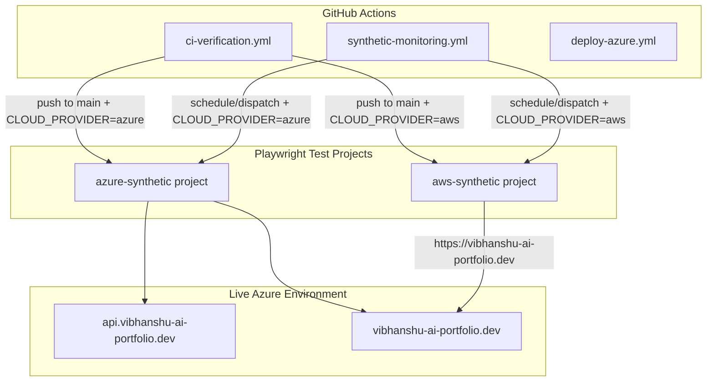
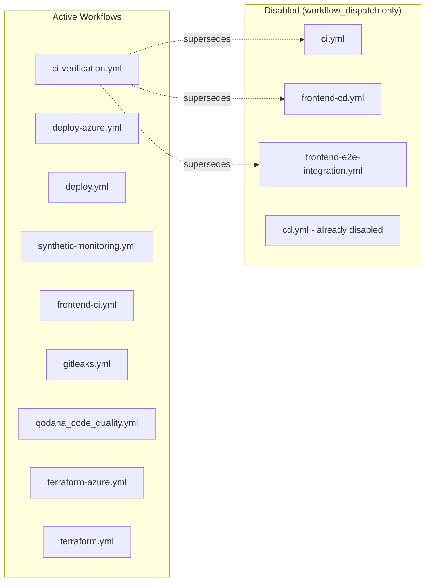

# Design Document: Azure Demo Readiness Phase 2

## Overview

Phase 2 of the Azure deployment audit remediation delivers six discrete improvements to the Azure deployment pipeline and observability posture. The changes span Playwright synthetic tests, GitHub Actions workflow rationalization, a dead-code removal in the deploy workflow, Spring `@Profile` widening, and Terraform housekeeping.

All changes assume Phase 1 (`azure-demo-readiness-phase1`) is merged — the seeding fix, deploy gating, and post-seed verification are already in place.

### Design Decisions

| Decision | Rationale |
|----------|-----------|
| Mirror `aws-synthetic/` structure for `azure-synthetic/` | Consistency reduces cognitive load; same test patterns, same directory layout |
| Use `request` API context (not `page`) for API-level assertions | Avoids browser overhead for pure HTTP checks; faster, more reliable in CI |
| Hardcode `https://api.vibhanshu-ai-portfolio.dev` in deploy-frontend | Custom domain is the permanent source of truth post-DNS-cutover; dynamic FQDN resolution is dead code |
| Disable workflows via `workflow_dispatch` + `reason` input | Retains file for git history and allows manual re-execution for debugging |
| Skip Correctness Properties / PBT | Feature is entirely IaC, CI/CD config, and integration tests — no pure functions with meaningful input variation |

## Architecture



### Workflow Rationalization



## Components and Interfaces

### Component 1: Azure Synthetic Monitoring Suite

**Location:** `frontend/tests/e2e/azure-synthetic/`

**Files:**
- `azure-api-smoke.spec.ts` — API-level HTTP assertions (health, login, seed verification, portfolio, summary)
- `azure-frontend-smoke.spec.ts` — Frontend page load assertion
- `README.md` — Documentation mirroring `aws-synthetic/README.md`

**Interfaces:**
- Consumes environment variables: `NEXT_PUBLIC_API_BASE_URL`, `BASE_URL`, `SKIP_BACKEND_HEALTH_CHECK`, `SKIP_GOLDEN_STATE_SEEDING`, `INTERNAL_API_KEY`, `APP_AUTH_EMAIL`/`E2E_TEST_USER_EMAIL`, `APP_AUTH_PASSWORD`/`E2E_TEST_USER_PASSWORD`
- Configured as Playwright project `azure-synthetic` in `playwright.config.ts`
- Uses `request` API context for HTTP assertions (no browser rendering needed for API tests)
- Uses `page` context only for the frontend page load test

**Test Assertions:**

| Test | Endpoint | Assertion |
|------|----------|-----------|
| Health check | `GET /actuator/health` | HTTP 200 within 70s |
| Login | `POST /api/auth/login` | Response contains non-empty `token` string |
| Portfolio seed | `POST /api/internal/portfolio/seed` | `holdingsInserted >= 160` or existing data (HTTP 200) |
| Market data seed | `POST /api/internal/market-data/seed` | `pricesUpserted >= 160` or existing data (HTTP 200) |
| Portfolio data | `GET /api/portfolio` | At least one portfolio with non-empty `holdings` array |
| Portfolio summary | `GET /api/portfolio/summary` | Total value > 0 |
| Frontend load | `GET https://vibhanshu-ai-portfolio.dev` | HTTP 200 |

### Component 2: Playwright Configuration Update

**Location:** `frontend/playwright.config.ts`

**Changes:**
- Add `azure-synthetic` project definition
- `testDir`: `./tests/e2e/azure-synthetic`
- `baseURL`: `https://api.vibhanshu-ai-portfolio.dev`
- `timeout`: 120,000ms
- Serial execution mode (workers: 1 inherited from root config)
- No `webServer` — tests run against live deployment
- No `dependencies` — no setup project needed (tests handle auth inline)
- `testIgnore` on `chromium` project updated to also ignore `azure-synthetic/`

### Component 3: Synthetic Monitoring Workflow Update

**Location:** `.github/workflows/synthetic-monitoring.yml`

**Changes:**
- Add `run-azure-synthetic-tests` job gated on `vars.CLOUD_PROVIDER == 'azure'`
- Existing `run-synthetic-tests` job remains unchanged with `if: vars.CLOUD_PROVIDER == 'aws'`
- Azure job targets `https://api.vibhanshu-ai-portfolio.dev` (API) and `https://vibhanshu-ai-portfolio.dev` (frontend)
- Upload Playwright HTML report as artifact (7-day retention) on failure
- Same triggers: `workflow_dispatch` + `schedule` (cron `0 * * * *`)

### Component 4: CI Verification Workflow Update

**Location:** `.github/workflows/ci-verification.yml`

**Changes:**
- Add Azure synthetic step in `docker-build-verify` job after Docker Compose E2E tests
- Gated on: `github.event_name == 'push' && github.ref == 'refs/heads/main' && vars.CLOUD_PROVIDER == 'azure'`
- Environment variables: `NEXT_PUBLIC_API_BASE_URL=https://api.vibhanshu-ai-portfolio.dev`, `BASE_URL=https://vibhanshu-ai-portfolio.dev`, `SKIP_BACKEND_HEALTH_CHECK="true"`
- Runs: `npx playwright test --project=azure-synthetic --reporter=list`

### Component 5: Deploy Azure Workflow Cleanup

**Location:** `.github/workflows/deploy-azure.yml`

**Changes in `deploy-frontend` job:**
- Remove the `Resolve API Gateway FQDN` step (step id `api_fqdn`)
- The `Build Next.js static export` step already uses the hardcoded `NEXT_PUBLIC_API_BASE_URL: https://api.vibhanshu-ai-portfolio.dev`
- Add YAML comment above the env var: `# Source of truth: custom domain https://api.vibhanshu-ai-portfolio.dev (permanent post-DNS-cutover)`
- No changes to `deploy`, `preflight`, or any other job

### Component 6: Workflow Disablement

**Files affected:**
- `.github/workflows/ci.yml`
- `.github/workflows/frontend-cd.yml`
- `.github/workflows/frontend-e2e-integration.yml`

**Pattern (applied to each):**
```yaml
# DISABLED: Superseded by ci-verification.yml — [one-sentence reason].
# Retained for historical reference. Use workflow_dispatch with a reason to run manually.
on:
  workflow_dispatch:
    inputs:
      reason:
        description: 'Reason for manual trigger (this workflow is disabled)'
        required: true
```

**Not modified:** `cd.yml` (already follows this pattern)

### Component 7: InfrastructureHealthLogger Profile Widening

**Files affected:**
- `portfolio-service/src/main/java/com/wealth/portfolio/InfrastructureHealthLogger.java`
- `market-data-service/src/main/java/com/wealth/market/InfrastructureHealthLogger.java`

**Change:** `@Profile("aws")` → `@Profile({"aws", "azure"})`

**Already done (no change needed):**
- `api-gateway` — already `@Profile({"aws", "azure"})`
- `insight-service` — already `@Profile({"aws", "azure"})`

**Javadoc update:** Add note that the bean activates under both `aws` and `azure` profiles for Log Analytics parity.

### Component 8: Terraform Import Block Removal

**File:** `infrastructure/terraform/azure/main.tf`

**Removal scope:**
- 4 Container App import blocks (`api-gateway`, `portfolio-service`, `market-data-service`, `insight-service`)
- 4 AcrPull role assignment import blocks (same four services)
- Associated section separator comments and descriptive comments that pertain solely to the import blocks

**Preserved:** All `resource`, `module`, `variable`, `output`, `locals`, `data`, `provider` blocks and their associated comments.

## Data Models

No new data models are introduced. The synthetic tests consume existing API response shapes:

| Endpoint | Response Shape (relevant fields) |
|----------|----------------------------------|
| `POST /api/auth/login` | `{ token: string, userId: string }` |
| `POST /api/internal/portfolio/seed` | `{ holdingsInserted: number }` or `{ message: string }` |
| `POST /api/internal/market-data/seed` | `{ pricesUpserted: number }` or `{ message: string }` |
| `GET /api/portfolio` | `Array<{ userId: string, holdings: Array<{ assetTicker: string, ... }> }>` |
| `GET /api/portfolio/summary` | `{ totalValue: number, ... }` |
| `GET /actuator/health` | `{ status: "UP" }` |

## Error Handling

### Synthetic Test Failures

- **Timeout handling:** Each API request uses a 70-second per-request timeout. The overall test timeout is 120 seconds. This accounts for Azure Container App cold starts (first request after scale-to-zero).
- **Seed idempotency:** Seed assertions accept both "inserted N records" and "data already exists" responses, making tests idempotent across repeated runs.
- **Credential fallback:** Tests read credentials from multiple environment variable names (`APP_AUTH_EMAIL` / `E2E_TEST_USER_EMAIL`) and fall back to `.env.secrets` file for local execution.
- **Report upload:** On failure in the synthetic-monitoring workflow, the Playwright HTML report is uploaded as a GitHub Actions artifact with 7-day retention for debugging.

### Workflow Disablement

- Disabled workflows remain executable via `workflow_dispatch` with a mandatory `reason` input, allowing manual debugging without re-enabling automatic triggers.
- The `reason` input is required (not optional) to ensure intentional manual execution is documented.

### Terraform Validation

- After import block removal, the file must pass `terraform fmt` and `terraform validate` without errors. This is verified by the existing `terraform-azure.yml` workflow on the next PR/push.

## Testing Strategy

### Why Property-Based Testing Does Not Apply

This feature consists entirely of:
1. **Integration/smoke tests** (Playwright synthetic monitoring against live infrastructure)
2. **CI/CD workflow configuration** (GitHub Actions YAML)
3. **IaC changes** (Terraform import block removal)
4. **Trivial annotation changes** (Spring `@Profile`)

None of these involve pure functions with meaningful input variation. There are no data transformations, parsers, serializers, or business logic functions being added. Property-based testing is not applicable.

### Testing Approach

| Component | Test Type | Verification Method |
|-----------|-----------|-------------------|
| Azure synthetic suite | Integration (live) | Run `npx playwright test --project=azure-synthetic` against live Azure deployment |
| Playwright config | Smoke | Verify `npx playwright test --list --project=azure-synthetic` lists expected tests |
| Synthetic monitoring workflow | Integration (CI) | Trigger `workflow_dispatch` and verify job executes correctly |
| CI verification workflow | Integration (CI) | Push to main with `CLOUD_PROVIDER=azure` and verify synthetic step runs |
| Deploy workflow FQDN removal | Smoke | Verify `deploy-azure.yml` YAML is valid and step `api_fqdn` is absent |
| Workflow disablement | Smoke | Verify disabled workflows only trigger on `workflow_dispatch` |
| Profile widening | Unit | Existing Spring Boot context tests with `@ActiveProfiles("azure")` verify bean instantiation |
| Terraform cleanup | Smoke | `terraform fmt` + `terraform validate` pass after removal |

### Manual Verification Checklist

1. Run `npx playwright test --project=azure-synthetic` locally with credentials in `.env.secrets`
2. Verify `terraform validate` passes in `infrastructure/terraform/azure/`
3. Verify `./gradlew :portfolio-service:test :market-data-service:test` passes (profile annotation change)
4. Verify disabled workflows show `workflow_dispatch` as only trigger in GitHub Actions UI
5. Verify `deploy-azure.yml` no longer contains the `Resolve API Gateway FQDN` step
