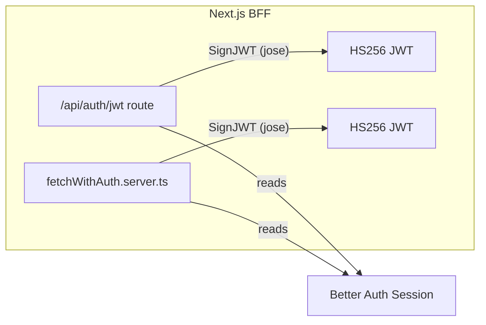
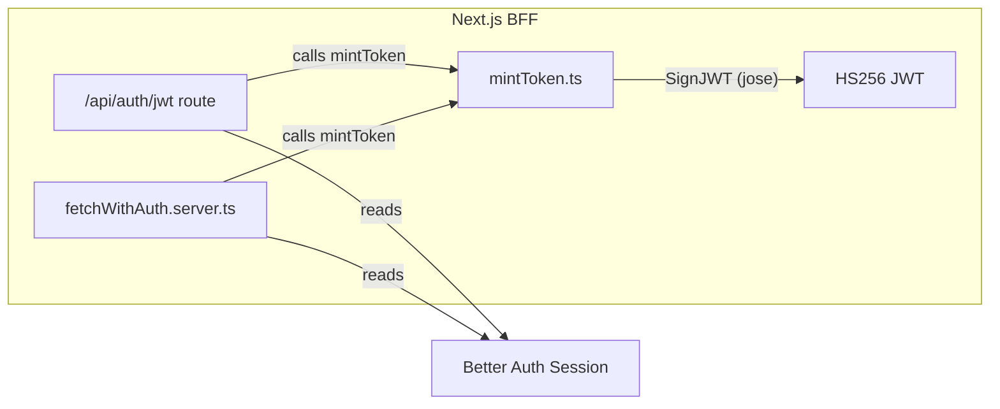
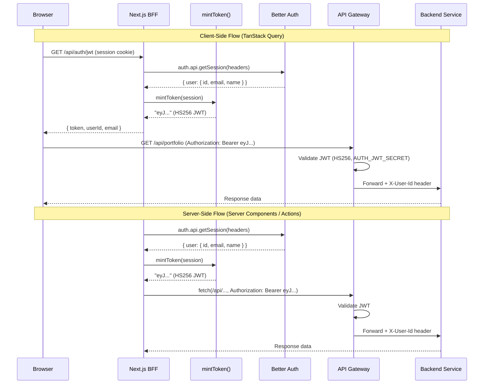

# Design Document: BFF JWT Token Exchange

## Overview

This design centralizes HS256 JWT minting into a single `mintToken` function within the Next.js BFF layer. Today, identical JWT signing logic exists in two places — the BFF route handler (`/api/auth/jwt/route.ts`) and the server-side fetch helper (`fetchWithAuth.server.ts`). Both use the `jose` library's `SignJWT` class with the same claims, algorithm, and expiry. This duplication risks silent divergence if one path is updated without the other.

The solution introduces a new module `frontend/src/lib/auth/mintToken.ts` that encapsulates all JWT signing logic. Both the BFF route and the server-side fetch helper become thin callers of this function. The `jose` dependency is confined to the `mintToken` module — no other module imports `SignJWT` directly.

### Design Rationale

- **Single source of truth**: One function defines the JWT shape (claims, algorithm, expiry). Changes propagate automatically to both the HTTP endpoint and server-side fetch paths.
- **Testability**: A pure-ish function (session in → JWT string out) is straightforward to property-test. The existing route handler and fetch helper tests can mock `mintToken` instead of mocking `jose` internals.
- **Minimal blast radius**: No changes to the API Gateway, backend microservices, client-side hook, or client-side fetch helper. The JWT format and signing algorithm remain identical.

## Architecture

### Current State (Duplicated Minting)



Both `A` and `C` independently import `jose`, construct `SignJWT`, set identical claims, and sign with the same secret. This is the duplication being eliminated.

### Target State (Centralized Minting)



`jose` is imported only by `mintToken.ts`. The route and fetch helper delegate all signing to `mintToken`.

### End-to-End Token Flow



## Components and Interfaces

### New Module: `frontend/src/lib/auth/mintToken.ts`

This is the sole new file introduced by this feature. It exports a single function.

```typescript
import "server-only";

import { SignJWT } from "jose";

/** The session shape expected by mintToken — matches Better Auth's session.user. */
export interface TokenUser {
  id: string;
  email: string;
  name: string;
}

/**
 * Mints an HS256 JWT from a Better Auth session user.
 *
 * - Reads AUTH_JWT_SECRET (fallback: BETTER_AUTH_SECRET) at invocation time,
 *   not at module load time, so env changes in tests are picked up.
 * - Encodes the secret as UTF-8 bytes for jose's HS256 signer.
 * - Sets sub, email, name claims from the session user.
 * - Sets iat to current time, exp to iat + 1 hour.
 * - Sets protected header alg to HS256.
 *
 * @param user - The authenticated user from Better Auth session
 * @returns A signed HS256 JWT string
 */
export async function mintToken(user: TokenUser): Promise<string> {
  const secret = new TextEncoder().encode(
    process.env.AUTH_JWT_SECRET ?? process.env.BETTER_AUTH_SECRET ?? "",
  );

  return new SignJWT({
    sub: user.id,
    email: user.email,
    name: user.name,
  })
    .setProtectedHeader({ alg: "HS256" })
    .setIssuedAt()
    .setExpirationTime("1h")
    .sign(secret);
}
```

**Design decisions:**

1. **`TokenUser` interface instead of full session object**: The function accepts only the user fields it needs (`id`, `email`, `name`), not the entire Better Auth session. This makes the function easier to test (no need to construct a full session object) and documents exactly which fields flow into the JWT.

2. **Lazy secret resolution**: The secret is read from `process.env` inside the function body, not at module scope. This ensures tests can stub environment variables between calls without module reloading.

3. **`server-only` import**: Prevents accidental import from Client Components, which would expose the signing secret in the client bundle.

4. **No caching of the secret**: The `TextEncoder().encode()` call happens on every invocation. This is intentional — the cost is negligible (a few microseconds) and it guarantees the function always uses the current env value.

### Modified: `frontend/src/app/api/auth/jwt/route.ts`

The route handler removes its inline `SignJWT` usage and delegates to `mintToken`.

```typescript
import { auth } from "@/lib/auth";
import { mintToken } from "@/lib/auth/mintToken";
import { headers } from "next/headers";
import { NextResponse } from "next/server";

export async function GET() {
  const reqHeaders = await headers();
  const session = await auth.api.getSession({ headers: reqHeaders });

  if (!session?.user?.id) {
    return NextResponse.json({ error: "Unauthorized" }, { status: 401 });
  }

  const token = await mintToken(session.user);

  return NextResponse.json({
    token,
    userId: session.user.id,
    email: session.user.email,
  });
}
```

**Changes from current:**

- Removes `import { SignJWT } from "jose"` — no direct jose dependency
- Removes the module-level `secret` constant
- Replaces the inline `new SignJWT(...)` chain with `await mintToken(session.user)`
- Everything else (session reading, 401 handling, response shape) stays identical

### Modified: `frontend/src/lib/api/fetchWithAuth.server.ts`

The server-side fetch helper removes its inline `SignJWT` usage and delegates to `mintToken`.

```typescript
import "server-only";

import { auth } from "@/lib/auth";
import { mintToken } from "@/lib/auth/mintToken";
import { headers } from "next/headers";

export async function fetchWithAuth<T>(
  path: string,
  init?: RequestInit,
): Promise<T> {
  const session = await auth.api.getSession({
    headers: await headers(),
  });

  let token: string | undefined;
  if (session?.user?.id) {
    token = await mintToken(session.user);
  }

  const reqHeaders: Record<string, string> = {
    "Content-Type": "application/json",
    ...(init?.headers as Record<string, string> | undefined),
    ...(token ? { Authorization: `Bearer ${token}` } : {}),
  };

  const response = await fetch(path, {
    method: "GET",
    ...init,
    headers: reqHeaders,
    cache: "no-store",
  });

  if (!response.ok) {
    throw new Error(`Request failed (${response.status}) for ${path}`);
  }

  return (await response.json()) as T;
}
```

**Changes from current:**

- Removes `import { SignJWT } from "jose"` — no direct jose dependency
- Removes the `getJwtSecret()` helper function
- Replaces the inline `new SignJWT(...)` chain with `await mintToken(session.user)`
- Everything else (session reading, header construction, fetch call, error handling) stays identical

### Unchanged: `frontend/src/lib/api/fetchWithAuth.ts` (Client-Side)

No changes. The client-side fetch helper already accepts a raw JWT string and attaches it as a Bearer token. It has no signing logic.

### Unchanged: `frontend/src/lib/hooks/useAuthenticatedUserId.ts`

No changes. The TanStack Query hook already calls `GET /api/auth/jwt` and caches the response. The response shape (`{ token, userId, email }`) is unchanged.

### Unchanged: API Gateway

No changes. The `JwtDecoderConfig` and `JwtAuthenticationFilter` continue to validate HS256 JWTs using `AUTH_JWT_SECRET` and inject `X-User-Id`. The JWT format produced by `mintToken` is identical to what both callers produced before.

## Data Models

### TokenUser (Input to mintToken)

| Field   | Type     | Source               | Maps to JWT Claim |
| ------- | -------- | -------------------- | ----------------- |
| `id`    | `string` | `session.user.id`    | `sub`             |
| `email` | `string` | `session.user.email` | `email`           |
| `name`  | `string` | `session.user.name`  | `name`            |

### JWT Claims (Output of mintToken)

| Claim   | Type     | Value                                 | Standard |
| ------- | -------- | ------------------------------------- | -------- |
| `sub`   | `string` | User ID from Better Auth              | RFC 7519 |
| `email` | `string` | User email from Better Auth           | Custom   |
| `name`  | `string` | User display name                     | Custom   |
| `iat`   | `number` | Unix timestamp (seconds) at mint time | RFC 7519 |
| `exp`   | `number` | `iat + 3600` (1 hour)                 | RFC 7519 |

### JWT Protected Header

| Field | Value   |
| ----- | ------- |
| `alg` | `HS256` |

### BFF Endpoint Response (`GET /api/auth/jwt`)

```typescript
// Success (200)
{
  token: string;
  userId: string;
  email: string;
}

// Unauthorized (401)
{
  error: "Unauthorized";
}
```

No changes to the response shape — existing client code continues to work.

## Correctness Properties

_A property is a characteristic or behavior that should hold true across all valid executions of a system — essentially, a formal statement about what the system should do. Properties serve as the bridge between human-readable specifications and machine-verifiable correctness guarantees._

### Property 1: Mint-then-verify round trip

_For any_ valid `TokenUser` (with non-empty `id`, `email`, and `name`), minting a JWT with `mintToken` and then verifying it with `jwtVerify` using the same `AUTH_JWT_SECRET` SHALL succeed without error.

**Validates: Requirements 1.1, 1.2, 5.2, 7.1**

### Property 2: Claim preservation

_For any_ valid `TokenUser`, the JWT produced by `mintToken` SHALL contain a `sub` claim equal to `user.id`, an `email` claim equal to `user.email`, and a `name` claim equal to `user.name`.

**Validates: Requirements 1.4, 7.2, 7.3**

### Property 3: Expiry invariant

_For any_ JWT produced by `mintToken`, the `exp` claim SHALL be exactly 3600 seconds after the `iat` claim.

**Validates: Requirements 1.5, 1.6, 7.4**

### Property 4: Algorithm header invariant

_For any_ JWT produced by `mintToken`, the protected header `alg` field SHALL equal `"HS256"`.

**Validates: Requirements 1.7, 7.5**

## Error Handling

### mintToken

| Condition                                                   | Behavior                                                                                                                                                                                                                                                                      |
| ----------------------------------------------------------- | ----------------------------------------------------------------------------------------------------------------------------------------------------------------------------------------------------------------------------------------------------------------------------- |
| `AUTH_JWT_SECRET` and `BETTER_AUTH_SECRET` both unset/empty | `jose` signs with an empty key. The resulting JWT will fail verification at the API Gateway. No runtime error is thrown by `mintToken` itself — the failure surfaces as a 401 from the Gateway. This is acceptable because the Gateway is the security boundary, not the BFF. |
| `user.id`, `user.email`, or `user.name` is undefined        | The claim is set to `undefined` in the JWT payload. `jose` serializes this as a missing claim. The Gateway's `JwtAuthenticationFilter` rejects JWTs with a missing/blank `sub` claim (returns 401).                                                                           |

### BFF Route Handler (`/api/auth/jwt`)

| Condition                                      | Behavior                                                                                                                               |
| ---------------------------------------------- | -------------------------------------------------------------------------------------------------------------------------------------- |
| No session cookie or invalid session           | `auth.api.getSession` returns `null`. Route returns `{ error: "Unauthorized" }` with HTTP 401.                                         |
| Session exists but `user.id` is falsy          | Route returns HTTP 401 (same guard as today).                                                                                          |
| `mintToken` throws (e.g., jose internal error) | Unhandled promise rejection. Next.js returns HTTP 500. This is an unexpected failure — jose signing should not throw for valid inputs. |

### Server-Side Fetch Helper (`fetchWithAuth.server.ts`)

| Condition                       | Behavior                                                                                                                                                                    |
| ------------------------------- | --------------------------------------------------------------------------------------------------------------------------------------------------------------------------- |
| No session                      | `token` remains `undefined`. Outgoing request has no `Authorization` header. The API Gateway returns 401 to the fetch helper, which throws `Error("Request failed (401)")`. |
| `mintToken` throws              | The error propagates to the caller (Server Component or Server Action). The caller's error boundary or try/catch handles it.                                                |
| Backend service returns non-2xx | Throws `Error("Request failed ({status})")` — unchanged from current behavior.                                                                                              |

## Testing Strategy

### Property-Based Tests (fast-check)

The project already has `fast-check` v4.6.0 as a dev dependency. Property tests target the `mintToken` function directly — it's a pure function (session user in → JWT string out) with no I/O dependencies beyond `process.env`.

**Configuration:**

- Library: `fast-check` (already installed)
- Runner: Vitest
- Minimum iterations: 100 per property
- Each test tagged with: `Feature: bff-jwt-token-exchange, Property {N}: {title}`

**Test file:** `frontend/src/lib/auth/mintToken.test.ts`

Property tests use `jose`'s `jwtVerify` to decode and validate minted tokens. No mocking of `jose` is needed — the tests exercise the real signing and verification path.

**Generators:**

- `TokenUser` generator: produces objects with random `id` (UUID-like strings), `email` (random string + `@` + domain), and `name` (random alphanumeric strings). Uses `fc.record({ id: fc.uuid(), email: fc.emailAddress(), name: fc.string({ minLength: 1 }) })` or similar.

### Unit Tests (Vitest)

**Test file:** `frontend/src/lib/auth/mintToken.test.ts` (alongside property tests)

| Test                                                               | Validates |
| ------------------------------------------------------------------ | --------- |
| Falls back to `BETTER_AUTH_SECRET` when `AUTH_JWT_SECRET` is unset | Req 1.3   |
| Reads secret at invocation time, not module load time              | Req 5.1   |

**Test file:** `frontend/src/app/api/auth/jwt/route.test.ts` (new or updated)

| Test                                                          | Validates    |
| ------------------------------------------------------------- | ------------ |
| Returns 200 with `{ token, userId, email }` for valid session | Req 2.3      |
| Returns 401 when session is missing                           | Req 2.4      |
| Returns 401 when session has no user ID                       | Req 2.4      |
| Calls `mintToken` (not inline SignJWT)                        | Req 2.2, 2.5 |

**Test file:** `frontend/src/lib/api/fetchWithAuth.test.ts` (updated)

| Test                                                            | Validates    |
| --------------------------------------------------------------- | ------------ |
| Attaches `Authorization: Bearer` header from `mintToken` result | Req 3.3      |
| Omits Authorization header when no session                      | Req 3.4      |
| Calls `mintToken` (not inline SignJWT)                          | Req 3.2, 3.5 |
| Does not forward Cookie headers to backend                      | Req 6.1      |
| Only attaches Content-Type and Authorization headers            | Req 6.2      |

### Static Verification

| Check                                            | Validates    |
| ------------------------------------------------ | ------------ |
| `route.ts` does not import `jose`                | Req 2.5      |
| `fetchWithAuth.server.ts` does not import `jose` | Req 3.5, 3.6 |

These can be enforced via a simple grep in CI or an ESLint `no-restricted-imports` rule scoped to those files.

### Integration Tests (Not in scope for this feature)

The API Gateway's JWT validation (`JwtDecoderConfig`, `JwtAuthenticationFilter`) is already tested in the Gateway's own test suite. Requirements 5.3, 6.3, and 6.4 are validated there. No cross-service integration tests are added by this feature since the JWT format is unchanged.
