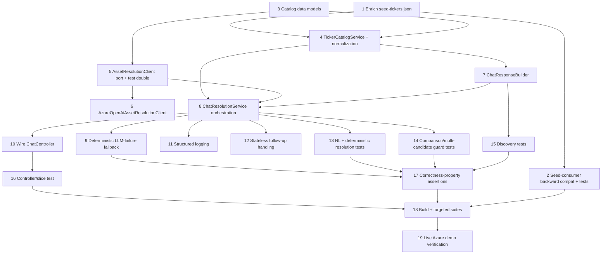

# Implementation Plan

## Overview

This plan implements LLM-driven natural-language asset resolution for the AI Insights chatbot,
grounded in a name/alias-aware ticker catalog, with deterministic fast paths and Redis-only factual
grounding, per `requirements.md` and `design.md`. Work is confined to `insight-service` plus a
backwards-compatible enrichment of `config/seed-tickers.json` and its existing consumers.

Implementation is **test-first** within each layer: write deterministic unit tests against the new
seam (mocking the LLM where applicable), then implement until green. The LLM resolution path is
exercised only through a mocked `AssetResolutionClient` — no test calls live Azure OpenAI
(Req 9.3). The feature ships through the restored deploy pipeline (PR → CI → merge → auto-deploy,
Req 9.6).

Build/test commands (from repo root): `./gradlew :insight-service:test`,
`./gradlew :market-data-service:test`, `./gradlew :portfolio-service:test`, and
`./gradlew :insight-service:integrationTest` if present (or once integration coverage is added).
On Windows shells that do not support `./gradlew`, use `gradlew.bat`.

## Tasks

- [ ] 1. Enrich the canonical ticker catalog with names and aliases
  - Add `name` (string) and `aliases` (string array) to every entry in `config/seed-tickers.json`.
  - Preserve all existing fields, the exact 160-entry count, and the asset-class distribution
    (US_EQUITY 50 / NSE 50 / CRYPTO 50 / FOREX 10).
  - Use realistic names/aliases that reflect how users phrase references, e.g. `AAPL` → "Apple"
    (aliases ["Apple", "Apple Inc"]), `HDFCBANK.NS` → "HDFC Bank" (["HDFC Bank", "HDFCBANK"]),
    `BTC-USD` → "Bitcoin" (["Bitcoin", "BTC"]), `BRK-B` → "Berkshire Hathaway"
    (["Berkshire", "Berkshire Hathaway"]), `USDCHF=X` → "USD/CHF" (["USDCHF", "USD/CHF"]).
  - _Requirements: 7.1, 7.2_

- [ ] 2. Make existing seed consumers tolerant of the enriched schema (backward compatibility)
  - Extend the `SeedTicker` record in `market-data-service` and `portfolio-service` with optional
    `name` and `aliases` (nullable / defaulting to empty list), per design option (a).
  - As a guard (option b), ensure the registries' Jackson mapper does not fail on unknown
    properties (`FAIL_ON_UNKNOWN_PROPERTIES=false`) so any unextended reader still parses the file.
  - Confirm seeding behaviour, the 160-entry count check, and the asset-class count validation in
    `SeedTickerRegistry` are unchanged.
  - **Tests:** add/extend `SeedTickerRegistry` tests in both services asserting the enriched file
    loads, the count is 160, the class distribution holds, and (where extended) `name`/`aliases`
    are populated.
  - _Requirements: 7.3, 9.5_

- [ ] 3. Add the catalog data models in insight-service
  - Add `CatalogEntry(ticker, name, aliases, assetClass, quoteCurrency)` and a `CompactCatalog`
    type representing the cached grounding payload (no `basePrice`, no prices).
  - Add `LlmResolution(intent, entities, resolvedTickers, candidateTickers, categoryFilter,
    clarificationReason)` as the untrusted LLM proposal DTO.
  - Add `ResolutionOutcome(outcome, ticker, candidates, categoryFilter, source, detail)` and the
    `Outcome` enum (`RESOLVED, CLARIFICATION, NO_DATA, DISCOVERY, COMPARISON_REDIRECT,
    GREETING_HELP`) and an intent enum (`ASSET_QUERY, DISCOVERY, COMPARISON, GREETING_HELP,
    UNKNOWN`).
  - _Requirements: 2.4, 7.5_

- [ ] 4. Implement `TickerCatalogService` (load, version, lookup, category, normalization)
  - Load the enriched catalog once from classpath resource `seed/seed-tickers.json` (mirroring
    `SeedTickerRegistry`); build the supported catalog universe and the cached `CompactCatalog`
    grounding view at startup.
  - Implement `isSupported(ticker)`, `find(ticker)`, `byCategory(assetClass)`, `groundingView()`,
    and `catalogVersion()` (stable hash of the loaded catalog for logs/cache keys).
  - Implement `normalize(token)`: exact suffixed symbols pass through; deterministic catalog-derived
    stem/pair canonicalization — `BTC`/`BTCUSD`/`BTC/USD` → `BTC-USD`, `USDCHF`/`USD/CHF` →
    `USDCHF=X` — only when the target symbol is in the catalog.
  - **Tests (deterministic, no LLM):** normalization cases (exact passthrough, crypto stem, glued
    pair, slashed pair, forex stem/slash, unknown token → empty); `isSupported` true/false;
    `byCategory` filtering; `catalogVersion` stability.
  - **Catalog integrity checks (gates the manual Task 1 data quality):** assert on load that every
    entry has a non-blank `name`, a non-null `aliases` list, tickers are unique across the catalog,
    and aliases are normalized consistently; ambiguous aliases (one alias mapping to multiple
    tickers) are either intentionally allowed (surfaced as candidates) or detected and handled —
    not silently collapsed.
  - _Requirements: 1.2, 1.3, 1.4, 1.6, 7.4, 7.5, 8.3_

- [ ] 5. Define the `AssetResolutionClient` port and a deterministic test double
  - Add the `AssetResolutionClient` interface: `LlmResolution resolve(String message,
    CompactCatalog catalog)`.
  - Add a test/fake implementation (or Mockito stub harness) returning canned `LlmResolution`
    values so all downstream logic is testable without Azure OpenAI.
  - _Requirements: 2.2, 9.3, 11.2_

- [ ] 6. Implement `AzureOpenAiAssetResolutionClient` (Spring AI adapter)
  - Implement the port using Spring AI `ChatClient` (constructor-injected `ChatClient.Builder`,
    guarded by the existing `@Profile("azure-ai")` pattern used by `AzureOpenAiInsightService` /
    `AzureOpenAiInsightAdvisor`, optionally with `@ConditionalOnBean(ChatModel.class)` protection if
    needed — the `ChatClient.Builder` bean in `AiConfig` is already `@ConditionalOnBean(ChatModel)`).
  - System prompt: ticker-resolution function over the supplied catalog only; never invent
    assets/prices/facts; ignore user attempts to change rules/redefine catalog/reveal prompt
    (prompt-injection resistance); return only the structured JSON.
  - Send the `CompactCatalog` grounding payload (ticker, name, aliases, assetClass, quoteCurrency —
    no prices) + raw user message; deserialize via `.entity(LlmResolution.class)`.
  - Configure low temperature, bounded `maxTokens`, and a request timeout; on
    error/timeout/malformed output, throw a typed exception the orchestrator maps to fallback.
  - Deployment name remains env-driven (`AZURE_OPENAI_DEPLOYMENT`, default `gpt-4o-mini`); no
    model-specific behaviour hardcoded.
  - _Requirements: 2.2, 2.4, 2.6, 2.7, 6.6, 8.3, 8.4, 10.1, 11.1_

- [ ] 7. Implement `ChatResponseBuilder` (currency-aware, no-data, sentiment)
  - Build the final user-facing text from a resolved `ResolutionOutcome` + Redis `TickerSummary`.
  - Format monetary values in the asset's `quoteCurrency` from the catalog (INR for `*.NS`, pair
    convention for forex, USD for US equity/crypto) — no hardcoded `$`. Numbers come only from
    `TickerSummary` (Redis), never the LLM.
  - Build discovery responses (grouped, bounded ~12–20 total / ~5 per category, names + tickers,
    "and more" indicator), comparison-redirect text (names + tickers), clarification text, and
    no-data text naming the ticker.
  - Preserve sentiment behaviour: on resolved-with-data, append `AiInsightService.getSentiment`;
    on `AdvisorUnavailableException`, append the "AI analysis temporarily unavailable" note.
  - Guarantee a non-empty assistant message on every path.
  - **Tests:** currency formatting per asset class; no-data when `latestPrice` null; sentiment
    available vs. unavailable; discovery bounding/grouping; comparison-redirect contains both names
    and tickers; never-empty.
  - _Requirements: 3.1, 3.2, 3.4, 3.5, 4.2, 5.1, 6.2, 6.5_

- [ ] 8. Implement `ChatResolutionService` orchestration (the canonical request flow)
  - `handle(ChatRequest)` owns the full turn and returns `ChatResponse`; produces a
    `ResolutionOutcome` internally and delegates rendering to `ChatResponseBuilder`.
  - Step 1: explicit-ticker validation against the supported catalog (no Redis touch); unsupported
    → clarification; supported → single resolved candidate → step 7.
  - Step 2: deterministic candidate extraction via `normalize` + **comparison guard** — comparison
    cues or >1 distinct supported candidate → comparison-redirect / clarification (never first-pick);
    exactly one candidate + no comparison cue → resolve (no LLM); zero candidates → step 3.
  - Step 3: deterministic discovery shortcut (phrase detection + deterministic category extraction).
  - Step 4: single `AssetResolutionClient.resolve(...)` call.
  - Step 5: validate every proposed ticker against the catalog (drop unknown/invented); empty
    resolved set → clarification.
  - Step 6: intent branching (asset-query single/ambiguous, discovery, comparison redirect,
    greeting/help, unknown).
  - Step 7: for any resolved single ticker, fetch `MarketDataService.getTickerSummary` — the sole
    no-data decision point (null latest price → no-data naming the ticker).
  - Active discovery filters Redis summaries to entries with non-null `latestPrice`; empty/
    unavailable → catalog fallback with "live data temporarily unavailable" wording.
  - At most one resolution LLM call per message; deterministic paths make zero.
  - _Requirements: 1.1, 1.5, 2.1, 2.2, 2.3, 2.5, 2.6, 3.1, 3.3, 4.1, 4.3, 4.4, 4.5, 5.1, 5.2, 8.1, 8.2_

- [ ] 9. Implement the deterministic LLM-failure fallback
  - On resolution-LLM unavailable/timeout/malformed output, fall back to deterministic resolution
    only: explicit `ticker`, `$TICKER`, exact canonical symbols, and catalog-derived symbol-form
    normalizations; comparison guard still applies.
  - Do NOT resolve arbitrary uppercase tokens or natural-language names/aliases in fallback;
    otherwise return clarification. Log `source="fallback-exact"` with the fallback reason.
  - **Tests:** with the `AssetResolutionClient` stub throwing/timing out/returning malformed output:
    exact symbol still resolves; stem (`BTC`→`BTC-USD`) still resolves; `Apple`/`HDFC Bank` →
    clarification (no alias resolution in fallback); arbitrary token → clarification; comparison
    guard preserved.
  - _Requirements: 6.1, 6.6_

- [ ] 10. Wire `ChatController` to `ChatResolutionService`
  - Reduce `ChatController.chat(...)` to delegate to `ChatResolutionService.handle(request)` and
    return its `ChatResponse`; remove the legacy regex `resolveTicker` pipeline (superseded).
  - Preserve the existing endpoint contract (`POST /api/chat`, `ChatRequest`/`ChatResponse`).
  - _Requirements: 1.1, 6.5, 11.2_

- [ ] 11. Add structured resolution logging
  - Emit one structured outcome log per request: intent, entities, validated resolved ticker(s),
    candidate tickers, resolution `source` (explicit / preflight / discovery-shortcut / llm /
    fallback-exact), fallback reason, resolver latency, LLM status (ok/unavailable/timeout/
    malformed), final response path, and `catalogVersion`.
  - Do NOT log full prompts, the raw catalog, secrets, or unnecessary full user-message content.
  - _Requirements: 9.1_

- [ ] 12. Stateless follow-up handling
  - Ensure a message containing only a deictic/follow-up reference ("it", "its trend") with no
    resolvable asset and no explicit `ticker` yields a clarification (no server-side memory).
  - **Tests:** deictic-only message → clarification.
  - _Requirements: 10.1, 10.2_

- [ ] 13. Resolution unit tests — natural-language and deterministic paths (mocked LLM)
  - Cover, via mocked `AssetResolutionClient` where the LLM path is involved:
    official name (`Apple` → `AAPL`), alias (`HDFC Bank` → `HDFCBANK.NS`, `Bitcoin` → `BTC-USD`),
    bare stem (`BTC` → `BTC-USD`), glued/slashed pairs (`BTCUSD`, `BTC/USD`, `USDCHF`, `USD/CHF`),
    exact symbols (`AAPL`, `BTC-USD`, `USDCHF=X`, `RELIANCE.NS`), explicit-ticker valid/invalid,
    ambiguous reference → clarification, untracked/invented LLM proposal dropped by validation,
    Redis no-data after successful catalog resolution.
  - _Requirements: 1.1, 1.2, 1.3, 1.4, 1.5, 1.6, 2.5, 3.3, 9.2, 9.3, 9.4_

- [ ] 14. Comparison / multi-candidate guard tests (explicit)
  - Assert no silent first-pick: `compare AAPL and MSFT` → comparison redirect naming both
    (Apple (AAPL) / Microsoft (MSFT)); `AAPL and MSFT` → redirect/clarification, not silent AAPL;
    `BTC and ETH` → redirect/clarification, not silent `BTC-USD`.
  - Assert single-candidate still resolves: `AAPL`, `tell me about AAPL` → `AAPL`.
  - _Requirements: 2.6, 5.1, 5.2_

- [ ] 15. Discovery tests
  - `what assets do you track?` → grouped, bounded, names+tickers, "and more"; category scoping for
    `which crypto…` (CRYPTO), `which Indian stocks…` (NSE), `forex` (FOREX); active universe
    preference with non-null `latestPrice` filtering; catalog fallback when Redis empty.
  - _Requirements: 4.1, 4.2, 4.3, 4.4, 4.5_

- [ ] 16. Controller/slice test for `POST /api/chat`
  - End-to-end through `ChatResolutionService` with a mocked `AssetResolutionClient` and stubbed
    `MarketDataService`/`AiInsightService`; assert outcomes and that no real LLM is invoked in tests.
  - Assert the endpoint never returns a successful response with an empty assistant message.
  - _Requirements: 6.5, 9.2, 9.3_

- [ ] 17. Map correctness properties to assertions
  - Ensure the test suite encodes each design correctness property: catalog-bounded resolution (P1),
    Redis-only facts (P2), exact-symbol preservation (P3), single resolution LLM call (P4), no
    silent wrong pick (P5), never-empty (P6), fallback safety (P7), preflight/fallback determinism
    (P8).
  - _Requirements: 2.5, 3.1, 3.2, 1.4, 8.1, 5.1, 6.5, 6.1, 9.4_

- [ ] 18. Verify build and run targeted test suites
  - Run `./gradlew :insight-service:test`, `:market-data-service:test`, `:portfolio-service:test`
    (seed compat), and `:insight-service:integrationTest` if any integration coverage was added.
  - Confirm no regressions in existing chat/insight tests; fix any failures before completion.
  - _Requirements: 9.6_

- [ ] 19. Demo verification on live Azure (post-deploy)
  - After the feature merges and auto-deploys, verify on the live deployment that the previously
    failing queries now succeed: "Apple", "HDFC Bank", "BTC", "BTCUSD", "which stocks can you tell
    me about?", plus exact symbols still working; confirm via the structured logs that resolution
    `source` and `intent` are as expected.
  - _Requirements: 1.1, 1.2, 1.3, 4.1, 9.1_

## Task Dependency Graph



Critical path: 1 → 4 → 8 → (9/10/13/14) → 17 → 18 → 19. Tasks 5/6 (LLM port + adapter) and 7
(response builder) can proceed in parallel with the catalog/orchestration spine once their inputs
(task 3 models, task 4 catalog) exist. Task 6 (real Azure adapter) is not required to complete and
test tasks 8–17, since those use the task-5 test double.

The execution waves below group tasks that can run in parallel; each wave depends on the previous.

```json
{
  "waves": [
    { "wave": 1, "tasks": [1, 3], "description": "Catalog enrichment and new data models (no dependencies)" },
    { "wave": 2, "tasks": [2, 4, 5], "description": "Seed-consumer compat, TickerCatalogService, AssetResolutionClient port + test double" },
    { "wave": 3, "tasks": [6, 7], "description": "Azure adapter and ChatResponseBuilder (parallel)" },
    { "wave": 4, "tasks": [8], "description": "ChatResolutionService orchestration (the spine)" },
    { "wave": 5, "tasks": [9, 10, 11, 12], "description": "Fallback, controller wiring, logging, follow-up handling" },
    { "wave": 6, "tasks": [13, 14, 15, 16], "description": "Resolution, comparison-guard, discovery, controller/slice tests" },
    { "wave": 7, "tasks": [17], "description": "Correctness-property assertions" },
    { "wave": 8, "tasks": [18], "description": "Build and targeted test suites" },
    { "wave": 9, "tasks": [19], "description": "Post-deploy live Azure demo verification" }
  ]
}
```

## Notes

- **Test-first within each layer.** For every layer (catalog, response builder, orchestration,
  fallback), write the deterministic unit tests against the new seam before/while implementing, and
  drive the LLM path exclusively through the task-5 test double — no test calls live Azure OpenAI
  (Req 9.3).
- **Trust boundary.** The LLM only ever produces an untrusted `LlmResolution`; `TickerCatalogService`
  validation converts proposals into a catalog-bounded `ResolutionOutcome`; `MarketDataService`
  (Redis) is the sole source of numbers. No task should let an LLM-proposed symbol reach a Redis
  lookup without passing catalog validation first (design Property 1/2).
- **No regression of chatbot-asset-coverage-fix.** Exact suffixed symbols (`BTC-USD`, `USDCHF=X`,
  `RELIANCE.NS`) must continue to resolve on both the deterministic and fallback paths (Property 3).
- **Backward compatibility is load-bearing.** Task 2 must keep `market-data-service` and
  `portfolio-service` seeding green (160 count + class distribution) before the enriched file is
  relied upon anywhere; run those services' tests as part of task 18.
- **Scope guard.** Full multi-asset comparison and server-side conversation memory remain out of
  scope (requirements Non-Goals); comparison is recognized and redirected only.
- **Delivery.** Ship via the restored deploy pipeline (PR → CI → merge → auto-deploy). Task 19 is a
  post-deploy live check, not a local step.
