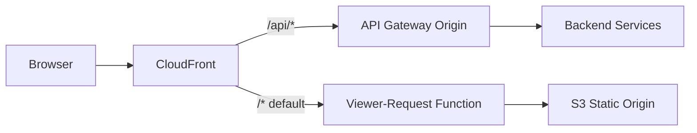

# Design Document: CloudFront Static Route 403 Fix

## Overview

This fix addresses frontend route 403 errors by correcting CloudFront request routing for a hybrid architecture:

- Static-export Next.js frontend assets/pages from S3
- Dynamic API traffic via API Gateway (Lambda URL origin)

The current behavior likely routes extensionless frontend paths to an origin/object pattern that cannot resolve to exported HTML objects. With S3 REST origin + OAC, this manifests as 403 `AccessDenied`.

The design introduces:

1. Explicit dual-origin CloudFront architecture
2. Behavior split: `/api/*` vs default `/*`
3. Viewer-request URI rewrite function for extensionless static routes

All changes are implemented in Terraform and released through existing CI/CD.

## Current State

- Frontend is built as static export (`output: "export"`), producing route HTML objects.
- CloudFront networking Terraform currently has a single-origin-style configuration.
- Extensionless route requests (for example `/portfolio`) may not map to a concrete S3 object key.
- API and frontend concerns are not fully isolated at CloudFront behavior level.

## Target State

### CloudFront Origins

1. **Static origin (S3)**
   - Serves HTML, JS, CSS, and static assets (`out/` sync output)
2. **API origin (gateway/Lambda URL)**
   - Serves `/api/*` traffic only
   - Receives API-specific custom security header (`X-Origin-Verify`)

### CloudFront Behaviors

1. **Ordered behavior** for `/api/*` -> API origin
2. **Default behavior** `/*` -> S3 origin + URI rewrite function

### CloudFront Function (viewer-request)

Rewrite logic:

- If path is `/`, rewrite to `/index.html`
- If path has no file extension:
  - `/foo` -> `/foo.html` (preferred with current export artifact pattern)
  - `/foo/` -> `/foo/index.html` (optional fallback strategy if needed)
- Do not rewrite:
  - `/_next/*`
  - `/api/*`
  - paths with explicit extension (for example `.js`, `.css`, `.png`, `.svg`, `.html`)

## Architecture

## Security Considerations

- `X-Origin-Verify` remains an API-origin-only control.
- Static S3 origin must not receive API-specific custom headers.
- OAC/OAI model remains unchanged; this fix only corrects path/origin behavior.

## Implementation Components

1. `infrastructure/terraform/modules/networking/main.tf`
   - Add/adjust CloudFront origins and behaviors
   - Add function association on default behavior
2. CloudFront Function resource + JS code asset
   - Deterministic URI rewrite logic
3. Pipeline workflow updates (if needed)
   - Ensure Terraform apply includes new function resource and distribution updates
   - Ensure cache invalidation after apply

## Verification Plan

### Functional

- Direct browser loads return 200 for:
  - `/`
  - `/login`
  - `/overview`
  - `/portfolio`
  - `/market-data`
  - `/ai-insights`
  - `/settings`

### API integrity

- `/api/auth/login` remains functional
- Authenticated `/api/portfolio/*` remains functional
- No increase in gateway 401/403 for valid API traffic

### Regression checks

- `/_next/*` static assets load successfully
- No route-level 403 for known static pages

## Rollout Strategy

1. Implement Terraform changes in feature branch
2. Run Terraform plan in CI
3. Review plan output for:
   - expected CloudFront behavior/origin/function deltas only
4. Apply via pipeline
5. Invalidate CloudFront cache
6. Execute post-deploy route/API smoke checks

## Risks and Mitigations

- **Risk:** Incorrect rewrite pattern could break static assets
  - **Mitigation:** Extension/static-prefix guard clauses in function logic
- **Risk:** API requests accidentally routed to S3
  - **Mitigation:** Explicit `/api/*` ordered behavior
- **Risk:** CloudFront distribution propagation delay causes transient mixed results
  - **Mitigation:** Cache invalidation + staged verification window
