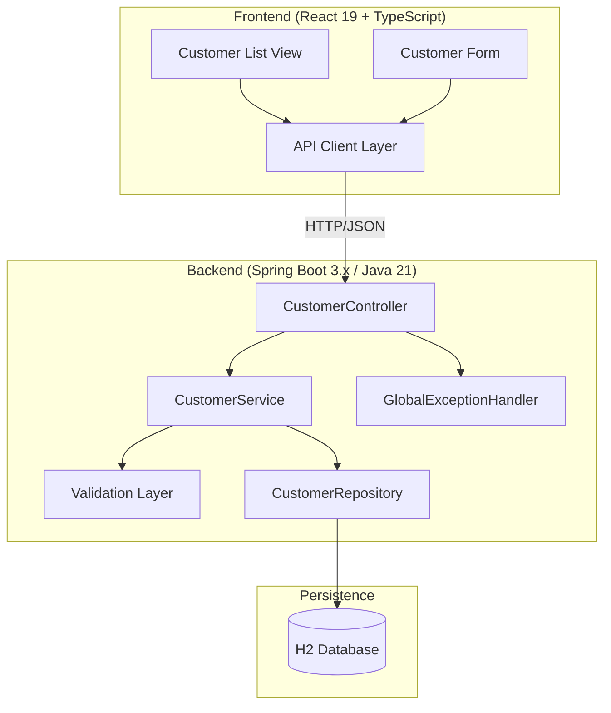

# Design Document: Customer Management Application

## Overview

A standalone full-stack Customer Management Application built as a tech evaluation exercise. The system provides customer creation and retrieval operations through a Spring Boot 3.x REST API backed by an H2 embedded database, with a React 19 + TypeScript frontend. The architecture prioritizes depth of implementation quality — thorough validation, comprehensive error handling, and extensive testing — over breadth of features.

**Key Design Decisions:**
- **UUID v7 identifiers**: Time-ordered, database-friendly, require no coordination. Generated server-side on creation.
- **H2 embedded database**: Zero-config persistence suitable for a standalone evaluation project. Runs in file mode for data persistence across restarts.
- **Layered architecture**: Controller → Service → Repository. Simple, well-understood, appropriate for the scope.
- **Monorepo structure**: Single Git repository with `backend/` and `frontend/` directories at root level.

**Locked-In Tech Stack:**

| Layer | Technology | Version |
|-------|-----------|---------|
| Language (BE) | Java | 21 |
| Framework (BE) | Spring Boot | 3.5.x |
| Persistence | Spring Data JPA + H2 | Compatible with Spring Boot 3.5.x |
| Testing (BE) | JUnit 5 + Mockito | Latest compatible |
| Coverage (BE) | JaCoCo | Latest compatible |
| Language (FE) | TypeScript | 5.x |
| UI Framework | React | 19.x |
| Build Tool (FE) | Vite | 5.x |
| Styling | Tailwind CSS | 3.x |
| Testing (FE) | Vitest + React Testing Library | Latest |

## Architecture



### Backend Layers

| Layer | Responsibility |
|-------|---------------|
| Controller | HTTP request/response mapping, input deserialization, delegation to service |
| Service | Business logic, validation orchestration, entity lifecycle |
| Repository | Data access via Spring Data JPA |
| Exception Handler | Centralized error translation to consistent API error responses |

### Frontend Architecture

| Component | Responsibility |
|-----------|---------------|
| API Client | Axios-based HTTP client with error interceptor |
| Custom Hooks | `useCustomers`, `useCreateCustomer` — encapsulate fetch/state logic with cleanup |
| Customer List View | Paginated table with search, sort, navigation |
| Customer Form | Controlled form with client-side validation and server error mapping |
| Error Notification | Toast/banner for API errors |

#### State Management: React 19 Hooks + Custom Hooks (No External Library)

No external state management library (TanStack Query, Redux, Zustand). Each data-fetching concern is encapsulated in a custom hook with proper cleanup:

```typescript
// useCustomers — list fetching with pagination, search, sort
function useCustomers(params: ListParams) {
  const [data, setData] = useState<PageResponse<Customer> | null>(null);
  const [loading, setLoading] = useState(false);
  const [error, setError] = useState<ApiError | null>(null);

  useEffect(() => {
    const controller = new AbortController();  // Race condition prevention
    let cancelled = false;                      // Memory leak guard

    const fetchData = async () => {
      setLoading(true);
      setError(null);
      try {
        const result = await getCustomers(params, { signal: controller.signal });
        if (!cancelled) setData(result);       // Only update if still mounted
      } catch (err) {
        if (!cancelled && !controller.signal.aborted) {
          setError(toApiError(err));
        }
      } finally {
        if (!cancelled) setLoading(false);
      }
    };

    fetchData();
    return () => { cancelled = true; controller.abort(); };  // Cleanup
  }, [params.page, params.size, params.sort, params.search]);

  return { data, loading, error, refetch };
}

// useCreateCustomer — form submission with abort support
function useCreateCustomer() {
  const [loading, setLoading] = useState(false);
  const [error, setError] = useState<ApiError | null>(null);
  const controllerRef = useRef<AbortController | null>(null);

  const create = async (req: CreateCustomerRequest): Promise<Customer | null> => {
    controllerRef.current?.abort();                    // Cancel any in-flight request
    controllerRef.current = new AbortController();
    setLoading(true);
    setError(null);
    try {
      const result = await createCustomer(req, { signal: controllerRef.current.signal });
      return result;
    } catch (err) {
      if (!controllerRef.current.signal.aborted) {
        setError(toApiError(err));
      }
      return null;
    } finally {
      setLoading(false);
    }
  };

  useEffect(() => () => { controllerRef.current?.abort(); }, []);  // Cleanup on unmount

  return { create, loading, error, reset: () => setError(null) };
}
```

**Race condition handling**: `AbortController` cancels stale requests when params change before the previous fetch completes. The `cancelled` flag prevents state updates after unmount.

**Memory leak prevention**: Cleanup functions in `useEffect` abort in-flight requests and set the `cancelled` flag, ensuring no `setState` calls happen on unmounted components.

## Components and Interfaces

### Backend Components

#### CustomerController
```java
@RestController
@RequestMapping("/api/customers")
public class CustomerController {
    POST /api/customers          → createCustomer(CreateCustomerRequest) → CustomerResponse (201)
    GET  /api/customers          → listCustomers(page, size, sort, search) → Page<CustomerResponse> (200)
    GET  /api/customers/{id}     → getCustomer(UUID) → CustomerResponse (200)
}
```

#### CustomerService
```java
@Service
public class CustomerService {
    CustomerResponse create(CreateCustomerRequest request);
    Page<CustomerResponse> list(String search, Pageable pageable);
    CustomerResponse findById(UUID id);
}
```

#### CustomerRepository
```java
@Repository
public interface CustomerRepository extends JpaRepository<Customer, UUID> {
    Page<Customer> findByFirstNameContainingIgnoreCaseOrLastNameContainingIgnoreCase(
        String firstName, String lastName, Pageable pageable);
}
```

#### `GlobalExceptionHandler`
```java
@RestControllerAdvice
public class GlobalExceptionHandler {
    // Handles: MethodArgumentNotValidException → 400 (validation errors)
    // Handles: MethodArgumentTypeMismatchException → 400 (e.g., invalid UUID in path)
    // Handles: CustomerNotFoundException → 404
    // Handles: HttpMessageNotReadableException → 400 (malformed JSON)
    // Handles: Exception → 500 (generic message, logs full trace)
}
```

### Frontend Components

#### API Client (`src/api/customerApi.ts`)
- `createCustomer(data: CreateCustomerRequest): Promise<Customer>`
- `getCustomers(params: ListParams): Promise<PageResponse<Customer>>`
- `getCustomer(id: string): Promise<Customer>`

#### CustomerListPage (`src/pages/CustomerListPage.tsx`)
- Renders paginated table of customers
- Search input with 300ms debounce
- Column sort controls
- "Add Customer" navigation button

#### CustomerFormPage (`src/pages/CustomerFormPage.tsx`)
- Controlled form inputs for first name, last name, date of birth
- Client-side validation with inline error messages
- Submit button with loading/disabled state
- Server error mapping to form fields

### API Contract

#### Create Customer
```
POST /api/customers
Content-Type: application/json

Request:
{
  "firstName": "Jane",
  "lastName": "Smith",
  "dateOfBirth": "1990-05-15"
}

Response (201 Created):
Location: /api/customers/019078a1-2b3c-7def-8901-234567890abc
{
  "id": "019078a1-2b3c-7def-8901-234567890abc",
  "firstName": "Jane",
  "lastName": "Smith",
  "dateOfBirth": "1990-05-15",
  "createdAt": "2025-01-15T10:30:00Z"
}
```

#### List Customers
```
GET /api/customers?page=0&size=10&sort=lastName,asc&search=smith

Response (200 OK):
{
  "content": [ ...CustomerResponse objects... ],
  "page": {
    "number": 0,
    "size": 10,
    "totalElements": 42,
    "totalPages": 5
  }
}
```

**Pagination offset convention**: The API uses Spring Data's native 0-indexed pages. The frontend `<Pagination/>` component displays 1-indexed pages to the user ("Page 1 of 5"). The offset translation (`uiPage - 1` on request, `apiPage + 1` on display) is handled in `customerApi.ts` so components never deal with 0-indexing directly. This prevents off-by-one bugs where page 0 is accidentally skipped or a negative page is requested.

#### Get Customer by ID
```
GET /api/customers/{id}

Response (200 OK):
{ ...CustomerResponse object... }

Response (404 Not Found):
Content-Type: application/problem+json
{
  "type": "https://api.example.com/problems/customer-not-found",
  "title": "Not Found",
  "status": 404,
  "detail": "Customer not found with id: 019078a1-...",
  "instance": "/api/customers/019078a1-..."
}
```

#### Error Response Structure (RFC 9457 — Problem Details for HTTP APIs)

All error responses conform to [RFC 9457](https://www.rfc-editor.org/rfc/rfc9457) `application/problem+json`:

```json
{
  "type": "https://api.example.com/problems/validation-error",
  "title": "Bad Request",
  "status": 400,
  "detail": "Validation failed for customer creation request",
  "instance": "/api/customers",
  "timestamp": "2025-01-15T10:30:00Z",
  "fieldErrors": [
    {
      "field": "firstName",
      "message": "First name is required"
    },
    {
      "field": "dateOfBirth",
      "message": "Customer must be at least 18 years old"
    }
  ]
}
```

Standard RFC 9457 fields: `type`, `title`, `status`, `detail`, `instance`. Extension fields: `timestamp`, `fieldErrors` (for validation errors only).

**Content-Type**: Error responses use `application/problem+json` media type.

## Data Models

### Customer Entity

```java
@Entity
@Table(name = "customers")
public class Customer {
    @Id
    private UUID id;              // UUID v7, generated server-side

    @Column(nullable = false, length = 100)
    private String firstName;

    @Column(nullable = false, length = 100)
    private String lastName;

    @Column(nullable = false)
    private LocalDate dateOfBirth;

    @Column(nullable = false, updatable = false)
    private Instant createdAt;    // Set on creation, never modified
}
```

**UUID v7 Generation**: Use `com.fasterxml.uuid:java-uuid-generator` library's `Generators.timeBasedEpochGenerator()` to produce RFC 9562 compliant UUID v7 values. These are time-ordered (sortable), globally unique without coordination, and index-friendly for B-tree storage.

### CreateCustomerRequest DTO

```java
public record CreateCustomerRequest(
    @NotBlank(message = "First name is required")
    @Size(max = 100, message = "First name must not exceed 100 characters")
    String firstName,

    @NotBlank(message = "Last name is required")
    @Size(max = 100, message = "Last name must not exceed 100 characters")
    String lastName,

    @NotNull(message = "Date of birth is required")
    @Past(message = "Date of birth must be in the past")
    LocalDate dateOfBirth
)
```

### CustomerResponse DTO

```java
public record CustomerResponse(
    UUID id,
    String firstName,
    String lastName,
    LocalDate dateOfBirth,
    Instant createdAt
)
```

### Validation Approach

| Rule | Mechanism |
|------|-----------|
| Required fields | Bean Validation `@NotBlank`, `@NotNull` |
| Max length | Bean Validation `@Size(max=100)` |
| Future date of birth | Bean Validation `@Past` |
| Minimum age (18) | Custom `@MinimumAge` constraint annotation + validator |
| Malformed JSON | Spring's `HttpMessageNotReadableException` handling |

The custom `@MinimumAge` annotation:
```java
@Target({ElementType.FIELD})
@Retention(RetentionPolicy.RUNTIME)
@Constraint(validatedBy = MinimumAgeValidator.class)
public @interface MinimumAge {
    int value() default 18;
    String message() default "Customer must be at least {value} years old";
    // ...
}
```

### Frontend TypeScript Types

```typescript
interface Customer {
  id: string;
  firstName: string;
  lastName: string;
  dateOfBirth: string;  // ISO date string
  createdAt: string;    // ISO datetime string
}

interface CreateCustomerRequest {
  firstName: string;
  lastName: string;
  dateOfBirth: string;
}

interface PageResponse<T> {
  content: T[];
  page: {
    number: number;
    size: number;
    totalElements: number;
    totalPages: number;
  };
}

interface ApiError {
  type: string;
  title: string;
  status: number;
  detail: string;
  instance: string;
  timestamp?: string;
  fieldErrors?: FieldError[];
}

interface FieldError {
  field: string;
  message: string;
}
```

### Frontend Validation: Zod Schema

Client-side validation uses [Zod](https://zod.dev/) for schema-based validation that mirrors the backend Bean Validation rules:

```typescript
// src/schemas/customerSchema.ts
import { z } from 'zod';

export const createCustomerSchema = z.object({
  firstName: z
    .string()
    .min(1, 'First name is required')
    .max(100, 'First name must not exceed 100 characters'),
  lastName: z
    .string()
    .min(1, 'Last name is required')
    .max(100, 'Last name must not exceed 100 characters'),
  dateOfBirth: z
    .string()
    .min(1, 'Date of birth is required')
    .refine((val) => new Date(val) <= new Date(), {
      message: 'Date of birth must be in the past',
    })
    .refine(
      (val) => {
        const dob = new Date(val);
        const today = new Date();
        const age = today.getFullYear() - dob.getFullYear();
        const monthDiff = today.getMonth() - dob.getMonth();
        const dayDiff = today.getDate() - dob.getDate();
        const actualAge = monthDiff < 0 || (monthDiff === 0 && dayDiff < 0) ? age - 1 : age;
        return actualAge >= 18;
      },
      { message: 'Customer must be at least 18 years old' }
    ),
});

export type CreateCustomerFormData = z.infer<typeof createCustomerSchema>;
```

**Why Zod**: Type-safe schema validation that integrates naturally with TypeScript. Produces structured `ZodError` with per-field issues that map directly to inline form errors. No runtime type mismatch possible between schema and form data.

**Form integration**: On submit, call `createCustomerSchema.safeParse(formData)`. If `!result.success`, map `result.error.issues` to form field errors by `issue.path[0]`. If `result.success`, pass `result.data` to the API client.

### Project Structure

```
customer-management-app/
├── backend/
│   ├── build.gradle
│   ├── settings.gradle
│   ├── gradlew / gradlew.bat
│   ├── src/
│   │   ├── main/
│   │   │   ├── java/com/allica/customermanagement/
│   │   │   │   ├── CustomerManagementApplication.java
│   │   │   │   ├── config/
│   │   │   │   │   └── CorsConfig.java
│   │   │   │   ├── customer/
│   │   │   │   │   ├── Customer.java
│   │   │   │   │   ├── CustomerController.java
│   │   │   │   │   ├── CustomerService.java
│   │   │   │   │   ├── CustomerRepository.java
│   │   │   │   │   ├── dto/
│   │   │   │   │   │   ├── CreateCustomerRequest.java
│   │   │   │   │   │   └── CustomerResponse.java
│   │   │   │   │   └── validation/
│   │   │   │   │       ├── MinimumAge.java
│   │   │   │   │       └── MinimumAgeValidator.java
│   │   │   │   └── exception/
│   │   │   │       ├── CustomerNotFoundException.java
│   │   │   │       ├── GlobalExceptionHandler.java
│   │   │   │       └── dto/
│   │   │   │           └── ApiErrorResponse.java
│   │   │   └── resources/
│   │   │       ├── application.yml
│   │   │       └── schema.sql
│   │   └── test/
│   │       └── java/com/allica/customermanagement/
│   │           ├── customer/
│   │           │   ├── CustomerServiceTest.java
│   │           │   ├── CustomerControllerIntegrationTest.java
│   │           │   └── validation/
│   │           │       └── MinimumAgeValidatorTest.java
│   │           └── CustomerManagementApplicationTests.java
│   └── gradle/
│       └── wrapper/
├── frontend/
│   ├── package.json
│   ├── tsconfig.json
│   ├── vite.config.ts
│   ├── index.html
│   ├── src/
│   │   ├── main.tsx
│   │   ├── App.tsx
│   │   ├── api/
│   │   │   └── customerApi.ts
│   │   ├── pages/
│   │   │   ├── CustomerListPage.tsx
│   │   │   └── CustomerFormPage.tsx
│   │   ├── components/
│   │   │   ├── CustomerTable.tsx
│   │   │   ├── Pagination.tsx
│   │   │   ├── SearchInput.tsx
│   │   │   └── ErrorNotification.tsx
│   │   ├── schemas/
│   │   │   └── customerSchema.ts
│   │   ├── types/
│   │   │   └── customer.ts
│   │   └── utils/
│   │       └── formatters.ts
│   └── src/__tests__/
│       ├── hooks/
│       │   ├── useCustomers.test.ts
│       │   └── useCreateCustomer.test.ts
│       ├── pages/
│       │   └── CustomerFormPage.test.tsx
│       ├── components/
│       │   ├── CustomerTable.test.tsx
│       │   ├── SearchInput.test.tsx
│       │   └── Pagination.test.tsx
│       └── schemas/
│           └── customerSchema.test.ts
├── README.md
└── AI_USAGE.md
```


## Correctness Properties

*These properties define the key behaviors that must hold true. They are validated through the unit and integration test suites rather than property-based testing.*

### Property 1: Customer creation round-trip preserves data

Creating a customer with valid data and then retrieving it by the returned ID SHALL produce a response with identical firstName, lastName, and dateOfBirth values, plus a non-null id (valid UUID) and a non-null createdAt timestamp.

**Validates: Requirements 1.1, 1.6, 2.4**

### Property 2: Invalid customer payloads are rejected with field-level errors

Any customer creation request containing invalid fields (blank/missing names, names > 100 chars, null/future date of birth, or age < 18) SHALL return HTTP 400 with a fieldErrors array containing entries for each violated field.

**Validates: Requirements 1.2, 1.3, 1.4, 1.5**

### Property 3: Pagination metadata is mathematically consistent

For N customers in the database with page size S and page number P, the response SHALL satisfy: totalElements = N, totalPages = ⌈N/S⌉, and content.length ≤ S.

**Validates: Requirements 2.1**

### Property 4: Search results contain only matching customers

For any search term T, every customer in the results SHALL have firstName or lastName containing T (case-insensitive).

**Validates: Requirements 2.2**

### Property 5: Error responses conform to RFC 9457 and expose no internals

Any error response (400, 404, 500) SHALL be served with `Content-Type: application/problem+json` and contain the fields: type (URI), title, status, detail, and instance. The response SHALL NOT contain Java package names, stack traces, or exception class names.

**Validates: Requirements 5.1, 5.4**

## Error Handling

### Backend Error Handling Strategy (RFC 9457)

| Error Type | HTTP Status | Handling | Log Level |
|-----------|-------------|----------|-----------|
| Bean Validation failure | 400 | `MethodArgumentNotValidException` → extract field errors → Problem Detail | WARN |
| Invalid path variable (bad UUID) | 400 | `MethodArgumentTypeMismatchException` → "Invalid identifier format" | WARN |
| Malformed JSON body | 400 | `HttpMessageNotReadableException` → generic "Malformed request body" | WARN |
| Customer not found | 404 | Custom `CustomerNotFoundException` → descriptive message with ID | WARN |
| Unexpected exception | 500 | Catch-all handler → generic "Internal server error" message | ERROR (with full stack trace) |

**CORS note**: CORS violations are enforced by the browser at the HTTP transport level. A blocked cross-origin request never reaches the application layer — Spring's `CorsFilter` simply omits the `Access-Control-Allow-Origin` header, and the browser rejects the response. No server-side exception is thrown, so no `DomainValidationException` or handler is needed. The integration test (`cors_disallowedOrigin_rejected`) verifies this by checking the absence of CORS headers rather than an error response body.

**Implementation**: A single `@RestControllerAdvice` class (`GlobalExceptionHandler`) handles all exception types and produces RFC 9457 `application/problem+json` responses. Spring Boot 3.x has built-in support for `ProblemDetail` — leverage `ResponseEntityExceptionHandler` as the base class.

**Logging & PII Protection**:
- **No PII in INFO-level logs**: Date of birth is classified as PII and MUST be masked (e.g., `"dateOfBirth": "****-**-15"`) in any log output at INFO level or below.
- **WARN for 4xx errors**: All client errors (400, 404, 409) log at WARN level with request details (PII masked).
- **ERROR for 5xx errors**: Server errors log at ERROR level with full stack trace for debugging.
- **Implementation**: Use a custom Logback `PatternLayout` or a structured logging approach (e.g., Logstash encoder with field masking) to redact `dateOfBirth` from log output.

### CORS Configuration

A dedicated `@Configuration` class (`CorsConfig`) configures CORS for the API:

```java
@Configuration
public class CorsConfig {
    @Bean
    public WebMvcConfigurer corsConfigurer() {
        return new WebMvcConfigurer() {
            @Override
            public void addCorsMappings(CorsRegistry registry) {
                registry.addMapping("/api/**")
                    .allowedOrigins("http://localhost:5173")  // Vite dev server
                    .allowedMethods("GET", "POST", "OPTIONS")
                    .allowedHeaders("Content-Type", "Accept")
                    .exposedHeaders("Location")              // Expose Location header from POST 201
                    .maxAge(3600);
            }
        };
    }
}
```

**Key decisions**:
- Restrict to only the methods actually used (GET, POST) — no PUT/DELETE since those are out of scope
- Expose `Location` header so the frontend can read it from POST 201 responses
- `allowedOrigins` is profile-aware: `localhost:5173` for local dev, configurable for production
- `maxAge(3600)` caches preflight responses for 1 hour to reduce OPTIONS requests

### Frontend Error Handling Strategy

| Scenario | Handling |
|----------|----------|
| Network error (no response) | Display "Unable to connect to server" toast notification |
| API validation error (400) | Map fieldErrors to form fields; show remaining errors as toast |
| Not found (404) | Display "Customer not found" message, offer navigation back to list |
| Server error (500) | Display "Something went wrong. Please try again." toast |
| Request timeout | Display "Request timed out" toast with retry option |

**Implementation**: An Axios response interceptor catches non-2xx responses and transforms them into typed `ApiError` objects. Components receive these through try/catch or React Query's `onError` callbacks.

## Testing Strategy

### Backend Unit Tests (JUnit 5 + Mockito)

#### `CustomerServiceTest` (mocks `CustomerRepository`)

| # | Test Case | Assertion |
|---|-----------|-----------|
| 1 | `create_validRequest_persistsAndReturnsResponseWithGeneratedUuid` | Verify repository `save()` called once; returned DTO has non-null UUID v7 and createdAt |
| 2 | `create_validRequest_mapsAllFieldsCorrectly` | firstName, lastName, dateOfBirth in response match request |
| 3 | `create_repositoryThrows_propagatesException` | RuntimeException from repo bubbles up (not swallowed) |
| 4 | `findById_existingId_returnsCustomerResponse` | Maps entity to DTO correctly |
| 5 | `findById_nonExistentId_throwsCustomerNotFoundException` | Verify exception message contains the UUID |
| 6 | `list_noSearch_delegatesToFindAll` | Verify `findAll(Pageable)` called when search is null/blank |
| 7 | `list_withSearch_delegatesToSearchMethod` | Verify search repository method called with correct term |
| 8 | `list_emptyResult_returnsEmptyPage` | Returns page with empty content, totalElements = 0 |
| 9 | `list_preservesPaginationMetadata` | Page number, size, totalElements, totalPages mapped correctly |

#### `MinimumAgeValidatorTest`

| # | Test Case | Assertion |
|---|-----------|-----------|
| 1 | `exactly18Today_isValid` | DOB = today minus 18 years → valid |
| 2 | `oneDayBefore18thBirthday_isInvalid` | DOB = today minus 18 years + 1 day → invalid |
| 3 | `well_over18_isValid` | DOB = 1980-01-01 → valid |
| 4 | `futureDateOfBirth_isInvalid` | DOB = tomorrow → invalid |
| 5 | `nullDateOfBirth_isValid` | Null handled by `@NotNull`, validator returns true for null (separation of concerns) |
| 6 | `leapYearBoundary_feb29Born_isValid` | Born Feb 29 in leap year, turning 18 on non-leap year → valid on Mar 1 |
| 7 | `exactlyOnBirthday_18thYear_isValid` | Validates on the exact birthday |

#### `GlobalExceptionHandlerTest`

| # | Test Case | Assertion |
|---|-----------|-----------|
| 1 | `validationException_returns400WithFieldErrors` | Status 400, content-type `application/problem+json`, fieldErrors array populated |
| 2 | `customerNotFound_returns404WithDetail` | Status 404, detail contains UUID, type URI correct |
| 3 | `malformedJson_returns400WithGenericMessage` | Status 400, no internal class names in response |
| 4 | `invalidUuidFormat_returns400WithMessage` | Status 400, detail says "Invalid identifier format" |
| 5 | `unexpectedException_returns500WithGenericMessage` | Status 500, message is generic, no stack trace in body |
| 6 | `allErrorResponses_containRequiredRfc9457Fields` | type, title, status, detail, instance all present |
| 7 | `errorResponse_doesNotExposeInternals` | No "java.", "org.springframework.", "com.allica." in serialized body |

### Backend Integration Tests (`@SpringBootTest` + MockMvc + H2)

#### `CustomerControllerIntegrationTest`

| # | Test Case | Assertion |
|---|-----------|-----------|
| 1 | `createCustomer_validPayload_returns201WithLocationHeader` | Status 201, Location header = `/api/customers/{id}`, body has all fields |
| 2 | `createCustomer_validPayload_persistsToDatabase` | GET by returned ID returns same data |
| 3 | `createCustomer_missingFirstName_returns400WithFieldError` | fieldErrors contains entry for "firstName" |
| 4 | `createCustomer_missingLastName_returns400WithFieldError` | fieldErrors contains entry for "lastName" |
| 5 | `createCustomer_missingDob_returns400WithFieldError` | fieldErrors contains entry for "dateOfBirth" |
| 6 | `createCustomer_allFieldsMissing_returns400WithMultipleErrors` | fieldErrors has 3 entries |
| 7 | `createCustomer_under18_returns400WithAgeError` | fieldErrors contains age-specific message |
| 8 | `createCustomer_futureDob_returns400` | Rejects future date |
| 9 | `createCustomer_firstNameExceeds100Chars_returns400` | fieldErrors contains size message |
| 10 | `createCustomer_malformedJson_returns400` | Problem detail with "malformed" message |
| 11 | `createCustomer_responseConformsToRfc9457` | Content-Type is `application/problem+json`, all required fields present |
| 12 | `getCustomer_existingId_returns200` | Full customer resource returned |
| 13 | `getCustomer_nonExistentId_returns404` | Problem detail with customer-not-found type |
| 14 | `getCustomer_invalidUuidFormat_returns400` | MethodArgumentTypeMismatchException → Problem Detail with "Invalid identifier format" |
| 15 | `listCustomers_emptyDatabase_returnsEmptyPage` | content = [], totalElements = 0 |
| 16 | `listCustomers_withData_returnsPaginatedResults` | Default page size applied, metadata correct |
| 17 | `listCustomers_page1Size5_returnsCorrectSlice` | Second page has expected subset |
| 18 | `listCustomers_searchByFirstName_filtersCorrectly` | Only matching customers returned |
| 19 | `listCustomers_searchByLastName_filtersCorrectly` | Case-insensitive match |
| 20 | `listCustomers_searchNoMatch_returnsEmptyPage` | content = [], totalElements = 0 |
| 21 | `listCustomers_sortByLastNameAsc_returnsOrdered` | Verify ordering |
| 22 | `listCustomers_sortByCreatedAtDesc_returnsOrdered` | Most recent first |
| 23 | `cors_preflightRequest_returnsExpectedHeaders` | Access-Control-Allow-Origin, Allow-Methods, Exposed-Headers |
| 24 | `cors_disallowedOrigin_rejected` | No CORS headers in response |
| 25 | `roundtrip_createThenGetById_returnsSameData` | POST → extract ID from Location header → GET by ID → all fields match original request |
| 26 | `roundtrip_createThenList_newCustomerAppearsInResults` | POST → GET list → response content contains the newly created customer |
| 27 | `roundtrip_createMultipleThenList_allPresent` | POST 3 customers → GET list → totalElements = 3, all three present |

### Frontend Unit Tests (Vitest + React Testing Library)

#### `useCustomers.test.ts` (hook tests via `renderHook`)

| # | Test Case | Assertion |
|---|-----------|-----------|
| 1 | `initialState_loadingTrueDataNull` | On mount, loading = true, data = null |
| 2 | `successfulFetch_setsDataAndLoadingFalse` | After resolve, data populated, loading = false |
| 3 | `apiError_setsErrorAndLoadingFalse` | After reject, error populated, loading = false |
| 4 | `paramsChange_cancelsInFlightRequest` | Changing params aborts previous (AbortController) |
| 5 | `unmount_abortsRequest_noStateUpdate` | Unmounting during fetch doesn't trigger setState warning |
| 6 | `raceCondition_onlyLatestResponseApplied` | Rapid param changes → only last response sets data |
| 7 | `refetch_retriggersApiCall` | Calling refetch re-fetches with same params |

#### `useCreateCustomer.test.ts` (hook tests via `renderHook`)

| # | Test Case | Assertion |
|---|-----------|-----------|
| 1 | `create_success_returnsCustomerAndLoadingFalse` | Resolved promise returns customer, loading = false |
| 2 | `create_validationError_setsApiError` | 400 response → error state populated with fieldErrors |
| 3 | `create_networkError_setsGenericError` | Network failure → error with appropriate message |
| 4 | `doubleSubmit_abortsFirstRequest` | Calling create twice rapidly aborts the first |
| 5 | `unmount_abortsInFlightCreate` | Unmounting during create doesn't trigger setState |
| 6 | `reset_clearsError` | Calling reset() sets error back to null |

#### `CustomerFormPage.test.tsx`

| # | Test Case | Assertion |
|---|-----------|-----------|
| 1 | `renders_allInputFields` | firstName, lastName, dateOfBirth inputs present |
| 2 | `submit_emptyForm_showsInlineErrors` | All three fields show required messages |
| 3 | `submit_firstNameBlank_showsError` | Inline error on firstName only |
| 4 | `submit_under18Dob_showsAgeError` | Inline error on dateOfBirth |
| 5 | `submit_futureDob_showsError` | Inline error on dateOfBirth |
| 6 | `submit_validData_callsCreateAndNavigates` | API called, navigation to list triggered |
| 7 | `submit_inProgress_disablesButtonShowsSpinner` | Button disabled, loading indicator visible |
| 8 | `serverError_mapsFieldErrorsToForm` | 400 response fieldErrors displayed inline |
| 9 | `serverError_genericError_showsToast` | 500 response shows toast notification |

#### `CustomerTable.test.tsx`

| # | Test Case | Assertion |
|---|-----------|-----------|
| 1 | `renders_correctColumns` | Headers: First Name, Last Name, Date of Birth, Created |
| 2 | `renders_customerData` | Row data matches provided customers |
| 3 | `emptyState_showsNoCustomersMessage` | Empty array → "No customers found" message |
| 4 | `loading_showsLoadingIndicator` | loading = true → spinner/skeleton visible |

#### `SearchInput.test.tsx`

| # | Test Case | Assertion |
|---|-----------|-----------|
| 1 | `renders_inputField` | Input with placeholder present |
| 2 | `typing_debounces300ms` | Callback not fired until 300ms after last keystroke |
| 3 | `rapidTyping_onlyFinalValueEmitted` | Multiple keystrokes → single callback with final value |
| 4 | `clearInput_emitsEmptyString` | Clearing triggers callback with "" |

#### `Pagination.test.tsx`

| # | Test Case | Assertion |
|---|-----------|-----------|
| 1 | `renders_pageInfo` | Shows "Page 1 of Y" (1-indexed for user display) |
| 2 | `firstPage_previousDisabled` | Previous button disabled on page 1 (UI) / page 0 (API) |
| 3 | `lastPage_nextDisabled` | Next button disabled on last page |
| 4 | `clickNext_callsOnPageChange` | Fires callback with page + 1 |
| 5 | `clickPrevious_callsOnPageChange` | Fires callback with page - 1 |
| 6 | `singlePage_bothDisabled` | totalPages = 1 → both buttons disabled |
| 7 | `pageOffset_apiReceivesZeroIndexed` | UI page 1 → API called with page=0; UI page 2 → API called with page=1 |

#### `customerSchema.test.ts` (Zod schema validation)

| # | Test Case | Assertion |
|---|-----------|-----------|
| 1 | `validInput_parsesSuccessfully` | All fields valid → returns parsed data |
| 2 | `blankFirstName_failsWithIssue` | ZodError with path ["firstName"] |
| 3 | `blankLastName_failsWithIssue` | ZodError with path ["lastName"] |
| 4 | `firstNameExceeds100_failsWithIssue` | ZodError with max length message |
| 5 | `missingDob_failsWithIssue` | ZodError with path ["dateOfBirth"] |
| 6 | `futureDob_failsWithIssue` | ZodError with refine message |
| 7 | `under18_failsWithIssue` | ZodError with age-specific message |
| 8 | `exactly18Today_parsesSuccessfully` | Boundary: valid |
| 9 | `multipleInvalid_returnsAllIssues` | ZodError.issues has entries for all violated fields |

### Coverage Target
- Backend: ≥ 70% line coverage (measured by JaCoCo)
- Frontend: ≥ 70% line coverage (measured by Vitest c8/istanbul)
- Combined: ≥ 70% as required by Requirement 6

### Test Execution Commands
```bash
# Backend unit tests
cd backend && ./gradlew test

# Backend integration tests
cd backend && ./gradlew integrationTest

# Frontend unit tests
cd frontend && npm run test

# Backend coverage report
cd backend && ./gradlew jacocoTestReport

# Frontend coverage report
cd frontend && npm run test -- --coverage
```
