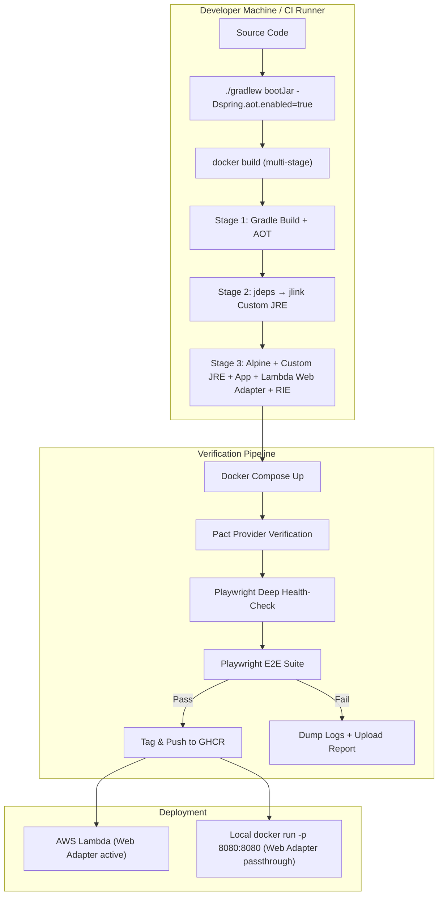
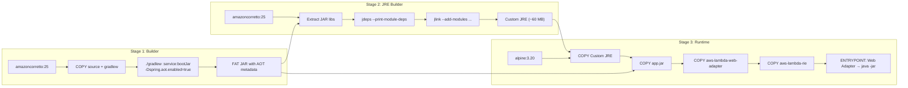
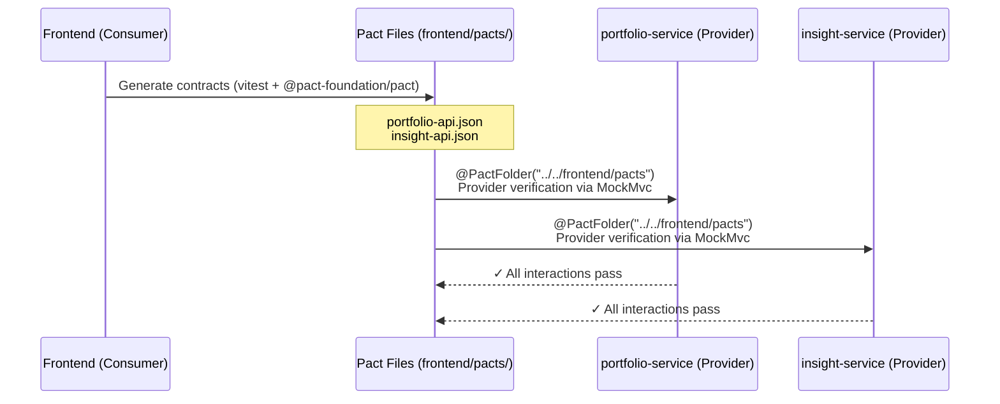
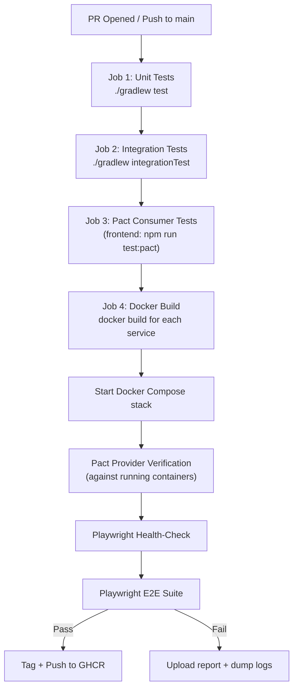

# Design Document: Deployment Verification Pipeline

## Overview

This design modernizes the build, packaging, and verification pipeline for the Wealth Management & Portfolio Tracker platform. The core goal is to produce a single OCI container image per Java service that runs identically on a developer laptop, in CI, and on AWS Lambda — then verify that image end-to-end before it ever reaches production.

The pipeline introduces five interconnected capabilities:

1. **Multi-stage Dockerfiles** — Gradle build → Spring AOT → jdeps/jlink Custom JRE → AWS Lambda Web Adapter + RIE, producing minimal images (~150–200 MB vs ~500+ MB today).
2. **Pact consumer-driven contract testing** — The Next.js frontend declares its API expectations; Spring Boot providers verify them. Pact files are committed to `frontend/pacts/` and are Pact Broker-ready.
3. **Playwright deep health-check hardening** — A `globalSetup` script polls through the API Gateway to a downstream service endpoint before any E2E test runs, with fallback to `/actuator/health`.
4. **Refactored GitHub Actions CI** — A single pipeline builds container images, runs Pact verification, starts the stack, runs Playwright E2E, and publishes verified images to GHCR.
5. **Docker Compose + local verification script** — Resource-limited Compose file with health checks, plus a `scripts/verify.sh` one-liner that orchestrates the full suite locally.

### Key Design Decisions

| Decision                                                      | Rationale                                                                                                                                                                                                                                                                                                                                                       |
| ------------------------------------------------------------- | --------------------------------------------------------------------------------------------------------------------------------------------------------------------------------------------------------------------------------------------------------------------------------------------------------------------------------------------------------------- |
| jdeps-driven jlink (not hardcoded module list)                | Spring Boot 4 / Java 25 dependency graph shifts across releases; dynamic analysis avoids silent breakage                                                                                                                                                                                                                                                        |
| Lambda Web Adapter over Serverless Java Container             | Web Adapter is framework-agnostic, requires zero code changes, and the same image works outside Lambda                                                                                                                                                                                                                                                          |
| Entrypoint override in Docker Compose                         | The Lambda Web Adapter requires the Lambda Extensions API to register; outside Lambda it exits immediately. Docker Compose overrides the entrypoint to run `java -jar` directly, bypassing the adapter. The Dockerfile ENTRYPOINT remains the adapter for Lambda deployments. CI smoke tests will validate the adapter-to-app bridge via RIE in a future phase. |
| Pact file-based sharing (not Broker) initially                | Avoids infrastructure overhead; repo-committed pacts are sufficient for a single-team monorepo. Config is Broker-ready for future migration                                                                                                                                                                                                                     |
| `@PactFolder` + `Spring7MockMvcTestTarget` for provider tests | Lightweight — no full app context needed; MockMvc replays contracts against controllers directly. Pact JVM 4.7.0-beta.4 provides Spring 7 / Spring Boot 4 compatibility                                                                                                                                                                                         |
| Deep health-check through API Gateway route                   | `/actuator/health` can report UP before gateway routes are initialized; polling `/api/portfolio/health` confirms end-to-end readiness                                                                                                                                                                                                                           |
| AOT via `processAot` Gradle task                              | Spring Boot 4 Gradle plugin provides `processAot` natively; reduces Lambda cold-start time by pre-computing bean definitions                                                                                                                                                                                                                                    |

## Architecture

### Build & Verification Flow



### Multi-Stage Dockerfile Architecture



### Pact Contract Flow



### CI Pipeline Flow



## Components and Interfaces

### 1. Multi-Stage Dockerfile (per Java service)

Each of the four Java services (portfolio-service, market-data-service, insight-service, api-gateway) gets an identical Dockerfile template with service-specific build args.

**Stages:**

- **builder** — `amazoncorretto:25` with Gradle wrapper; runs `./gradlew :${SERVICE}:bootJar` with AOT enabled
- **jre-builder** — `amazoncorretto:25`; extracts JAR, runs `jdeps --ignore-missing-deps --print-module-deps` on the fat JAR + libs, pipes output to `jlink --add-modules`
- **runtime** — `alpine:3.20` with glibc compatibility; copies Custom JRE, app JAR, Lambda Web Adapter binary (`public.ecr.aws/awsguru/aws-lambda-adapter`), and RIE binary

**Environment variables:**

- `AWS_LAMBDA_RUNTIME_API` — set by Lambda; when absent, Web Adapter runs in passthrough mode
- `AWS_LWA_PORT` — port the Web Adapter forwards to (default `8080`)
- `AWS_LWA_READINESS_CHECK_PATH` — readiness path for the adapter (e.g., `/actuator/health`)
- `SPRING_PROFILES_ACTIVE` — `local` for Docker Compose, `aws` for Lambda

**Entrypoint logic:**

```dockerfile
# Default: Lambda Web Adapter wraps the app
ENTRYPOINT ["/opt/extensions/aws-lambda-web-adapter"]
CMD ["java", "-Dspring.aot.enabled=true", "-jar", "/app/app.jar"]
```

When running locally via `docker run -p 8080:8080`, the Web Adapter detects no Lambda runtime API and passes through — the app serves HTTP directly on 8080.

For RIE testing: `docker run -p 9000:8080 --entrypoint /usr/local/bin/aws-lambda-rie <image> /opt/extensions/aws-lambda-web-adapter java -jar /app/app.jar`

### 2. Gradle Build Integration

**Changes to root `build.gradle`:**

- No new plugins required — Spring Boot 4's Gradle plugin already provides `processAot`
- AOT is activated via `-Dspring.aot.enabled=true` JVM arg passed to `bootJar` or at Docker build time
- Existing `./gradlew build`, `test`, `integrationTest` tasks remain unchanged

**Per-service `build.gradle` additions:**

- Pact provider verification dependency: `testImplementation 'au.com.dius.pact.provider:spring7:4.7.0-beta.4'`
- Pact JUnit5 support is included transitively

### 3. Pact Consumer Tests (Frontend)

**Library:** `@pact-foundation/pact` (v13.x) — installed as a devDependency in `frontend/`

**Test runner:** Vitest (already configured)

**Test files:**

- `frontend/tests/pact/portfolio-api.pact.spec.ts` — consumer contract for `GET /api/portfolio`
- `frontend/tests/pact/insight-api.pact.spec.ts` — consumer contract for `GET /api/insights/market-summary`

**Pact output directory:** `frontend/pacts/`

**npm script:** `"test:pact": "vitest run tests/pact/"`

**Consumer test structure (per endpoint):**

```typescript
import { PactV4, MatchersV3 } from "@pact-foundation/pact";

const provider = new PactV4({
  consumer: "wealth-frontend",
  provider: "portfolio-service",
  dir: "./pacts",
});

// Define interaction: GET /api/portfolio
// Assert: response status 200, body matches expected schema using MatchersV3.like()
```

### 4. Pact Provider Verification (Backend)

**Library:** `au.com.dius.pact.provider:spring7:4.7.0-beta.4`

**Test files:**

- `portfolio-service/src/test/java/.../pact/PortfolioPactVerificationTest.java`
- `insight-service/src/test/java/.../pact/InsightPactVerificationTest.java`

**Approach:** `@WebMvcTest` + `Spring7MockMvcTestTarget` — lightweight, no full app context. Requires Pact JVM 4.7.0-beta.4+ for Spring 7 / Spring Boot 4 compatibility (includes fix for ClassCastException with multipart requests)

**Pact source:** `@PactFolder("../../frontend/pacts")` (relative path from service root to `frontend/pacts/`)

**Provider states:** `@State` annotated methods seed test data (e.g., portfolio holdings, cached market summary) before each interaction replay.

### 5. Playwright Health-Check Hardening

**File:** `frontend/tests/e2e/global-setup.ts`

**Behavior:**

1. Poll `GET http://localhost:8080/api/portfolio/health` (deep health-check through gateway → portfolio-service)
2. If deep endpoint unavailable after 30s, fall back to `GET http://localhost:8080/actuator/health`
3. Log each attempt with timestamp and HTTP status
4. Abort with clear timeout error after configurable timeout (default 120s)

**Integration:** Referenced in `playwright.config.ts` via `globalSetup: './tests/e2e/global-setup.ts'`

### 6. GitHub Actions CI Pipeline

**File:** `.github/workflows/ci-verification.yml` (new unified pipeline)

**Jobs:**

1. `unit-tests` — `./gradlew test --no-daemon`
2. `integration-tests` — `./gradlew integrationTest --no-daemon` (with Testcontainers)
3. `pact-consumer` — `cd frontend && npm ci && npm run test:pact`
4. `docker-build-verify` — builds all images, starts Compose, runs Pact provider verification against running services, runs Playwright E2E, pushes verified images to GHCR

**Caching:** Gradle dependencies (`~/.gradle/caches`), Docker layer cache (`type=gha`), npm cache

### 7. Docker Compose Configuration

**File:** `docker-compose.yml` (updated in-place)

**Changes from current:**

- Java services use new multi-stage Dockerfiles with build context set to repo root (`.`) and explicit `dockerfile:` path, since Dockerfiles reference root-level files (`gradlew`, `settings.gradle`, `common-dto/`)
- **Entrypoint override** on all Java services: `entrypoint: ["/opt/java/bin/java", "-Dspring.aot.enabled=true", "-jar", "/app/app.jar"]` — bypasses the Lambda Web Adapter, which requires the Lambda Extensions API and cannot run outside Lambda. The Dockerfile ENTRYPOINT (adapter) remains the default for Lambda deployments.
- Health checks added to all Java services using `curl -f` (curl is installed in the Alpine runtime stage):
  ```yaml
  healthcheck:
    test: ["CMD", "curl", "-f", "http://localhost:<PORT>/actuator/health"]
    interval: 10s
    timeout: 5s
    retries: 12
    start_period: 30s
  ```
- Resource limits on all Java services: `deploy.resources.limits.memory: 768M` (512M caused OOM during AOT hydration)
- `depends_on` with `condition: service_healthy` for services that depend on other Java services (insight-service → portfolio-service, api-gateway → all three backend services)
- Port mappings preserved (8080, 8081, 8082, 8083, 3000)

### 8. Local Verification Script

**File:** `scripts/verify.sh`

**Stages:**

1. `./gradlew bootJar` (with AOT)
2. `docker compose build`
3. `docker compose up -d`
4. Wait for health checks
5. `cd frontend && npm run test:pact` (consumer contracts)
6. `./gradlew pactProviderVerify` (or run provider tests)
7. `cd frontend && npx playwright test`
8. Print summary
9. `docker compose down -v` (cleanup)

## Data Models

### Pact Contract Schema (Generated)

The Pact files are auto-generated JSON conforming to the Pact Specification v4. Key structure:

```json
{
  "consumer": { "name": "wealth-frontend" },
  "provider": { "name": "portfolio-service" },
  "interactions": [
    {
      "description": "a request for portfolio holdings",
      "request": {
        "method": "GET",
        "path": "/api/portfolio",
        "headers": { "Authorization": "Bearer <token>" }
      },
      "response": {
        "status": 200,
        "headers": { "Content-Type": "application/json" },
        "body": {
          "holdings": [
            {
              "symbol": "string",
              "quantity": 0,
              "currentPrice": 0.0,
              "totalValue": 0.0
            }
          ],
          "totalPortfolioValue": 0.0
        }
      }
    }
  ],
  "metadata": {
    "pactSpecification": { "version": "4.0" }
  }
}
```

### Docker Compose Service Health Model

Each Java service exposes health status via Spring Boot Actuator:

```json
{
  "status": "UP",
  "components": {
    "db": { "status": "UP" },
    "kafka": { "status": "UP" },
    "redis": { "status": "UP" }
  }
}
```

The deep health-check endpoint (`/api/portfolio/health`) returns a simple:

```json
{ "status": "UP", "service": "portfolio-service" }
```

### Verification Summary Model (Local Script Output)

```
╔══════════════════════════════════════╗
║   Verification Pipeline Summary      ║
╠══════════════════════════════════════╣
║ Build (bootJar + Docker)    ✅ PASS  ║
║ Pact Consumer Contracts     ✅ PASS  ║
║ Pact Provider Verification  ✅ PASS  ║
║ Playwright E2E              ✅ PASS  ║
╠══════════════════════════════════════╣
║ Overall: PASS                        ║
╚══════════════════════════════════════╝
```

## Correctness Properties

Property-based testing is **not applicable** for this feature. The acceptance criteria are overwhelmingly infrastructure configuration (Dockerfiles, Docker Compose, CI pipelines), build tooling (Gradle AOT, jlink/jdeps), external service wiring (Pact library behavior), and script orchestration. None involve pure functions with meaningful input variation where running 100+ iterations would find more bugs than 2–3 targeted examples.

The appropriate testing strategies are:

- **Smoke tests** for configuration checks (Dockerfile stages, Compose health checks, resource limits, port mappings, AOT metadata presence)
- **Integration tests** for end-to-end wiring (container serves HTTP, RIE accepts Lambda invokes, Pact provider verification passes, Docker Compose stack starts correctly)
- **Example-based tests** for specific scenarios (Pact contract generation, provider mismatch detection, health-check fallback, verification script failure handling)

## Error Handling

### Dockerfile Build Failures

| Error                                    | Cause                                                                                   | Handling                                                                                                                                                                |
| ---------------------------------------- | --------------------------------------------------------------------------------------- | ----------------------------------------------------------------------------------------------------------------------------------------------------------------------- |
| `jdeps` fails with missing dependencies  | Fat JAR has split packages or unsigned modules                                          | Use `--ignore-missing-deps` flag; log warnings but continue. If `jlink` subsequently fails, the Docker build fails with a clear error at the jlink stage                |
| `jlink` produces incomplete JRE          | `jdeps` missed a module (e.g., `jdk.unsupported` needed by Spring internals)            | The app will fail at runtime with `ClassNotFoundException`. Mitigation: add `--add-modules jdk.unsupported,java.security.jgss` as fallback modules in the jlink command |
| AOT processing fails                     | Bean definition conflicts at build time (e.g., conditional beans evaluated differently) | `processAot` task fails the Gradle build. Developer must fix AOT-incompatible beans or exclude them via `@ImportRuntimeHints`                                           |
| Lambda Web Adapter binary download fails | Network issue or ECR rate limit                                                         | Dockerfile uses `COPY --from=public.ecr.aws/awsguru/aws-lambda-adapter:1.0.0 /lambda-adapter /opt/extensions/` — fails at build time with clear error                   |

### Pact Contract Failures

| Error                                     | Cause                                                    | Handling                                                                                                                           |
| ----------------------------------------- | -------------------------------------------------------- | ---------------------------------------------------------------------------------------------------------------------------------- |
| Consumer test fails to generate Pact file | Mock server port conflict or test configuration error    | Vitest reports the failure; Pact file is not written. CI job fails at the `pact-consumer` stage                                    |
| Provider verification fails               | API response doesn't match consumer contract             | Pact JVM reports the specific field mismatch, expected vs actual values. CI job fails at the `pact-provider` stage before E2E runs |
| Pact file not found by provider test      | Incorrect `@PactFolder` path or consumer test didn't run | Provider test throws `NoPactsFoundException`. CI pipeline ensures consumer tests run before provider verification                  |
| Provider state setup fails                | Missing test data seeding in `@State` method             | Provider verification fails with state setup error. Developer must implement the missing `@State` handler                          |

### Health-Check Failures

| Error                               | Cause                                                          | Handling                                                                                                                                                                             |
| ----------------------------------- | -------------------------------------------------------------- | ------------------------------------------------------------------------------------------------------------------------------------------------------------------------------------ |
| Deep health-check never returns 200 | API Gateway routes not initialized, downstream service crashed | After 30s of deep-check failures, fall back to shallow `/actuator/health`. If shallow also fails after total timeout (120s), abort with descriptive error including last HTTP status |
| Connection refused on health-check  | Container not yet listening on port                            | Polling loop retries every 2s. Connection errors are logged and treated as "not ready yet"                                                                                           |
| Health-check returns 503            | Service starting but not ready                                 | Logged as a poll attempt; polling continues until 200 or timeout                                                                                                                     |

### CI Pipeline Failures

| Error                                 | Cause                                                          | Handling                                                                                                    |
| ------------------------------------- | -------------------------------------------------------------- | ----------------------------------------------------------------------------------------------------------- |
| Docker build fails                    | Compilation error, dependency resolution, or Dockerfile syntax | Job fails immediately. Build logs are available in GitHub Actions output                                    |
| Docker Compose services fail to start | Port conflict, missing env var, OOM (512M limit exceeded)      | Health-check timeout triggers. Container logs are dumped via `docker compose logs` and uploaded as artifact |
| Playwright tests fail                 | Application bug, flaky test, or incomplete startup             | Workflow fails. Playwright HTML report uploaded as artifact. Container logs dumped for debugging            |
| GHCR push fails                       | Authentication error or registry unavailable                   | Job fails at the push step. Images are not published. Retry on next push                                    |

### Local Verification Script Failures

| Error                        | Cause                                          | Handling                                                                                                                                               |
| ---------------------------- | ---------------------------------------------- | ------------------------------------------------------------------------------------------------------------------------------------------------------ |
| `./gradlew bootJar` fails    | Compilation or test failure                    | Script stops at stage 1, prints Gradle error output, exits with code 1                                                                                 |
| `docker compose up` fails    | Port already in use, Docker daemon not running | Script stops, prints Docker error, suggests `docker compose down -v` to clean up                                                                       |
| Any verification stage fails | Contract mismatch, E2E failure, etc.           | Script stops at the failing stage, prints failure details, leaves containers running for debugging, prints `docker compose down -v` as cleanup command |

## Testing Strategy

### Testing Pyramid for This Feature

```
         ╱╲
        ╱  ╲        E2E (Playwright)
       ╱    ╲       Full-stack verification against containers
      ╱──────╲
     ╱        ╲     Integration
    ╱          ╲    Pact provider verification, Docker container HTTP tests
   ╱────────────╲
  ╱              ╲  Smoke / Unit
 ╱                ╲ Dockerfile structure, AOT metadata, config validation
╱──────────────────╲
```

### Smoke Tests

These verify that build artifacts and configurations are correct:

- **AOT metadata presence**: After `./gradlew :portfolio-service:bootJar -Dspring.aot.enabled=true`, verify the JAR contains `META-INF/native-image/` or Spring AOT-generated classes
- **Docker image structure**: After `docker build`, verify:
  - Custom JRE exists at expected path
  - Lambda Web Adapter binary exists at `/opt/extensions/aws-lambda-web-adapter`
  - RIE binary exists at `/usr/local/bin/aws-lambda-rie`
  - No full JDK present (image size < 300 MB)
  - ENTRYPOINT is set to the Web Adapter
- **Docker Compose config**: Validate health checks, resource limits, port mappings, and dependency ordering are present in `docker-compose.yml`
- **Pact file output path**: After running consumer tests, verify files exist in `frontend/pacts/`

### Integration Tests

These verify end-to-end wiring between components:

- **Container HTTP serving**: Start a service container with `docker run -p 8080:8080`, send `GET /actuator/health`, verify HTTP 200
- **RIE Lambda invoke**: Start with RIE entrypoint, POST a Lambda event payload to port 9000, verify the response contains the expected HTTP translation
- **Pact provider verification**: Run `@TestTemplate` provider tests against MockMvc for portfolio-service and insight-service, verifying all consumer contract interactions pass
- **Docker Compose full stack**: Run `docker compose up -d`, wait for all health checks, verify all services respond on their expected ports
- **Deep health-check through gateway**: With the full stack running, verify `GET http://localhost:8080/api/portfolio/health` returns 200

### Example-Based Tests

These verify specific scenarios and edge cases:

- **Pact contract generation**: Run consumer tests and verify the generated Pact JSON contains the expected interaction structure (method, path, response schema)
- **Provider mismatch detection**: Modify a provider response to remove a required field, run verification, verify it fails with a descriptive error identifying the mismatched field
- **Health-check fallback**: Mock the deep endpoint to return 503, verify the poller falls back to `/actuator/health`
- **Health-check timeout**: Set a 5s timeout, mock all endpoints to never respond, verify the poller aborts with a clear timeout error
- **Verification script failure**: Introduce a deliberate failure in one stage, verify the script stops and prints failure details
- **Verification script summary**: Run the full script successfully, verify the summary output shows pass/fail per stage

### Test Execution in CI

The CI pipeline runs tests in this order, with each stage gating the next:

1. **Unit tests** (`./gradlew test`) — fast, no infrastructure
2. **Integration tests** (`./gradlew integrationTest`) — Testcontainers for DB/Kafka
3. **Pact consumer tests** (`npm run test:pact`) — generates contract files
4. **Docker build** — multi-stage build for all services
5. **Pact provider verification** — replays contracts against running containers
6. **Playwright E2E** — full-stack verification with deep health-check
7. **Publish** — tag and push verified images to GHCR

### Test Tooling

| Layer                 | Tool                                                       | Config                                                           |
| --------------------- | ---------------------------------------------------------- | ---------------------------------------------------------------- |
| Unit (backend)        | JUnit 5 + Spring Boot Test                                 | `./gradlew test` (excludes `@Tag("integration")`)                |
| Integration (backend) | JUnit 5 + Testcontainers                                   | `./gradlew integrationTest`                                      |
| Unit (frontend)       | Vitest + Testing Library + MSW                             | `npm run test`                                                   |
| Pact consumer         | `@pact-foundation/pact` v13 + Vitest                       | `npm run test:pact`                                              |
| Pact provider         | `au.com.dius.pact.provider:spring7:4.7.0-beta.4` + JUnit 5 | `./gradlew test` (provider tests run as unit tests with MockMvc) |
| E2E                   | Playwright                                                 | `npx playwright test` with `globalSetup` health-check            |
| Smoke (Docker)        | Shell assertions in CI workflow                            | `docker inspect`, `docker run`, image size checks                |
