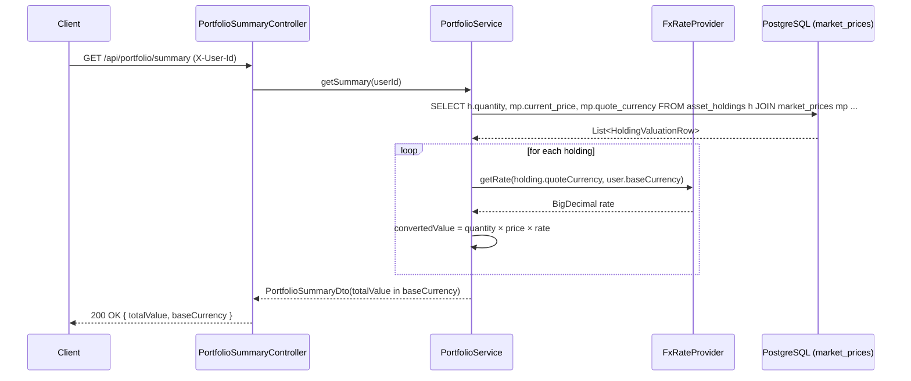
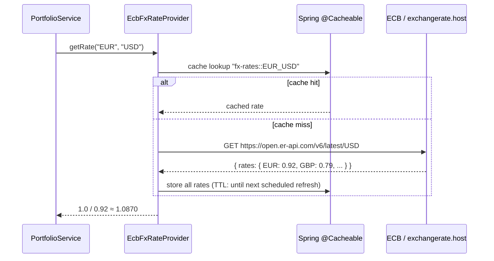

# Design Document: FX Currency Conversion

## Overview

The `portfolio-service` currently computes `totalValue` by summing `quantity × current_price` across all holdings using a raw SQL query (`PortfolioService.java:64`). This assumes every asset is priced in the user's base currency, which breaks for multi-currency portfolios (e.g., a holding priced in EUR or GBP). This feature introduces an `FxRateProvider` abstraction that normalises every holding's value into the user's configured base currency before aggregation, resolving the TODO at line 64.

The design follows hexagonal architecture: the domain port (`FxRateProvider`) lives in the domain package; the two adapters (mock/static for `local`, ECB/exchangerate.host for `aws`) live in an `fx` infrastructure sub-package and are wired exclusively via Spring profiles — no domain code imports any adapter directly.

---

## Architecture

```mermaid
graph TD
    subgraph Domain ["Domain Layer (com.wealth.portfolio)"]
        PS[PortfolioService]
        FRP["FxRateProvider (port/interface)"]
        PS -->|calls getRate(from, to)| FRP
    end

    subgraph Adapters ["Infrastructure Adapters (com.wealth.portfolio.fx)"]
        MOCK["StaticFxRateProvider\n@Profile('local')"]
        ECB["EcbFxRateProvider\n@Profile('aws')"]
    end

    subgraph Cache ["Spring Cache"]
        C["@Cacheable('fx-rates')\nIn-memory ConcurrentHashMap (local)\nor Spring Cache (aws)"]
    end

    FRP -.->|implemented by| MOCK
    FRP -.->|implemented by| ECB
    ECB -->|HTTP GET daily XML/JSON| ECBAPI["ECB / exchangerate.host\n(free, no key required)"]
    ECB --> C
    MOCK --> C
```

---

## Sequence Diagrams

### getSummary — FX-normalised aggregation



### EcbFxRateProvider — daily rate fetch with cache



---

## Components and Interfaces

### FxRateProvider (Domain Port)

**Package**: `com.wealth.portfolio`

**Purpose**: Domain port that abstracts FX rate retrieval. `PortfolioService` depends only on this interface — never on any adapter.

**Interface**:

```java
package com.wealth.portfolio;

import java.math.BigDecimal;
import java.util.Currency;

/**
 * Domain port for foreign exchange rate lookup.
 *
 * Implementations must be thread-safe. Rates are directional:
 * getRate("EUR", "USD") returns how many USD one EUR buys.
 *
 * If from.equals(to), implementations MUST return BigDecimal.ONE.
 */
public interface FxRateProvider {

    /**
     * Returns the exchange rate to convert 1 unit of {@code fromCurrency}
     * into {@code toCurrency}.
     *
     * @param fromCurrency ISO 4217 currency code (e.g. "EUR")
     * @param toCurrency   ISO 4217 currency code (e.g. "USD")
     * @return rate > 0; exactly BigDecimal.ONE when fromCurrency.equals(toCurrency)
     * @throws FxRateUnavailableException if the rate cannot be resolved
     */
    BigDecimal getRate(String fromCurrency, String toCurrency);
}
```

**Responsibilities**:

- Provide a rate for any supported currency pair
- Return `BigDecimal.ONE` for same-currency pairs (no-op conversion)
- Throw `FxRateUnavailableException` (unchecked) when a rate is genuinely unavailable

---

### StaticFxRateProvider (Local Adapter)

**Package**: `com.wealth.portfolio.fx`

**Profile**: `local`

**Purpose**: Zero-network, deterministic adapter for local development and unit tests. Rates are loaded from a static map seeded in `application-local.yml` (or hardcoded defaults). A `@Scheduled` method can optionally jitter rates to simulate market movement without any external call.

**Interface**:

```java
@Service
@Profile("local")
class StaticFxRateProvider implements FxRateProvider {

    // Rates relative to USD base (1 USD = X foreign)
    // Inverted on demand: getRate("EUR","USD") = 1 / rates.get("EUR")
    private final Map<String, BigDecimal> ratesFromUsd;

    StaticFxRateProvider(FxProperties props) { ... }

    @Override
    public BigDecimal getRate(String fromCurrency, String toCurrency) { ... }

    /** Optional: jitter rates every 60 s to simulate live data locally */
    @Scheduled(fixedDelayString = "${fx.local.jitter-interval-ms:60000}")
    void jitterRates() { ... }
}
```

**Responsibilities**:

- Serve rates from an in-memory map — no network calls
- Support optional scheduled jitter for local realism
- Invert rates correctly: if map holds `EUR → 0.92` (1 USD = 0.92 EUR), then `getRate("EUR","USD")` = `1 / 0.92`

---

### EcbFxRateProvider (AWS Adapter)

**Package**: `com.wealth.portfolio.fx`

**Profile**: `aws`

**Purpose**: Fetches daily rates from the free [Open Exchange Rates API](https://open.er-api.com/v6/latest/USD) (no API key required for the free tier) or the ECB's public XML feed. Rates are cached in Spring's cache abstraction (`@Cacheable`) so the external call happens at most once per cache TTL window.

**Interface**:

```java
@Service
@Profile("aws")
class EcbFxRateProvider implements FxRateProvider {

    private final RestClient restClient;

    EcbFxRateProvider(RestClient.Builder builder, FxProperties props) { ... }

    @Override
    @Cacheable(value = "fx-rates", key = "#fromCurrency + '_' + #toCurrency")
    public BigDecimal getRate(String fromCurrency, String toCurrency) { ... }

    /** Evict cache daily so rates refresh without a restart */
    @Scheduled(cron = "${fx.aws.refresh-cron:0 0 6 * * *}")
    @CacheEvict(value = "fx-rates", allEntries = true)
    void evictDailyRates() { ... }
}
```

**Responsibilities**:

- Fetch all rates in a single HTTP call (base = USD) and derive cross-rates
- Cache results via `@Cacheable` — no repeated network calls within the TTL
- Evict cache on a daily cron so rates stay fresh
- Throw `FxRateUnavailableException` on HTTP errors or missing currency pairs

---

### FxProperties (Configuration)

**Package**: `com.wealth.portfolio.fx`

**Purpose**: Typed `@ConfigurationProperties` binding for all FX-related config, keeping `application-local.yml` and `application-aws.yml` as the single source of truth.

```java
@ConfigurationProperties(prefix = "fx")
public record FxProperties(
    String baseCurrency,          // default "USD"
    LocalProperties local,
    AwsProperties aws
) {
    public record LocalProperties(
        Map<String, BigDecimal> staticRates,   // e.g. EUR: 0.92, GBP: 0.79
        long jitterIntervalMs
    ) {}

    public record AwsProperties(
        String ratesUrl,           // https://open.er-api.com/v6/latest/USD
        String refreshCron         // "0 0 6 * * *"
    ) {}
}
```

---

## Data Models

### HoldingValuationRow (Query Projection)

The existing SQL query in `PortfolioService.getSummary` is replaced with a query that also returns the `quote_currency` per holding, enabling per-row FX conversion.

```java
/** Internal projection — not a public DTO */
record HoldingValuationRow(
    String assetTicker,
    BigDecimal quantity,
    BigDecimal currentPrice,
    String quoteCurrency      // ISO 4217, e.g. "USD", "EUR"
) {}
```

The `market_prices` table gains a `quote_currency` column (Flyway `V5`):

```sql
-- V5__Add_Quote_Currency_To_Market_Prices.sql
ALTER TABLE market_prices
    ADD COLUMN IF NOT EXISTS quote_currency VARCHAR(10) NOT NULL DEFAULT 'USD';
```

### PortfolioSummaryDto (Extended)

The existing record gains `baseCurrency` so the frontend can display the correct currency symbol:

```java
public record PortfolioSummaryDto(
    String userId,
    int portfolioCount,
    int totalHoldings,
    BigDecimal totalValue,
    String baseCurrency       // NEW — ISO 4217 code, e.g. "USD"
) {}
```

### FxRateUnavailableException

```java
public class FxRateUnavailableException extends RuntimeException {
    public FxRateUnavailableException(String from, String to, Throwable cause) {
        super("FX rate unavailable: %s → %s".formatted(from, to), cause);
    }
}
```

---

## Algorithmic Pseudocode

### getSummary — FX-normalised total value

```pascal
PROCEDURE getSummary(userId: String): PortfolioSummaryDto
  INPUT:  userId — validated UUID string
  OUTPUT: PortfolioSummaryDto with totalValue in user's base currency

  PRECONDITIONS:
    - userRepository.existsById(userId) = true
    - fxRateProvider is non-null and operational

  POSTCONDITIONS:
    - totalValue ≥ 0
    - totalValue is expressed in baseCurrency
    - If all holdings are already in baseCurrency, result equals the legacy SQL sum

  BEGIN
    requireUserExists(userId)
    baseCurrency ← fxProperties.baseCurrency()   // e.g. "USD"

    rows ← jdbcTemplate.query(
      SELECT h.asset_ticker, h.quantity,
             COALESCE(mp.current_price, 0) AS current_price,
             COALESCE(mp.quote_currency, 'USD') AS quote_currency
      FROM asset_holdings h
      JOIN portfolios p ON p.id = h.portfolio_id
      LEFT JOIN market_prices mp ON mp.ticker = h.asset_ticker
      WHERE p.user_id = ?,
      userId
    )

    totalValue ← ZERO

    FOR EACH row IN rows DO
      // Loop invariant: totalValue = sum of converted values for all previously processed rows
      IF row.quoteCurrency EQUALS baseCurrency THEN
        rate ← ONE                               // no-op, same currency
      ELSE
        rate ← fxRateProvider.getRate(row.quoteCurrency, baseCurrency)
      END IF

      holdingValue ← row.quantity × row.currentPrice × rate
      totalValue   ← totalValue + holdingValue
    END FOR

    ASSERT totalValue ≥ ZERO

    portfolios    ← portfolioRepository.findByUserId(userId)
    totalHoldings ← SUM(portfolio.holdings.size() FOR portfolio IN portfolios)

    RETURN PortfolioSummaryDto(userId, portfolios.size(), totalHoldings, totalValue, baseCurrency)
  END
```

### getRate — cross-rate derivation (both adapters)

```pascal
FUNCTION getRate(fromCurrency: String, toCurrency: String): BigDecimal
  INPUT:  fromCurrency, toCurrency — ISO 4217 codes
  OUTPUT: rate > 0

  PRECONDITIONS:
    - fromCurrency is non-null and non-blank
    - toCurrency is non-null and non-blank

  POSTCONDITIONS:
    - result > 0
    - getRate(X, X) = 1 for all X
    - getRate(A, B) × getRate(B, A) ≈ 1 (within rounding tolerance)

  BEGIN
    IF fromCurrency EQUALS toCurrency THEN
      RETURN ONE
    END IF

    // Both adapters store rates as: 1 USD = X foreign (base = USD)
    // To convert A → B:  rate = ratesFromUsd[B] / ratesFromUsd[A]
    rateFrom ← ratesFromUsd.get(fromCurrency)   // how many fromCurrency per 1 USD
    rateTo   ← ratesFromUsd.get(toCurrency)     // how many toCurrency per 1 USD

    IF rateFrom IS NULL OR rateTo IS NULL THEN
      THROW FxRateUnavailableException(fromCurrency, toCurrency)
    END IF

    IF rateFrom EQUALS ZERO THEN
      THROW FxRateUnavailableException(fromCurrency, toCurrency)
    END IF

    RETURN rateTo / rateFrom
  END
```

---

## Key Functions with Formal Specifications

### PortfolioService.getSummary

**Preconditions:**

- `userId` is a valid UUID string and the user exists in the repository
- `fxRateProvider` is non-null and returns positive rates

**Postconditions:**

- `result.totalValue` ≥ 0
- `result.baseCurrency` equals `fxProperties.baseCurrency()`
- If all `market_prices.quote_currency` equal `baseCurrency`, result is numerically identical to the legacy query

**Loop Invariant (over holdings):**

- `totalValue` equals the sum of `quantity × price × fxRate` for all rows processed so far

---

### FxRateProvider.getRate

**Preconditions:**

- `fromCurrency` and `toCurrency` are non-null, non-blank ISO 4217 codes

**Postconditions:**

- Returns `BigDecimal.ONE` iff `fromCurrency.equals(toCurrency)`
- Returns a value `> 0` for all supported pairs
- Throws `FxRateUnavailableException` for unsupported pairs

---

### EcbFxRateProvider — cache eviction

**Preconditions:**

- Cron expression is valid and the scheduler is active

**Postconditions:**

- After eviction, the next `getRate` call triggers a fresh HTTP fetch
- No stale rates survive beyond one cache TTL window

---

## Example Usage

### Wiring in PortfolioService

```java
@Service
public class PortfolioService {

    private final PortfolioRepository portfolioRepository;
    private final JdbcTemplate jdbcTemplate;
    private final UserRepository userRepository;
    private final FxRateProvider fxRateProvider;   // injected — profile selects impl
    private final FxProperties fxProperties;

    // constructor injection (all fields) ...

    @Transactional(readOnly = true)
    public PortfolioSummaryDto getSummary(String userId) {
        requireUserExists(userId);
        String baseCurrency = fxProperties.baseCurrency();

        List<HoldingValuationRow> rows = jdbcTemplate.query(
            """
            SELECT h.asset_ticker,
                   h.quantity,
                   COALESCE(mp.current_price, 0)       AS current_price,
                   COALESCE(mp.quote_currency, 'USD')  AS quote_currency
            FROM asset_holdings h
            JOIN portfolios p ON p.id = h.portfolio_id
            LEFT JOIN market_prices mp ON mp.ticker = h.asset_ticker
            WHERE p.user_id = ?
            """,
            (rs, i) -> new HoldingValuationRow(
                rs.getString("asset_ticker"),
                rs.getBigDecimal("quantity"),
                rs.getBigDecimal("current_price"),
                rs.getString("quote_currency")
            ),
            userId
        );

        BigDecimal totalValue = rows.stream()
            .map(row -> {
                BigDecimal rate = row.quoteCurrency().equals(baseCurrency)
                    ? BigDecimal.ONE
                    : fxRateProvider.getRate(row.quoteCurrency(), baseCurrency);
                return row.quantity()
                          .multiply(row.currentPrice())
                          .multiply(rate)
                          .setScale(4, RoundingMode.HALF_UP);
            })
            .reduce(BigDecimal.ZERO, BigDecimal::add);

        var portfolios = portfolioRepository.findByUserId(userId);
        int totalHoldings = portfolios.stream().mapToInt(p -> p.getHoldings().size()).sum();

        return new PortfolioSummaryDto(
            userId,
            portfolios.size(),
            totalHoldings,
            totalValue,
            baseCurrency
        );
    }
}
```

### application-local.yml additions

```yaml
fx:
  base-currency: USD
  local:
    jitter-interval-ms: 60000
    static-rates:
      EUR: 0.92
      GBP: 0.79
      JPY: 149.50
      CAD: 1.36
      AUD: 1.53
      CHF: 0.90
      USD: 1.00 # explicit identity entry
```

### application-aws.yml additions

```yaml
fx:
  base-currency: USD
  aws:
    rates-url: https://open.er-api.com/v6/latest/USD
    refresh-cron: "0 0 6 * * *"

spring:
  cache:
    type: simple # ConcurrentHashMap — no Redis dependency for FX rates
```

---

## Error Handling

### FX Rate Unavailable

**Condition**: `EcbFxRateProvider` cannot reach the external API, or the currency pair is not in the response payload.

**Response**: Throw `FxRateUnavailableException` (unchecked). `GlobalExceptionHandler` maps this to HTTP 503 with a structured error body: `{ "error": "FX rate unavailable: EUR → USD", "retryable": true }`.

**Recovery**: The daily `@CacheEvict` + `@Scheduled` refresh will retry on the next cycle. For the `local` profile this never occurs (static map).

---

### Same-Currency Short-Circuit

**Condition**: `fromCurrency.equals(toCurrency)` — e.g., a USD-priced asset in a USD portfolio.

**Response**: Both adapters return `BigDecimal.ONE` immediately without any map lookup or HTTP call. This is the hot path for most holdings.

---

### Missing `quote_currency` in DB

**Condition**: `market_prices.quote_currency` is NULL (pre-migration rows).

**Response**: The SQL query uses `COALESCE(mp.quote_currency, 'USD')` so legacy rows default to USD. No exception is thrown; the conversion is a no-op.

---

### Invalid Currency Code

**Condition**: A ticker's `quote_currency` is set to an unrecognised string (e.g., `"XYZ"`).

**Response**: `FxRateUnavailableException` is thrown. The `GlobalExceptionHandler` returns 503. The holding is not silently dropped — the entire summary call fails fast so data integrity is preserved.

---

## Testing Strategy

### Unit Testing — PortfolioService with Mocked FxRateProvider

The key principle: inject a `Mockito` mock of `FxRateProvider` directly into `PortfolioService`. No Spring context, no network, no DB.

```java
@ExtendWith(MockitoExtension.class)
class PortfolioServiceFxTest {

    @Mock FxRateProvider fxRateProvider;
    @Mock PortfolioRepository portfolioRepository;
    @Mock JdbcTemplate jdbcTemplate;
    @Mock UserRepository userRepository;

    PortfolioService service;

    @BeforeEach
    void setUp() {
        FxProperties props = new FxProperties("USD", null, null);
        service = new PortfolioService(
            portfolioRepository, jdbcTemplate, userRepository,
            fxRateProvider, props
        );
    }

    @Test
    void totalValueConvertsEurHoldingToUsd() {
        // Arrange: 10 shares of EURASSET priced at 100 EUR, rate = 1.08
        when(userRepository.existsById(any())).thenReturn(true);
        when(portfolioRepository.findByUserId(any())).thenReturn(List.of());
        when(jdbcTemplate.query(anyString(), any(RowMapper.class), any()))
            .thenReturn(List.of(
                new HoldingValuationRow("EURASSET", new BigDecimal("10"),
                                        new BigDecimal("100"), "EUR")
            ));
        when(fxRateProvider.getRate("EUR", "USD")).thenReturn(new BigDecimal("1.08"));

        // Act
        var summary = service.getSummary("00000000-0000-0000-0000-000000000001");

        // Assert: 10 × 100 × 1.08 = 1080.00
        assertThat(summary.totalValue()).isEqualByComparingTo("1080.0000");
        assertThat(summary.baseCurrency()).isEqualTo("USD");
        verify(fxRateProvider).getRate("EUR", "USD");
    }

    @Test
    void sameCurrencyHoldingDoesNotCallFxProvider() {
        when(userRepository.existsById(any())).thenReturn(true);
        when(portfolioRepository.findByUserId(any())).thenReturn(List.of());
        when(jdbcTemplate.query(anyString(), any(RowMapper.class), any()))
            .thenReturn(List.of(
                new HoldingValuationRow("AAPL", new BigDecimal("5"),
                                        new BigDecimal("200"), "USD")
            ));

        var summary = service.getSummary("00000000-0000-0000-0000-000000000001");

        assertThat(summary.totalValue()).isEqualByComparingTo("1000.0000");
        verifyNoInteractions(fxRateProvider);   // short-circuit: no FX call for USD→USD
    }

    @Test
    void unavailableRatePropagatesToCaller() {
        when(userRepository.existsById(any())).thenReturn(true);
        when(portfolioRepository.findByUserId(any())).thenReturn(List.of());
        when(jdbcTemplate.query(anyString(), any(RowMapper.class), any()))
            .thenReturn(List.of(
                new HoldingValuationRow("EXOTIC", new BigDecimal("1"),
                                        new BigDecimal("50"), "XYZ")
            ));
        when(fxRateProvider.getRate("XYZ", "USD"))
            .thenThrow(new FxRateUnavailableException("XYZ", "USD", null));

        assertThatThrownBy(() -> service.getSummary("00000000-0000-0000-0000-000000000001"))
            .isInstanceOf(FxRateUnavailableException.class);
    }
}
```

### Unit Testing — StaticFxRateProvider

```java
class StaticFxRateProviderTest {

    StaticFxRateProvider provider;

    @BeforeEach
    void setUp() {
        var rates = Map.of("EUR", new BigDecimal("0.92"), "USD", BigDecimal.ONE);
        var props = new FxProperties("USD", new FxProperties.LocalProperties(rates, 60000L), null);
        provider = new StaticFxRateProvider(props);
    }

    @Test
    void sameCurrencyReturnsOne() {
        assertThat(provider.getRate("USD", "USD")).isEqualByComparingTo("1");
    }

    @Test
    void eurToUsdIsInverseOfUsdToEur() {
        BigDecimal eurToUsd = provider.getRate("EUR", "USD");
        BigDecimal usdToEur = provider.getRate("USD", "EUR");
        // eurToUsd × usdToEur ≈ 1 (within rounding)
        assertThat(eurToUsd.multiply(usdToEur))
            .isCloseTo(BigDecimal.ONE, within(new BigDecimal("0.0001")));
    }

    @Test
    void unknownCurrencyThrowsFxRateUnavailableException() {
        assertThatThrownBy(() -> provider.getRate("XYZ", "USD"))
            .isInstanceOf(FxRateUnavailableException.class);
    }
}
```

### Integration Testing — EcbFxRateProvider (WireMock)

For the `aws` profile adapter, use WireMock to stub the external HTTP endpoint. No real network calls in CI.

```java
@Tag("integration")
@SpringBootTest(properties = "spring.profiles.active=aws")
@AutoConfigureWireMock(port = 0)
class EcbFxRateProviderIntegrationTest {

    @Autowired EcbFxRateProvider provider;

    @Test
    void fetchesAndCachesRatesFromStubbedEndpoint() {
        stubFor(get(urlEqualTo("/v6/latest/USD"))
            .willReturn(okJson("""
                { "rates": { "EUR": 0.92, "GBP": 0.79, "USD": 1.0 } }
            """)));

        BigDecimal rate = provider.getRate("EUR", "USD");

        assertThat(rate).isCloseTo(new BigDecimal("1.0870"), within(new BigDecimal("0.001")));
        // Second call must hit cache — verify only 1 HTTP request was made
        provider.getRate("EUR", "USD");
        verify(1, getRequestedFor(urlEqualTo("/v6/latest/USD")));
    }
}
```

---

## Performance Considerations

- The `local` adapter is a pure in-memory map lookup — O(1), no I/O.
- The `aws` adapter makes at most one HTTP call per cache TTL window (daily by default). All subsequent calls within the window are served from `ConcurrentHashMap` via Spring's `simple` cache.
- The FX conversion loop in `getSummary` is O(n) in the number of holdings. For typical portfolios (< 100 holdings) this is negligible. The same-currency short-circuit (`quoteCurrency.equals(baseCurrency)`) eliminates the map lookup for the majority of holdings in a USD-denominated portfolio.
- `RestClient` (Spring 6.1+) is used instead of `RestTemplate` for the HTTP call — it is the current recommended synchronous client in Spring Boot 4.

---

## Security Considerations

- The free-tier external API (`open.er-api.com`) requires no API key, so there are no secrets to manage or rotate.
- If a paid/keyed provider is adopted in future, the key must be injected via environment variable (`${FX_API_KEY}`) and never committed to source. `FxProperties` already has an `aws` sub-record that can accommodate this.
- The `quote_currency` value read from the DB is used only as a map key — it is never reflected into HTTP responses verbatim, so there is no injection risk.
- Rate values are `BigDecimal` throughout — no floating-point arithmetic that could introduce rounding exploits in financial calculations.

---

## Dependencies

No new third-party libraries are required.

| Dependency                    | Already Present                              | Usage                                              |
| ----------------------------- | -------------------------------------------- | -------------------------------------------------- |
| `spring-boot-starter-webmvc`  | ✅                                           | `RestClient` for HTTP calls in `EcbFxRateProvider` |
| `spring-boot-starter-cache`   | ❌ — add to `portfolio-service/build.gradle` | `@Cacheable` / `@CacheEvict` support               |
| `spring-context` (scheduling) | ✅ (transitive)                              | `@Scheduled` for cache eviction and local jitter   |
| `spring-boot-starter-test`    | ✅                                           | JUnit 5 + Mockito for unit tests                   |
| `wiremock-spring-boot`        | ❌ — add to `testImplementation`             | Stub HTTP in `EcbFxRateProvider` integration test  |

`build.gradle` additions for `portfolio-service`:

```groovy
implementation 'org.springframework.boot:spring-boot-starter-cache'

testImplementation 'org.wiremock.integrations:wiremock-spring-boot:3.2.0'
```

`@EnableCaching` must be added to `PortfolioApplication` (or a `@Configuration` class).

---

## Correctness Properties

_A property is a characteristic or behavior that should hold true across all valid executions of a system — essentially, a formal statement about what the system should do. Properties serve as the bridge between human-readable specifications and machine-verifiable correctness guarantees._

### Property 1: Same-currency identity

_For any_ ISO 4217 currency code `X`, `FxRateProvider.getRate(X, X)` SHALL return `BigDecimal.ONE`.

**Validates: Requirements 1.2, 2.4**

---

### Property 2: Rate positivity

_For any_ supported currency pair `(A, B)`, `FxRateProvider.getRate(A, B)` SHALL return a value strictly greater than zero.

**Validates: Requirements 1.3, 2.3**

---

### Property 3: Inverse round-trip

_For any_ two supported currencies `A` and `B`, `getRate(A, B) × getRate(B, A)` SHALL equal `1` within a rounding tolerance of `0.0001`.

**Validates: Requirements 2.6**

---

### Property 4: Cross-rate formula correctness

_For any_ two currencies `A` and `B` present in the USD-base rate map, `getRate(A, B)` SHALL equal `ratesFromUsd[B] / ratesFromUsd[A]`.

**Validates: Requirements 2.3, 3.6**

---

### Property 5: Cache hit suppresses HTTP calls

_For any_ number of `getRate` calls `n ≥ 2` within the same cache TTL window, the total number of HTTP requests made to the external rates API SHALL be exactly `1`.

**Validates: Requirements 3.3**

---

### Property 6: Fault-tolerant fallback

_For any_ currency pair, if the external HTTP call throws an exception, `EcbFxRateProvider.getRate` SHALL return `BigDecimal.ONE` and SHALL NOT propagate any exception to the caller.

**Validates: Requirements 3.5, 7.2**

---

### Property 7: FX-normalised total value

_For any_ list of holdings with arbitrary `quoteCurrency` values and a configured `baseCurrency`, `PortfolioService.getSummary` SHALL return a `totalValue` equal to `Σ (quantity × currentPrice × getRate(quoteCurrency, baseCurrency))` for all holdings.

**Validates: Requirements 4.1, 4.2**

---

### Property 8: Same-currency short-circuit

_For any_ list of holdings where every `quoteCurrency` equals `baseCurrency`, `PortfolioService.getSummary` SHALL produce the same `totalValue` as the legacy `Σ (quantity × currentPrice)` sum, and SHALL NOT invoke `FxRateProvider.getRate` for any holding.

**Validates: Requirements 4.3, 4.4**

---

### Property 9: BaseCurrency propagation

_For any_ `getSummary` call, the `baseCurrency` field of the returned `PortfolioSummaryDto` SHALL equal the value of `FxProperties.baseCurrency()`.

**Validates: Requirements 4.5**
