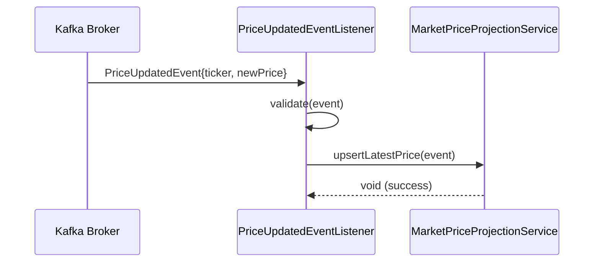
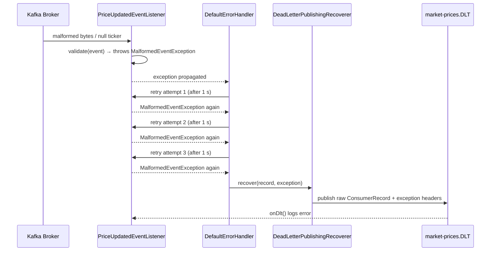
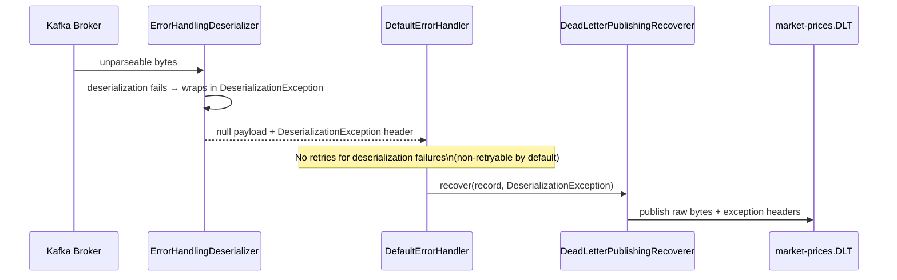

# Design Document: Kafka Dead-Letter Queue (DLQ) — portfolio-service

## Overview

This feature hardens the `portfolio-service` Kafka consumer pipeline by routing malformed or
poison-pill `PriceUpdatedEvent` messages to a Dead-Letter Topic (DLT) after a fixed number of
retries, preventing a single bad message from blocking partition progress indefinitely.
The implementation is pure Spring Kafka — no cloud-vendor SDKs are introduced.

---

## Architecture

The DLQ strategy sits entirely within the `portfolio-service` consumer boundary.
The `market-data-service` producer and the shared `common-dto` contract are untouched.

```mermaid
graph TD
    subgraph market-data-service
        P[KafkaProducer]
    end

    subgraph Kafka Broker
        T[market-prices topic]
        DLT[market-prices.DLT topic]
    end

    subgraph portfolio-service
        L[PriceUpdatedEventListener]
        EH[DefaultErrorHandler\nFixedBackOff 1 s × 3]
        DLPR[DeadLetterPublishingRecoverer]
        MPPS[MarketPriceProjectionService]
        DL[DLT Listener\nonDlt&#40;&#41;]
    end

    P -->|publish| T
    T -->|consume| L
    L -->|valid event| MPPS
    L -->|throws MalformedEventException| EH
    EH -->|retry 1-3| L
    EH -->|retries exhausted| DLPR
    DLPR -->|publish raw bytes + headers| DLT
    DLT -->|consume| DL
```



---

## Sequence Diagrams

### Happy Path — Valid Event



### Poison-Pill Path — Malformed Event → DLT



### Deserialization Failure Path



---

## Components and Interfaces

### MalformedEventException

**Purpose**: Typed, non-retryable signal for business-level validation failures on a `PriceUpdatedEvent`.

**Interface**:

```java
public final class MalformedEventException extends RuntimeException {
    public MalformedEventException(String message) { super(message); }
    public MalformedEventException(String message, Throwable cause) { super(message, cause); }
}
```

**Responsibilities**:

- Distinguishes a known-bad event (poison pill) from a transient infrastructure failure.
- Thrown by `PriceUpdatedEventListener` when validation fails.
- Registered as a non-retryable exception type in `DefaultErrorHandler` so it bypasses the
  retry loop and goes straight to the DLT.

---

### PortfolioKafkaConfig (updated)

**Purpose**: Wires the `DefaultErrorHandler` + `DeadLetterPublishingRecoverer` and registers
`MalformedEventException` as non-retryable.

**Key beans**:

```java
// Retry 3 times with 1-second fixed backoff, then publish to DLT.
@Bean
DefaultErrorHandler priceUpdatedErrorHandler(KafkaOperations<Object, Object> dlqKafkaTemplate) {
    DeadLetterPublishingRecoverer recoverer = new DeadLetterPublishingRecoverer(
        dlqKafkaTemplate,
        (record, ex) -> new TopicPartition(record.topic() + ".DLT", record.partition())
    );
    DefaultErrorHandler handler = new DefaultErrorHandler(recoverer, new FixedBackOff(1_000L, 3L));
    handler.addNotRetryableExceptions(MalformedEventException.class);
    return handler;
}
```

**Responsibilities**:

- `ErrorHandlingDeserializer` wraps `JacksonJsonDeserializer` to catch deserialization failures
  before they reach listener code.
- `DeadLetterPublishingRecoverer` routes failed records to `{topic}.DLT` preserving partition
  affinity and attaching Spring Kafka exception headers.
- `FixedBackOff(1_000L, 3L)` → 3 retry attempts, 1 second apart.
- `MalformedEventException` is non-retryable: goes to DLT on first failure.

---

### PriceUpdatedEventListener (updated)

**Purpose**: Validates the incoming event before delegating to the projection service; throws
`MalformedEventException` for poison pills.

**Interface**:

```java
@KafkaListener(
    topics = "market-prices",
    groupId = "portfolio-group",
    containerFactory = "priceUpdatedKafkaListenerContainerFactory"
)
void on(PriceUpdatedEvent event);

@KafkaListener(topics = "market-prices.DLT", groupId = "portfolio-group-dlt")
void onDlt(Object failedPayload,
           @Header(KafkaHeaders.RECEIVED_TOPIC) String topic,
           @Header(KafkaHeaders.RECEIVED_PARTITION) int partition,
           @Header(KafkaHeaders.OFFSET) long offset);
```

**Validation rules enforced before delegation**:

- `event` must not be `null`
- `event.ticker()` must not be `null` or blank
- `event.newPrice()` must not be `null` and must be `> 0`

---

## Data Models

### PriceUpdatedEvent (unchanged — common-dto)

```java
public record PriceUpdatedEvent(String ticker, BigDecimal newPrice) {}
```

**Validation rules** (enforced in listener, not in the record itself):

- `ticker`: non-null, non-blank string
- `newPrice`: non-null, positive `BigDecimal`

### DLT Message Headers (set automatically by Spring Kafka)

| Header                           | Value                                |
| -------------------------------- | ------------------------------------ |
| `kafka_dlt-exception-fqcn`       | Fully-qualified exception class name |
| `kafka_dlt-exception-message`    | Exception message                    |
| `kafka_dlt-exception-cause-fqcn` | Cause class name (if present)        |
| `kafka_dlt-original-topic`       | `market-prices`                      |
| `kafka_dlt-original-partition`   | Source partition number              |
| `kafka_dlt-original-offset`      | Source offset                        |
| `kafka_dlt-original-timestamp`   | Source message timestamp             |

---

## Key Functions with Formal Specifications

### PriceUpdatedEventListener.on()

```java
void on(PriceUpdatedEvent event)
```

**Preconditions:**

- `event` is non-null (guaranteed by `ErrorHandlingDeserializer`; null payload triggers DLT directly)
- `event.ticker()` is non-null and non-blank
- `event.newPrice()` is non-null and `> 0`

**Postconditions:**

- If all preconditions hold: `marketPriceProjectionService.upsertLatestPrice(event)` is called exactly once
- If any precondition fails: `MalformedEventException` is thrown; no write to the projection store occurs
- No partial state mutations on validation failure

**Loop Invariants:** N/A

---

### DefaultErrorHandler retry loop

```
ALGORITHM retryOrRoute(record, exception)
INPUT:  ConsumerRecord record, Exception exception
OUTPUT: void (side-effect: either re-delivers to listener or publishes to DLT)

BEGIN
  IF exception IS INSTANCE OF MalformedEventException THEN
    // Non-retryable — skip retry loop entirely
    recoverer.recover(record, exception)
    RETURN
  END IF

  attempts ← 0
  WHILE attempts < 3 DO
    TRY
      listener.on(deserialize(record))
      RETURN  // success
    CATCH Exception e
      attempts ← attempts + 1
      IF attempts < 3 THEN
        SLEEP 1000ms
      END IF
    END TRY
  END WHILE

  // Retries exhausted
  recoverer.recover(record, lastException)
END
```

**Preconditions:**

- `record` is a valid `ConsumerRecord` from the `market-prices` topic
- `FixedBackOff` is configured with `interval=1000ms`, `maxAttempts=3`

**Postconditions:**

- Either the listener processes the record successfully, OR the record is published to `market-prices.DLT`
- The Kafka consumer offset is committed in both cases (no infinite blocking)
- `MalformedEventException` bypasses the retry loop entirely

**Loop Invariants:**

- `attempts` is monotonically increasing
- Each iteration either succeeds (exits) or increments `attempts`
- When `attempts == 3`, the loop terminates and `recoverer.recover()` is called

---

## Configuration

### application.yml additions

```yaml
spring:
  kafka:
    consumer:
      # ErrorHandlingDeserializer wraps the real deserializer; configured in PortfolioKafkaConfig
      # No changes needed here — consumer factory is fully programmatic
    producer:
      # DLQ producer factory is programmatic; no additional yml keys required
```

> The retry count and backoff are intentionally hardcoded in `PortfolioKafkaConfig` rather than
> externalised to YAML. They are infrastructure policy, not environment-specific tuning.
> If environment-specific overrides are needed in future, a `@ConfigurationProperties` bean
> can be introduced without changing the design.

### application-local.yml (no changes required)

The local profile already points to `localhost:9094` via `SPRING_KAFKA_BOOTSTRAP_SERVERS`.
The DLT topic (`market-prices.DLT`) is auto-created by the broker in local/Docker mode.

---

## Error Handling

### Scenario 1: Deserialization failure (unparseable bytes)

**Condition**: Kafka message bytes cannot be parsed into `PriceUpdatedEvent` by Jackson.  
**Response**: `ErrorHandlingDeserializer` catches the exception, sets a `DeserializationException`
header on the record, and delivers a `null` payload to the listener container.  
**Recovery**: `DefaultErrorHandler` detects the deserialization header and routes directly to
`DeadLetterPublishingRecoverer` — no retries (deserialization failures are non-retryable by default).

### Scenario 2: Business validation failure (poison pill)

**Condition**: Event deserializes successfully but fails validation (null ticker, negative price, etc.).  
**Response**: `PriceUpdatedEventListener.on()` throws `MalformedEventException`.  
**Recovery**: Registered as non-retryable in `DefaultErrorHandler`; record is immediately routed to DLT.

### Scenario 3: Transient processing failure

**Condition**: `MarketPriceProjectionService.upsertLatestPrice()` throws a transient exception
(e.g., `DataAccessException` due to a momentary DB hiccup).  
**Response**: `DefaultErrorHandler` retries up to 3 times with 1-second backoff.  
**Recovery**: If all 3 retries fail, the record is published to the DLT.

### Scenario 4: DLT consumer failure

**Condition**: The `onDlt()` listener itself throws an exception.  
**Response**: The DLT listener uses the default container factory (no error handler configured),
so the exception propagates and the consumer logs the error. The DLT offset is not committed.  
**Recovery**: Operator intervention required. The DLT is a terminal sink — no further routing.

---

## Testing Strategy

### Unit Testing

- `PriceUpdatedEventListenerTest`: verify that `on()` throws `MalformedEventException` for each
  invalid input variant (null event, blank ticker, null price, zero price, negative price).
- `PortfolioKafkaConfigTest`: verify that `MalformedEventException` is registered as non-retryable
  in the `DefaultErrorHandler` bean.

### Integration Testing — `DlqIntegrationTest`

**Tag**: `@Tag("integration")`  
**Infrastructure**: Testcontainers Kafka module (`org.testcontainers:kafka`)  
**Framework**: `@SpringBootTest` + `EmbeddedKafkaBroker` or Testcontainers Kafka

**Test scenarios**:

1. **Malformed message → DLT**: Publish a raw JSON string with a blank ticker to `market-prices`.
   Assert the message arrives on `market-prices.DLT` within a timeout. Assert the main projection
   table is not updated.

2. **Valid message → projection updated**: Publish a well-formed `PriceUpdatedEvent`. Assert
   `market_prices` table is updated. Assert nothing arrives on `market-prices.DLT`.

3. **Deserialization failure → DLT**: Publish raw bytes that are not valid JSON. Assert the
   message arrives on `market-prices.DLT`. Assert no exception escapes the container.

**Assertion approach**:

- Use `KafkaTestUtils.getRecords()` with a `KafkaConsumer` subscribed to `market-prices.DLT`
  to assert DLT delivery.
- Use `JdbcTemplate` to assert projection table state.
- Use `Awaitility` (already on the Spring Boot test classpath) for async assertions.

---

## Dependencies

### New (to add to `portfolio-service/build.gradle`)

```groovy
testImplementation 'org.testcontainers:kafka'
```

> `org.testcontainers:testcontainers-bom` is already managed at the root level, so no version
> pin is needed.

### Existing (already present — no changes)

| Dependency                                            | Purpose                                                                 |
| ----------------------------------------------------- | ----------------------------------------------------------------------- |
| `spring-boot-starter-kafka`                           | `DefaultErrorHandler`, `DeadLetterPublishingRecoverer`, `KafkaTemplate` |
| `spring-kafka-test`                                   | `EmbeddedKafkaBroker`, `KafkaTestUtils`                                 |
| `org.testcontainers:testcontainers-junit-jupiter`     | Testcontainers JUnit 5 extension                                        |
| `org.springframework.boot:spring-boot-testcontainers` | `@ServiceConnection` support                                            |

---

## Security Considerations

- The DLT topic (`market-prices.DLT`) should have the same ACL policy as `market-prices` in
  production — only the `portfolio-group` service account should be able to produce to it.
- DLT messages contain the original raw bytes of the failed record. If the payload could contain
  PII in future event types, the DLT should be treated with the same data-classification level
  as the source topic.

## Performance Considerations

- `FixedBackOff(1_000L, 3L)` adds at most 3 seconds of delay per poison pill before it is
  routed to the DLT. This is acceptable for a non-critical price-update consumer.
- The DLT producer reuses the same Kafka bootstrap connection; no additional network overhead.
- `MalformedEventException` being non-retryable means zero retry delay for known-bad events —
  they are routed to the DLT immediately on first failure.

---

## Correctness Properties

_A property is a characteristic or behavior that should hold true across all valid executions of a system — essentially, a formal statement about what the system should do. Properties serve as the bridge between human-readable specifications and machine-verifiable correctness guarantees._

### Property 1: Valid event reaches the projection service exactly once

For any `PriceUpdatedEvent` with a non-null, non-blank `ticker` and a non-null `newPrice` greater
than zero, the Consumer SHALL invoke `ProjectionService.upsertLatestPrice(event)` exactly once
and SHALL NOT publish any record to the DLT.

**Validates: Requirements 1.1, 1.2**

---

### Property 2: Any blank-or-null ticker is rejected without a projection write

For any `PriceUpdatedEvent` where `ticker` is null, empty, or composed entirely of whitespace,
the Consumer SHALL throw `MalformedEventException` and SHALL NOT call
`ProjectionService.upsertLatestPrice`.

**Validates: Requirements 2.1, 2.2, 2.6**

---

### Property 3: Any non-positive newPrice is rejected without a projection write

For any `PriceUpdatedEvent` where `newPrice` is null, zero, or negative, the Consumer SHALL
throw `MalformedEventException` and SHALL NOT call `ProjectionService.upsertLatestPrice`.

**Validates: Requirements 2.3, 2.4, 2.5, 2.6**

---

### Property 4: MalformedEventException bypasses retries and routes to DLT immediately

For any record that causes the Consumer to throw `MalformedEventException`, the
`DefaultErrorHandler` SHALL invoke `DeadLetterPublishingRecoverer.recover()` on the first
failure with zero retry attempts, and the record SHALL appear on `market-prices.DLT`.

**Validates: Requirements 3.1, 3.2, 3.3**

---

### Property 5: DLT records preserve partition affinity and carry required diagnostic headers

For any record published to `market-prices.DLT`, the DLT partition SHALL equal the source
partition, and the record SHALL carry the headers `kafka_dlt-exception-fqcn`,
`kafka_dlt-exception-message`, `kafka_dlt-original-topic`, `kafka_dlt-original-partition`,
`kafka_dlt-original-offset`, and `kafka_dlt-original-timestamp`.

**Validates: Requirements 6.2, 6.3**

---

### Property 6: Deserialization failure routes to DLT without retries and without crashing the consumer

For any Kafka message whose bytes cannot be deserialized into `PriceUpdatedEvent`, the
`ErrorHandlingDeserializer` SHALL capture the failure as a `DeserializationException` header,
and the `DefaultErrorHandler` SHALL route the record directly to `market-prices.DLT` with zero
retry attempts, leaving the consumer running and the offset committed.

**Validates: Requirements 5.1, 5.2, 5.3, 5.4**
