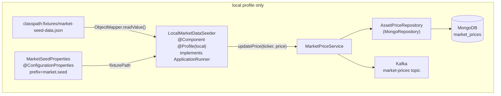
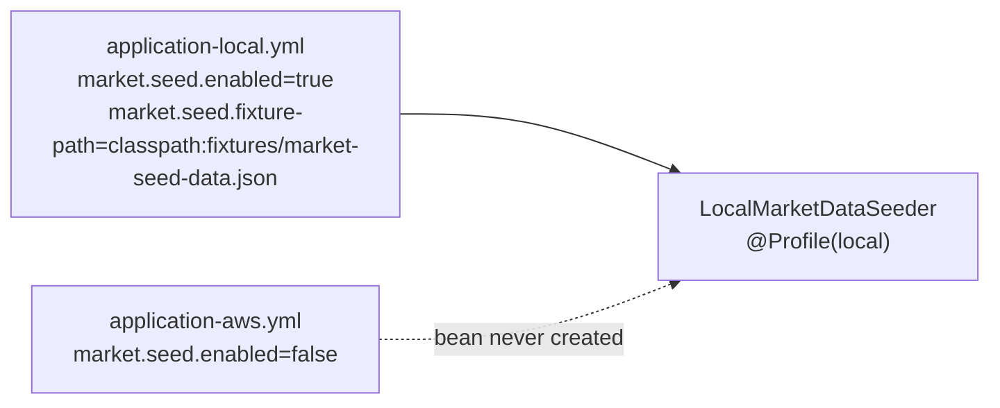
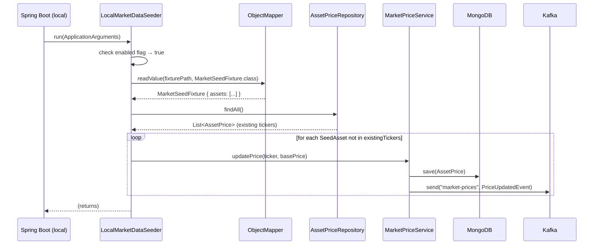

# Design Document: Dynamic Configurable Fixture Profiles for Market Data Seeder

## Overview

The `LocalMarketDataSeeder` currently hardcodes a `Map<String, BigDecimal>` of six tickers directly
in Java source. This design replaces that static map with an externalized JSON fixture file read at
startup via Jackson `ObjectMapper`. Adding or removing a ticker becomes a JSON edit — no Java
recompilation required. The seeder remains strictly `@Profile("local")` and never activates in the
`aws` profile.

The change is intentionally narrow in scope: only the seed-data source changes. The idempotency
logic, the `MarketPriceService.updatePrice` write path, and the Kafka publish chain are all
preserved without modification.

---

## Architecture

### High-Level Component View



### Profile Isolation



The `@Profile("local")` annotation on `LocalMarketDataSeeder` is the primary guard. The
`market.seed.enabled=false` flag in `application-aws.yml` is a belt-and-suspenders defence that
also prevents accidental seeding if the profile annotation were ever removed.

---

## Sequence Diagram — Startup Seed Flow



---

## Components and Interfaces

### 1. `MarketSeedProperties`

**Purpose**: Binds `market.seed.*` configuration properties into a typed record.

**Location**: `com.wealth.market.MarketSeedProperties`

**Interface**:

```java
@ConfigurationProperties(prefix = "market.seed")
public record MarketSeedProperties(
    boolean enabled,
    String fixturePath   // e.g. "classpath:fixtures/market-seed-data.json"
) {}
```

**Responsibilities**:

- Provides the fixture resource path to the seeder without hardcoding it.
- Allows `enabled` to be toggled per-profile without touching Java code.
- Validated at startup via `@Validated` + `@NotBlank` on `fixturePath` when `enabled=true`.

---

### 2. `SeedAsset` (JSON-mapped record)

**Purpose**: Represents a single asset entry in the fixture file.

**Location**: `com.wealth.market.SeedAsset`

**Interface**:

```java
public record SeedAsset(
    String ticker,
    BigDecimal basePrice,
    String currency        // e.g. "USD" — reserved for future FX integration
) {}
```

**Responsibilities**:

- Serves as the Jackson deserialization target for each element in the `assets` array.
- `currency` is included now to align with the existing `quote_currency` pattern in
  `portfolio-service` and to avoid a future breaking schema change.

---

### 3. `MarketSeedFixture` (JSON root wrapper)

**Purpose**: Root deserialization target for the fixture file.

**Location**: `com.wealth.market.MarketSeedFixture`

**Interface**:

```java
public record MarketSeedFixture(
    List<SeedAsset> assets
) {}
```

**Responsibilities**:

- Wraps the `assets` array so the JSON schema is extensible (metadata fields can be added at the
  root level in future without breaking the asset list).

---

### 4. `LocalMarketDataSeeder` (updated)

**Purpose**: Reads the fixture file at startup and backfills missing tickers into MongoDB.

**Location**: `com.wealth.market.LocalMarketDataSeeder`

**Interface**:

```java
@Component
@Profile("local")
class LocalMarketDataSeeder implements ApplicationRunner {
    LocalMarketDataSeeder(
        AssetPriceRepository repo,
        MarketPriceService svc,
        ObjectMapper objectMapper,
        MarketSeedProperties props
    ) { ... }

    @Override
    public void run(ApplicationArguments args) throws Exception { ... }
}
```

**Responsibilities**:

- Checks `props.enabled()` and short-circuits if false.
- Resolves the fixture resource via `ResourceLoader` (supports `classpath:` and `file:` prefixes).
- Delegates JSON parsing to `ObjectMapper`.
- Computes the set of already-present tickers via `AssetPriceRepository.findAll()`.
- Calls `MarketPriceService.updatePrice` only for tickers absent from MongoDB (idempotent).
- Logs a summary of seeded vs skipped tickers.

---

## Data Models

### JSON Fixture Schema

**File**: `src/main/resources/fixtures/market-seed-data.json`

```json
{
  "assets": [
    { "ticker": "AAPL", "basePrice": 212.5, "currency": "USD" },
    { "ticker": "TSLA", "basePrice": 276.0, "currency": "USD" },
    { "ticker": "BTC", "basePrice": 70775.0, "currency": "USD" },
    { "ticker": "MSFT", "basePrice": 425.3, "currency": "USD" },
    { "ticker": "NVDA", "basePrice": 938.6, "currency": "USD" },
    { "ticker": "ETH", "basePrice": 3540.5, "currency": "USD" }
  ]
}
```

**Validation Rules**:

- `ticker`: non-null, non-blank string; uppercase by convention.
- `basePrice`: non-null, positive `BigDecimal`; Jackson deserializes JSON numbers to `BigDecimal`
  when `DeserializationFeature.USE_BIG_DECIMAL_FOR_FLOATS` is enabled (or via `@JsonDeserialize`).
- `currency`: non-null, non-blank, ISO 4217 code (3 uppercase letters).
- Duplicate tickers within the file are tolerated — the idempotency check against MongoDB deduplicates them.

### Test Fixture Schema

**File**: `src/test/resources/fixtures/test-market-seed-data.json`

```json
{
  "assets": [
    { "ticker": "TEST1", "basePrice": 100.0, "currency": "USD" },
    { "ticker": "TEST2", "basePrice": 200.0, "currency": "USD" }
  ]
}
```

Uses synthetic tickers that will never collide with real data, keeping tests hermetic.

---

## Low-Level Design

### Key Functions with Formal Specifications

#### `LocalMarketDataSeeder.run()`

```java
@Override
public void run(ApplicationArguments args) throws Exception
```

**Preconditions**:

- `props.enabled()` may be `true` or `false`; both are valid.
- When `enabled=true`: `props.fixturePath()` is a non-blank, resolvable Spring resource path.
- `objectMapper` is configured with `USE_BIG_DECIMAL_FOR_FLOATS = true`.
- MongoDB is reachable (Spring context startup guarantees this for local profile).

**Postconditions**:

- If `enabled=false`: no reads, no writes, no Kafka events; method returns immediately.
- If `enabled=true` and fixture parses successfully:
  - Every `SeedAsset` in the fixture whose `ticker` was absent from MongoDB before the call is now
    present in MongoDB with `currentPrice = basePrice`.
  - Every `SeedAsset` whose `ticker` was already present in MongoDB is left unchanged.
  - A `PriceUpdatedEvent` is published to Kafka for each newly inserted ticker.
  - The total number of inserted documents equals `|fixture.assets| - |pre-existing tickers ∩ fixture tickers|`.
- If the fixture file is missing or malformed: an exception propagates and Spring Boot startup fails
  fast with a descriptive error (fail-loud, not silent).

**Loop Invariant** (over `fixture.assets`):

- At the start of each iteration, `seededCount` equals the number of tickers from previous
  iterations that were absent from `existingTickers`.
- `existingTickers` is read once before the loop and does not change during iteration (snapshot
  semantics — consistent with the idempotency contract).

---

#### `ObjectMapper.readValue()` call

```java
Resource resource = resourceLoader.getResource(props.fixturePath());
MarketSeedFixture fixture = objectMapper.readValue(resource.getInputStream(), MarketSeedFixture.class);
```

**Preconditions**:

- `resource.exists()` is `true`.
- The JSON content is a valid UTF-8 document matching the `MarketSeedFixture` schema.
- `objectMapper` has `USE_BIG_DECIMAL_FOR_FLOATS` enabled to prevent `double` precision loss on
  `basePrice` values.

**Postconditions**:

- Returns a non-null `MarketSeedFixture` with a non-null (possibly empty) `assets` list.
- Throws `JsonProcessingException` (subtype of `IOException`) on malformed JSON — propagates to
  caller, causing startup failure.

---

### Algorithmic Pseudocode

```pascal
PROCEDURE run(args)
  INPUT: ApplicationArguments args (unused)
  OUTPUT: void (side effects: MongoDB writes, Kafka publishes)

  IF props.enabled = false THEN
    LOG "Market data seeding disabled"
    RETURN
  END IF

  resource ← resourceLoader.getResource(props.fixturePath)

  IF NOT resource.exists() THEN
    THROW IllegalStateException("Fixture not found: " + props.fixturePath)
  END IF

  fixture ← objectMapper.readValue(resource.inputStream, MarketSeedFixture)
  // Throws JsonProcessingException on malformed JSON → startup fails fast

  existingTickers ← SET of ticker strings from assetPriceRepository.findAll()
  // Snapshot taken once; loop does not re-query

  seededCount ← 0

  FOR EACH asset IN fixture.assets DO
    // Loop invariant: seededCount = number of assets processed so far that were absent
    IF existingTickers CONTAINS asset.ticker THEN
      CONTINUE
    END IF
    marketPriceService.updatePrice(asset.ticker, asset.basePrice)
    seededCount ← seededCount + 1
  END FOR

  IF seededCount = 0 THEN
    LOG "Seed skipped: all baseline tickers already present"
  ELSE
    LOG "Seeded {} missing market prices into MongoDB", seededCount
  END IF
END PROCEDURE
```

---

### Configuration Wiring

**`application.yml`** (base — profile-neutral defaults):

```yaml
market:
  seed:
    enabled: true
    fixture-path: classpath:fixtures/market-seed-data.json
```

**`application-local.yml`** (local profile — can override path for local variants):

```yaml
# Inherits base defaults; override only if a different fixture is needed locally
```

**`application-aws.yml`** (aws profile — seeder bean never created, but belt-and-suspenders):

```yaml
market:
  seed:
    enabled: false
```

`@EnableConfigurationProperties(MarketSeedProperties.class)` is added to `MarketDataApplication`.

---

## Error Handling

### Missing Fixture File

**Condition**: `props.fixturePath` points to a resource that does not exist on the classpath.

**Response**: `resourceLoader.getResource(...).exists()` returns `false`; seeder throws
`IllegalStateException` with a descriptive message before attempting to parse.

**Recovery**: Spring Boot startup fails with a clear log message. The developer adds the missing
file to `src/main/resources/fixtures/`.

---

### Malformed JSON

**Condition**: The fixture file exists but contains invalid JSON or a field type mismatch
(e.g., `basePrice` is a string).

**Response**: `objectMapper.readValue()` throws `JsonProcessingException`; the exception propagates
out of `run()`, causing Spring Boot to abort startup.

**Recovery**: Startup failure log includes the Jackson parse error with line/column. Developer
fixes the JSON file.

---

### Empty Asset List

**Condition**: `fixture.assets` is an empty array `[]`.

**Response**: The loop body never executes; `seededCount = 0`; the "seed skipped" log line is
emitted. No error is thrown — an empty fixture is valid (e.g., for a clean-slate test environment).

**Recovery**: No action required; this is intentional behaviour.

---

### MongoDB Unavailable

**Condition**: MongoDB is not reachable when `assetPriceRepository.findAll()` is called.

**Response**: Spring Data throws a `DataAccessException`; it propagates out of `run()`, causing
startup failure.

**Recovery**: Ensure Docker Compose is running (`docker compose up -d mongodb`). This is consistent
with existing behaviour — the seeder has always required MongoDB at startup.

---

## Testing Strategy

### Unit Testing — `LocalMarketDataSeederTest`

**Location**: `market-data-service/src/test/java/com/wealth/market/LocalMarketDataSeederTest.java`

**Approach**: No Spring context. Use Mockito for `AssetPriceRepository` and `MarketPriceService`.
Use a real `ObjectMapper` (configured identically to production) and the test fixture file loaded
from `src/test/resources/fixtures/test-market-seed-data.json`.

**Key test cases**:

| Test                                              | Assertion                                                                                                  |
| ------------------------------------------------- | ---------------------------------------------------------------------------------------------------------- |
| `run_seedsAllAssets_whenDatabaseIsEmpty`          | `marketPriceService.updatePrice` called once per asset in test fixture; `seededCount` matches fixture size |
| `run_skipsExistingTickers_whenAlreadyPresent`     | When repo returns both test tickers, `updatePrice` is never called                                         |
| `run_seedsOnlyMissingTickers_whenPartiallySeeded` | Repo returns `TEST1`; only `TEST2` triggers `updatePrice`                                                  |
| `run_doesNothing_whenDisabled`                    | `props.enabled=false`; zero interactions with repo or service                                              |
| `run_failsFast_whenFixtureFileMissing`            | `IllegalStateException` thrown; no calls to repo or service                                                |
| `run_failsFast_whenFixtureMalformed`              | `JsonProcessingException` propagates; no calls to repo or service                                          |
| `run_parsesFixtureCorrectly`                      | Deserialized `SeedAsset` has correct `ticker`, `basePrice`, `currency` values                              |

**ObjectMapper configuration in tests**:

```java
ObjectMapper mapper = new ObjectMapper()
    .enable(DeserializationFeature.USE_BIG_DECIMAL_FOR_FLOATS)
    .findAndRegisterModules(); // registers JavaTimeModule etc.
```

---

### Integration Testing — `LocalMarketDataSeederIntegrationTest`

**Location**: `market-data-service/src/test/java/com/wealth/market/LocalMarketDataSeederIntegrationTest.java`

**Approach**: `@SpringBootTest` + `@ActiveProfiles("local")` + Testcontainers MongoDB. Kafka is
stubbed via `@MockBean KafkaTemplate` to avoid requiring a running broker in CI.

**Annotation**: `@Tag("integration")` — runs under `integrationTest` Gradle task only.

**Key test cases**:

| Test                                     | Assertion                                                                                          |
| ---------------------------------------- | -------------------------------------------------------------------------------------------------- |
| `contextLoads_andSeedsFixture`           | After context startup, `assetPriceRepository.findAll()` contains all tickers from the main fixture |
| `seeder_isIdempotent`                    | Running the seeder twice (via `ApplicationRunner.run`) does not duplicate documents                |
| `seeder_doesNotActivate_underAwsProfile` | `@ActiveProfiles("aws")` — `LocalMarketDataSeeder` bean is absent from context                     |

---

### Property-Based Testing

Not applicable for this feature. The seeder's correctness properties (idempotency, completeness)
are better expressed as example-based integration tests against a real MongoDB container than as
generated-input property tests.

---

## Performance Considerations

- `assetPriceRepository.findAll()` is called once at startup to snapshot existing tickers. For a
  local dev fixture with O(10–100) assets this is negligible.
- If the fixture grows to thousands of entries, replace `findAll()` with a projection query
  returning only the `_id` (ticker) field: `mongoTemplate.findDistinct("_id", AssetPrice.class, String.class)`.
- The seeder runs synchronously on the Spring Boot startup thread. This is acceptable for local dev;
  it must never run in `aws` profile where startup latency matters for Lambda cold starts.

---

## Security Considerations

- The fixture file is a classpath resource bundled in the JAR. It contains no secrets — only
  synthetic baseline prices for local development.
- The `@Profile("local")` guard ensures the seeder bean is never instantiated in production,
  eliminating any risk of accidental data injection into a live MongoDB instance.
- `market.seed.enabled=false` in `application-aws.yml` provides a second layer of protection.

---

## Dependencies

| Dependency                                                  | Already Present                      | Notes                                              |
| ----------------------------------------------------------- | ------------------------------------ | -------------------------------------------------- |
| `com.fasterxml.jackson.core:jackson-databind`               | Yes (`build.gradle`)                 | Pinned at 2.18.2 via root BOM                      |
| `org.springframework.boot:spring-boot-starter-data-mongodb` | Yes                                  | Provides `ResourceLoader` via `ApplicationContext` |
| `org.testcontainers:testcontainers-mongodb`                 | Yes (`build.gradle`)                 | Used in integration tests                          |
| `org.mockito:mockito-core`                                  | Yes (via `spring-boot-starter-test`) | Used in unit tests                                 |

No new dependencies are required. Jackson `ObjectMapper` is already on the classpath and
auto-configured by Spring Boot.
