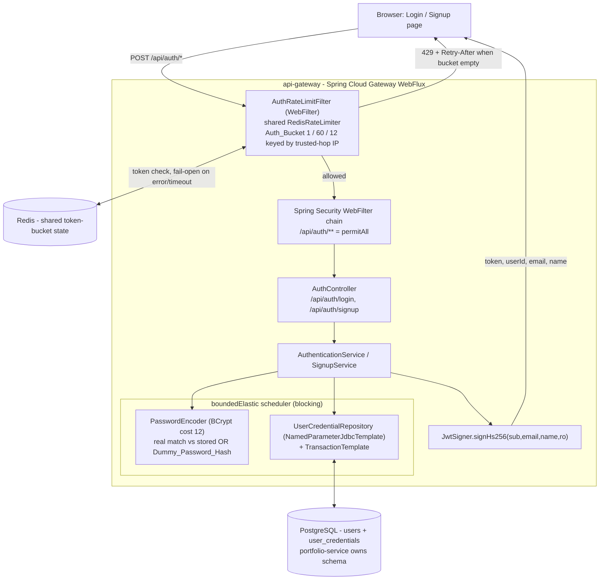
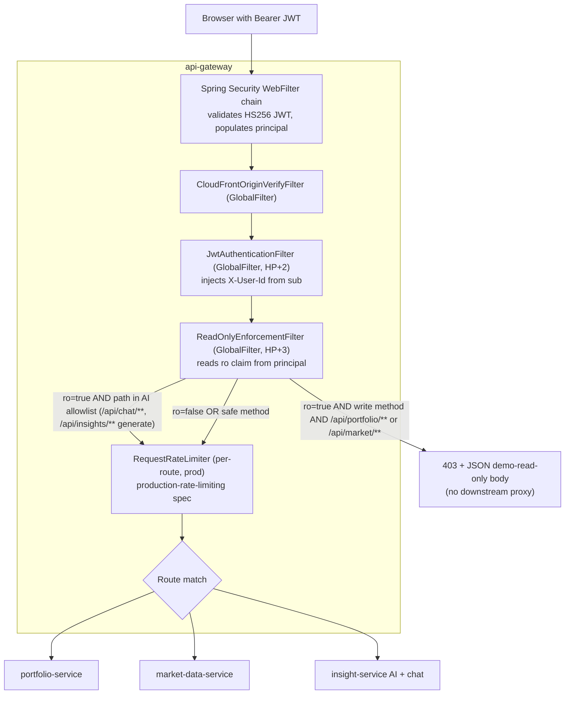

# Design Document

## Overview

This feature turns the `api-gateway` into the real authentication server for the platform while
keeping the frontend a static export. It replaces the single hardcoded string-equality credential
check in `AuthController` with per-user database lookups and bcrypt password verification, adds a
self-service signup endpoint and page, provisions each new account atomically (one transaction that
writes both the `users` row `PortfolioService.requireUserExists()` needs and the credential row the
gateway authenticates against), throttles the unauthenticated auth endpoints with a `WebFilter` that
reuses the shared Redis limiter, enforces a demo read-only account at the gateway, and retires the
dead Better Auth code and `ba_*` tables.

The design holds three settled architectural calls fixed and builds everything else around them:

1. **A separate `user_credentials` table**, not password columns on `users` — keeps the password
   hash out of the `users` table that `portfolio-service` `SELECT`s and that will accrue
   personalization fields (roadmap 3.2), isolates the secret from a careless `SELECT *`, and leaves
   room for credential rotation/history. The `read_only` flag is account semantics and lives on
   `users`.
2. **Blocking JDBC on `Schedulers.boundedElastic()`**, not R2DBC — plain `spring-jdbc`
   (`NamedParameterJdbcTemplate` + `TransactionTemplate`) with a tiny HikariCP pool, wrapped in
   `Mono.fromCallable(...).subscribeOn(boundedElastic())` so the WebFlux event loop is never
   blocked (Req 2.5). No `spring-boot-starter-data-jpa` is added to the gateway.
3. **Demo read-only = a JWT `ro` claim + a gateway `WebFilter` with an AI-route allowlist** — the
   claim is sourced from `users.read_only` at login, and a `ReadOnlyEnforcementFilter` rejects
   portfolio/market writes with `403` while explicitly allowing the AI routes (`/api/chat/**` and
   insight generation under `/api/insights/**`).

The externally observable contracts are deliberately unchanged: the gateway still mints the same
HS256 JWT via `JwtSigner` (claims `sub`/`email`/`name`, 1-hour expiry, `auth.jwt.secret`), the login
response shape is still `{ token, userId, email, name }`, and the frontend still stores the session
in `localStorage` under `wmpt.auth.session`. Downstream services and existing dashboard code keep
working without modification.

### Key design decisions

| Decision | Rationale | Requirements |
| --- | --- | --- |
| Separate `user_credentials` table (1:1 with `users`) | Isolate the password hash from the frequently-`SELECT`ed, soon-to-grow `users` table; enable rotation/history | 1, 4, 9.4 |
| `read_only` boolean on `users` (not `user_credentials`) | Read-only is account semantics, read at login to source the `ro` claim | 7.4 |
| Blocking `spring-jdbc` + `TransactionTemplate` on `boundedElastic` | Atomic two-row write with real SQL transactions; no event-loop blocking; no JPA in a WebFlux app | 2.1, 2.5 |
| Small HikariCP pool (2–4 connections) | Auth is capped at ~5 req/min/IP by the Auth_Bucket, so contention and event-loop pressure are non-issues | 2.5, 6.3 |
| BCrypt `PasswordEncoder` (cost 12) | Already on the classpath via spring-security; no Bouncy Castle needed for argon2id; cost ≥ 10 satisfied | 4.3 |
| Password max = 72 bytes UTF-8 (not 128 chars) | Caps at BCrypt's 72-byte input limit — Spring Security 6's `BCryptPasswordEncoder` throws for input > 72 bytes, so bounding it at signup avoids the throw/silent-truncation footgun with zero new dependencies (vs switching to Argon2id + Bouncy Castle). Checked on UTF-8 byte length, not character count | 1.6, 4.3 |
| Dummy-hash verification on unknown-email login | Equalize timing between unknown-email and wrong-password paths (timing oracle) | 3.4, 3.5 |
| Byte-identical `Uniform_Auth_Error` body on both 401 paths | No enumeration signal from body differences | 3.5, 3.6, 10.6 |
| `ro` JWT claim + `ReadOnlyEnforcementFilter` with AI allowlist | Enforce read-only with zero per-request DB lookups; keep the demo's flagship AI capability | 7.4, 7.5, 7.6 |
| `AuthRateLimitFilter` as a `WebFilter` reusing the shared `RedisRateLimiter` | `/api/auth/**` is a controller endpoint, not a proxied route, so the route-filter `RequestRateLimiter` cannot apply | 6.1, 6.8 |
| Migrations authored in `portfolio-service` only | `portfolio-service` is the Schema_Owner; the gateway reads/writes but owns no Flyway | 2.6, 8.3 |
| Better Auth drop migration versioned LAST, shipped with code removal | No deployed build may reference `ba_*` after it is dropped | 8.3 |

## Architecture

The enforcement point is unchanged: every external request enters through the api-gateway, the only
externally reachable deployable. What changes is that the gateway now (a) owns a Postgres connection
for authentication, (b) throttles `/api/auth/**` before the controller runs, and (c) enforces the
read-only flag on the way to proxied routes.

### Authentication request flow (login / signup)



Ordering note (auth path): `AuthRateLimitFilter` is a `WebFilter` ordered to run **before** the
`AuthController` handler so a throttled request never reaches the hashing-heavy login/signup logic
(Req 6.3). It does not depend on an authenticated principal (auth endpoints are anonymous), so it is
placed at high precedence and keys purely off the Trusted_Hop_Resolver. Spring Security's chain
still runs (`/api/auth/**` is `permitAll`), and `JwtAuthenticationFilter` already short-circuits
`/api/auth/**` without requiring a principal.

### Read-only enforcement path (authenticated proxied routes)



Ordering note (read-only path): `ReadOnlyEnforcementFilter` is a `GlobalFilter` ordered at
`HIGHEST_PRECEDENCE + 3` — **after** `JwtAuthenticationFilter` (`HP + 2`), which is itself after
Spring Security's `WebFilter` chain that validates the JWT and populates
`exchange.getPrincipal()`. Running after authentication is required so the validated `ro` claim is
available (Req 7.4). It runs before the per-route `RequestRateLimiter` so a read-only write is
rejected with `403` without consuming a rate-limit token; the ordering relative to the limiter is a
courtesy, not a correctness requirement (both would ultimately block the write). The
`AuthRateLimiter` and `ReadOnlyEnforcementFilter` never interact: the former applies only to
`/api/auth/**` (a non-proxied controller endpoint), the latter only to authenticated proxied routes.

### Why blocking JDBC on `boundedElastic` is safe here

The gateway is reactive (Netty event loop). Blocking a small, bounded fraction of work off-loop via
`Schedulers.boundedElastic()` is the standard Reactor bridge for occasional blocking I/O. The auth
endpoints are the only blocking callers, and they are capped by the `Auth_Bucket` at an effective
~5 requests/min/IP. Even a modest number of distinct IPs produces auth throughput far below what a
2–4 connection HikariCP pool and the default `boundedElastic` cap can absorb, so event-loop
starvation is not a realistic failure mode. bcrypt at cost 12 (~50–100 ms CPU) also runs on
`boundedElastic`, never on the event loop.

## Components and Interfaces

### 1. `AuthController` (modified) — `com.wealth.gateway`

Drops the `app.auth.*` constructor bindings and the string-equality check (Req 3.8). Delegates to
two services and returns reactive types so the blocking work stays off the event loop.

```java
@RestController
@RequestMapping("/api/auth")
public class AuthController {

    private final AuthenticationService authService;
    private final SignupService signupService;

    @PostMapping("/login")
    public Mono<ResponseEntity<?>> login(@RequestBody LoginDtos.LoginRequest request) {
        return authService.authenticate(request)   // Mono<LoginResponse>, runs on boundedElastic
            .map(resp -> ResponseEntity.ok((Object) resp))
            .onErrorResume(InvalidCredentialsException.class,
                ex -> Mono.just(uniformAuthError()))          // 401, byte-identical body
            .onErrorResume(CredentialStoreUnavailableException.class,
                ex -> Mono.just(serviceUnavailable()));       // 503, no enumeration signal
    }

    @PostMapping("/signup")
    public Mono<ResponseEntity<?>> signup(@RequestBody SignupDtos.SignupRequest request) {
        return signupService.provision(request)    // Mono<LoginResponse>, runs on boundedElastic
            .map(resp -> ResponseEntity.status(HttpStatus.CREATED).body((Object) resp))
            .onErrorResume(ValidationException.class,
                ex -> Mono.just(badRequest(ex.field(), ex.reason())))   // 400 + which field
            .onErrorResume(DuplicateEmailException.class,
                ex -> Mono.just(conflict()))                            // 409
            .onErrorResume(ProvisioningFailedException.class,
                ex -> Mono.just(provisioningFailed()));                 // 500/503
    }
}
```

`uniformAuthError()` returns a single shared, pre-serialized body (see Error Handling) so the
unknown-email and wrong-password responses are byte-identical (Req 3.5, 3.6, 10.6).

### 2. `AuthenticationService` (new) — `com.wealth.gateway.auth`

Encapsulates the login logic: lookup, verify (with dummy-hash equalization), mint.

```java
public Mono<LoginDtos.LoginResponse> authenticate(LoginDtos.LoginRequest req) {
    // Req 3.9: reject blank/missing fields with the Uniform_Auth_Error BEFORE any hashing.
    if (isBlank(req.email()) || isBlank(req.password())) {
        return Mono.error(new InvalidCredentialsException());
    }
    return Mono.fromCallable(() -> {
        var cred = credentialRepository.findByEmailIgnoreCase(req.email());  // Optional<CredentialRow>
        if (cred.isEmpty()) {
            // Req 3.4: burn equivalent CPU against a fixed dummy hash, then fail uniformly.
            passwordEncoder.matches(req.password(), DUMMY_PASSWORD_HASH);
            throw new InvalidCredentialsException();
        }
        var row = cred.get();
        // Req 4.6: absent/malformed stored hash → uniform 401 (still run a match for timing).
        if (isBlank(row.passwordHash()) || !passwordEncoder.matches(req.password(), row.passwordHash())) {
            throw new InvalidCredentialsException();
        }
        String token = jwtSigner.signHs256(row.userId(), row.email(), row.name(), row.readOnly());
        return new LoginDtos.LoginResponse(token, row.userId(), row.email(), row.name());
    })
    .subscribeOn(Schedulers.boundedElastic())                       // Req 2.5 (no event-loop block)
    .onErrorMap(DataAccessException.class, e -> new CredentialStoreUnavailableException(e)); // Req 3.10
}
```

Notes:
- The `ro` claim is sourced from `row.readOnly()` at login (Req 7.4) — no per-request DB read on
  proxied routes later.
- `DUMMY_PASSWORD_HASH` is a compile-time constant bcrypt hash at the same cost (12) so its
  `matches()` cost matches a real verification (Req 3.4).
- The login path does **not** enforce the 72-byte password maximum (Req 3.11): `authenticate` only
  calls `passwordEncoder.matches(submitted, storedHash)` against the stored hash and never re-runs
  the signup length check. This keeps seeded/legacy passwords unaffected — the byte cap is a
  signup-time input rule, not a login-time gate.

### 3. `SignupService` + `Provisioning_Transaction` (new) — `com.wealth.gateway.auth`

Validates input, hashes the password, and writes both rows in one transaction on `boundedElastic`.

```java
public Mono<LoginDtos.LoginResponse> provision(SignupDtos.SignupRequest req) {
    var v = SignupValidator.validate(req);   // throws ValidationException(field, reason) — Req 1.4–1.8, 9.2
    return Mono.fromCallable(() ->
        txTemplate.execute(status -> {                              // Req 2.1: single transaction
            String hash = passwordEncoder.encode(v.password());     // Req 4.1 (never store plaintext)
            UUID userId = UUID.randomUUID();                        // Req 2.3 (== JWT sub)
            try {
                credentialRepository.insertUser(userId, v.email(), v.name());        // users row
                credentialRepository.insertCredential(userId, v.email(), hash);      // user_credentials row
            } catch (DuplicateKeyException dup) {                   // Req 2.7, 2.8, 1.9
                status.setRollbackOnly();
                throw new DuplicateEmailException();
            }
            String token = jwtSigner.signHs256(userId.toString(), v.email(), v.name(), false);
            return new LoginDtos.LoginResponse(token, userId.toString(), v.email(), v.name());
        }))
        .subscribeOn(Schedulers.boundedElastic())
        .onErrorMap(ex -> !(ex instanceof DuplicateEmailException || ex instanceof ValidationException),
                    ProvisioningFailedException::new);              // Req 2.2 (rollback + error)
}
```

**Atomicity and concurrency (Req 2.1, 2.2, 2.7, 2.8).** Both inserts run inside one
`TransactionTemplate.execute`; any failure sets rollback-only so neither row persists. The
concurrency guard is the database, not application locking: `users.id` is the primary key,
`user_credentials.user_id` is the primary key, and both `user_credentials.email` (case-insensitive
functional unique index) and `users.email` are unique. Two concurrent provisioning transactions for
the same email therefore have exactly one winner; the loser's insert raises a
`DuplicateKeyException`, is rolled back, and surfaces as `409` (Req 2.8, 1.9). No `SELECT`-then-
`INSERT` race exists because uniqueness is enforced by constraint, not by a prior read.

**Validation (`SignupValidator`).** Pure function, no I/O — the natural PBT surface:
- email present, ≤ 254 chars, matches `Email_Format_Rule` (`local@domain`, non-empty local, domain
  with ≥ 1 dot) → else `ValidationException("email", ...)` → `400` (Req 1.4, 1.5, 5.x).
- password present, at least 12 characters AND UTF-8 byte length ≤ 72 → else `400` (Req 1.6, 4).
  The upper bound is checked on the **UTF-8 byte length**, not the character count: a multibyte
  passphrase (accents, CJK, emoji) can exceed 72 bytes while staying under 72 characters, so the
  validator computes `password.getBytes(StandardCharsets.UTF_8).length` and rejects `> 72`. This
  cap is deliberate — Spring Security 6's `BCryptPasswordEncoder` **throws** for input longer than
  72 bytes, so validating the byte length at signup prevents a `500` on `encode(...)` and the
  silent-truncation verify that a longer secret would otherwise produce.
- name present, `trim()` length 1..100 → else `400` (Req 1.7, 1.8, 9.2); the **trimmed** name is
  what gets persisted and placed in the `name` claim (Req 9.1, 9.3).

### 4. `UserCredentialRepository` (new) — `com.wealth.gateway.auth`

Plain `NamedParameterJdbcTemplate`; no Spring Data, no JPA. The gateway reads/writes tables owned by
`portfolio-service` (Req 2.6) but defines no migrations.

```java
Optional<CredentialRow> findByEmailIgnoreCase(String email);
// SELECT u.id, u.name, u.read_only, c.email, c.password_hash
//   FROM user_credentials c JOIN users u ON u.id = c.user_id
//  WHERE lower(c.email) = lower(:email)

void insertUser(UUID id, String email, String name);
// INSERT INTO users (id, email, name, read_only) VALUES (:id, :email, :name, false)

void insertCredential(UUID userId, String email, String hash);
// INSERT INTO user_credentials (user_id, email, password_hash) VALUES (:userId, :email, :hash)

record CredentialRow(String userId, String email, String name, String passwordHash, boolean readOnly) {}
```

The login lookup joins `user_credentials` → `users` so a single query returns the user id, name (for
the JWT `name` claim), `read_only` (for the `ro` claim), and the password hash.

### 5. `JwtSigner` (modified) — `com.wealth.gateway`

Adds the `ro` claim via a new overload; the existing 3-arg method is kept (or delegates) so nothing
else changes. Algorithm (HS256), secret (`auth.jwt.secret`), expiry (1h), and existing claims are
untouched (Req 3.7).

```java
public String signHs256(String userId, String email, String name) throws JOSEException {
    return signHs256(userId, email, name, false);   // back-compat overload
}

public String signHs256(String userId, String email, String name, boolean readOnly) throws JOSEException {
    // ...existing builder... plus:
    //   .claim("ro", readOnly)
}
```

### 6. `ReadOnlyEnforcementFilter` (new `GlobalFilter`) — `com.wealth.gateway`

Ordered `HIGHEST_PRECEDENCE + 3` (after `JwtAuthenticationFilter`). Reads the validated principal.

```java
public Mono<Void> filter(ServerWebExchange exchange, GatewayFilterChain chain) {
    String path = exchange.getRequest().getURI().getPath();
    HttpMethod method = exchange.getRequest().getMethod();
    return exchange.getPrincipal()
        .filter(p -> p instanceof JwtAuthenticationToken)
        .cast(JwtAuthenticationToken.class)
        .flatMap(jwt -> {
            boolean ro = Boolean.TRUE.equals(jwt.getToken().getClaims().get("ro"));
            if (ro && isMutating(method) && isProtectedPortfolioPath(path) && !isAiAllowlisted(path)) {
                return writeForbidden(exchange);   // 403 + JSON demo-read-only body (Req 7.5)
            }
            return chain.filter(exchange);
        })
        .switchIfEmpty(chain.filter(exchange));    // no JWT principal → not our concern here
}
```

- `isMutating` = `POST | PUT | PATCH | DELETE`.
- `isProtectedPortfolioPath` = matches `/api/portfolio/**` or `/api/market/**` (Req 7.5).
- `isAiAllowlisted` = matches `/api/chat/**` or the insight-generation endpoints under
  `/api/insights/**` (Req 7.6); these pass through even with write methods.
- **Read-only defined precisely** (Req 7.5/7.6): "cannot mutate portfolio data" = cannot issue a
  write HTTP method against `/api/portfolio/**` or `/api/market/**`. Reads (`GET`/`HEAD`) always
  pass; AI routes always pass (Req 7.7).

**AI allowlist granularity.** `/api/chat/**` is entirely allowlisted. Under `/api/insights/**`,
only the insight-*generation* endpoints are allowlisted; if any future mutating insight endpoint is
not a generation call it would fall outside the allowlist. To keep this declarative and reviewable,
the allowlist is a configured list of `AntPathMatcher` patterns (default `/api/chat/**`,
`/api/insights/generate/**`) rather than hardcoded string checks, so adding a route is a config
change.

### 7. `AuthRateLimitFilter` (new `WebFilter`) — `com.wealth.gateway`

Throttles `/api/auth/login` and `/api/auth/signup` by programmatically invoking the **shared**
`RedisRateLimiter` with a dedicated `Auth_Bucket` config, keyed by the Trusted_Hop_Resolver (Req 6).
It is a `WebFilter` (not a route `RequestRateLimiter`) because `/api/auth/**` is a controller
endpoint on the gateway, not a proxied route, so the route-filter limiter never runs for it (Req
6.1, 6.8).

```java
@Component
@Order(Ordered.HIGHEST_PRECEDENCE + 1)   // before the AuthController handler (Req 6.3)
public class AuthRateLimitFilter implements WebFilter {

    private static final String AUTH_ROUTE_ID = "auth-bucket";  // one bucket shared by login+signup
    private final RateLimiter<?> authRateLimiter;               // shared RedisRateLimiter, Auth_Bucket config
    private final KeyResolver authKeyResolver;                  // Trusted_Hop_Resolver (IP only)

    public Mono<Void> filter(ServerWebExchange exchange, WebFilterChain chain) {
        String path = exchange.getRequest().getURI().getPath();
        if (!path.equals("/api/auth/login") && !path.equals("/api/auth/signup")) {
            return chain.filter(exchange);                      // only the two auth endpoints
        }
        return authKeyResolver.resolve(exchange).flatMap(key ->
            authRateLimiter.isAllowed(AUTH_ROUTE_ID, key)       // shared route id => shared bucket (Req 6.5)
                .flatMap(resp -> {
                    if (resp.isAllowed()) return chain.filter(exchange);      // Req 6.4
                    exchange.getResponse().setStatusCode(HttpStatus.TOO_MANY_REQUESTS);
                    exchange.getResponse().getHeaders().add("Retry-After", retryAfterSeconds()); // Req 6.6
                    return writeThrottledBody(exchange);                       // Req 6.3
                }))
            .onErrorResume(ex -> chain.filter(exchange));       // fail-open on Redis error/timeout (Req 6.7)
    }
}
```

- **Shared bucket** (Req 6.5): both endpoints call `isAllowed` with the *same* route id
  (`"auth-bucket"`), so login and signup volume from one IP draw from one token bucket.
- **`Auth_Bucket` config** (Req 6.3): a dedicated `RedisRateLimiter` bean with `replenishRate = 1`,
  `requestedTokens = 12`, `burstCapacity = 60` → 12 tokens accrue every 12 s (~5/min), burst
  allowance `60 / 12 = 5`.
- **Key** (Req 6.2): the Trusted_Hop_Resolver from the production-rate-limiting spec
  (`app.rate-limit.trust-xff-last-hop`), IP-only — auth requests are anonymous, so there is no JWT
  `sub` to key on.
- **`Retry-After`** (Req 6.6): `ceil(requestedTokens / replenishRate) = ceil(12 / 1) = 12` seconds,
  a non-negative integer bounded by the refill window.
- **Fail-open** (Req 6.7): any error/timeout from the limiter resolves to `chain.filter(exchange)`,
  consistent with the production-rate-limiting fail-open behavior.

**Reuse, not duplication (Req 6.8).** The `RedisRateLimiter` type, the Redis wiring, and the
Trusted_Hop_Resolver logic (`resolveTrustedHopKey`) come from the production-rate-limiting design.
This feature adds only (a) a new `@Bean` `RedisRateLimiter authRateLimiter(...)` with the
`Auth_Bucket` numbers and (b) the `WebFilter` that calls it. No second limiter implementation is
introduced.

### 8. Frontend — Signup page, Login page, session (Req 5)

All client-side; the app remains `output: "export"` with no runtime Next.js server (Req 5.9).

- **`session.ts` (extend, not replace):** add `signupWithBackend(email, password, name)` mirroring
  `loginWithBackend` — `POST` to `apiPath("/auth/signup")`, coerce the response via the existing
  `coerceSession`, `saveAuthSession`, return `AuthSession`. The `Session_Contract` (`localStorage`
  key `wmpt.auth.session`, shape `{ token, userId, email, name }`) is untouched (Req 5.4, 5.7).
- **`frontend/src/app/(auth)/signup/page.tsx` (new):** a client component collecting email/password/
  name with client-side validation matching the `Password_Policy` (≥12 chars and UTF-8 byte length
  ≤72 — compute the byte length, e.g. `new TextEncoder().encode(pw).length`, rather than
  `pw.length`, so it matches the server's byte-length check) and name (1–100) and
  email syntax (Req 5.1–5.3). On invalid input it shows a field-specific message, does not call the
  endpoint, and retains email + name (Req 5.3). On `201` it persists the session and routes to
  `/overview` (Req 5.4). On `400`/`409` it shows the server message and retains email + name (Req
  5.5). On timeout (10 s via `AbortController`) or other non-2xx it shows a generic failure and
  stays on the page (Req 5.6).
- **Login page (`login/page.tsx`):** keep the existing demo pre-fill (Req 7.2); add a link to
  `/signup` (Req 5.8). The signup page adds a link back to `/login` (Req 5.8).
- **Better Auth removal (Req 8.1, 8.2):** delete `auth.ts`, `auth-client.ts`, `mintToken.ts`,
  `fetchWithAuth.server.ts`, remove the `better-auth` npm dependency from `package.json` and the
  lockfile; the production build must pass with zero errors. `fetchWithAuth.ts` (the client one used
  by dashboards) stays.

## Data Models

### `users` (modified — owned by portfolio-service)

Existing columns (`id UUID PK`, `email VARCHAR(255) UNIQUE`, `created_at`) are kept unchanged
(Req 9.4). Added: `name` (the display name for the `name` claim) and `read_only` (account flag,
Req 7.4). `created_at` is set once at insert and never altered on update (Req 9.5).

```sql
ALTER TABLE users ADD COLUMN IF NOT EXISTS name      VARCHAR(100);
ALTER TABLE users ADD COLUMN IF NOT EXISTS read_only BOOLEAN NOT NULL DEFAULT FALSE;
```

`read_only` lives here (not on `user_credentials`) because it is account semantics, read once at
login to source the `ro` claim. Future personalization (risk tolerance, base currency) is added as
further nullable columns here without touching `id`, `email`, or `name` (Req 9.4).

### `user_credentials` (new — owned by portfolio-service)

A 1:1 table keyed by `user_id` (also the FK to `users.id`). Isolates the password hash from `users`.

```sql
CREATE TABLE IF NOT EXISTS user_credentials (
    user_id       UUID PRIMARY KEY REFERENCES users (id) ON DELETE CASCADE,
    email         VARCHAR(254) NOT NULL,
    password_hash VARCHAR(255) NOT NULL,
    created_at    TIMESTAMP    NOT NULL DEFAULT now(),
    updated_at    TIMESTAMP    NOT NULL DEFAULT now()
);

-- Case-insensitive email uniqueness without requiring the citext extension.
CREATE UNIQUE INDEX IF NOT EXISTS ux_user_credentials_email_lower
    ON user_credentials (lower(email));
```

- `user_id` PK + FK enforces the 1:1 relationship and the "same user id already exists" guard
  (Req 2.7).
- The functional unique index on `lower(email)` enforces case-insensitive email uniqueness and is
  the concurrency guard for duplicate signups (Req 1.9, 2.8). `bcrypt` hashes are 60 chars, so
  `VARCHAR(255)` is ample and tolerates a future switch to argon2id.
- `email` is duplicated on both `users` (identity) and `user_credentials` (login index) and written
  from the same normalized value in one transaction; the login path reads only
  `user_credentials.email` via the functional index, keeping the hot login lookup off the `users`
  table's growing column set.

### Flyway migration list and order (authored in portfolio-service)

Current head is `V13`. The release adds three migrations; the Better Auth drop is versioned **last**
(Req 8.3). Flyway orders strictly by version number, so "last" is enforced by assigning the highest
version — the code removal and the drop ship together in the same release (Req 8.3, release
sequencing, not a Flyway feature).

| Version | File | Purpose | Requirements |
| --- | --- | --- | --- |
| V14 | `V14__Add_User_Credentials_And_Account_Flags.sql` | Create `user_credentials`; add `users.name`, `users.read_only` | 1, 4, 7.4, 9.4 |
| V15 | `V15__Reconcile_Auth_Seed_Users.sql` | Idempotently seed demo (read-only) + dev + E2E users into `users` + `user_credentials` with bcrypt hashes, **and reassign the seeded showcase portfolio + its holdings/history from dev `...0001` to the demo UUID** | 7.1, 7.8, 7.9, 7.10, 8.4, 8.5 |
| V16 | `V16__Drop_Better_Auth_Tables.sql` | `DROP TABLE ba_verification, ba_account, ba_session, ba_user` (highest version, last) | 8.3 |

**V15 seed (idempotent, Req 8.4/8.5).** Existing `users` rows (dev `...0001`, E2E `...0e2e`) were
seeded by V4/V10; V15 adds their `user_credentials` rows and the demo account, using
`ON CONFLICT DO NOTHING` so re-running never duplicates and never overwrites existing rows.

```sql
-- Demo/recruiter account (read-only). The demo password is ≥12 chars and intentionally public
-- (wired to NEXT_PUBLIC_DEMO_PASSWORD for the login pre-fill); the hash below is a FRESH
-- bcrypt(cost=12) of it, pre-computed offline. The legacy scrypt ba_account hashes are NOT reused.
INSERT INTO users (id, email, name, read_only, created_at)
VALUES ('00000000-0000-0000-0000-0000000d3110', 'demo@wealthtracker.dev', 'Demo User', TRUE, now())
ON CONFLICT (id) DO NOTHING;
INSERT INTO user_credentials (user_id, email, password_hash)
VALUES ('00000000-0000-0000-0000-0000000d3110', 'demo@wealthtracker.dev', '$2b$12$....')
ON CONFLICT (user_id) DO NOTHING;

-- Dev + E2E: rows already exist in users (V4/V10); add name + credentials, keep read_only=false.
UPDATE users SET name = COALESCE(name, 'Dev User')     WHERE id = '00000000-0000-0000-0000-000000000001';
UPDATE users SET name = COALESCE(name, 'E2E Test User') WHERE id = '00000000-0000-0000-0000-000000000e2e';
INSERT INTO user_credentials (user_id, email, password_hash) VALUES
  ('00000000-0000-0000-0000-000000000001', 'dev@localhost.local', '$2b$12$....'),
  ('00000000-0000-0000-0000-000000000e2e', 'e2e-test-user@vibhanshu-ai-portfolio.dev', '$2b$12$....')
ON CONFLICT (user_id) DO NOTHING;

-- Reassign the seeded showcase portfolio (and its holdings/history) from the dev user to the demo
-- account so the read-only demo login lands on a populated, non-empty portfolio (Req 7.8, 7.9, 7.10).
-- Each statement is guarded by the CURRENT owner in the WHERE clause, so re-running is idempotent:
-- once the portfolio belongs to the demo UUID the guard no longer matches and nothing is re-assigned.
UPDATE portfolios
   SET user_id = '00000000-0000-0000-0000-0000000d3110'
 WHERE id      = '<showcase-portfolio-id>'
   AND user_id = '00000000-0000-0000-0000-000000000001';

-- Holdings/valuation-history: if these tables carry user_id directly, reassign them the same way,
-- guarded on both the portfolio and the current owner. If they are keyed only by portfolio_id
-- (FK to portfolios), reassigning the portfolios row above is sufficient and these are omitted.
UPDATE holdings
   SET user_id = '00000000-0000-0000-0000-0000000d3110'
 WHERE portfolio_id = '<showcase-portfolio-id>'
   AND user_id      = '00000000-0000-0000-0000-000000000001';
UPDATE valuation_history
   SET user_id = '00000000-0000-0000-0000-0000000d3110'
 WHERE portfolio_id = '<showcase-portfolio-id>'
   AND user_id      = '00000000-0000-0000-0000-000000000001';
```

The Better Auth scrypt hashes in `ba_account` (V9/V10) are **not** reused — they are scrypt, not
bcrypt, and incompatible with the gateway's `PasswordEncoder`. V15 seeds fresh bcrypt hashes for the
known dev/E2E/demo passwords instead. `read_only` stays `FALSE` for dev and E2E so E2E write tests
against `/api/portfolio/**` still work — in particular the **dev user `...0001` remains writable**
(`read_only = false`) after the reassignment; only ownership of the showcase portfolio moves.

**Showcase portfolio reassignment (Req 7.8, 7.9, 7.10).** This mirrors the V7 precedent, where a
seeded portfolio was previously reassigned. The demo account owns the flagship portfolio so the
read-only recruiter login sees real holdings and history rather than an empty account. The
reassignment is expressed as idempotent `UPDATE`s whose `WHERE` clause pins the **current** owner
(`...0001`): once the rows belong to the demo UUID the guard stops matching, so re-running the
migration (or re-seeding) neither duplicates rows nor mis-assigns them. The exact tables and columns
**must be confirmed against the live schema during implementation** — specifically whether
`holdings` and any valuation/price-history tables carry `user_id` directly or are keyed only by
`portfolio_id` (FK to `portfolios`):
- If they are keyed **only by `portfolio_id`**, reassigning the `portfolios.user_id` row above is
  sufficient — ownership follows the FK and the holdings/history `UPDATE`s are dropped.
- If any of them carry `user_id` **directly**, they must be updated too (as shown), or the demo
  account would own the portfolio while its holdings/history still point at the dev user.

### JWT claim set (Jwt_Signer output)

| Claim | Source | Changed? |
| --- | --- | --- |
| `sub` | `users.id` (UUID) — matches `portfolios.user_id` / `requireUserExists` | no |
| `email` | persisted email | no |
| `name` | persisted `users.name` | no |
| `ro` | `users.read_only` (login) / `false` (fresh signup) | **new** |
| `iat` / `exp` | now / now + 3600 s | no |

`sub` is the UUID `users.id` (Req 2.3). `requireUserExists()` first checks
`portfolioRepository.existsByUserId(sub)`; for a brand-new user with no portfolios it then parses
`sub` as a UUID and checks `userRepository.existsById(uuid)` — which the provisioned `users` row
satisfies (Req 2.4). This is why `sub` must be the `users.id` UUID, not a synthetic string.

The demo login is not special-cased: it flows through the same `AuthenticationService`, and its
`ro=true` claim is sourced from `users.read_only` for the demo UUID
(`00000000-0000-0000-0000-0000000d3110`), which V15 seeds as `TRUE`. No separate demo branch reads
or sets the flag.

## Correctness Properties

*A property is a characteristic or behavior that should hold true across all valid executions of a
system — essentially, a formal statement about what the system should do. Properties serve as the
bridge between human-readable specifications and machine-verifiable correctness guarantees.*

The auth path has several genuinely universal surfaces — signup input validation, the
signup→login round trip, the uniform-error byte-identity, the read-only decision over
`(ro, method, path)`, and the token-bucket allowance — so property-based testing applies (in
addition to the example/integration tests in the Testing Strategy). Properties that need a live
backend (Postgres or Redis) are validated with generated inputs against Testcontainers, with small
burst capacities to bound per-iteration cost. The prework was consolidated to remove redundancy
(e.g. the several happy-path login/claim criteria fold into one round-trip property; all four
authentication-failure criteria fold into one uniform-error property).

### Property 1: Signup input validation is exact and side-effect-free

*For any* signup request, `SignupValidator` accepts it **iff** the email is present, ≤ 254
characters, and matches the Email_Format_Rule; the password is present, at least 12 characters, and
has a **UTF-8 byte length ≤ 72** (a byte-length check, not a character count — a multibyte passphrase
can exceed 72 bytes under 72 characters); and the trimmed name is 1–100 characters — and *for any*
request that violates exactly one rule, the rejection identifies that specific field
(`email` / `password` / `name`) and no `users` or `user_credentials` row is written.

**Validates: Requirements 1.4, 1.5, 1.6, 1.7, 1.8, 9.2**

### Property 2: Signup→login round trip preserves identity, claims, and the trimmed name

*For any* valid `(email, name-with-arbitrary-surrounding-whitespace, password)`, provisioning then
logging in with the same email and password returns HTTP `200` with a non-empty HS256 token whose
`sub` equals the created `users.id`, whose `email` equals the stored email, whose `name` equals the
**trimmed** name, whose `ro` reflects `users.read_only`, and whose expiry is one hour; and the
created `users.id` satisfies `PortfolioService.requireUserExists()`.

**Validates: Requirements 1.2, 1.3, 2.3, 2.4, 3.1, 3.2, 3.3, 3.7, 9.1, 9.3**

### Property 3: All authentication-failure paths return a byte-identical uniform 401 with no token

*For any* login request that is an unknown email, a known email with a non-matching password, a
matched email whose stored hash is absent or malformed, or a request with a missing/blank/
whitespace email or password, the response is HTTP `401` with a response body that is **byte-for-
byte identical** across all these cases and contains no token; and on the unknown-email and
wrong-password cases a Password_Hasher verification is executed (against the Dummy_Password_Hash for
the unknown-email case) so the two paths do approximately equal work.

**Validates: Requirements 3.4, 3.5, 3.6, 3.9, 4.5, 4.6, 10.6**

### Property 4: Provisioning is atomic and at most one account exists per email

*For any* provisioning attempt, either both the `users` row and the `user_credentials` row commit or
neither does; *for any* forced failure at any step, no row for that email persists and an error is
returned; and *for any* set of concurrent or repeated provisioning attempts for the same email
(case-insensitive), at most one commits — every other attempt returns HTTP `409` and leaves the row
count for that email at exactly one.

**Validates: Requirements 1.9, 2.1, 2.2, 2.7, 2.8**

### Property 5: Passwords are stored only as an immutable strong hash, never as plaintext

*For any* password, after signup the `user_credentials.password_hash` is a bcrypt (cost ≥ 10) value
that the Password_Hasher verifies against the original password and that never equals the plaintext;
the plaintext appears in no persistent store and no log output; and *for any* number of subsequent
login verifications, the stored hash is unchanged.

**Validates: Requirements 4.1, 4.2, 4.3, 4.4**

### Property 6: Read-only enforcement is exactly "block portfolio/market writes, allow AI routes and reads"

*For any* authenticated request, the `ReadOnlyEnforcementFilter` rejects it with HTTP `403` (and
proxies nothing) **iff** the principal's `ro` claim is `true` AND the method is
`POST`/`PUT`/`PATCH`/`DELETE` AND the path matches `/api/portfolio/**` or `/api/market/**` AND the
path is not in the AI allowlist (`/api/chat/**`, insight-generation under `/api/insights/**`); every
other request — any read, any AI-allowlisted request even with a write method, or any request from a
non-read-only principal — is forwarded unchanged.

**Validates: Requirements 7.4, 7.5, 7.6, 7.7**

### Property 7: The auth bucket is shared per IP, allows the burst, then throttles with a valid Retry-After

*For any* sequence of requests to the Login_Endpoint and Signup_Endpoint from a single
Auth_Rate_Limit_Key, requests within the shared Auth_Bucket allowance are forwarded to the login or
signup logic, and once the bucket is exhausted the next request returns HTTP `429` without executing
that logic, carrying a `Retry-After` header whose value is a non-negative integer no greater than the
refill bound (12) — where login and signup volume draw down the **same** bucket for that key.

**Validates: Requirements 6.3, 6.4, 6.5, 6.6**

### Property 8: The auth limiter fails open

*For any* request to the Login_Endpoint or Signup_Endpoint, when the Redis backend errors or does
not respond within the configured timeout, the Auth_Rate_Limiter allows the request to proceed to
the login or signup logic rather than rejecting it.

**Validates: Requirements 6.7**

### Property 9: The Better-Auth reconciliation seed and showcase reassignment are idempotent

*For any* number of applications of the reconciliation seed, each of the demo, dev, and E2E users
exists as exactly one `users` row with exactly one corresponding `user_credentials` entry, and
re-application neither duplicates nor overwrites an existing row; and *for any* number of
applications, the showcase portfolio (with its holdings/history) is owned by exactly the demo UUID
and by no other user — re-running never re-assigns it away from the demo user and never leaves it
owned by the dev user `...0001`.

**Validates: Requirements 7.8, 7.9, 7.10, 8.4, 8.5**

> Key derivation spoof-resistance (Req 6.2) is **reused** from the production-rate-limiting design
> (its Property 1) via the shared Trusted_Hop_Resolver and is therefore not restated as a new
> property here; the Auth_Rate_Limiter is asserted to key through that resolver.

## Error Handling

### Authentication and signup error map

| Condition | Status | Body | Requirement |
| --- | --- | --- | --- |
| Login: unknown email | `401` | `Uniform_Auth_Error` (shared constant) | 3.5 |
| Login: wrong password | `401` | `Uniform_Auth_Error` (byte-identical) | 3.6 |
| Login: matched email, absent/malformed hash | `401` | `Uniform_Auth_Error` | 4.6 |
| Login: missing/blank email or password | `401` | `Uniform_Auth_Error` (no hasher call, no mint) | 3.9 |
| Login/Signup: credential store unreachable | `503` | generic "temporarily unavailable" (no enumeration) | 3.10 |
| Signup: missing field | `400` | `{ "error": "invalid_request", "field": "<name>" }` | 1.4 |
| Signup: invalid/oversized email | `400` | field = `email` | 1.5 |
| Signup: non-compliant password | `400` | field = `password` | 1.6 |
| Signup: empty/whitespace name | `400` | field = `name` (required) | 1.7 |
| Signup: name > 100 after trim | `400` | field = `name` (too long) | 1.8 |
| Signup: duplicate email | `409` | "email already registered" | 1.9 |
| Signup: provisioning failure (rollback) | `500`/`503` | "account provisioning failed" | 2.2 |
| Auth endpoint throttled | `429` | throttled body + `Retry-After` | 6.3, 6.6 |
| Read-only write to portfolio/market | `403` | `{ "error": "read_only_account", ... }` | 7.5 |

**`Uniform_Auth_Error` byte-identity (Req 3.5, 3.6, 10.6).** The 401 body is a single pre-serialized
constant (e.g. `{"error":"Invalid username or password."}`) written identically on every failure
path — same status, same headers-relevant content, same bytes. No path includes the submitted email,
a reason code, or timing-varying content, so the response reveals nothing about *why* it failed.

**Timing equalization (Req 3.4).** The unknown-email path calls
`passwordEncoder.matches(submitted, DUMMY_PASSWORD_HASH)` before returning `401`. Because bcrypt's
cost is encoded in the hash and `DUMMY_PASSWORD_HASH` uses the same cost (12) as real hashes, the
unknown-email and wrong-password paths perform one comparable bcrypt verification each, making them
approximately time-indistinguishable. Blank/missing-field requests (Req 3.9) intentionally skip the
hasher — they are rejected before lookup, which does not create an enumeration oracle because the
distinction is between *malformed requests* and *credential attempts*, not between existing and
non-existing accounts.

**Credential store failure (Req 3.10).** A `DataAccessException` during the email lookup is mapped to
`CredentialStoreUnavailableException` → `503` "temporarily unavailable". This is deliberately
distinct from the `401` paths: it neither mints a token nor reveals whether the email exists.

**Provisioning rollback (Req 2.2).** Any exception inside the `TransactionTemplate` other than the
duplicate/validation cases sets the transaction rollback-only, so neither row persists, and the
caller receives a provisioning-failed error. Duplicate-key collisions are the expected concurrent
outcome and surface as `409`, not `500`.

**Rate-limiter fail-open (Req 6.7).** Any error or timeout from `authRateLimiter.isAllowed(...)`
resolves to `chain.filter(exchange)` — the request proceeds. This matches the production-rate-
limiting fail-open stance: a rate-limiter outage must not take down auth.

**Frontend error handling (Req 5.5, 5.6).** The Signup_Page maps `400`/`409` to the specific
server message (retaining email + name), a 10-second `AbortController` timeout and any other non-2xx
to a generic "signup could not be completed" (staying on the page, retaining email + name), and a
network failure likewise. It reuses the `LoginError`-style discrimination already present in
`session.ts`.

## Testing Strategy

### Dual approach

- **Property tests** (jqwik for Java pure logic; fast-check for the frontend validator) cover the
  universal surfaces in Properties 1–9. Each property test runs **≥ 100 iterations** and is tagged
  `// Feature: new-user-signup-profile, Property {n}: {property text}`.
- **Example / integration tests** cover concrete scenarios, wiring, and the Req 10 mandated cases.
- A property-based testing library is used; property generators are **not** hand-rolled loops.

**PBT applicability note.** PBT is applied to `SignupValidator` (pure), the uniform-error contract,
the `ReadOnlyEnforcementFilter` decision function (pure over `(ro, method, path)`), and the
token-bucket allowance. It is **not** applied to Flyway DDL, the static-export build, the demo
pre-fill UI, or the "portfolio-service owns migrations / no Better Auth import" facts — those use
migration tests, build checks, component tests, and ArchUnit/grep respectively.

### Java unit / property tests (api-gateway)

| Target | Type | Property/Req |
| --- | --- | --- |
| `SignupValidator` accept/reject + field identification | Property (jqwik) | P1 / 1.4–1.8, 9.2 |
| `ReadOnlyEnforcementFilter.decide(ro, method, path)` | Property (jqwik) | P6 / 7.4–7.7 |
| Trusted-hop key derivation | reuse production-rate-limiting property | 6.2 |
| `JwtSigner` `ro` claim + unchanged sub/email/name/exp/alg | Example | 3.7, 9.3 |
| `Uniform_Auth_Error` constant identity | Example | 3.5, 10.6 |

### Integration tests (Testcontainers, `@Tag("integration")`)

Backed by Testcontainers **Postgres** (with the portfolio-service Flyway migrations applied so the
gateway reads/writes the real schema) and **Redis** (for the limiter). These satisfy Requirement 10:

| Test | Backing | Req |
| --- | --- | --- |
| Signup provisions both `users` + `user_credentials` rows | Postgres | 10.1 |
| Signup `sub` matched by `requireUserExists()` | Postgres | 10.2 |
| Forced provisioning failure → error + neither row persists | Postgres | 10.3 (P4) |
| Correct login → `200` + non-empty token | Postgres | 10.4 (P2) |
| Wrong password → `401` uniform, no token | Postgres | 10.5 (P3) |
| Unknown-email body byte-identical to wrong-password body | Postgres | 10.6 (P3) |
| Duplicate-email signup → `409`, row count stays 1 | Postgres | 10.7 (P4) |
| Login rate exceeded → `429` + positive-integer `Retry-After` | Redis | 10.8 (P7) |
| Redis unavailable → auth returns non-`5xx` (fail-open) | Redis-down | 10.9 (P8) |
| Demo write to `/api/portfolio/**` → `403`, data unchanged | Postgres | 10.10 (P6) |
| Demo `POST /api/chat/**` → allowed (not `403`) | — | 10.11 (P6) |
| Reconciliation seed idempotency (apply twice, count stays 1) | Postgres | P9 / 8.5 |
| After seeding, demo UUID owns the showcase portfolio (non-empty holdings) and dev `...0001` no longer owns it | Postgres | 10.12 (P9) |

**Timing-equalization test approach (Req 3.4).** Rather than asserting a brittle absolute wall-clock
equality, the primary assertion is behavioral: a spy/verifying `PasswordEncoder` confirms that the
unknown-email path invokes `matches(..)` exactly once (against the dummy hash) just as the
wrong-password path does. A secondary, tolerance-based timing test compares median latencies of the
two paths over many samples and asserts they are within a coarse ratio, treated as a
non-blocking/soft check to avoid CI flakiness.

**Demo read-only vs AI-allowlist tests (Req 7.5/7.6).** Using a demo (`ro=true`) token: assert
`POST/PUT/PATCH/DELETE` to `/api/portfolio/**` and `/api/market/**` return `403` and that a
follow-up read shows persisted data unchanged; assert `POST /api/chat/**` and the insight-generation
endpoint are forwarded (not `403`); and assert a non-read-only token is never blocked on the same
routes.

### Frontend tests

- **Vitest + Testing Library** component tests for the Signup_Page: field-specific validation
  messages, no endpoint call on invalid input, email/name retained on error, session persisted +
  navigation on `201`, `400`/`409` message surfaced, timeout/other-error handling (Req 5.1–5.6),
  and the login↔signup navigation links (Req 5.8). MSW mocks the Signup_Endpoint.
- **Property test (fast-check)** for the shared client-side validator mirroring `SignupValidator`
  (email/password/name rules) — the frontend companion to Property 1.
- **Build check** that `npm run build` produces the static export with zero errors after Better Auth
  removal (Req 5.9, 8.2), and a grep/ESLint check that no source imports the removed files (Req 8.1).

### Architecture / build checks

- ArchUnit (or a build-time grep) asserting the `com.wealth.gateway` package has **no** Better Auth
  types and defines **no** Flyway migration (Req 2.6, 8.6), and that the gateway build succeeds with
  `ba_*` and the Better Auth code removed (Req 8.6).
- A migration test asserting `V16` is the highest version in the release and that after all
  migrations the `ba_*` tables are absent while the demo/dev/E2E `User_Account`s each resolve to
  exactly one row pair (Req 8.3, 8.4, 8.5, 8.7).

---

Design decisions are traced to requirements inline and in the decision table above. If gaps surface
during review (for example, a decision on whether the demo account should reuse
`NEXT_PUBLIC_DEMO_EMAIL` verbatim or a dedicated `demo@` address, or whether argon2id is preferred
over bcrypt), I can return to requirements clarification before implementation.
