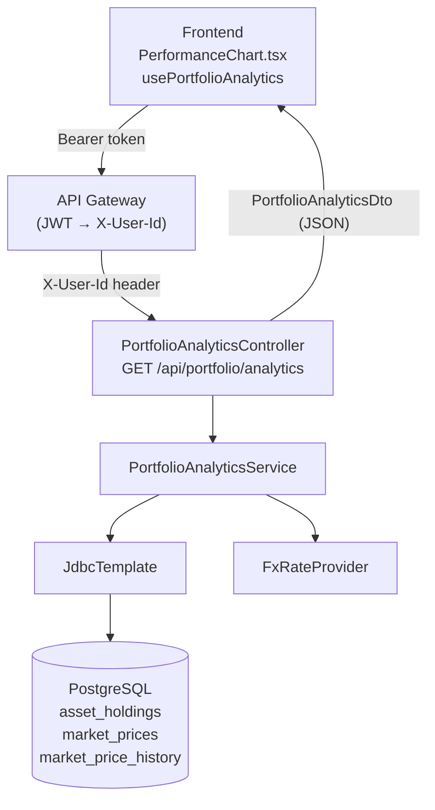
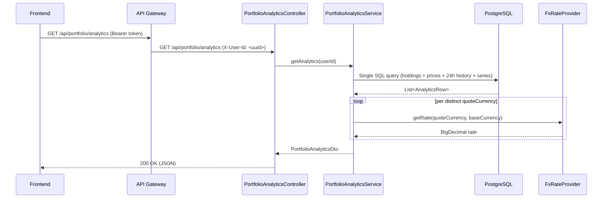

# Design Document: Portfolio Analytics API

## Overview

This feature adds a `GET /api/portfolio/analytics` endpoint to `portfolio-service` that returns a
unified analytics payload for the frontend dashboard. It computes best/worst performers (from real
24h price history), per-holding unrealized P&L, a historical performance series sourced from
`market_price_history`, and exposes all of this through a new `usePortfolioAnalytics` TanStack
Query hook on the frontend.

The design extends the existing `PortfolioService` / `JdbcTemplate` pattern already established
for `getSummary()`, avoids N+1 queries by using a single SQL aggregation, and respects the
hexagonal architecture guardrails (no AWS SDK in domain layer, FX conversion stays in the service
layer).

---

## Architecture



---

## Sequence Diagrams

### Analytics Request Flow



---

## Components and Interfaces

### PortfolioAnalyticsController

**Purpose**: Thin HTTP adapter. Extracts `X-User-Id`, delegates to service, returns DTO.

**Interface**:

```java
@RestController
@RequestMapping("/api/portfolio")
public class PortfolioAnalyticsController {
    @GetMapping("/analytics")
    ResponseEntity<PortfolioAnalyticsDto> getAnalytics(@RequestHeader("X-User-Id") String userId);
}
```

**Responsibilities**:

- Validate `X-User-Id` header is present (Spring handles 400 on missing required header)
- Delegate to `PortfolioAnalyticsService.getAnalytics(userId)`
- Return `200 OK` with the DTO; `404` propagated from `UserNotFoundException` via `GlobalExceptionHandler`

---

### PortfolioAnalyticsService

**Purpose**: Domain service that orchestrates the single SQL query, applies FX conversion, and
assembles the `PortfolioAnalyticsDto`.

**Interface**:

```java
@Service
public class PortfolioAnalyticsService {
    PortfolioAnalyticsDto getAnalytics(String userId);
}
```

**Responsibilities**:

- Validate user exists (reuse `requireUserExists` pattern from `PortfolioService`)
- Execute the analytics SQL query via `JdbcTemplate`
- Apply FX conversion to each holding's value using `FxRateProvider`
- Compute `unrealizedPnL` per holding (placeholder: `avgCostBasis = currentPrice`)
- Identify `bestPerformer` / `worstPerformer` by `change24hPercent`
- Aggregate `performanceSeries` from the history rows
- Return fully assembled `PortfolioAnalyticsDto`

---

## Data Models

### PortfolioAnalyticsDto (Java record — public DTO)

```java
package com.wealth.portfolio.dto;

import java.math.BigDecimal;
import java.util.List;

public record PortfolioAnalyticsDto(
    BigDecimal totalValue,
    BigDecimal totalCostBasis,
    BigDecimal totalUnrealizedPnL,
    BigDecimal totalUnrealizedPnLPercent,
    String baseCurrency,
    PerformerDto bestPerformer,
    PerformerDto worstPerformer,
    List<HoldingAnalyticsDto> holdings,
    List<PerformancePointDto> performanceSeries
) {

    public record PerformerDto(
        String ticker,
        BigDecimal change24hPercent
    ) {}

    public record HoldingAnalyticsDto(
        String ticker,
        BigDecimal quantity,
        BigDecimal currentPrice,
        BigDecimal currentValueBase,   // FX-converted to baseCurrency
        BigDecimal avgCostBasis,       // placeholder: equals currentPrice until trade ledger exists
        BigDecimal unrealizedPnL,      // currentValueBase - (quantity × avgCostBasis × fxRate)
        BigDecimal change24hAbsolute,  // currentPrice - price24hAgo (in quoteCurrency)
        BigDecimal change24hPercent,   // (change24hAbsolute / price24hAgo) × 100
        String quoteCurrency
    ) {}

    public record PerformancePointDto(
        String date,       // ISO-8601 date: "2024-03-01"
        BigDecimal value,  // total portfolio value on that date (baseCurrency)
        BigDecimal change  // day-over-day change in baseCurrency
    ) {}
}
```

**Validation Rules**:

- `totalValue >= 0`
- `bestPerformer.change24hPercent >= worstPerformer.change24hPercent`
- `performanceSeries` is ordered ascending by `date`
- `totalUnrealizedPnL = totalValue - totalCostBasis`
- `totalUnrealizedPnLPercent = (totalUnrealizedPnL / totalCostBasis) × 100` when `totalCostBasis > 0`, else `0`

### AnalyticsQueryRow (internal projection — not serialised)

```java
record AnalyticsQueryRow(
    String assetTicker,
    BigDecimal quantity,
    BigDecimal currentPrice,
    String quoteCurrency,
    BigDecimal price24hAgo,      // nullable — null if no history row exists
    String historyDate,          // "YYYY-MM-DD" from market_price_history.observed_at
    BigDecimal historyPrice      // price on historyDate
) {}
```

---

## SQL Aggregation Strategy

### Design Rationale

The existing `getSummary()` query joins `asset_holdings → portfolios → market_prices`. The
analytics query extends this with two additional joins against `market_price_history`:

1. **24h-ago price** — a lateral subquery (or `DISTINCT ON`) that picks the single history row
   closest to `now() - INTERVAL '24 hours'` per ticker.
2. **Full history series** — all history rows for the user's tickers within the last N days,
   returned as additional rows in the same result set and distinguished by a `row_type` column.

This keeps the round-trip count at **one query** regardless of the number of holdings.

### Primary Analytics Query

```sql
-- Returns two row types per ticker:
--   row_type = 'HOLDING'  → one row per holding with 24h-ago price
--   row_type = 'HISTORY'  → one row per (ticker, date) from market_price_history

WITH user_tickers AS (
    SELECT h.asset_ticker,
           h.quantity,
           COALESCE(mp.current_price, 0)      AS current_price,
           COALESCE(mp.quote_currency, 'USD') AS quote_currency
    FROM asset_holdings h
    JOIN portfolios p ON p.id = h.portfolio_id
    LEFT JOIN market_prices mp ON mp.ticker = h.asset_ticker
    WHERE p.user_id = ?                          -- param 1: userId
),
price_24h AS (
    -- Closest history row to exactly 24 hours ago, per ticker
    SELECT DISTINCT ON (mph.ticker)
           mph.ticker,
           mph.price AS price_24h_ago
    FROM market_price_history mph
    JOIN user_tickers ut ON ut.asset_ticker = mph.ticker
    WHERE mph.observed_at <= now() - INTERVAL '24 hours'
    ORDER BY mph.ticker, mph.observed_at DESC   -- index: idx_market_price_history_ticker_observed_at
)
-- Row type 1: current holding snapshot with 24h change
SELECT 'HOLDING'              AS row_type,
       ut.asset_ticker,
       ut.quantity,
       ut.current_price,
       ut.quote_currency,
       p24.price_24h_ago,
       NULL::DATE             AS history_date,
       NULL::NUMERIC          AS history_price
FROM user_tickers ut
LEFT JOIN price_24h p24 ON p24.ticker = ut.asset_ticker

UNION ALL

-- Row type 2: historical series for performance chart
SELECT 'HISTORY'              AS row_type,
       mph.ticker             AS asset_ticker,
       NULL::NUMERIC          AS quantity,
       NULL::NUMERIC          AS current_price,
       ut.quote_currency,
       NULL::NUMERIC          AS price_24h_ago,
       mph.observed_at::DATE  AS history_date,
       mph.price              AS history_price
FROM market_price_history mph
JOIN user_tickers ut ON ut.asset_ticker = mph.ticker
WHERE mph.observed_at >= now() - (? * INTERVAL '1 day')  -- param 2: periodDays (default 50)
ORDER BY row_type, asset_ticker, history_date;
```

**Index usage**: The `DISTINCT ON` in `price_24h` CTE uses
`idx_market_price_history_ticker_observed_at (ticker, observed_at)` — the existing index covers
this access pattern exactly. The history series join also benefits from the same index.

**Why not LAG()?** `LAG()` over the full history table would require a window over all tickers
before filtering to the user's holdings. The `DISTINCT ON` lateral approach is cheaper because it
filters to the user's tickers first via the CTE join, then seeks the single closest row per ticker
using the composite index.

---

## Service Layer Design

### PortfolioAnalyticsService — Algorithm

```pascal
PROCEDURE getAnalytics(userId: String): PortfolioAnalyticsDto
  INPUT: userId — authenticated user UUID
  OUTPUT: PortfolioAnalyticsDto

  SEQUENCE
    requireUserExists(userId)                          -- throws UserNotFoundException if absent
    baseCurrency ← fxProperties.baseCurrency()

    rows ← jdbcTemplate.query(ANALYTICS_SQL, userId, DEFAULT_PERIOD_DAYS)
    -- rows contains HOLDING rows and HISTORY rows interleaved

    holdingRows  ← rows WHERE row_type = 'HOLDING'
    historyRows  ← rows WHERE row_type = 'HISTORY'

    -- ── Per-holding computation ──────────────────────────────────────────────
    holdingDtos ← []
    FOR each row IN holdingRows DO
      rate ← IF row.quoteCurrency = baseCurrency
              THEN 1
              ELSE fxRateProvider.getRate(row.quoteCurrency, baseCurrency)

      currentValueBase ← row.quantity × row.currentPrice × rate

      -- Placeholder until trade ledger: avgCostBasis = currentPrice
      avgCostBasis     ← row.currentPrice
      costBasisBase    ← row.quantity × avgCostBasis × rate
      unrealizedPnL    ← currentValueBase - costBasisBase   -- always 0 with placeholder

      price24hAgo      ← row.price24hAgo ?? row.currentPrice  -- fallback if no history
      change24hAbs     ← row.currentPrice - price24hAgo
      change24hPct     ← IF price24hAgo > 0
                         THEN (change24hAbs / price24hAgo) × 100
                         ELSE 0

      holdingDtos.add(HoldingAnalyticsDto(
        ticker           = row.assetTicker,
        quantity         = row.quantity,
        currentPrice     = row.currentPrice,
        currentValueBase = currentValueBase,
        avgCostBasis     = avgCostBasis,
        unrealizedPnL    = unrealizedPnL,
        change24hAbsolute = change24hAbs,
        change24hPercent  = change24hPct,
        quoteCurrency    = row.quoteCurrency
      ))
    END FOR

    -- ── Aggregates ───────────────────────────────────────────────────────────
    totalValue      ← SUM(holdingDtos.currentValueBase)
    totalCostBasis  ← SUM(holdingDtos.quantity × holdingDtos.avgCostBasis × fxRate)
    totalPnL        ← totalValue - totalCostBasis
    totalPnLPct     ← IF totalCostBasis > 0 THEN (totalPnL / totalCostBasis) × 100 ELSE 0

    bestPerformer   ← holdingDtos.maxBy(change24hPercent)
    worstPerformer  ← holdingDtos.minBy(change24hPercent)

    -- ── Performance series ───────────────────────────────────────────────────
    -- Group history rows by date; for each date sum (quantity × historyPrice × fxRate)
    -- across all tickers to get total portfolio value on that date.
    seriesByDate ← GROUP historyRows BY history_date

    -- Local-profile resilience: if fewer than 7 distinct dates exist in the history,
    -- fall back to a synthetic 7-day random walk seeded from totalValue.
    -- This ensures PerformanceChart.tsx is never blank during local development.
    IF seriesByDate.distinctDates() < 7 THEN
      performanceSeries ← generateSyntheticSeries(totalValue, 7)
    ELSE
      performanceSeries ← []
      previousValue ← NULL

      FOR each date IN seriesByDate.keys() SORTED ASC DO
        dateValue ← 0
        FOR each histRow IN seriesByDate[date] DO
          holding ← holdingRows.find(ticker = histRow.assetTicker)
          IF holding IS NOT NULL THEN
            rate      ← fxRateProvider.getRate(histRow.quoteCurrency, baseCurrency)
            dateValue ← dateValue + (holding.quantity × histRow.historyPrice × rate)
          END IF
        END FOR

        change ← IF previousValue IS NULL THEN 0 ELSE dateValue - previousValue
        performanceSeries.add(PerformancePointDto(date, dateValue, change))
        previousValue ← dateValue
      END FOR
    END IF

    RETURN PortfolioAnalyticsDto(
      totalValue, totalCostBasis, totalPnL, totalPnLPct,
      baseCurrency, bestPerformer, worstPerformer,
      holdingDtos, performanceSeries
    )
  END SEQUENCE
END PROCEDURE
```

**Preconditions**:

- `userId` is a valid UUID present in the `users` table
- `fxRateProvider` is available and returns rates > 0

**Postconditions**:

- `bestPerformer.change24hPercent >= worstPerformer.change24hPercent`
- `performanceSeries` is non-null and ordered ascending by date
- `totalUnrealizedPnL = totalValue - totalCostBasis`
- All `HoldingAnalyticsDto.currentValueBase` values are in `baseCurrency`

**Loop Invariants**:

- Holding loop: `totalValue` accumulates only FX-converted values; all previously processed
  holdings have been converted to `baseCurrency`
- Series loop: `performanceSeries` contains one entry per processed date; entries are in
  ascending date order; `previousValue` always holds the value of the immediately preceding date

---

## Key Functions with Formal Specifications

### computeChange24h()

```java
BigDecimal computeChange24hPercent(BigDecimal currentPrice, BigDecimal price24hAgo)
```

**Preconditions**:

- `currentPrice != null && currentPrice.compareTo(BigDecimal.ZERO) >= 0`
- `price24hAgo != null && price24hAgo.compareTo(BigDecimal.ZERO) >= 0`

**Postconditions**:

- Returns `BigDecimal.ZERO` when `price24hAgo == 0` (avoids division by zero)
- Returns `((currentPrice - price24hAgo) / price24hAgo) × 100` otherwise, scaled to 4 decimal places

**Loop Invariants**: N/A (no loops)

---

### buildPerformanceSeries()

```java
List<PerformancePointDto> buildPerformanceSeries(
    List<AnalyticsQueryRow> historyRows,
    List<AnalyticsQueryRow> holdingRows,
    String baseCurrency,
    FxRateProvider fxRateProvider
)
```

**Preconditions**:

- `historyRows` is non-null (may be empty)
- `holdingRows` is non-null and non-empty
- All rows have non-null `historyDate` and `historyPrice`

**Postconditions**:

- Result list is sorted ascending by `date`
- `result.size() == distinct dates in historyRows`
- For each point: `change == value - previousValue` (first point has `change == 0`)

**Loop Invariants**:

- After processing date `d`, all dates `< d` are present in the result list
- `previousValue` equals the `value` of the last appended point

---

### generateSyntheticSeries()

```java
List<PerformancePointDto> generateSyntheticSeries(BigDecimal anchorValue, int days)
```

**Purpose**: Local-profile fallback. Produces a deterministic-looking 7-day random walk ending at `anchorValue` so `PerformanceChart.tsx` is never blank during local development.

**Preconditions**:

- `anchorValue != null && anchorValue.compareTo(BigDecimal.ZERO) >= 0`
- `days >= 1`

**Postconditions**:

- Returns a list of exactly `days` `PerformancePointDto` entries
- Last entry's `value == anchorValue`
- Entries are ordered ascending by date (today − (days−1) … today)
- `points[0].change == 0`
- `∀ i >= 1: points[i].change == points[i].value - points[i-1].value`

**Algorithm**: Start at `anchorValue × 0.92`, apply a small deterministic drift + sine wave per day (same formula as the existing frontend `buildPerformanceSeries`), pin the final point to `anchorValue`.

**Loop Invariants**: After processing day `d`, the list contains exactly `d` entries ordered ascending by date.

---

### Backend — Controller call

```java
// GET /api/portfolio/analytics
// Header: X-User-Id: 550e8400-e29b-41d4-a716-446655440000

PortfolioAnalyticsDto dto = analyticsService.getAnalytics("550e8400-e29b-41d4-a716-446655440000");
// dto.bestPerformer().change24hPercent() >= dto.worstPerformer().change24hPercent()
// dto.performanceSeries() is sorted ascending by date
// dto.totalUnrealizedPnL() == dto.totalValue() - dto.totalCostBasis()
```

### Frontend — API function

```typescript
// frontend/src/lib/api/portfolio.ts

export interface PortfolioAnalyticsDTO {
  totalValue: number;
  totalCostBasis: number;
  totalUnrealizedPnL: number;
  totalUnrealizedPnLPercent: number;
  baseCurrency: string;
  bestPerformer: { ticker: string; change24hPercent: number };
  worstPerformer: { ticker: string; change24hPercent: number };
  holdings: HoldingAnalyticsDTO[];
  performanceSeries: PerformanceDataPoint[]; // reuses existing PerformanceDataPoint type
}

export interface HoldingAnalyticsDTO {
  ticker: string;
  quantity: number;
  currentPrice: number;
  currentValueBase: number;
  avgCostBasis: number;
  unrealizedPnL: number;
  change24hAbsolute: number;
  change24hPercent: number;
  quoteCurrency: string;
}

export async function fetchPortfolioAnalytics(
  token: string,
): Promise<PortfolioAnalyticsDTO> {
  return fetchWithAuthClient<PortfolioAnalyticsDTO>(
    "/api/portfolio/analytics",
    token,
  );
}
```

### Frontend — TanStack Query hook

```typescript
// frontend/src/lib/hooks/usePortfolio.ts  (additions)

export const portfolioKeys = {
  // ... existing keys ...
  analytics: (userId: string) => ["portfolio", userId, "analytics"] as const,
};

export function usePortfolioAnalytics() {
  const { userId, token, status } = useAuthenticatedUserId();
  return useQuery({
    queryKey: portfolioKeys.analytics(userId),
    queryFn: () => fetchPortfolioAnalytics(token),
    enabled: status === "authenticated",
    staleTime: 30_000,
    refetchInterval: 60_000,
  });
}
```

### Frontend — Replacing TODO placeholders

`fetchPortfolio()` in `portfolio.ts` currently synthesises `change24hPercent`, `unrealizedPnL`,
`bestPerformer`, `worstPerformer`, and `performanceSeries` with placeholder values. Once
`fetchPortfolioAnalytics` is available, the dashboard components that consume those fields should
be migrated to call `usePortfolioAnalytics()` instead. The existing `fetchPortfolio` function
remains for the holdings table (quantity, allocation weight) and is not removed.

Specifically:

- `PerformanceChart.tsx` → switch data source from `usePortfolioPerformance` to
  `usePortfolioAnalytics().data?.performanceSeries`
- Summary cards showing `bestPerformer` / `worstPerformer` → switch to
  `usePortfolioAnalytics().data?.bestPerformer` / `.worstPerformer`
- `unrealizedPnL` on `AssetHoldingDTO` → populated from `usePortfolioAnalytics().data?.holdings`
  matched by ticker

---

## Error Handling

### Missing X-User-Id Header

**Condition**: Request arrives without `X-User-Id` header (bypassed gateway, misconfiguration)
**Response**: Spring MVC returns `400 Bad Request` automatically for `@RequestHeader` with no default
**Recovery**: No recovery needed; this is a gateway misconfiguration

### User Not Found

**Condition**: `userId` from header does not exist in `users` table
**Response**: `UserNotFoundException` thrown by service → `GlobalExceptionHandler` maps to `404 Not Found`
**Recovery**: Client should re-authenticate; the JWT may reference a deleted user

### No Holdings

**Condition**: User exists but has no portfolios or holdings
**Response**: `200 OK` with `totalValue = 0`, empty `holdings` list, empty `performanceSeries`,
`bestPerformer` and `worstPerformer` set to a sentinel `PerformerDto("N/A", BigDecimal.ZERO)`
**Recovery**: N/A — valid empty state

### No Price History

**Condition**: A holding's ticker has no rows in `market_price_history` within the period
**Response**: `price24hAgo` falls back to `currentPrice` (change = 0%); history series omits that
ticker's contribution for dates where no row exists
**Recovery**: Graceful degradation — the endpoint still returns data for tickers that do have history

### FX Rate Unavailable

**Condition**: `FxRateProvider.getRate()` throws `FxRateUnavailableException`
**Response**: Propagated as `500 Internal Server Error` via `GlobalExceptionHandler`
**Recovery**: Retry logic is the responsibility of the `FxRateProvider` implementation; the
analytics service does not swallow this exception

---

## Testing Strategy

### Unit Testing

Key unit test cases for `PortfolioAnalyticsService`:

- Single holding, same currency as base → no FX call, values pass through unchanged
- Single holding, foreign currency → FX rate applied correctly to `currentValueBase`
- `bestPerformer.change24hPercent >= worstPerformer.change24hPercent` for any non-empty holdings list
- `totalUnrealizedPnL == totalValue - totalCostBasis` (always 0 with placeholder cost basis)
- Empty holdings → sentinel performers, empty series, zero totals
- Missing `price24hAgo` (null from query) → `change24hPercent == 0`, no NPE
- `performanceSeries` is sorted ascending by date
- `performanceSeries[0].change == 0` (first point has no previous)

### Property-Based Testing

**Library**: Standard JUnit 5 `@ParameterizedTest` with `@MethodSource` — no additional dependencies required.

**Property 1 — Performer ordering invariant**:

```
∀ non-empty holdings list H:
  bestPerformer(H).change24hPercent >= worstPerformer(H).change24hPercent
```

Implemented as `@ParameterizedTest @MethodSource` supplying multiple `List<HoldingAnalyticsDto>` inputs (single holding, two holdings with equal change, two with different change, many holdings with random order).

**Property 2 — P&L identity**:

```
∀ analytics result A:
  A.totalUnrealizedPnL == A.totalValue - A.totalCostBasis
```

Implemented with `@MethodSource` supplying varied `(totalValue, totalCostBasis)` pairs including zero, positive, and negative cost basis scenarios.

**Property 3 — Value decomposition**:

```
∀ analytics result A with non-empty holdings:
  A.totalValue == Σ(holding.currentValueBase) for all holdings in A.holdings
```

Implemented with `@MethodSource` supplying lists of holdings with varying quantities, prices, and FX rates.

**Property 4 — Performance series ordering**:

```
∀ performanceSeries S with |S| >= 2:
  ∀ i ∈ [1, |S|-1]: S[i].date > S[i-1].date
```

Implemented with `@MethodSource` supplying pre-built series lists (already sorted, reverse-sorted, single element, 50 elements).

**Property 5 — Performance series change consistency**:

```
∀ performanceSeries S with |S| >= 2:
  ∀ i ∈ [1, |S|-1]: S[i].change == S[i].value - S[i-1].value
```

Implemented with `@MethodSource` supplying series with known value sequences to assert change arithmetic.

**Property 6 — 24h change formula**:

```
∀ holding h where h.price24hAgo > 0:
  h.change24hPercent == (h.change24hAbsolute / h.price24hAgo) × 100
```

Implemented with `@MethodSource` supplying `(currentPrice, price24hAgo)` pairs including edge cases: equal prices (0%), price doubled (100%), price halved (-50%), price24hAgo = 0 (returns 0, no division).

### Integration Testing

- `@Tag("integration")` test using Testcontainers (PostgreSQL) with seeded `V2__Seed_Market_Data.sql`
  data verifying the full SQL query returns correct `HOLDING` and `HISTORY` rows
- End-to-end: seed a user + portfolio + holdings, call `GET /api/portfolio/analytics`, assert
  `bestPerformer.change24hPercent >= worstPerformer.change24hPercent` and
  `performanceSeries.size() == 50` (matching the 50-day seed)
- FX conversion integration: seed a holding with `quote_currency = 'EUR'`, assert
  `currentValueBase` differs from raw `currentPrice × quantity`

---

## Performance Considerations

### Single-Query Join Strategy

The analytics query uses a single SQL round-trip via a CTE + `UNION ALL` pattern:

- The `user_tickers` CTE filters holdings to the authenticated user first, limiting the scope of
  all subsequent joins to only the relevant tickers
- `DISTINCT ON (ticker) ORDER BY ticker, observed_at DESC` in `price_24h` CTE uses the existing
  `idx_market_price_history_ticker_observed_at` index for an efficient index scan per ticker
- The history series join also benefits from the same index with a range predicate on `observed_at`

### Index Coverage

| Access Pattern            | Index Used                                                           |
| ------------------------- | -------------------------------------------------------------------- |
| 24h-ago price lookup      | `idx_market_price_history_ticker_observed_at`                        |
| History series range scan | `idx_market_price_history_ticker_observed_at`                        |
| Holdings by user          | `portfolios.user_id` (add index if not present — see migration note) |
| Current price lookup      | `market_prices.ticker` (PRIMARY KEY)                                 |

A `V6` Flyway migration should add `CREATE INDEX IF NOT EXISTS idx_portfolios_user_id ON portfolios(user_id)` if not already present, to avoid a sequential scan on `portfolios` for the CTE filter.

### Caching Notes

The analytics endpoint is read-heavy and relatively expensive (multi-table join + FX calls). Two
caching strategies are appropriate depending on profile:

- **Local profile**: Spring `@Cacheable` with Caffeine (in-memory, TTL 30s) — no additional
  infrastructure required
- **AWS profile**: Spring Cache backed by ElastiCache (Redis) with the same TTL — consistent with
  the existing Redis usage in `api-gateway`

Cache key: `"portfolio-analytics:" + userId`. Invalidation: TTL-based only (no event-driven
invalidation needed at this stage, since price updates arrive via Kafka and the 30s TTL is
acceptable for the dashboard refresh rate).

Caching must be profile-aware (Caffeine local, Redis AWS) to satisfy the architectural guardrail
that Redis is approved for local dev only and must be swappable via config.

---

## Security Considerations

- User identity comes exclusively from the `X-User-Id` header injected by the API Gateway JWT
  filter — the endpoint never accepts a `userId` query parameter
- The SQL query always scopes to `WHERE p.user_id = ?` — no cross-user data leakage is possible
- No sensitive data (cost basis, P&L) is logged; only ticker symbols and aggregate values appear
  in debug logs

---

## Dependencies

| Dependency                     | Already Present | Notes                                                                                        |
| ------------------------------ | --------------- | -------------------------------------------------------------------------------------------- |
| `spring-boot-starter-jdbc`     | Yes             | `JdbcTemplate` used in `PortfolioService`                                                    |
| `spring-boot-starter-data-jpa` | Yes             | `PortfolioRepository`, `UserRepository`                                                      |
| `FxRateProvider`               | Yes             | Domain port, injected in `PortfolioService`                                                  |
| `FxProperties`                 | Yes             | `baseCurrency()` used in `PortfolioService`                                                  |
| `UserRepository`               | Yes             | For `requireUserExists` guard                                                                |
| JUnit 5 `@ParameterizedTest`   | Yes             | PBT via `@MethodSource` — no additional dependency needed                                    |
| Caffeine cache                 | No              | Add `spring-boot-starter-cache` + `com.github.ben-manes.caffeine:caffeine` for local caching |
| `@tanstack/react-query` v5     | Yes             | Already used in `usePortfolio.ts`                                                            |

---

## Correctness Properties

_A property is a characteristic or behavior that should hold true across all valid executions of a
system — essentially, a formal statement about what the system should do. Properties serve as the
bridge between human-readable specifications and machine-verifiable correctness guarantees._

### Property 1: Performer Ordering Invariant

_For any_ non-empty list of `HoldingAnalyticsDto` values, the `bestPerformer` selected by
`PortfolioAnalyticsService` must have a `change24hPercent` greater than or equal to the
`worstPerformer`'s `change24hPercent`.

**Validates: Requirements 5.3**

---

### Property 2: P&L Identity

_For any_ `PortfolioAnalyticsDto` result, `totalUnrealizedPnL` must equal `totalValue` minus
`totalCostBasis`, and when `totalCostBasis > 0`, `totalUnrealizedPnLPercent` must equal
`(totalUnrealizedPnL / totalCostBasis) × 100`.

**Validates: Requirements 4.2, 4.3**

---

### Property 3: Value Decomposition

_For any_ non-empty list of holdings, the `totalValue` in `PortfolioAnalyticsDto` must equal the
sum of all `HoldingAnalyticsDto.currentValueBase` values, where each `currentValueBase` has been
FX-converted to `baseCurrency`.

**Validates: Requirements 3.1, 4.1**

---

### Property 4: Performance Series Ordering

_For any_ `performanceSeries` list with two or more entries, every entry at index `i` must have a
`date` strictly greater than the entry at index `i − 1`.

**Validates: Requirements 7.1**

---

### Property 5: Performance Series Change Consistency

_For any_ `performanceSeries` list, the first entry's `change` must be zero, and for every
subsequent entry at index `i`, `change` must equal `value[i] − value[i−1]`.

**Validates: Requirements 7.2, 7.3**

---

### Property 6: 24h Change Formula

_For any_ holding where `price24hAgo > 0`, `change24hPercent` must equal
`((currentPrice − price24hAgo) / price24hAgo) × 100` scaled to 4 decimal places, and
`change24hAbsolute` must equal `currentPrice − price24hAgo`.

**Validates: Requirements 6.1, 6.2**

---

### Property 7: Synthetic Series Anchor and Length

_For any_ call to `generateSyntheticSeries(anchorValue, days)` where `days >= 1`, the returned
list must contain exactly `days` entries, the last entry's `value` must equal `anchorValue`, and
entries must be ordered ascending by date spanning `today − (days − 1)` through `today`.

**Validates: Requirements 8.1, 8.2, 8.3**
