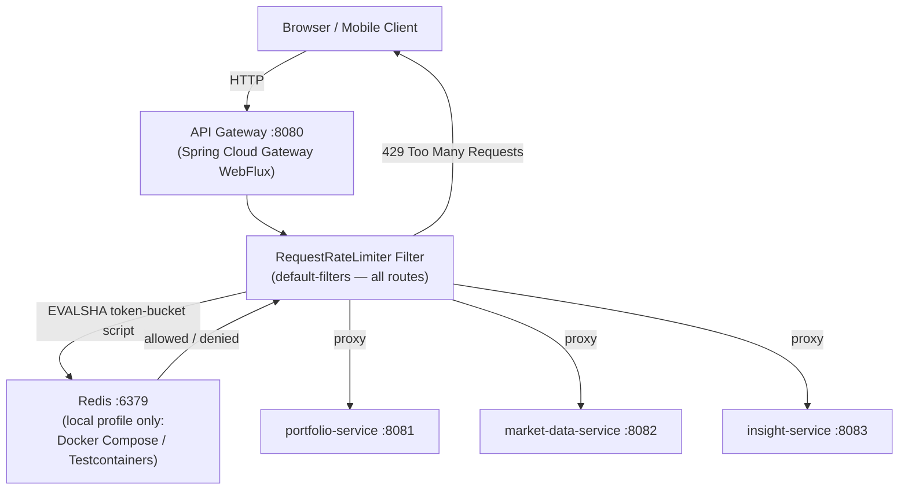
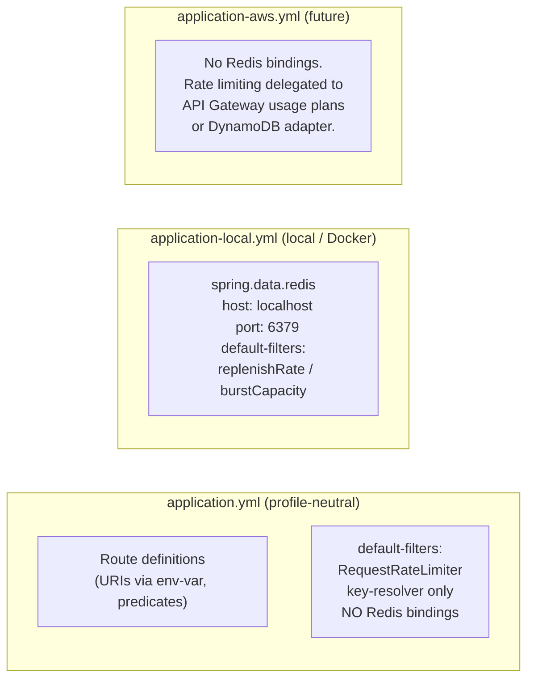
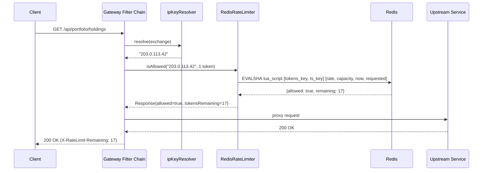
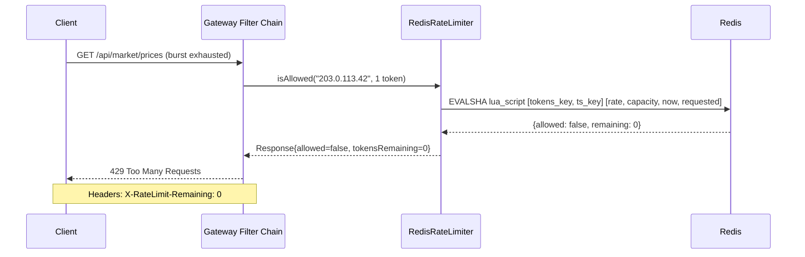

# Design Document: Redis-Backed Distributed Rate Limiting for API Gateway

## Overview

Replace the current partial, per-route `RequestRateLimiter` on `market-data-service` in
`api-gateway` with a fully distributed, Redis-backed filter applied globally via `default-filters`
to all active routes. The implementation uses Spring Cloud Gateway's built-in `RedisRateLimiter`
exclusively — no custom Redis client code. All Redis connection details are isolated to
`application-local.yml` only; `application.yml` carries zero Redis bindings (not even env-var
placeholders). The abstraction is swappable via Spring profile so AWS deployments can substitute
API Gateway usage plans or DynamoDB without touching application code.

The change addresses the TODO at `api-gateway/.../RequestRateLimitFilter.java:81` and enforces the
profile-isolation guardrail in `docs/architecture/CoreArchitecturalGuardrails_v2.md §5`.

**Scope boundary**: changes are confined to the `api-gateway` module. AWS CDK scripts,
infrastructure folders, and frontend code are not touched.

---

## Architecture



### Profile Strategy



**Critical rule**: `spring.data.redis.*` must not appear in `application.yml` in any form —
including env-var placeholders like `${SPRING_DATA_REDIS_HOST:localhost}`. The current file
contains such bindings; they must be removed entirely and placed only in `application-local.yml`.

---

## Components and Interfaces

### Component 1: `GatewayRateLimitConfig` (existing, no structural change)

**Purpose**: Provides the `KeyResolver` bean used by `RequestRateLimiter` to derive the
rate-limit key per request.

**Interface** (existing bean, unchanged):

```java
@Bean
KeyResolver ipKeyResolver();
```

**Responsibilities**:

- Extract client IP from `X-Forwarded-For` header (first entry) when present.
- Fall back to `RemoteAddress` host string.
- Return `"anonymous"` as a safe default when neither is available.
- Must remain a plain `@Configuration` class — no Redis imports, no `@Profile` annotation,
  no eager initialization of heavy resources (cold-start guardrail).

---

### Component 2: `RedisRateLimiter` (Spring Cloud Gateway built-in)

**Purpose**: Token-bucket rate limiter backed by a Lua script executed atomically in Redis.
Registered automatically by Spring Cloud Gateway when `spring-boot-starter-data-redis-reactive`
is on the classpath and a `RequestRateLimiter` filter is configured.

**Key parameters** (configured in YAML only — no Java code):

| Parameter                            | Description                                    |
| ------------------------------------ | ---------------------------------------------- |
| `redis-rate-limiter.replenishRate`   | Tokens added per second (sustained throughput) |
| `redis-rate-limiter.burstCapacity`   | Maximum tokens in bucket (peak burst)          |
| `redis-rate-limiter.requestedTokens` | Tokens consumed per request (default: 1)       |
| `key-resolver`                       | SpEL reference to the `KeyResolver` bean       |

---

### Component 3: YAML Configuration (restructured)

**Purpose**: Move `RequestRateLimiter` to `default-filters` (global) and strictly isolate all
Redis connection properties to `application-local.yml`.

**`application.yml` after change**:

- Route definitions (URIs via env-var placeholders, predicates) — unchanged.
- `spring.data.redis.*` block removed entirely (no env-var form either).
- Per-route `RequestRateLimiter` filter on `market-data-service` removed.
- **No `default-filters` block** — any `RequestRateLimiter` reference in `application.yml` would
  trigger Spring Boot's Redis autoconfiguration on startup in AWS, crashing the app because no
  Redis is available. Rate limiting config must not exist in this file at all.

**`application-local.yml` (new file)**:

- `spring.data.redis.host: localhost` and `spring.data.redis.port: 6379`.
- The complete `default-filters` block with `RequestRateLimiter` including `key-resolver` SpEL ref
  and all numeric params (`replenishRate`, `burstCapacity`, `requestedTokens`).
- This is the **only** file that contains any rate-limiting or Redis configuration.

---

### Component 4: `RateLimitingIntegrationTest` (new)

**Purpose**: JUnit 5 integration test that spins up a real Redis instance via Testcontainers,
starts the gateway application context with the `local` profile, and asserts that repeated
requests from the same IP are throttled with HTTP 429 after burst capacity is exhausted.

**Responsibilities**:

- Annotated `@Tag("integration")` — runs under `integrationTest` Gradle task only, not `test`.
- Uses `@Testcontainers` + `@Container` for lifecycle management.
- Overrides `spring.data.redis.host` / `port` via `@DynamicPropertySource`.
- Uses `WebTestClient` (reactive) for request assertions.
- JVM timezone set to `Asia/Kolkata` via `build.gradle` `jvmArgs` (project convention).

---

## Data Models

### Rate-Limit Token Bucket (Redis keys)

Spring Cloud Gateway's built-in Lua script manages two Redis keys per resolved key:

```
request_rate_limiter.{resolvedKey}.tokens     → current token count (String, integer)
request_rate_limiter.{resolvedKey}.timestamp  → last refill timestamp (String, epoch seconds)
```

**Example** for IP `192.168.1.10`:

```
request_rate_limiter.192.168.1.10.tokens     = "18"
request_rate_limiter.192.168.1.10.timestamp  = "1712500800"
```

Keys have a TTL set automatically by the Lua script (`2 × burstCapacity / replenishRate` seconds).

### `KeyResolver` contract

```java
// Functional interface — one method
Mono<String> resolve(ServerWebExchange exchange);
// Returns: non-null, non-empty string used as Redis key suffix
// "anonymous" is the safe fallback — still rate-limited as a shared bucket
```

---

## Sequence Diagrams

### Happy Path — Request Allowed



### Rate Limit Exceeded — 429 Response



---

## Algorithmic Pseudocode

### Token Bucket Evaluation (Redis Lua — conceptual)

Executed atomically inside Redis by Spring Cloud Gateway's built-in script. Shown as structured
pseudocode for design clarity; the actual Lua is owned by the framework.

```pascal
ALGORITHM evaluateTokenBucket(tokensKey, timestampKey, rate, capacity, now, requested)
INPUT:
  tokensKey    : Redis key for current token count
  timestampKey : Redis key for last refill timestamp
  rate         : tokens replenished per second (replenishRate)
  capacity     : maximum tokens in bucket (burstCapacity)
  now          : current epoch time in seconds
  requested    : tokens required by this request (default 1)
OUTPUT:
  allowed      : boolean
  newTokens    : integer (remaining tokens after this request)

BEGIN
  lastTokens    ← GET tokensKey   (default: capacity if key missing)
  lastRefill    ← GET timestampKey (default: now if key missing)

  delta         ← MAX(0, now - lastRefill)
  filledTokens  ← MIN(capacity, lastTokens + (delta × rate))
  newTokens     ← filledTokens - requested

  IF newTokens >= 0 THEN
    SET tokensKey    ← newTokens    WITH TTL = 2 × (capacity / rate) seconds
    SET timestampKey ← now          WITH TTL = 2 × (capacity / rate) seconds
    RETURN (allowed=true,  newTokens=newTokens)
  ELSE
    SET tokensKey    ← filledTokens  WITH TTL unchanged
    SET timestampKey ← now           WITH TTL unchanged
    RETURN (allowed=false, newTokens=MAX(0, filledTokens))
  END IF
END
```

**Preconditions:**

- `rate > 0` and `capacity >= rate`
- `requested >= 1`
- Redis connection is available; if unavailable, gateway fails open (allow) to avoid cascading outage

**Postconditions:**

- Token count in Redis is always in range `[0, capacity]`
- `allowed = true` implies `newTokens >= 0`
- `allowed = false` implies the bucket did not have enough tokens; count is not decremented

**Loop Invariants:** N/A (single atomic operation)

---

### IP Key Resolution

```pascal
ALGORITHM resolveClientIp(exchange)
INPUT:  exchange : ServerWebExchange
OUTPUT: ip       : String (non-null, non-empty)

BEGIN
  forwardedFor ← exchange.request.headers["X-Forwarded-For"]

  IF forwardedFor IS NOT NULL AND forwardedFor IS NOT BLANK THEN
    comma ← INDEX_OF(forwardedFor, ',')
    IF comma >= 0 THEN
      RETURN TRIM(SUBSTRING(forwardedFor, 0, comma))
    ELSE
      RETURN TRIM(forwardedFor)
    END IF
  END IF

  remoteAddr ← exchange.request.remoteAddress
  IF remoteAddr IS NOT NULL AND remoteAddr.address IS NOT NULL THEN
    RETURN remoteAddr.address.hostAddress
  END IF

  RETURN "anonymous"
END
```

**Preconditions:**

- `exchange` is non-null with a valid request object

**Postconditions:**

- Returns a non-null, non-empty string
- Returns the leftmost (client-originating) IP when `X-Forwarded-For` contains a chain
- Returns `"anonymous"` only when no address information is available

---

## Key Functions with Formal Specifications

### `GatewayRateLimitConfig.ipKeyResolver()`

```java
@Bean
KeyResolver ipKeyResolver()
```

**Preconditions:**

- Spring application context is active
- No other `KeyResolver` bean named `ipKeyResolver` exists in context
- Class carries no `@Profile` annotation — must be unconditionally registered

**Postconditions:**

- Returns a singleton `KeyResolver` bean
- `resolve(exchange)` always returns a non-empty `Mono<String>`
- `resolve(exchange)` never returns `Mono.empty()` or `Mono.error(...)` for well-formed exchanges

---

### `RateLimitingIntegrationTest` — key test methods

```java
// Application context starts with Testcontainers Redis and local profile
void contextLoadsWithRedis()

// First N requests (N ≤ burstCapacity) are proxied — non-429
void requestsWithinBurstAreAllowed()

// (burstCapacity + 1) rapid requests from same IP yields at least one 429
void requestsExceedingBurstAreThrottled()

// IP-B bucket is independent — not throttled after IP-A exhausts its bucket
void differentIpsHaveIndependentBuckets()

// X-RateLimit-Remaining header is present on allowed responses
void rateLimitHeadersPresent()
```

**Preconditions for each test:**

- Testcontainers Redis container is running and healthy
- `spring.data.redis.host` / `port` overridden via `@DynamicPropertySource`
- Application context loaded with `local` Spring profile active

**Postconditions:**

- `requestsExceedingBurstAreThrottled`: at least one response has status `429`
- `differentIpsHaveIndependentBuckets`: IP-B requests succeed even after IP-A is throttled

---

## Configuration Structure

### `application.yml` (after change — profile-neutral)

The entire `spring.data.redis` block is removed. The per-route `RequestRateLimiter` filter on
`market-data-service` is removed. **No `default-filters` block is added** — any `RequestRateLimiter`
reference here would cause Spring Boot to auto-configure a Redis connection on startup, which
crashes AWS deployments where no Redis is present.

```yaml
spring:
  application:
    name: api-gateway
  # spring.data.redis.* removed entirely
  # No default-filters here — rate limiting lives only in application-local.yml

  cloud:
    gateway:
      server:
        webflux:
          routes:
            - id: portfolio-service
              uri: ${PORTFOLIO_SERVICE_URL:http://localhost:8081}
              predicates:
                - Path=/api/portfolio/**
            - id: market-data-service
              uri: ${MARKET_DATA_SERVICE_URL:http://localhost:8082}
              predicates:
                - Path=/api/market/**
              # per-route RequestRateLimiter filter removed
            - id: insight-service
              uri: ${INSIGHT_SERVICE_URL:http://localhost:8083}
              predicates:
                - Path=/api/insight/**

server:
  port: 8080

management:
  endpoints:
    web:
      exposure:
        include: "*"
```

### `application-local.yml` (new file)

Activated when `SPRING_PROFILES_ACTIVE=local` (set in Docker Compose `environment` block and
local IDE run configurations). Contains all Redis connection details and the complete
`default-filters` args block with numeric rate-limiter parameters.

```yaml
spring:
  data:
    redis:
      host: localhost
      port: 6379
  cloud:
    gateway:
      server:
        webflux:
          default-filters:
            - name: RequestRateLimiter
              args:
                key-resolver: "#{@ipKeyResolver}"
                redis-rate-limiter.replenishRate: 20
                redis-rate-limiter.burstCapacity: 40
                redis-rate-limiter.requestedTokens: 1
```

> The full `default-filters` args block is restated here (not just the numeric params) because
> Spring Cloud Gateway replaces list entries by filter name when a profile overlay is active.
> Omitting `key-resolver` from the overlay would cause a `BeanCreationException` at startup.

### `build.gradle` additions (api-gateway)

```groovy
dependencies {
    // existing entries unchanged ...
    testImplementation 'org.testcontainers:testcontainers'
    testImplementation 'org.testcontainers:junit-jupiter'
    testImplementation 'org.testcontainers:redis'
    // net.jqwik:jqwik NOT added — key-resolver cases covered by @ParameterizedTest/@CsvSource
}
```

---

## Error Handling

### Scenario 1: Redis Unavailable at Startup

**Condition**: Redis is not reachable when the gateway starts (e.g., Docker not running, wrong port).

**Response**: Spring Boot's health indicator marks Redis as DOWN. The `RequestRateLimiter` filter
fails open by default in Spring Cloud Gateway — requests are proxied without rate limiting rather
than rejected. This prevents a Redis outage from taking down the gateway.

**Recovery**: Redis reconnects automatically via Lettuce's reactive connection pool. No restart
required.

### Scenario 2: Redis Unavailable Mid-Request

**Condition**: Redis becomes unreachable after startup during a live request.

**Response**: `RedisRateLimiter.isAllowed()` returns a fallback `Response` with `allowed=true` and
`tokensRemaining=-1`. The request is proxied. A `WARN` log is emitted by the framework.

**Recovery**: Lettuce reconnects in the background. Subsequent requests resume normal limiting.

### Scenario 3: Missing `key-resolver` Bean

**Condition**: `ipKeyResolver` bean is absent from context (e.g., `GatewayRateLimitConfig`
accidentally annotated with `@Profile`).

**Response**: Application context fails to start with a `BeanCreationException` — SpEL expression
`#{@ipKeyResolver}` cannot be resolved.

**Recovery**: `GatewayRateLimitConfig` must carry no `@Profile` annotation and must remain
unconditionally registered in all profiles.

### Scenario 4: `anonymous` Key Saturation

**Condition**: Many clients with no resolvable IP all share the `"anonymous"` bucket.

**Response**: Legitimate clients behind broken proxies may be throttled collectively.

**Recovery**: Acceptable trade-off for the current phase. Future mitigation: add a secondary
resolver (e.g., authenticated user ID from JWT) as a higher-priority key.

### Scenario 5: Profile Not Activated (Redis params missing)

**Condition**: Gateway starts without `local` profile active and no `application-aws.yml` provides
rate-limiter params.

**Response**: `RequestRateLimiter` filter is declared in `default-filters` but `replenishRate` and
`burstCapacity` default to `1` (Spring Cloud Gateway built-in default). Requests are not blocked
but throughput is severely restricted.

**Recovery**: Ensure `SPRING_PROFILES_ACTIVE=local` is set in Docker Compose and IDE run configs.
For AWS, provide `application-aws.yml` with appropriate rate-limiting strategy before deploying.

---

## Testing Strategy

### Unit Testing

`GatewayRateLimitConfig` is a pure Spring `@Configuration` with no external dependencies. Unit
tests load a minimal context and assert:

- `ipKeyResolver` bean is present and non-null.
- `resolve()` returns the first IP from a multi-value `X-Forwarded-For` header.
- `resolve()` falls back to remote address when header is absent.
- `resolve()` returns `"anonymous"` when both sources are null.

No Redis required for unit tests.

### Property-Based Testing

**Library**: `net.jqwik:jqwik` (JUnit 5 compatible, added to `testImplementation`).

**Properties to verify for `resolveClientIp`**:

- For any non-blank `X-Forwarded-For` value, the resolved key is the trimmed first segment before
  the first comma — never empty, never contains a comma.
- For any valid IPv4/IPv6 string as remote address, the resolved key equals that string exactly.
- The resolved key is always non-null and non-empty regardless of input combination.

### Integration Testing (`@Tag("integration")`)

**Class**: `RateLimitingIntegrationTest`

**Infrastructure**: `GenericContainer("redis:7-alpine")` via Testcontainers (official
`org.testcontainers:redis` module).

**Profile**: `@ActiveProfiles("local")` — ensures `application-local.yml` is loaded.

**Test cases**:

| Test                                 | Assertion                                                         |
| ------------------------------------ | ----------------------------------------------------------------- |
| `contextLoadsWithRedis`              | Application context starts successfully with Testcontainers Redis |
| `requestsWithinBurstAreAllowed`      | First N requests (N ≤ burstCapacity) return non-429               |
| `requestsExceedingBurstAreThrottled` | Request N+1 returns 429                                           |
| `differentIpsHaveIndependentBuckets` | IP-B not throttled after IP-A exhausts its bucket                 |
| `rateLimitHeadersPresent`            | `X-RateLimit-Remaining` header present on allowed responses       |

**JVM flag**: `-Duser.timezone=Asia/Kolkata` applied via `build.gradle` `integrationTest` task
`jvmArgs` (project-wide convention).

### Architecture Testing

Manual review (ArchUnit optional):

- `GatewayRateLimitConfig` must not import any `software.amazon.awssdk.*` class.
- No class in `com.wealth.gateway` may import `io.lettuce.*` directly (framework abstraction rule).
- `application.yml` must not contain `localhost`, `6379`, or any `spring.data.redis.*` key.

---

## Performance Considerations

- The Redis Lua script executes atomically in O(1) — no performance concern at gateway throughput.
- Lettuce (reactive Redis client bundled with Spring Data Redis) uses a single shared connection
  by default; connection pooling is not required for this use case.
- Token bucket TTL is auto-managed by the Lua script; no manual key expiry needed.
- At 20 req/s replenish rate, Redis memory per tracked IP ≈ 2 keys × ~50 bytes = ~100 bytes.
  10,000 concurrent IPs ≈ 1 MB — negligible.
- `GatewayRateLimitConfig` must not perform heavy eager initialization at startup — aligns with
  cold-start mitigation requirements for future Lambda/SnapStart deployments (guardrail §5).

---

## Security Considerations

- `X-Forwarded-For` spoofing: a client can inject a fake IP to bypass per-IP limits. Mitigation
  for a later phase: configure a trusted proxy list and strip untrusted `X-Forwarded-For` headers
  at the load balancer / ingress layer before they reach the gateway.
- The `"anonymous"` shared bucket is a denial-of-service vector if many clients lack a resolvable
  IP. Acceptable for local dev; revisit before production.
- Redis is not exposed outside the Docker network in local dev. In AWS, ElastiCache is VPC-private
  (if used); otherwise rate limiting is delegated to API Gateway usage plans with no Redis exposure.

---

## Dependencies

| Dependency                                    | Scope                | Already Present |
| --------------------------------------------- | -------------------- | --------------- |
| `spring-boot-starter-data-redis-reactive`     | `implementation`     | Yes             |
| `spring-cloud-starter-gateway-server-webflux` | `implementation`     | Yes             |
| `org.testcontainers:testcontainers`           | `testImplementation` | No — add        |
| `org.testcontainers:junit-jupiter`            | `testImplementation` | No — add        |
| `org.testcontainers:redis`                    | `testImplementation` | No — add        |
| `net.jqwik:jqwik`                             | `testImplementation` | No — add        |

Spring Boot's dependency management (`spring-boot-dependencies` BOM) controls Testcontainers and
Lettuce versions. `jqwik` version should be pinned in the root `build.gradle` dependency
management block if not already present.

---

## Correctness Properties

_A property is a characteristic or behavior that should hold true across all valid executions of a system — essentially, a formal statement about what the system should do. Properties serve as the bridge between human-readable specifications and machine-verifiable correctness guarantees._

### Property 1: X-Forwarded-For first-segment extraction

For any non-blank `X-Forwarded-For` header value (single IP or comma-separated chain), the
`IP_Key_Resolver` SHALL return a key that equals the trimmed first segment, is non-empty, and
contains no comma character.

**Validates: Requirements 3.1, 3.4**

---

### Property 2: Remote-address fallback identity

For any valid IPv4 or IPv6 host string supplied as the remote address (with no `X-Forwarded-For`
header present), the `IP_Key_Resolver` SHALL return a key that equals that host string exactly.

**Validates: Requirements 3.2, 3.4**

---

### Property 3: Key resolver always non-null and non-empty

For any combination of `X-Forwarded-For` header value (including absent, blank, single IP, or
multi-hop chain) and remote address (including null), the `IP_Key_Resolver` SHALL return a
non-null, non-empty string.

**Validates: Requirements 3.3, 3.4**

---

### Property 4: Requests within burst capacity are always allowed

For any client IP and any request count N where N ≤ `burstCapacity`, all N rapid requests from
that IP SHALL receive a non-429 HTTP response.

**Validates: Requirements 4.1, 7.4**

---

### Property 5: Burst exhaustion triggers throttling

For any client IP, sending `burstCapacity + 1` rapid requests SHALL result in at least one HTTP
429 Too Many Requests response.

**Validates: Requirements 4.2, 7.5**

---

### Property 6: Independent token buckets per IP

For any two distinct client IPs A and B, exhausting IP-A's token bucket SHALL NOT cause any
request from IP-B to receive an HTTP 429 response.

**Validates: Requirements 4.3, 7.6**

---

### Property 7: X-RateLimit-Remaining header present on allowed responses

For any request that the `Rate_Limiter` allows (non-429 response), the HTTP response SHALL
include the `X-RateLimit-Remaining` header.

**Validates: Requirements 4.4, 7.7**
