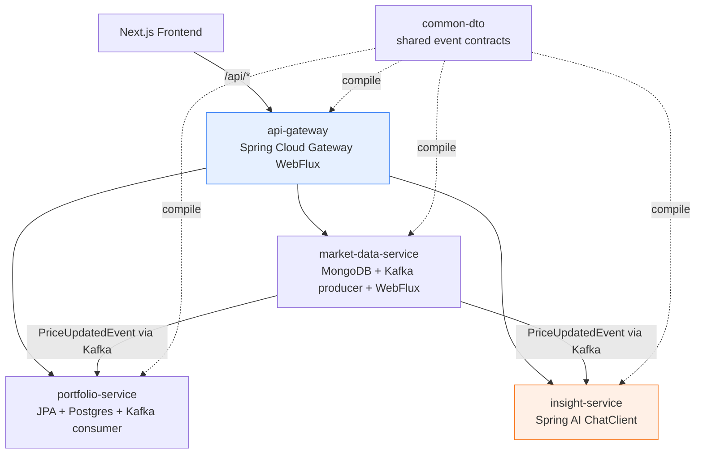
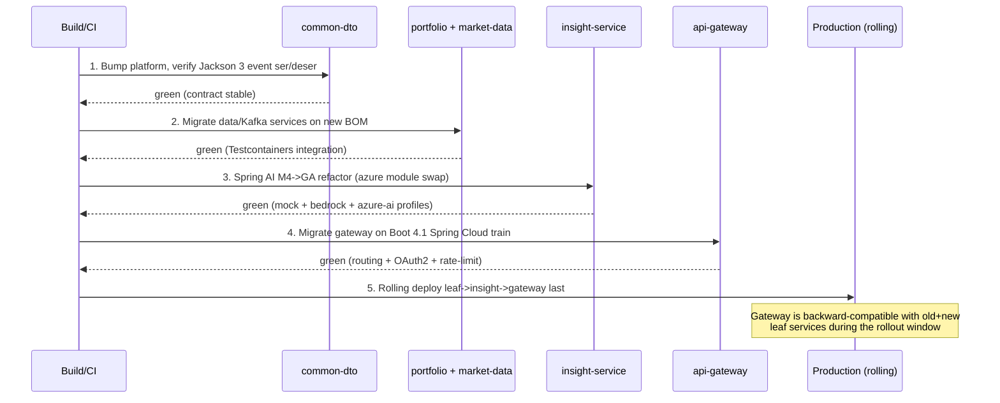
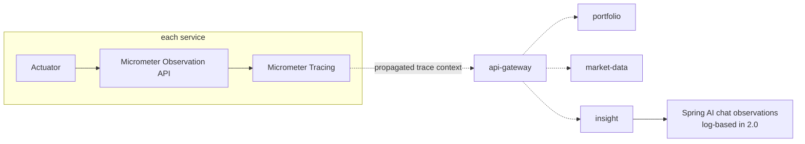

# Design Document: Spring Boot 4.1 + Spring AI 2.0.0 GA Migration

## Overview

This design defines a zero-downtime migration of the Wealth Management & Portfolio Tracker
microservices platform from **Spring Boot 4.0.5 / Spring AI 2.0.0-M4** to
**Spring Boot 4.1.x / Spring AI 2.0.0 GA**, keeping the Spring Cloud release train,
the full transitive dependency graph, and the AI provider adapters internally consistent
across all five modules (`api-gateway`, `portfolio-service`, `market-data-service`,
`insight-service`, `common-dto`).

The migration is sequenced as three gated steps so each service can be built, tested, and
rolled out independently behind the API Gateway without a coordinated downtime window:

1. **Migration Strategy & BOM Analysis** — align the Gradle dependency-management surface
   (Spring Boot plugin, Spring Cloud train, Spring AI BOM, Jackson) so the entire graph
   resolves to one coherent generation.
2. **API Refactoring Guide** — resolve the concrete breaking changes between Spring AI
   2.0.0-M4 and 2.0.0 GA that the `insight-service` actually touches.
3. **Distributed Deployment Considerations** — containerization (Dockerfile/JDK/Gradle)
   and observability/tracing impacts of the Boot 4.1 upgrade across service boundaries.

> The application does **not** use Spring AI vector stores, chat memory, MCP, RAG, or
> tool-calling. This sharply narrows the Spring AI 2.0 breaking-change surface that applies
> here — the design scopes Step 2 to exactly the APIs the codebase uses today.

---

## ⚠️ Version Verification (Read First)

The user explicitly required that target versions be verified against official sources and
that anything unconfirmed be flagged. Results of that verification (against `spring.io`,
`docs.spring.io`, and the Spring Cloud release wiki):

| Component | Current | Target requested | Verified status | Confidence |
|---|---|---|---|---|
| Spring AI | 2.0.0-M4 | 2.0.0 GA | **CONFIRMED** — Spring AI 2.0.0 GA released 2026-06-12; upgrade notes published. Targets Spring Boot 4.1.x. | High |
| Spring Boot | 4.0.5 | 4.1.0 | **CONFIRMED GA** — Spring Boot 4.1.0 is published as CURRENT/GA on spring.io (user-confirmed). The migration pins `springBootVersion = '4.1.0'` and proceeds directly on the main integration branch. | High |
| Spring Cloud | 2025.1.1 (Oakwood) | 2025.1.2 (Oakwood patch) | **DECIDED with residual risk** — pinned to `2025.1.2`. Oakwood (2025.1) is officially documented as a **Spring Boot 4.0** train; pairing `2025.1.2` with Boot 4.1 is a calculated decision pending a dedicated Boot 4.1 train. Safety mechanism: the api-gateway boot/contract gate (clean startup with routing, JWT validation, and rate limiting intact). | ⚠️ Residual risk — gated |
| Jackson | declared 2.x (`com.fasterxml.jackson`) | Jackson 3 (managed by Boot 4) | **CONFIRMED** — Jackson 3.0.0 GA (2025-10-03); Spring Boot 4 uses Jackson 3 (`tools.jackson`) as the default serialization library. | High |
| Java | 21 | 21 | **CONFIRMED** — Java 21 LTS is a supported baseline for Boot 4.x. | High |

### Flagged decisions (resolved)

- **F1 — Spring Boot 4.1.0 GA (RESOLVED).** Spring Boot **4.1.0 is GA** (confirmed CURRENT/GA
  on spring.io). The migration pins the exact `4.1.0` coordinate in the root build and proceeds
  **directly on the main integration branch** — no throwaway RC branch is needed.
- **F2 — Spring Cloud train (RESOLVED, residual risk).** Pinned to `springCloudVersion = '2025.1.2'`.
  This patch release is used for `api-gateway` WebFlux stability while a dedicated Boot 4.1 train
  is pending. **Honest residual-risk note:** Spring Cloud 2025.1 (Oakwood) is officially documented
  as a **Boot 4.0** train, so pairing `2025.1.2` with Boot 4.1 is a calculated decision. It is
  validated — and made safe — by the **gateway boot/contract gate**: `api-gateway` must start
  cleanly on Boot 4.1 with routing, JWT validation, and rate limiting intact. If that gate fails,
  the train selection must be revisited.
- **F3 — Steering doc drift.** `tech.md` states "Jackson version is pinned at 2.18.2 across
  all modules," but the **actual** root `build.gradle` has already removed those pins (comment:
  "Jackson 2.x pins removed — Spring Boot 4 manages Jackson 3"). The design follows the real
  build state, not the steering text. The steering doc should be corrected post-migration.

---

## Current-State Inventory (from the codebase)

Findings gathered by reading the actual build files and `insight-service` sources:

**Root `build.gradle`**
- `org.springframework.boot` plugin `4.0.5` (applied false at root, applied per service).
- `io.spring.dependency-management` `1.1.7`.
- `ext.springCloudVersion = "2025.1.1"`; imports `spring-cloud-dependencies` BOM +
  `testcontainers-bom:2.0.4` in every subproject.
- Jackson 2.x pins already removed (relies on Boot 4 → Jackson 3).
- OpenRewrite plugin active with recipe `org.openrewrite.java.spring.boot4.UpgradeSpringBoot_4_0`
  and `rewrite-spring:6.28.2`.
- Repositories include `https://repo.spring.io/milestone` (needed today because Spring AI is
  on a milestone; can be dropped once Spring AI resolves from Maven Central at GA).

**Per-service dependency highlights**
- `api-gateway`: `spring-cloud-starter`, `spring-cloud-starter-gateway-server-webflux`,
  reactive Redis, OAuth2 resource server, actuator. **(Spring Cloud surface — most sensitive
  to the train/Boot alignment.)**
- `portfolio-service`: web-mvc, JPA, Flyway (`flyway-database-postgresql`), Kafka, cache
  (Caffeine), Redis, `com.fasterxml.jackson.core:jackson-databind` (Jackson 2 GAV), Postgres.
- `market-data-service`: web-mvc, MongoDB, Kafka, WebFlux, `resilience4j-spring-boot4:2.4.0`,
  `com.fasterxml.jackson.core:jackson-databind`.
- `insight-service`: web-mvc, restclient, Kafka, Redis, `jackson-databind`,
  **`spring-ai-bom:2.0.0-M4`**, **`spring-ai-starter-model-bedrock-converse`**,
  **`spring-ai-starter-model-azure-openai`**, **`spring-ai-client-chat`**,
  `com.azure:azure-identity:1.13.2`.
- `common-dto`: plain `java`, excludes Boot test starters; JUnit BOM `5.12.2`.

**Spring AI usage in `insight-service` (the only AI module)**
- `infrastructure/ai/AiConfig.java` — `@Bean @ConditionalOnBean(ChatModel.class)
  ChatClient.Builder chatClientBuilder(ChatModel chatModel)`.
- `BedrockInsightAdvisor`, `BedrockAiInsightService` — `@Profile("bedrock")`, Bedrock Converse,
  `ChatClient.prompt().system(..).user(..).call().content()` and `.call().entity(AnalysisResult.class)`.
- `AzureOpenAiInsightService`, `AzureOpenAiInsightAdvisor`, `AzureOpenAiAssetResolutionClient`
  — `@Profile("azure-ai")`, `spring-ai-starter-model-azure-openai`, Managed Identity via
  `DefaultAzureCredential`, structured output via `.entity(LlmResolution.class)`.
- Default profile = mock adapters (no `ChatModel` bean; tests set `spring.ai.model.chat=none`).
- **No** vector store, chat memory, MCP, tool-calling, or RAG usage anywhere.

---

## Architecture

### Service topology and the migration's blast radius



- **Spring Cloud surface (highest risk):** `api-gateway` only. The Boot 4.1 + Spring Cloud
  `2025.1.2` pairing (F2, residual risk) is the single most fragile boundary, gated by the
  gateway boot/contract check.
- **Spring AI surface (highest churn):** `insight-service` only. The M4 → GA breaking changes
  (Step 2) are localized here.
- **Shared contract:** `common-dto` is plain Java; it compiles against the new platform with
  no AI/Cloud dependencies, so it migrates first and validates Jackson 3 serialization of
  `PriceUpdatedEvent` across producers/consumers.

### Migration sequencing for zero downtime



**Zero-downtime principle:** the API Gateway and the event contract (`common-dto`) are
backward compatible across the rollout, so leaf services can be replaced one replica at a
time (rolling update / Lambda alias shift) while old and new instances coexist. The gateway
migrates **last** so it never routes to a service generation it cannot reach.

---

## Step 1: Migration Strategy & BOM Analysis

### Goal

Make the entire dependency graph resolve to one coherent generation: **Spring Framework 7.x
→ Spring Boot 4.1.x → matching Spring Cloud train → Spring AI 2.0.0 GA**, with Jackson 3
managed centrally and no Jackson 2 leakage.

### 1.1 Version variable matrix (single source of truth)

All version coordinates are centralized in the root `build.gradle` so the migration is a
controlled, reviewable diff. Remaining `<<VERIFY>>` markers are minor, implementation-time
checks only (Testcontainers BOM alignment).

```groovy
// root build.gradle — ext block (DESIGN TARGET, not yet applied)
ext {
    // F1 RESOLVED: Spring Boot 4.1.0 is GA. Pinned directly on the main integration branch.
    set('springBootVersion',  '4.1.0')          // CONFIRMED GA (F1)
    // F2 RESOLVED: pinned to the 2025.1.2 Oakwood patch for gateway WebFlux stability.
    // Residual risk: Oakwood is officially a Boot 4.0 train — validated by the gateway boot gate.
    set('springCloudVersion', '2025.1.2')        // DECIDED w/ residual risk (F2)
    set('springAiVersion',    '2.0.0')          // CONFIRMED GA (2026-06-12)
    set('testcontainersVersion', '<<VERIFY>>')  // align with Boot 4.1-managed Testcontainers
}
```

> **Why `springCloudVersion = '2025.1.2'` carries residual risk:** Oakwood (2025.1) is
> officially documented against Spring Boot 4.0. Running it on Boot 4.1 (newer Spring
> Framework 7.x) can surface `NoSuchMethodError`/`ClassNotFoundException` in
> `spring-cloud-gateway-server-webflux` and the reactive Netty/HTTP stack. The decision to use
> the `2025.1.2` patch is **deliberate** while a dedicated Boot 4.1 train is pending; the
> **gateway boot/contract gate** (clean startup with routing + JWT validation + rate limiting)
> is the safety mechanism that confirms the pairing actually works for this codebase.

### 1.2 Spring Boot plugin upgrade

```groovy
// root build.gradle — plugins block
plugins {
    id 'java'
    id 'org.springframework.boot' version "${springBootVersion}" apply false   // 4.0.5 -> 4.1.0
    id 'io.spring.dependency-management' version '1.1.7'                          // unchanged
    id 'org.openrewrite.rewrite' version 'latest.release'
}
```

The Boot plugin version is the lever that pulls in Spring Framework 7.x and the Jackson 3
BOM transitively. `io.spring.dependency-management 1.1.7` remains compatible.

### 1.3 BOM imports (per subproject `dependencyManagement`)

```groovy
// root build.gradle — subprojects { dependencyManagement { imports { ... } } }
imports {
    mavenBom "org.springframework.cloud:spring-cloud-dependencies:${springCloudVersion}"
    mavenBom "org.testcontainers:testcontainers-bom:${testcontainersVersion}"
    // insight-service additionally imports the Spring AI BOM (kept local to that module):
    // mavenBom "org.springframework.ai:spring-ai-bom:${springAiVersion}"
}
```

The Spring Boot BOM is applied automatically by the Boot plugin; Spring Cloud, Testcontainers,
and (in insight-service) Spring AI are layered on top. **Import order matters**: Boot first,
then Spring Cloud, then Spring AI, so Boot's Jackson 3 and Framework 7.x versions win.

### 1.4 Spring AI BOM: M4 → GA (insight-service)

```groovy
// insight-service/build.gradle — DESIGN TARGET
dependencies {
    implementation platform("org.springframework.ai:spring-ai-bom:${springAiVersion}") // 2.0.0-M4 -> 2.0.0

    implementation 'org.springframework.ai:spring-ai-starter-model-bedrock-converse'   // retained (GA)
    implementation 'org.springframework.ai:spring-ai-client-chat'                       // retained (GA)

    // ❌ REMOVED IN 2.0 GA — see Step 2.1. Do NOT keep this line; the module no longer exists:
    // implementation 'spring-ai-starter-model-azure-openai'
    // ✅ REPLACEMENT — Spring AI 2.0 consolidated Azure OpenAI into the generic OpenAI module,
    //    which now uses the official com.openai:openai-client Java SDK and provides native
    //    out-of-the-box support for Azure OpenAI / Microsoft Foundry deployments:
    implementation 'org.springframework.ai:spring-ai-starter-model-openai'

    // com.azure:azure-identity — likely REMOVABLE now that the openai module supports Azure /
    // Foundry auth natively via spring.ai.openai.* properties (no hand-rolled AAD bridge).
    // Keep only if another code path still needs the Azure SDK. <<VERIFY before deleting.
    // implementation 'com.azure:azure-identity:1.13.2'
}
```

### 1.5 Jackson: eliminate the Jackson 2 / Jackson 3 split

**Problem.** `portfolio-service`, `market-data-service`, and `insight-service` each declare
`implementation 'com.fasterxml.jackson.core:jackson-databind'` (Jackson **2** group id),
while Boot 4 manages Jackson **3** under the `tools.jackson` group id. This pulls both major
versions onto the classpath — the exact "Jackson 3 class initialization failure" the root
build comment warns about.

**Resolution.**
- Remove the explicit `com.fasterxml.jackson.core:jackson-databind` lines. Boot 4.1 provides
  Jackson 3 (`tools.jackson:jackson-databind`) transitively to everything that needs JSON.
- Where code imports `com.fasterxml.jackson.*` directly (annotations on DTOs/records,
  `ObjectMapper`), migrate to the Jackson 3 equivalents (`tools.jackson.*` /
  `tools.jackson.databind.JsonMapper`). See Step 2.4.
- Keep a transitive Jackson 2 (`com.fasterxml.jackson`) **only** if a third-party library
  still requires it (e.g. an SDK); if so, it must be runtime-isolated, not used by app code.

```groovy
// portfolio-service / market-data-service / insight-service — DESIGN TARGET
dependencies {
    // ❌ remove:
    // implementation 'com.fasterxml.jackson.core:jackson-databind'   // Jackson 2 GAV
    // ✅ rely on Boot 4.1 -> Jackson 3 (tools.jackson) transitively; add explicitly ONLY if
    //    a compile-time dependency on the mapper is required:
    // implementation 'tools.jackson.core:jackson-databind'           // version from Boot BOM
}
```

**Isolation guardrail (apply if a third-party client lib transitively pulls Jackson 2).** When
an SDK or client library still drags in `com.fasterxml.jackson.*`, do **not** let it leak into
application code. Add a resolution-strategy hook in the root `build.gradle` to make the
isolation explicit and reviewable — it pins/constrains the transitive Jackson 2 to runtime-only
scope for the offending dependency so it never reaches DTOs, `common-dto`, or the wire mapper:

```groovy
// root build.gradle — Jackson 2 isolation guardrail (apply only when a third-party lib needs it)
configurations.all {
    resolutionStrategy.eachDependency { DependencyResolveDetails details ->
        if (details.requested.group == 'com.fasterxml.jackson.core') {
            // Enforce isolation: restrict Jackson 2 strictly to runtime-only scope for the
            // specific third-party lib that requires it; it must never reach app code/DTOs.
            // App code + common-dto serialize exclusively via Jackson 3 (tools.jackson).
            details.useVersion('2.18.2')                 // pin the transitive Jackson 2 (no open range)
            details.because('runtime-only isolation for <third-party-lib>; app code uses Jackson 3')
        }
    }
}
```

This `resolutionStrategy` block is the concrete enforcement hook behind the **"aggressive
classpath auditing"** guidance (see Testing Strategy) and **Property 12** (no Jackson 2
contamination of app DTOs). Pair it with the Step 1.8 dependency-resolution gate: the gate
*detects* a Jackson 2/3 split, and this hook *constrains* the unavoidable transitive Jackson 2
to runtime-only so it cannot leak into compile scope.

### 1.6 Other dependency-graph checks

| Dependency | Module | Action |
|---|---|---|
| `resilience4j-spring-boot4:2.4.0` | market-data | **Verify** a release compatible with Boot 4.1/Framework 7.x; bump if the `-spring-boot4` line publishes a 4.1 build. |
| `flyway-database-postgresql` (BOM-managed) | portfolio | Confirm Flyway version from Boot 4.1 BOM supports Postgres 16; no pin needed. |
| `spring-boot-starter-kafka` | portfolio, market-data, insight | Spring for Apache Kafka advances with Boot; no explicit version. Re-run Kafka Testcontainers. |
| OAuth2 / Nimbus JOSE+JWT | api-gateway | Managed by Boot BOM; verify resource-server config compiles on Framework 7.x. |
| `jjwt 0.12.6`, `wiremock-spring-boot 3.2.0`, `pact spring7 4.7.0-beta.4`, `jqwik 1.9.2` | tests | Test-only; verify against Boot 4.1 test context. Pact `spring7` artifact name is correct for Framework 7. |
| `org.openrewrite.recipe:rewrite-spring` | root | Bump to a release that ships an `UpgradeSpringBoot_4_1` recipe; update `activeRecipe`. |

### 1.7 OpenRewrite-assisted upgrade

```groovy
// root build.gradle — rewrite block (DESIGN TARGET)
rewrite {
    // was: org.openrewrite.java.spring.boot4.UpgradeSpringBoot_4_0
    activeRecipe('org.openrewrite.java.spring.boot4.UpgradeSpringBoot_4_1') // <<VERIFY recipe id/availability
    setExportDatatables(true)
}
```

Spring AI also publishes OpenRewrite recipes (e.g. `migrate-to-2-0-0-*`), but the project's
M4→GA delta does **not** touch the areas those recipes cover (MCP, chat-memory artifacts), so
the Spring AI refactor in Step 2 is small and best done by hand.

### 1.8 Resolution-verification gate

After the BOM edits, prove a coherent graph **before** touching code:

```bash
# Fail the build on any Jackson 2/3 coexistence or split Spring Framework versions.
./gradlew :common-dto:dependencies --configuration runtimeClasspath
./gradlew :api-gateway:dependencies --configuration runtimeClasspath | grep -E "spring-framework|spring-cloud|jackson"
./gradlew :insight-service:dependencies --configuration runtimeClasspath | grep -E "spring-ai|jackson"
./gradlew build -x test   # compile the whole graph first
```

**Correctness property (Step 1):** for every module, `runtimeClasspath` contains exactly one
Spring Framework major (7.x), one Jackson major (3.x) for application code, one Spring Cloud
train, and `spring-ai-*` at exactly `2.0.0`. Any duplicate major version is a migration defect.

---

## Step 2: API Refactoring Guide (Spring AI 2.0.0-M4 → 2.0.0 GA)

This step lists **only** the breaking changes that the `insight-service` code actually
exercises, mapped to the official Spring AI 2.0 upgrade notes. The vast majority of the 2.0
breaking surface (MCP, chat memory, vector stores, tool-calling, Ollama, Anthropic SDK swap)
does not apply because the codebase does not use those features.

### 2.0 Applicability triage

| Spring AI 2.0 breaking change | Used here? | Action |
|---|---|---|
| `spring-ai-azure-openai` module **removed** → consolidated into `spring-ai-openai` | ✅ Yes (azure-ai profile) | **2.1 — module swap + native config** |
| Default temperature `0.7` removed | ✅ Yes (all chat calls) | **2.2 — pin temperature** |
| `.entity()` / `BeanOutputConverter` schema generation changed | ✅ Yes (`AnalysisResult`, `LlmResolution`) | **2.3 — validate structured output** |
| Jackson 3 (`tools.jackson`) default; M4 used `com.fasterxml`/`tools.jackson` mix | ✅ Yes (DTO records, ObjectMapper) | **2.4 — Jackson 3 + JSpecify** |
| ChatClient options now require a builder (`.options(builder)`) | ⚠️ Latent (no options passed today) | **2.5 — guardrail only** |
| `ChatClient.builder(chatModel)` construction | ✅ Yes (`AiConfig`) | Unchanged — still valid |
| Bedrock Converse starter | ✅ Yes | Unchanged — retained in GA |
| Tool calling / `ToolCallingAdvisor` / `internalToolExecutionEnabled` | ❌ No | N/A |
| Chat memory advisors / conversation ID required | ❌ No | N/A |
| MCP (annotations, transports, SDK 2.0) | ❌ No | N/A |
| Vector store / RAG / advisors | ❌ No | N/A |

### 2.1 Azure OpenAI module consolidation (the major refactor)

**Breaking change (official):** the `spring-ai-azure-openai` module, its starter
`spring-ai-starter-model-azure-openai`, and its auto-configuration were **removed** in 2.0.
Spring AI 2.0 **consolidated Azure OpenAI into the generic `spring-ai-openai` module**, which
now uses the official **`com.openai:openai-client`** Java SDK (the legacy `azure-ai-openai`
library was dropped). The unified `spring-ai-openai` module provides **native, out-of-the-box
support for Azure OpenAI and Microsoft Foundry deployments** via native configuration
properties for endpoint routing and authentication.

**Impact on this codebase:**
- Dependency `spring-ai-starter-model-azure-openai` no longer resolves (Step 1.4 swaps it for
  `spring-ai-starter-model-openai`).
- The `@Profile("azure-ai")` adapters (`AzureOpenAiInsightService`,
  `AzureOpenAiInsightAdvisor`, `AzureOpenAiAssetResolutionClient`) keep their **Java type
  names** (they are our classes), but their **autoconfig and properties** change.
- **No custom auth bridge is needed.** Because the consolidated `spring-ai-openai` module
  natively supports Azure OpenAI / Foundry endpoints and authentication, the previously
  sketched hand-rolled AAD-token bridge / custom `RestClient` interceptor is **eliminated**.
  Authentication and endpoint routing are expressed through `spring.ai.openai.*` native
  properties.
- Config keys move from `spring.ai.azure.openai.*` → `spring.ai.openai.*` (native Azure /
  Foundry properties for endpoint, deployment, and auth).
- **`com.azure:azure-identity` reassessment:** with native auth in place, the explicit
  `azure-identity` dependency is **likely removable**. Verify no other code path still depends
  on the Azure SDK before deleting it (Step 1.4).

The adapter bodies (`chatClient.prompt().system(..).user(..).call().content()` /
`.entity(..)`) are **unchanged** — the `ChatClient` fluent API is stable across M4 → GA. Only
wiring, dependency, and native configuration properties change.

```yaml
# insight-service application-azure-ai.yml — DESIGN TARGET (native config; illustrative)
#  Before (M4, azure-openai module)            After (GA, unified openai module — native Azure/Foundry)
#  spring.ai.azure.openai.endpoint=...         spring.ai.openai.*  (native endpoint routing)
#  spring.ai.azure.openai.chat.options.*       spring.ai.openai.chat.options.*
#  (Managed Identity via DefaultAzureCredential   ->  native Azure/Foundry auth via spring.ai.openai.*
#   + custom RestClient interceptor)               no custom interceptor / AAD bridge required
```

> **No residual decision here.** The native-config approach removes the F4 open question
> entirely: there is no need to weigh a custom auth bridge against staying on Spring AI 1.1.x.
> The migration stays on a single Spring AI 2.0 generation across all profiles.

### 2.2 Default temperature removal

**Breaking change (official):** Spring AI no longer injects a default `temperature=0.7`; the
provider's native default now applies (varies by provider/model).

**Impact:** `BedrockAiInsightService`, `AzureOpenAiInsightService` (sentiment) and the
advisors rely on stable, low-variance output and **cache results in Redis**. A silent jump to
a provider default of `1.0` would increase output variance and reduce cache value.

**Resolution:** pin temperature explicitly per profile.

```properties
# application-bedrock.yml
spring.ai.bedrock.converse.chat.options.temperature=0.7
# application-azure-ai.yml  (now under the openai prefix per 2.1)
spring.ai.openai.chat.options.temperature=0.7
```

### 2.3 Structured output (`.entity()`) schema-generation change

**Breaking change (official):** `BeanOutputConverter` now delegates JSON-Schema generation to
`JsonSchemaGenerator` (the same path tool-calling uses). `@JsonProperty(required=false)` (and
unspecified `required`) fields are no longer marked required, and primitive `format` hints are
added.

**Impact:** `AnalysisResult` and `LlmResolution` are deserialized via
`.call().entity(AnalysisResult.class)` / `.entity(LlmResolution.class)`. The prompt instructs
the model to return a specific JSON shape; the generated schema steers/validates that. Field
"required-ness" in the generated schema may shift.

**Resolution:**
- Re-verify both records deserialize from representative model output after upgrade.
- For fields that must be present, enforce required-ness explicitly (non-null record
  components + validation), since schema-level `required` defaults changed.
- Keep the existing defensive null checks (`if (result == null) throw …`) — still correct.

### 2.4 Jackson 3 + JSpecify

**Jackson 3 (official):** Boot 4 default serialization is Jackson 3 (`tools.jackson`). Any
direct `com.fasterxml.jackson.*` imports in app code must move to `tools.jackson.*`.

Audit targets (anywhere in the four Java services, especially `common-dto` event records and
`insight-service` DTOs/`ObjectMapper` usage):

```java
// Before (Jackson 2)                       After (Jackson 3)
import com.fasterxml.jackson.databind.ObjectMapper;   import tools.jackson.databind.json.JsonMapper;
import com.fasterxml.jackson.annotation.JsonProperty;  import tools.jackson.annotation.JsonProperty; // verify annotation home
// ObjectMapper om = new ObjectMapper();              JsonMapper om = JsonMapper.builder().build();
```

- `common-dto` (`PriceUpdatedEvent` and shared DTOs) is the critical path: producers
  (`market-data-service`) and consumers (`portfolio-service`, `insight-service`) must serialize
  Kafka payloads identically. Validate round-trip ser/deser on Jackson 3 **before** rolling any
  consumer (the zero-downtime contract depends on it).
- Where a test or SDK still needs Jackson 2 annotations, isolate it; do not mix on a DTO.

**JSpecify (official):** Spring AI 2.0 (and Boot 4) are fully JSpecify-annotated. For Java this
is mostly compile-time nullness metadata — `@Nullable` returns (e.g. `ChatClient … .entity()`
can be null) are already handled by the existing null checks. Action: treat new nullness
warnings as real; keep null-guards on all `ChatClient` results.

### 2.5 ChatClient options-builder guardrail (latent)

**Breaking change (official):** `ChatClient.prompt().options(...)` now requires a
`ChatOptions.Builder`, not a built `ChatOptions`. The current code passes **no** options
inline (temperature is set via properties in 2.2), so nothing breaks today. **Guardrail:** if
future code sets options programmatically, pass the builder, not `.build()`:

```java
// Correct for ChatClient in 2.0:
chatClient.prompt().user(msg)
    .options(OpenAiChatOptions.builder().temperature(0.7))   // builder, NOT .build()
    .call().content();
```

### 2.6 `AiConfig` — unchanged, with a note

`AiConfig.chatClientBuilder(ChatModel)` using `@ConditionalOnBean(ChatModel.class)` +
`ChatClient.builder(chatModel)` remains valid in 2.0. The mock-profile behavior (no
`ChatModel` bean → builder skipped) is preserved. Tests that set `spring.ai.model.chat=none`
continue to work (that property family is unchanged in 2.0).

### Step 2 verification

```bash
./gradlew :insight-service:test                      # mock-profile unit tests
SPRING_PROFILES_ACTIVE=local,bedrock ./gradlew :insight-service:integrationTest  # opt-in Bedrock smoke
# azure-ai: validate native spring.ai.openai.* Azure/Foundry config (2.1) in a non-prod Azure env before cutover.
```

**Correctness properties (Step 2):**
- For all profiles `p ∈ {mock, bedrock, azure-ai}`: the service context starts and every
  `AiInsightService.getSentiment`/`InsightAdvisor.analyze` path returns a non-null,
  contract-valid result (or throws `AdvisorUnavailableException`), identical to pre-migration
  behavior.
- `∀` Kafka event `e`: `deserialize(serialize(e))` under Jackson 3 equals `e` (cross-service
  contract preserved).

---

## Step 3: Distributed Deployment Considerations

### 3.1 Containerization (Dockerfile / JDK / Gradle)

Current Dockerfiles (`portfolio-service`, `market-data-service`) use a multi-stage build:
`amazoncorretto:21` builder → Gradle wrapper `9.4.1` → `bootJar` (AOT) → `jdeps`/`jlink`
custom JRE → `public.ecr.aws/amazonlinux:2023-minimal` runtime + AWS Lambda Web Adapter.
There are also `Dockerfile.azure` variants for Azure Container Apps.

| Concern | Status under Boot 4.1 | Action |
|---|---|---|
| **Java baseline** | Boot 4.x requires Java 17+; Java 21 LTS is fully supported. | Keep `amazoncorretto:21`. No JDK bump required. (Java 25 LTS is optional/out of scope.) |
| **Gradle version** | Boot 4.1 plugin requires a recent Gradle (8.x/9.x). `9.4.1` is fine; consider latest 9.x for plugin-compat fixes. | Optional bump of `GRADLE_VERSION` in the `gradle-dist` stage; keep in sync with `gradle/wrapper`. |
| **AOT (`processAot`)** | `bootJar` depends on `processAot`; behavior is stable in 4.1. `processTestAot` already disabled per service. | No change; re-validate AOT output builds in the container. |
| **`jdeps`/`jlink` module set** | Framework 7.x/Jackson 3 may pull different JDK modules (e.g. `tools.jackson` reflection). | Re-run `jdeps`; the `--add-modules` fallback list (`jdk.unsupported`, `java.security.jgss`, `java.sql`, `java.naming`, …) may need additions. **Verify the slim JRE still boots each service.** ⚠️ **`tools.jackson` modules must be explicitly verified as included in the custom slim JRE** — Jackson 3 relies on dynamic reflection, which can cause static analysis (`jdeps`) to miss its modules. Add them explicitly to `--add-modules` if `jdeps` does not surface them. |
| **insight-service image** | No standalone `Dockerfile` was found for `insight-service`; it deploys via Lambda (bedrock) / Container Apps (azure-ai). | Confirm its build path; the azure-module swap (2.1) changes its runtime classpath and image contents. |
| **HttpClient5** | Boot 4.1 uses Apache HttpClient5 5.6 (per Spring AI 2.0 OpenSearch note). | RestClient/WebClient-based services (insight `restclient`, market-data `webflux`) must re-test outbound TLS through the slim JRE (cacerts already handled in the Dockerfiles). |

```dockerfile
# Dockerfile gradle-dist stage — DESIGN TARGET (version bump only if needed)
FROM amazoncorretto:21 AS gradle-dist
RUN GRADLE_VERSION=9.4.1 \   # keep == gradle/wrapper/gradle-wrapper.properties; bump together
    && ...                    # (rest of stage unchanged)
```

**Recovery action plan — `tools.jackson` modules missing from the slim JRE (Property 7).**
Because Jackson 3 (`tools.jackson`) binds via dynamic runtime reflection, `jdeps` static
analysis can miss its sub-modules, producing a slim `jlink` image that compiles and links but
fails at runtime. The symptom is a `ClassNotFoundException` / module-initialization failure the
first time a service serializes — typically surfaced immediately when hitting
`/actuator/health` on the slim image (the Step 3 boot check). When that happens, manually append
the reflection-bound Jackson 3 modules to the Dockerfile's `jlink --add-modules` directive and
rebuild:

```dockerfile
# Dockerfile jlink stage — recovery: explicitly add tools.jackson modules jdeps misses
RUN jlink \
      --add-modules "$(cat deps.info),\
tools.jackson.core,\
tools.jackson.databind,\
tools.jackson.module.paramnames" \
      # tools.jackson.module.paramnames is required specifically when serializing Java records
      --strip-debug --no-header-files --no-man-pages --compress=2 \
      --output /opt/slim-jre
```

Add `tools.jackson.core` and `tools.jackson.databind` whenever serialization fails on the slim
image; add `tools.jackson.module.paramnames` specifically when the failure occurs serializing
**Java records** (e.g. `PriceUpdatedEvent`, `AnalysisResult`, `LlmResolution`), since record
component-name binding relies on the paramnames module. Re-run the Step 3 boot check
(`/actuator/health = UP`) after each addition to confirm the slim JRE boots — this closes the
loop on **Property 7**.

> **Constraint to honor (steering):** AWS Free-Tier / cold-start rules still apply. The slim
> `jlink` JRE and AOT must keep working for Lambda cold-start; do not regress to a full JRE.
> GraalVM Native Image / SnapStart readiness is unchanged by this migration.

### 3.2 Distributed tracing & observability impact



**Findings from the build files:** every service has `spring-boot-starter-actuator`, but
**no** tracer bridge / exporter dependency is present (no `micrometer-tracing-bridge-*`, no
Zipkin/OTLP). So today there is observability metadata but **no exported distributed trace**.

Impacts of the Boot 4.1 + Spring AI 2.0 upgrade:

1. **Micrometer / Observation moves with the platform.** Boot 4.1 brings updated Micrometer
   and Observation APIs. Any custom `ObservationRegistry`/`@Observed` usage must compile
   against the new versions. Actuator endpoint defaults and property names should be
   re-verified (some `management.*` keys evolve across Boot majors).
2. **Spring AI observability changed to log-based.** In 2.0, content observation uses logging
   handlers, not tracing: properties renamed `include-prompt → log-prompt`,
   `include-completion → log-completion`; `micrometer-tracing-bridge-otel` replaced by
   `micrometer-tracing`; direct OTel SDK dependency removed. Tool-calling spans were renamed
   (`tool_call` → `execute_tool`) — **not used here**, so no dashboard impact. If
   prompt/completion logging is ever enabled in `insight-service`, use the new `log-*` keys and
   **respect the existing requirement that raw user messages/prompts must not be logged**
   (there is a test asserting no prompt leakage — keep `log-prompt=false`).
3. **Trace context across service boundaries (IN-SCOPE).** End-to-end distributed tracing is
   **in-scope** for this migration: this upgrade is the designated entry point to **standardize
   tracing across the microservices ecosystem**. Trace-context headers must propagate seamlessly
   through `api-gateway → insight-service` (and the other leaf services `portfolio-service` /
   `market-data-service`). Add a tracer consistently to **all** services:

```groovy
// IN-SCOPE (all services) — standardize distributed tracing as part of this migration
implementation 'io.micrometer:micrometer-tracing-bridge-otel' // or -brave
implementation 'io.opentelemetry:opentelemetry-exporter-otlp' // export target = your collector
// api-gateway is WebFlux: ensure reactive context propagation is on (Boot autoconfig handles it)
```

   The migration is the natural point to introduce this consistently, and Spring AI 2.0's
   observability rewrite (log-based content observation) changes how AI calls surface in
   traces/logs — so the tracing standardization and the AI upgrade are addressed together.
   **Correctness requirement:** a single trace must span `api-gateway → leaf/insight`, with the
   trace-context (W3C `traceparent`) header propagated unbroken across every hop, including the
   reactive gateway boundary (see Property 10).

4. **Health/readiness during rolling deploys.** Zero-downtime rollout relies on accurate
   actuator liveness/readiness. Re-verify `management.endpoint.health` group config and
   Lambda/Container Apps probes after the Boot bump (probe semantics are stable but
   property-name drift is possible).

### Step 3 verification

```bash
docker build -f portfolio-service/Dockerfile  -t pf:4.1 .
docker build -f market-data-service/Dockerfile -t md:4.1 .
# boot each slim-JRE image locally and hit /actuator/health before any deploy
docker run --rm -p 8081:8081 pf:4.1 &  curl -fsS localhost:8081/actuator/health
```

**Correctness properties (Step 3):** each service image (a) builds with the slim `jlink`
JRE, (b) starts and reports `status: UP` on `/actuator/health`, and (c) makes outbound TLS
calls (Kafka/Mongo/OpenAI/Bedrock) successfully — i.e. no module/cert regression from the
platform bump.

---

## Error Handling

| Scenario | Detection | Response / Recovery |
|---|---|---|
| Dependency graph has split majors (Jackson 2+3, Framework 7.0+7.x, two Cloud trains) | `gradle dependencies` gate (1.8) | Block the migration; pin/remove the offending coordinate before proceeding. |
| Spring Cloud `2025.1.2` incompatible with Boot 4.1 (gateway `NoSuchMethodError` at startup) | **api-gateway boot/contract gate** — context must start cleanly with routing, JWT validation, and rate limiting intact | This is the F2 safety mechanism. If the gate fails, revisit the train selection (escalate to a dedicated Boot 4.1 train when published); never ship a gateway that fails the boot gate. |
| `spring-ai-starter-model-azure-openai` fails to resolve | Gradle resolution error | Expected — complete the 2.1 swap to the consolidated `spring-ai-openai` module. |
| Azure OpenAI auth fails through the consolidated openai module | `azure-ai` integration smoke test (401/403) | Re-check the native `spring.ai.openai.*` Azure/Foundry auth properties (2.1); no custom AAD bridge is needed. |
| Structured-output deserialization fails post-upgrade | `insight-service` tests on `.entity()` paths | Re-align record required-ness / prompt (2.3); keep null-guards. |
| Kafka event round-trip differs across Jackson versions | `common-dto` + cross-service contract tests | Fix Jackson 3 mapping before rolling consumers (zero-downtime contract). |
| Slim JRE missing a JDK module after platform bump (esp. `tools.jackson` reflection) | Container fails to boot | Add the module to `jlink --add-modules`; re-run `jdeps` and explicitly include `tools.jackson` modules that dynamic reflection hides from static analysis. |
| Jackson serialization fails at runtime despite clean compilation | Runtime ser/deser tests, slice tests, jqwik contamination tests (see Testing Strategy) | Standard compilation checks do **not** catch this — fix the Jackson 3 mapping / classpath isolation and re-run the serialization test suite before rollout. |

---

## Testing Strategy

### Unit testing
- Run each module's `test` task (excludes `@Tag("integration")`). Focus on `insight-service`
  mock-profile tests (`ChatResolutionService`, `ChatResponseBuilder`, advisor unavailability)
  and the jqwik property tests already present.

### Jackson 3 serialization testing (mandatory — compilation checks are insufficient)

> **Why this is its own section:** standard compilation checks **cannot** catch Jackson 3
> serialization failures (wrong mapper bean, missing module, Jackson 2/3 contamination). These
> only surface at runtime. Runtime/serialization tests are therefore **mandatory**, not optional.

- **(a) Parameterized DTO ser/deser tests.** Add `@ParameterizedTest` serialize→deserialize
  round-trip tests for `PriceUpdatedEvent` and the other `common-dto` records, asserting
  **specifically against the configured `tools.jackson.databind.JsonMapper`** (not an
  ad-hoc mapper). Each case asserts byte-stable round-trip and correct field mapping under the
  Jackson 3 mapper the application actually wires.
- **(b) Web slice tests at the serialization boundaries.** Add `@WebMvcTest` (portfolio,
  market-data, insight controllers) and `@WebFluxTest` (api-gateway) slice tests that assert
  the **correct Jackson 3 `ObjectMapper`/`JsonMapper` bean** handles request/response
  serialization at the gateway and controller boundaries — confirming the autoconfigured
  Jackson 3 mapper is the one used on the wire, not a stray Jackson 2 mapper.
- **(c) Cross-version contamination property tests (jqwik).** Property-based tests verifying
  `AnalysisResult` and `LlmResolution` **instantiate and map all required fields correctly
  through the Spring AI 2.0 Jackson 3 schema generator** — i.e. no Jackson 2 leakage corrupts
  the structured-output path. Generate arbitrary valid instances and assert round-trip through
  the schema generator + Jackson 3 mapper.
- **Aggressive classpath auditing.** Audit every module's `runtimeClasspath` to isolate any
  transitive Jackson 2 (`com.fasterxml.jackson`) to **runtime-only for the specific
  third-party libs that require it** — it must **never** leak into app-level DTOs or
  `common-dto`. App code and shared contracts use Jackson 3 (`tools.jackson`) exclusively.

### Property-based testing
- **Library:** jqwik 1.9.2 (already in `insight-service` and `market-data-service`).
- Properties to assert across the migration:
  - **Jackson 3 round-trip:** `∀ event e: deserialize(serialize(e)) == e` for `common-dto`
    contracts, asserted against the configured `tools.jackson.databind.JsonMapper` (new —
    protects the zero-downtime event contract).
  - **Schema-generator contamination guard:** `AnalysisResult` / `LlmResolution` map all
    required fields correctly through the Spring AI 2.0 Jackson 3 schema generator (item c).
  - **AI response non-emptiness (existing P6):** all outcome paths produce a non-blank
    `ChatResponse` — must still hold on Spring AI GA.
  - **Risk-score clamping (existing):** `MockInsightAdvisor`/`BedrockInsightAdvisor` keep
    `riskScore ∈ [1,100]`.

### Integration testing (Testcontainers, `@Tag("integration")`)
- `./gradlew integrationTest` per service: Postgres 16 (portfolio), MongoDB 7 (market-data),
  Kafka (both), Redis. These validate the platform bump against real infra locally
  (no real AWS, per steering).
- Pact provider tests (`spring7` artifact) validate API contracts the gateway/frontend rely on.

### Migration-specific gates
- Dependency-resolution gate (Step 1.8) runs first in CI.
- Per-service context-load test on the new platform before any deploy.
- Cross-service contract test on Jackson 3 event payloads before rolling consumers.
- **Gateway boot/contract gate (F2 safety mechanism):** `api-gateway` must start cleanly on
  Boot 4.1 + Spring Cloud `2025.1.2` with routing, JWT validation, and rate limiting intact.
- **Trace-context propagation gate:** assert a single trace spans `api-gateway → insight-service`
  (and the other leaf services) with the W3C `traceparent` header propagated unbroken across
  every hop, including the reactive gateway boundary (Property 10).

---

## Performance Considerations

- **Cold start (Lambda):** preserve AOT + slim `jlink` JRE; the platform bump must not inflate
  startup. Re-measure cold start after the bump; Framework 7.x/Jackson 3 init time is the
  variable to watch.
- **AI cost/variance:** pinning `temperature=0.7` (2.2) preserves cache hit rates in Redis
  (sentiment 60-min TTL, analysis 30-min TTL); leaving the provider default could raise
  variance and cost.

## Security Considerations

- **No new network exposure** is introduced by this migration; the gateway remains the single
  entry point with OAuth2 resource-server + rate limiting.
- **Prompt-leak guardrail:** Spring AI 2.0 log-based observation must keep `log-prompt=false`
  (an existing test asserts raw user messages never reach logs).
- **Azure auth:** the consolidated `spring-ai-openai` module authenticates to Azure OpenAI /
  Foundry natively via `spring.ai.openai.*` properties; prefer Managed Identity / Entra ID over
  static API keys and do not introduce a static OpenAI API key into Azure config.
- **Dependency provenance:** all new coordinates come from official Spring/Maven Central BOMs;
  pin GA versions (no open ranges) once F1/F2 resolve.

## Dependencies

**Platform (target):** Spring Boot `4.1.0` GA (confirmed), Spring Framework 7.x (transitive),
Spring Cloud `2025.1.2` (Oakwood patch — residual risk, gated by the gateway boot check),
Spring AI `2.0.0` GA (confirmed), Jackson `3.x` (`tools.jackson`, BOM-managed), Java 21,
Gradle 9.4.1+.

**Removed:** `spring-ai-starter-model-azure-openai` (module consolidated into `spring-ai-openai`
in 2.0); explicit `com.fasterxml.jackson.core:jackson-databind` (Jackson 2) in app modules;
`com.azure:azure-identity` (likely removable — native `spring.ai.openai.*` Azure/Foundry auth
replaces the hand-rolled AAD bridge; verify no other usage before deleting).

**Added/changed:** `spring-ai-starter-model-openai` (replaces azure-openai starter; uses the
official `com.openai:openai-client` SDK, native Azure/Foundry support);
`micrometer-tracing-bridge-*` + OTLP exporter (now **in-scope** — standardizing distributed
tracing across all services).

**Verify-at-implementation (minor):** Testcontainers BOM alignment, `resilience4j-spring-boot4`
Boot-4.1 build, OpenRewrite `UpgradeSpringBoot_4_1` recipe id, and confirming `com.azure:azure-identity`
has no remaining usage before removal.

---

## Open Questions / Decisions Needed

All previously flagged decisions are **resolved**:

- **F1 (RESOLVED):** Spring Boot **4.1.0 is GA** (confirmed CURRENT/GA on spring.io). Pin
  `springBootVersion = '4.1.0'` and migrate directly on the main integration branch — no RC
  spike branch needed.
- **F2 (RESOLVED, residual risk):** Pin `springCloudVersion = '2025.1.2'`. Oakwood (2025.1) is
  officially a Boot 4.0 train, so this pairing is a calculated decision validated by the
  **api-gateway boot/contract gate** (clean startup with routing, JWT validation, and rate
  limiting). Revisit if/when a dedicated Boot 4.1 train ships.
- **F4 (RESOLVED):** No custom Entra ID auth bridge is needed. Spring AI 2.0 consolidated Azure
  OpenAI into the generic `spring-ai-openai` module (official `com.openai:openai-client` SDK),
  which natively supports Azure OpenAI / Microsoft Foundry endpoints and authentication via
  `spring.ai.openai.*` properties. `com.azure:azure-identity` is likely removable (verify no
  other usage).
- **Tracing scope (RESOLVED — in-scope):** End-to-end distributed tracing **is in-scope**. This
  migration is the designated entry point to standardize tracing across the ecosystem, ensuring
  trace-context propagates `api-gateway → insight-service` and the other leaf services.

**Remaining verify-at-implementation items (minor):** `resilience4j-spring-boot4` Boot 4.1
build, OpenRewrite `UpgradeSpringBoot_4_1` recipe id, Testcontainers BOM alignment, and
confirming `com.azure:azure-identity` has no remaining usage before removal.

---

## Components and Interfaces

The migration's "components" are the build/runtime units whose contracts must stay stable
across the upgrade. Each has an interface (its compile/runtime contract) that the migration
must preserve.

### Component 1: `common-dto` (shared contract)

**Purpose:** defines inter-service event/DTO contracts (e.g. `PriceUpdatedEvent`) serialized
over Kafka. Plain Java; no Spring AI/Cloud deps.

**Interface (contract that must not break):**
```java
// Stable wire contract — serialization must be byte-compatible across Jackson 2 -> 3
record PriceUpdatedEvent(/* ticker, price, timestamp, ... */) { }
// Property: deserialize(serialize(e)) == e under Jackson 3 for every producer/consumer.
```
**Responsibilities:** migrate first; prove Jackson 3 round-trip before any consumer rolls.

### Component 2: `api-gateway` (Spring Cloud edge)

**Purpose:** single entry point; routing, OAuth2 resource-server, Redis rate limiting (WebFlux).

**Interface:**
```java
// Inbound: HTTP /api/** ; Outbound: routes to portfolio/market-data/insight
// Contract: route table, JWT validation, and rate-limit semantics unchanged across upgrade.
interface GatewayContract {
    // routes(): Map<PathPattern, ServiceUri>   — preserved
    // authn(): validates bearer JWT            — preserved on Framework 7.x
    // rateLimit(): per-principal limiting       — preserved (profile-aware backing store)
}
```
**Responsibilities:** migrates **last**; must boot cleanly on Boot 4.1 + Spring Cloud `2025.1.2`
(F2 gateway boot/contract gate).

### Component 3: Leaf data services (`portfolio-service`, `market-data-service`)

**Purpose:** JPA/Postgres + Kafka consumer (portfolio); MongoDB + Kafka producer + WebFlux
(market-data).

**Interface:**
```java
// REST controllers behind the gateway + Kafka producer/consumer contracts.
// Contract: HTTP responses and Kafka payloads unchanged; only platform/Jackson bump.
```
**Responsibilities:** migrate after `common-dto`; validate via Testcontainers integration tests.

### Component 4: `insight-service` AI adapters (Spring AI surface)

**Purpose:** AI sentiment/analysis/asset-resolution via `ChatClient` across `mock` / `bedrock`
/ `azure-ai` profiles.

**Interface (preserved application contracts):**
```java
interface AiInsightService { String getSentiment(String ticker); }          // unchanged
interface InsightAdvisor   { AnalysisResult analyze(PortfolioDto portfolio); } // unchanged
interface AssetResolutionClient { LlmResolution resolve(String msg, CompactCatalog c); } // unchanged
// Spring AI binding contract CHANGES: azure-openai module -> consolidated openai module with
// native Azure/Foundry config (Step 2.1).
@Bean @ConditionalOnBean(ChatModel.class) ChatClient.Builder chatClientBuilder(ChatModel m); // valid in 2.0
```
**Responsibilities:** absorb the M4→GA breaking changes (Step 2) without changing the three
application-facing interfaces above.

### Component 5: Container/Deploy units (Dockerfiles + probes)

**Purpose:** multi-stage slim-JRE images (AOT + `jlink`) for Lambda / Container Apps.

**Interface:**
```text
build: bootJar(AOT) -> jdeps/jlink slim JRE -> AL2023 runtime (+ Lambda Web Adapter)
runtime: /actuator/health = UP ; outbound TLS to Kafka/Mongo/OpenAI/Bedrock OK
```
**Responsibilities:** re-validate module set & health probes on the new platform (Step 3).

---

## Data Models

These are the configuration/metadata models the migration manipulates (not application
domain entities, which are unchanged).

### Model 1: Version Matrix (root build `ext`)

```groovy
ext {
    springBootVersion    : String   // '4.1.0' GA (F1 RESOLVED — confirmed GA)
    springCloudVersion   : String   // '2025.1.2' Oakwood patch (F2 RESOLVED — residual risk, gated)
    springAiVersion      : String   // '2.0.0' GA (confirmed)
    testcontainersVersion: String   // align to Boot 4.1 BOM
}
```
**Validation rules:**
- `springBootVersion` == `4.1.0` (published GA — confirmed).
- `springCloudVersion` == `2025.1.2`; the gateway boot/contract gate must pass (F2 residual-risk
  safety mechanism). Revisit only if a dedicated Boot 4.1 train is adopted.
- `springAiVersion` == `2.0.0` exactly (no milestone/RC suffix).

### Model 2: Per-module Dependency Set

```text
DependencySet = {
  bootStarters: Set<Coordinate>,   // version-less (BOM-managed)
  cloudStarters: Set<Coordinate>,  // api-gateway only
  aiStarters: Set<Coordinate>,     // insight-service only; { bedrock-converse, openai, client-chat }
  jackson: { group: 'tools.jackson', major: 3 },   // app code; no com.fasterxml in app modules
  explicitPins: Set<Coordinate>    // resilience4j, test libs (each minor <<VERIFY>>);
                                   // azure-identity likely removable (native openai auth)
}
```
**Validation rules:** exactly one Spring Framework major (7.x), one Jackson major (3.x for app
code), one Spring Cloud train, `spring-ai-*` all `2.0.0`; `spring-ai-starter-model-azure-openai`
absent.

### Model 3: AI Profile Configuration

```text
Profile ∈ { mock, bedrock, azure-ai }
mock     -> no ChatModel bean; spring.ai.model.chat=none
bedrock  -> spring.ai.bedrock.converse.chat.options.temperature=0.7
azure-ai -> spring.ai.openai.* (migrated from spring.ai.azure.openai.*); temperature=0.7;
            auth = native Azure/Foundry auth via spring.ai.openai.* (no custom AAD bridge)
```
**Validation rules:** each profile boots; temperature pinned; no raw prompt logging
(`log-prompt=false`).

---

## Correctness Properties

Consolidated, testable properties the migration must satisfy (referenced per step above).

### Property 1: Single-generation dependency graph

For every module, `runtimeClasspath` contains exactly one Spring Framework major (7.x), one
Jackson major (3.x) for application code, one Spring Cloud train, and all `spring-ai-*` at
`2.0.0`. _(Step 1.8)_

### Property 2: Gateway boots on the pinned train

`api-gateway` starts on Boot 4.1 with Spring Cloud `2025.1.2`; routing, JWT validation, and
rate limiting behave as before. This is the F2 residual-risk safety gate — the pairing is only
accepted if this property holds. _(Step 1, Step 3)_

### Property 3: Event contract preserved

For all Kafka events `e`, `deserialize(serialize(e))` under Jackson 3 equals `e`, across all
producers and consumers, asserted against the configured `tools.jackson.databind.JsonMapper`.
_(Step 2.4, Testing)_

### Property 4: AI behavior parity

For all profiles `p ∈ {mock, bedrock, azure-ai}`, the context starts and every
`getSentiment`/`analyze`/`resolve` path returns a non-null, contract-valid result or throws
`AdvisorUnavailableException`/`LlmResolutionException` as before. _(Step 2)_

### Property 5: Structured output stable

`.entity(AnalysisResult.class)` and `.entity(LlmResolution.class)` still deserialize
representative model output; required fields remain enforced despite the schema-generation
change. _(Step 2.3)_

### Property 6: Risk-score invariant

`analyze(...)` always returns `riskScore ∈ [1,100]`. _(Step 2)_

### Property 7: Image boots slim

Each service image builds with the `jlink` JRE, reports `/actuator/health = UP`, and completes
outbound TLS to its backends. _(Step 3)_

### Property 8: No prompt leakage

With Spring AI 2.0 log-based observation, raw user messages/prompts never appear in logs
(`log-prompt=false`). _(Step 3, Security)_

### Property 9: Version provenance

No `<<VERIFY>>` placeholder for the platform coordinates and no milestone/RC version remains in
the production build at cutover. `springBootVersion = '4.1.0'` (GA), `springCloudVersion =
'2025.1.2'`, `springAiVersion = '2.0.0'` are all pinned to released coordinates. _(Version
Verification)_

### Property 10: Trace-context propagation

A single distributed trace spans `api-gateway → insight-service` (and the other leaf services).
The W3C `traceparent` header propagates unbroken across every hop, including the reactive
gateway boundary, with no new trace started mid-path. _(Step 3.2)_

### Property 11: Jackson 3 mapper at serialization boundaries

`@WebMvcTest`/`@WebFluxTest` slice tests confirm the autoconfigured Jackson 3
`ObjectMapper`/`JsonMapper` bean (not a stray Jackson 2 mapper) handles request/response
serialization at the gateway and controller boundaries. _(Testing — Jackson 3 serialization)_

### Property 12: No Jackson 2 contamination of app DTOs

`AnalysisResult`, `LlmResolution`, `PriceUpdatedEvent`, and all `common-dto` records
instantiate and map required fields correctly through the Spring AI 2.0 Jackson 3 schema
generator; any transitive Jackson 2 is runtime-isolated to specific third-party libs and never
reaches app-level DTOs or `common-dto`. _(Testing — Jackson 3 serialization)_
