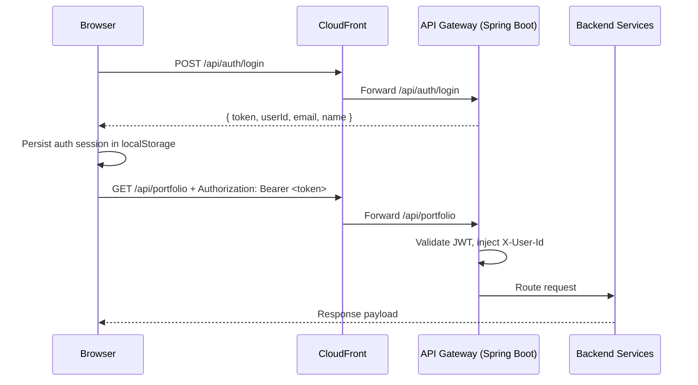

# Design Document: Static Export Auth Migration

## Overview

This migration removes all Next.js server-side API dependencies from the frontend and shifts auth token issuance to Spring Boot (`api-gateway`). The frontend becomes static-export compatible and manages auth state in browser storage.

## Current State

- Frontend contains route handlers under `frontend/src/app/api/auth/**`.
- Client hooks depend on `/api/auth/jwt` token exchange from Next.js runtime.
- Login/session UI uses Better Auth client runtime.
- `output: "export"` fails because route handlers are incompatible.

## Target State

1. `frontend/src/app/api/**` removed.
2. `api-gateway` provides `POST /api/auth/login` token issuance endpoint.
3. Frontend uses a browser session module:
   - Persist `{ token, userId, email, name }` in `localStorage`.
   - Provide read/write/clear utilities and a React hook for route guards.
4. Existing API fetch helpers continue using bearer token attachment.

## Architecture

## Component Changes

### Frontend

- Add `frontend/src/lib/auth/session.ts`
  - `loginWithBackend(email, password)`
  - `saveAuthSession()`, `loadAuthSession()`, `clearAuthSession()`
  - `useAuthSession()` hook with client-side pending/authenticated status
- Update page gates/components that use `useSession`:
  - `PortfolioPageContent`
  - `OverviewPageContent`
  - `MarketDataPageContent`
  - `UserMenu`
- Update `LoginPage` to call backend login endpoint and persist session.
- Update `useAuthenticatedUserId` to consume local storage-backed session instead of BFF `/api/auth/jwt`.
- Remove `frontend/src/app/api/**` route handlers/tests.

### Backend (`api-gateway`)

- Add `AuthController` with `POST /api/auth/login`.
- Add token signer utility using `AUTH_JWT_SECRET` (UTF-8 bytes, HS256, 1h expiry).
- Add credential properties for bootstrap auth (`app.auth.email/password/user-id/name`) with environment overrides.
- Permit `/api/auth/**` in security config.

## Security Notes

- JWT signing secret remains server-side only (`AUTH_JWT_SECRET`).
- Frontend stores JWT in `localStorage`; this is acceptable for this phase but carries XSS risk.
- Future hardening: move to HttpOnly cookie sessions and dedicated identity provider.

## Risks and Mitigations

- **Risk:** Credential bootstrap model is simplistic.
  - **Mitigation:** Keep endpoint contract stable so it can later validate against real user store.
- **Risk:** Existing Better Auth code remains in repository.
  - **Mitigation:** Remove runtime imports from app paths; dead code can be removed in a follow-up cleanup PR.
