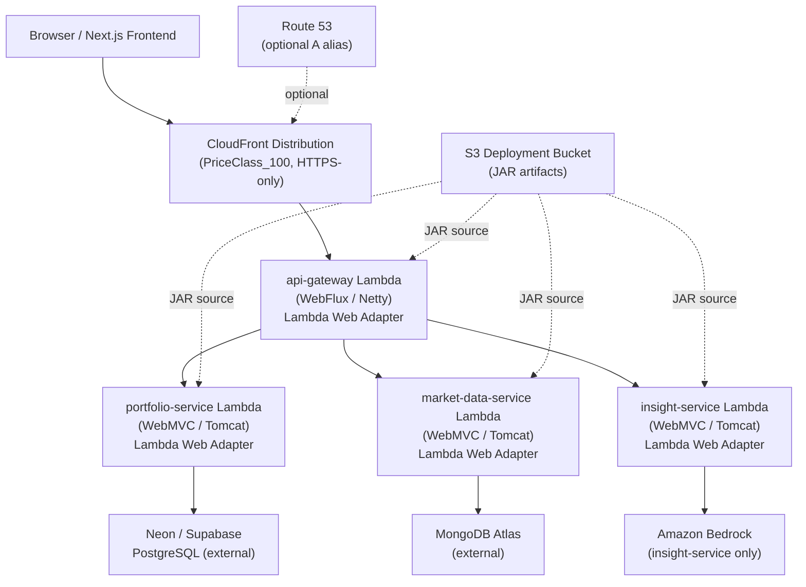

# Design Document: terraform-serverless-infra

## Overview

This design replaces the existing AWS CDK v2 (TypeScript) infrastructure with a Terraform-based
serverless stack. The four Spring Boot microservices — `api-gateway`, `portfolio-service`,
`market-data-service`, and `insight-service` — are each packaged as a fat JAR and deployed as AWS
Lambda functions using the AWS Lambda Web Adapter layer. A CloudFront distribution fronts the
`api-gateway` Lambda Function URL, replicating the routing role that the Docker Compose
`api-gateway` container plays in local development. All infrastructure stays within the AWS Always
Free Tier: no NAT Gateways, no provisioned databases, no ECS/Fargate, no ALB.

### Design Goals

- **Zero fixed cost** — Lambda + CloudFront + S3 + DynamoDB (on-demand) are all free-tier eligible.
- **No application code changes** — Lambda Web Adapter proxies HTTP to the embedded server on
  port 8080 for both the reactive (Netty/WebFlux) and servlet (Tomcat/WebMVC) stacks.
- **Portable modules** — `modules/compute` and `modules/networking` are cloud-agnostic in
  interface; only the provider block changes when retargeting to Azure.
- **Local parity** — `use_localstack = true` remaps every provider endpoint to LocalStack so the
  full `terraform apply` cycle can be validated without touching real AWS.
- **Secret hygiene** — sensitive values flow GitHub Actions Secrets → `TF_VAR_*` env vars →
  Terraform `sensitive` variables → Lambda environment variables. No Secrets Manager, no cost.

---

## Architecture

### Request Flow: Local Dev vs. AWS

```
LOCAL DEV (Docker Compose)
──────────────────────────
Browser / Frontend
  │  HTTP :8080
  ▼
api-gateway container (Spring Cloud Gateway WebFlux, Netty)
  │  PORTFOLIO_SERVICE_URL=http://portfolio-service:8081
  │  MARKET_DATA_SERVICE_URL=http://market-data-service:8082
  │  INSIGHT_SERVICE_URL=http://insight-service:8083
  ▼
portfolio-service / market-data-service / insight-service containers


AWS (Terraform Serverless)
──────────────────────────
Browser / Frontend
  │  HTTPS
  ▼
CloudFront Distribution (PriceClass_100, HTTPS-only)
  │  Origin: api-gateway Function URL (HTTPS)
  ▼
api-gateway Lambda  ←── Lambda Web Adapter (port 8080 → Netty/WebFlux)
  │  PORTFOLIO_SERVICE_URL  = portfolio-service Function URL
  │  MARKET_DATA_SERVICE_URL = market-data-service Function URL
  │  INSIGHT_SERVICE_URL    = insight-service Function URL
  ▼
portfolio-service Lambda     market-data-service Lambda     insight-service Lambda
(Tomcat/WebMVC)              (Tomcat/WebMVC)                (Tomcat/WebMVC)
Lambda Web Adapter           Lambda Web Adapter             Lambda Web Adapter
```

CloudFront acts as "the bouncer" — the single public HTTPS entry point. The `api-gateway` Lambda
is the only origin; downstream service Function URLs are private (reachable only by the
`api-gateway` Lambda over the public internet, no VPC required).

### Component Diagram



---

## Components and Interfaces

### Directory / File Tree

```
infrastructure/
├── terraform/
│   ├── main.tf                    # Root: instantiates compute + networking modules
│   ├── variables.tf               # All root input variables
│   ├── outputs.tf                 # Public endpoint URL output
│   ├── versions.tf                # required_providers, terraform version constraint
│   ├── terraform.tfvars.example   # Documented placeholder values for onboarding
│   ├── localstack.tfvars          # use_localstack=true + stub secrets
│   ├── .terraform.lock.hcl        # Pinned provider versions (committed)
│   ├── README.md                  # LocalStack setup, bootstrap sequence, CI usage
│   │
│   ├── bootstrap/                 # Standalone config — run ONCE before main init
│   │   ├── main.tf                # aws_s3_bucket (state) + aws_dynamodb_table (lock)
│   │   ├── variables.tf
│   │   └── outputs.tf
│   │
│   └── modules/
│       ├── compute/
│       │   ├── main.tf            # aws_lambda_function × 4, aws_iam_role × 4,
│       │   │                      # aws_lambda_function_url × 4,
│       │   │                      # aws_lambda_alias + aws_lambda_provisioned_concurrency_config
│       │   ├── variables.tf       # s3_bucket, s3_key_*, connection strings, service URLs
│       │   └── outputs.tf         # function_url_* for each service
│       │
│       └── networking/
│           ├── main.tf            # aws_cloudfront_distribution, aws_route53_record (optional),
│           │                      # aws_acm_certificate (optional)
│           ├── variables.tf       # origin_url, domain_name, acm_certificate_arn, zone_id
│           └── outputs.tf         # cloudfront_domain_name
```

### Root Module (`terraform/`)

Responsibilities:

- Declares the AWS provider with the `use_localstack` toggle.
- Instantiates `module.compute` and `module.networking`, wiring outputs between them.
- Declares the S3 remote state backend.
- Declares the S3 deployment artifact bucket.
- Exposes the final public URL as an output.

### Compute Module (`modules/compute`)

Responsibilities:

- One `aws_lambda_function` per service (4 total).
- One `aws_iam_role` + `aws_iam_role_policy_attachment` per function.
- One `aws_lambda_function_url` per function.
- SnapStart via `snap_start { apply_on = "PublishedVersions" }` + `publish = true`.
- Environment variable injection (Spring profile, DB URLs, service-to-service URLs, secrets).

### Networking Module (`modules/networking`)

Responsibilities:

- `aws_cloudfront_distribution` with the `api-gateway` Function URL as origin.
- Optional `aws_route53_record` (A alias) when `domain_name` is provided.
- Optional ACM certificate association.

### Bootstrap (`bootstrap/`)

A standalone Terraform root that provisions the remote state backend resources. Run once before
`terraform init` in the main root. It uses a local state file (not the S3 backend it is creating).

---

## Data Models

### Terraform Variable Contracts

#### Root `variables.tf`

| Variable                     | Type     | Sensitive | Default       | Description                                    |
| ---------------------------- | -------- | --------- | ------------- | ---------------------------------------------- |
| `use_localstack`             | `bool`   | no        | `false`       | Toggle LocalStack vs. real AWS                 |
| `aws_region`                 | `string` | no        | `"us-east-1"` | Target AWS region                              |
| `state_bucket_name`          | `string` | no        | —             | S3 bucket for Terraform state                  |
| `lock_table_name`            | `string` | no        | —             | DynamoDB table for state locking               |
| `artifact_bucket_name`       | `string` | no        | —             | S3 bucket for Lambda JARs                      |
| `lambda_adapter_layer_arn`   | `string` | no        | —             | ARN of the Lambda Web Adapter layer            |
| `postgres_connection_string` | `string` | **yes**   | —             | Neon/Supabase JDBC URL                         |
| `mongodb_connection_string`  | `string` | **yes**   | —             | MongoDB Atlas URI                              |
| `auth_jwt_secret`            | `string` | **yes**   | —             | JWT signing secret (local profile only)        |
| `auth_jwk_uri`               | `string` | no        | —             | JWK endpoint URI (aws profile)                 |
| `s3_key_api_gateway`         | `string` | no        | —             | S3 object key for api-gateway JAR              |
| `s3_key_portfolio`           | `string` | no        | —             | S3 object key for portfolio-service JAR        |
| `s3_key_market_data`         | `string` | no        | —             | S3 object key for market-data-service JAR      |
| `s3_key_insight`             | `string` | no        | —             | S3 object key for insight-service JAR          |
| `domain_name`                | `string` | no        | `""`          | Custom domain (empty = use CloudFront default) |
| `acm_certificate_arn`        | `string` | no        | `""`          | ACM cert ARN (required when domain_name set)   |
| `route53_zone_id`            | `string` | no        | `""`          | Route 53 hosted zone ID                        |

#### Compute Module `variables.tf` (subset passed from root)

The compute module accepts all of the above except networking-specific variables. It exposes:

| Output                     | Description                                |
| -------------------------- | ------------------------------------------ |
| `api_gateway_function_url` | HTTPS Function URL for api-gateway         |
| `portfolio_function_url`   | HTTPS Function URL for portfolio-service   |
| `market_data_function_url` | HTTPS Function URL for market-data-service |
| `insight_function_url`     | HTTPS Function URL for insight-service     |

#### Networking Module `variables.tf`

| Variable              | Description                                           |
| --------------------- | ----------------------------------------------------- |
| `origin_url`          | api-gateway Function URL (from compute module output) |
| `domain_name`         | Optional custom domain                                |
| `acm_certificate_arn` | Optional ACM cert ARN                                 |
| `route53_zone_id`     | Optional hosted zone ID                               |

---

## Key Design Decisions

### Lambda Web Adapter — Reactive vs. Servlet

Both `api-gateway` (Spring Cloud Gateway WebFlux / Netty) and the three downstream services
(Spring WebMVC / Tomcat) work identically with the Lambda Web Adapter. The adapter does not care
about the HTTP framework — it simply:

1. Receives the Lambda invocation payload (HTTP event from Function URL).
2. Translates it into a plain HTTP/1.1 request.
3. Forwards it to `http://localhost:8080` (the embedded server, whether Netty or Tomcat).
4. Reads the HTTP response and translates it back into a Lambda response payload.

No application code changes are required. The adapter is attached as a Lambda layer; the JAR is
unchanged. The `AWS_LAMBDA_EXEC_WRAPPER=/opt/bootstrap` environment variable (set by the layer
itself) intercepts the Lambda bootstrap and starts the adapter process before the JVM.

### SnapStart

SnapStart is enabled on all four functions via:

```hcl
snap_start {
  apply_on = "PublishedVersions"
}
publish = true
```

`publish = true` causes Terraform to publish a new numbered version on every `apply`, which
triggers a new SnapStart snapshot. The `aws_lambda_function_url` is attached to `$LATEST` (not
the published version) to avoid the need for alias management in the free-tier setup. If alias
routing is needed later, an `aws_lambda_alias` pointing to the published version can be added.

### Provider Toggle (LocalStack)

The provider block uses a conditional `dynamic` block pattern to inject custom endpoints only when
`use_localstack = true`:

```hcl
# versions.tf
terraform {
  required_version = ">= 1.6.0"
  required_providers {
    aws = {
      source  = "hashicorp/aws"
      version = ">= 5.0"
    }
  }
}

# main.tf
locals {
  localstack_endpoint = "http://localhost:4566"
}

provider "aws" {
  region                      = var.aws_region
  access_key                  = var.use_localstack ? "test" : null
  secret_key                  = var.use_localstack ? "test" : null
  skip_credentials_validation = var.use_localstack
  skip_metadata_api_check     = var.use_localstack
  skip_requesting_account_id  = var.use_localstack

  dynamic "endpoints" {
    for_each = var.use_localstack ? [1] : []
    content {
      lambda     = local.localstack_endpoint
      s3         = local.localstack_endpoint
      dynamodb   = local.localstack_endpoint
      cloudfront = local.localstack_endpoint
      iam        = local.localstack_endpoint
      acm        = local.localstack_endpoint
      route53    = local.localstack_endpoint
    }
  }
}
```

When `use_localstack = false` (the default), the `dynamic "endpoints"` block produces zero
iterations and the provider uses standard AWS credential resolution
(`AWS_ACCESS_KEY_ID` / `AWS_SECRET_ACCESS_KEY` / `AWS_REGION` environment variables in CI).

### Secret Injection Flow

Sensitive values never appear in source-controlled files. The flow is:

```
GitHub Actions Secrets (repository settings)
  │  AWS_ACCESS_KEY_ID, AWS_SECRET_ACCESS_KEY, AWS_REGION
  │  TF_VAR_postgres_connection_string
  │  TF_VAR_mongodb_connection_string
  │  TF_VAR_auth_jwt_secret
  │  TF_VAR_auth_jwk_uri
  │
  ▼  (GitHub Actions job: env: block)
Terraform process environment
  │  Terraform reads TF_VAR_* automatically as variable values
  │  Variables declared sensitive=true → never printed in plan/apply output
  │
  ▼  (modules/compute/main.tf: environment block)
Lambda function environment variables
  │  SPRING_DATASOURCE_URL   = var.postgres_connection_string
  │  SPRING_DATA_MONGODB_URI = var.mongodb_connection_string
  │  AUTH_JWT_SECRET         = var.auth_jwt_secret  (local profile only)
  │  AUTH_JWK_URI            = var.auth_jwk_uri     (aws profile)
  │
  ▼  (Lambda execution)
Spring Boot reads env vars at startup via ${SPRING_DATASOURCE_URL} in application-aws.yml
```

No AWS Secrets Manager, no Parameter Store, no cost. The `sensitive = true` declaration on the
Terraform variables ensures the values are redacted in `terraform plan` output and in the
Terraform state file (stored encrypted in S3 with versioning).

### GitHub Actions CI Workflow (integration points)

```yaml
# .github/workflows/terraform.yml (sketch)
env:
  AWS_ACCESS_KEY_ID: ${{ secrets.AWS_ACCESS_KEY_ID }}
  AWS_SECRET_ACCESS_KEY: ${{ secrets.AWS_SECRET_ACCESS_KEY }}
  AWS_REGION: ${{ secrets.AWS_REGION }}
  TF_VAR_postgres_connection_string: ${{ secrets.POSTGRES_CONNECTION_STRING }}
  TF_VAR_mongodb_connection_string: ${{ secrets.MONGODB_CONNECTION_STRING }}
  TF_VAR_auth_jwk_uri: ${{ secrets.AUTH_JWK_URI }}

steps:
  - run: terraform init
    working-directory: infrastructure/terraform
  - run: terraform validate
    working-directory: infrastructure/terraform
  - run: terraform plan -out=tfplan
    working-directory: infrastructure/terraform
  - run: terraform apply tfplan # main branch only
    working-directory: infrastructure/terraform
```

### Bootstrap Sequence

Before the first `terraform init` in the main root, the state backend must exist:

```
1. cd infrastructure/terraform/bootstrap
2. terraform init          # uses local state
3. terraform apply         # creates S3 state bucket + DynamoDB lock table
4. cd ../                  # back to main root
5. terraform init          # now the S3 backend is reachable
6. terraform apply -var-file=terraform.tfvars
```

The bootstrap directory uses a local state file (`.terraform/terraform.tfstate` inside
`bootstrap/`). It is safe to commit the bootstrap state file since it contains no secrets.

### Free Tier Guardrails

The following resource types are structurally absent from all `.tf` files:

- `aws_ecs_cluster`, `aws_ecs_service`, `aws_ecs_task_definition`
- `aws_lb`, `aws_lb_listener`
- `aws_nat_gateway`, `aws_internet_gateway` (no VPC at all)
- `aws_db_instance`, `aws_rds_cluster`, `aws_docdb_cluster`
- `aws_elasticache_cluster`, `aws_elasticache_replication_group`

Lambda concurrency is capped at `reserved_concurrent_executions = 10` per function. CloudFront
uses `price_class = "PriceClass_100"`.

---

## Correctness Properties

_A property is a characteristic or behavior that should hold true across all valid executions of a
system — essentially, a formal statement about what the system should do. Properties serve as the
bridge between human-readable specifications and machine-verifiable correctness guarantees._

This feature is primarily Infrastructure as Code (Terraform HCL). The majority of acceptance
criteria describe declarative resource configuration (CloudFront price class, IAM role
attachments, S3 versioning flags) rather than functions with varying input/output behavior.
Property-based testing is not appropriate for IaC configuration itself.

However, two areas of this design contain logic that varies meaningfully with input and is
testable as properties:

1. **The provider toggle logic** — the conditional endpoint injection is a pure function of
   `use_localstack`.
2. **The secret injection mapping** — the mapping from Terraform variable values to Lambda
   environment variable names is a deterministic transformation that should be verified for all
   four functions.

For the IaC layer, the testing strategy uses Terraform's built-in validation tools and LocalStack
integration tests rather than property-based tests.

### Property 1: Provider endpoint toggle is exclusive

_For any_ Terraform configuration where `use_localstack = true`, every AWS service endpoint
configured in the provider block SHALL point to `http://localhost:4566`, and no real AWS endpoint
SHALL be contacted. Conversely, when `use_localstack = false`, no custom endpoint overrides SHALL
be present in the provider configuration.

**Validates: Requirements 2.2, 2.3**

### Property 2: Sensitive variable values are never exposed in plan output

_For any_ value assigned to `postgres_connection_string`, `mongodb_connection_string`, or
`auth_jwt_secret`, the string `terraform plan` produces SHALL NOT contain the literal value of
those variables — it SHALL contain only `(sensitive value)` in their place.

**Validates: Requirements 7.4**

### Property 3: Lambda environment variable injection completeness

_For any_ set of valid input variable values passed to the compute module, every Lambda function
SHALL have `SPRING_PROFILES_ACTIVE=aws` present in its environment block, and each function that
requires a connection string SHALL have the corresponding environment variable key present with a
non-empty value.

**Validates: Requirements 4.7, 5.6, 6.2, 6.3, 13.1**

### Property 4: Free-tier resource exclusion invariant

_For any_ valid combination of input variables, `terraform plan` SHALL NOT include a planned
creation or update of any resource whose type is in the prohibited set:
`{aws_ecs_cluster, aws_ecs_service, aws_lb, aws_nat_gateway, aws_db_instance, aws_rds_cluster,
aws_docdb_cluster, aws_elasticache_cluster}`.

**Validates: Requirements 8.1, 8.4, 15.1**

### Property 5: Module output wiring round-trip

_For any_ compute module instantiation, the `api_gateway_function_url` output SHALL be a valid
HTTPS URL, and when that URL is passed as `origin_url` to the networking module, the CloudFront
distribution's origin domain SHALL equal the hostname extracted from that URL.

**Validates: Requirements 9.1, 9.6**

### Property 6: Route 53 record conditional creation

_For any_ value of `domain_name`, an `aws_route53_record` resource SHALL appear in the plan if
and only if `domain_name` is a non-empty string. When `domain_name` is empty or omitted, no
Route 53 record resource SHALL be present in the plan.

**Validates: Requirements 10.1, 10.3**

### Property 7: Lambda concurrency cap invariant

_For any_ Lambda function resource produced by the compute module, the
`reserved_concurrent_executions` attribute SHALL be set to a value greater than 0 and no greater
than 10, ensuring no single function can exhaust the free-tier invocation budget.

**Validates: Requirements 15.2**

---

## Error Handling

### Provider Connectivity Errors

When `use_localstack = true` and LocalStack is unreachable, the AWS provider will surface a
connection refused error during `terraform init` or the first resource operation. Terraform's
default HTTP timeout (30 s) satisfies Requirement 2.5 without additional configuration.

### Missing Sensitive Variables

If `postgres_connection_string` or `mongodb_connection_string` are not provided (no `TF_VAR_*`
env var, no `.tfvars` file), Terraform will prompt interactively or fail in CI with:
`Error: No value for required variable`. This is the correct behavior — the apply must not
proceed with empty connection strings.

### SnapStart Publish Failures

If a Lambda function fails to publish a new version (e.g., code package too large), Terraform
will surface the AWS API error and roll back. The `publish = true` flag ensures this is caught at
apply time, not silently deferred.

### State Lock Conflicts

When two `terraform apply` processes run concurrently, the second will receive:
`Error: Error acquiring the state lock`. The DynamoDB lock table enforces this. The error message
includes the lock holder's ID and timestamp, enabling manual release via `terraform force-unlock`
if a process dies mid-apply.

### LocalStack Resource Gaps

Some AWS resources have partial LocalStack support (e.g., CloudFront distributions are emulated
but not fully functional). The `localstack.tfvars` file and README document which resources are
validated locally vs. requiring a real AWS apply for full verification.

---

## Testing Strategy

### Layer 1: Terraform Validate (Static)

```bash
terraform validate
```

Catches HCL syntax errors, missing required arguments, and type mismatches. Run in CI on every
pull request. Zero configuration required beyond `terraform init`.

### Layer 2: LocalStack Integration Tests

```bash
# Start LocalStack alongside existing dev services
docker compose -f docker-compose.yml -f docker-compose.localstack.yml up -d localstack

# Apply against LocalStack
cd infrastructure/terraform
terraform apply -var-file=localstack.tfvars -auto-approve

# Verify resources were created
terraform output
aws --endpoint-url=http://localhost:4566 lambda list-functions
aws --endpoint-url=http://localhost:4566 s3 ls

# Teardown
terraform destroy -var-file=localstack.tfvars -auto-approve
```

The `docker-compose.localstack.yml` snippet to add to the project:

```yaml
services:
  localstack:
    image: localstack/localstack:latest
    ports:
      - "4566:4566"
    environment:
      SERVICES: lambda,s3,dynamodb,cloudfront,iam,acm,route53
      DEFAULT_REGION: us-east-1
```

### Layer 3: Terraform Plan Assertions (CI)

In the GitHub Actions PR workflow, `terraform plan -out=tfplan` followed by
`terraform show -json tfplan` produces a machine-readable plan. A lightweight script (Python or
`jq`) asserts:

- No prohibited resource types appear in `resource_changes`.
- All four Lambda functions appear in `resource_changes` with `actions = ["create"]` or
  `["update"]`.
- `reserved_concurrent_executions` ≤ 10 for every Lambda resource.
- CloudFront `price_class = "PriceClass_100"`.
- All sensitive variable references show `"(sensitive value)"` in the plan JSON.

These assertions implement Properties 2, 3, 4, 5, 6, and 7 as automated checks without requiring a
real AWS account.

### Layer 4: Unit Tests for Terraform Modules (Terratest — optional)

If Go tooling is available in CI, Terratest can be used to apply the LocalStack configuration and
assert on the resulting state programmatically. This is optional given the plan assertion approach
above covers the same properties.

### Property-Based Testing Applicability

PBT is not applied to the IaC layer itself (declarative HCL configuration). The correctness
properties above are validated through:

- **Properties 1, 4**: `terraform plan` JSON assertions (deterministic, no randomization needed).
- **Property 2**: `terraform plan` output text scan for sensitive variable values.
- **Property 3**: `terraform show -json` state inspection after LocalStack apply.
- **Properties 5, 6**: Output value inspection after LocalStack apply.
- **Property 7**: `terraform show -json` state inspection — `reserved_concurrent_executions` ≤ 10 for all Lambda resources.

If the project later adds a Go or Python helper library that transforms Terraform outputs (e.g.,
a script that parses plan JSON and generates a cost report), property-based testing with
`hypothesis` (Python) or `gopter` (Go) would be appropriate for that transformation logic.
