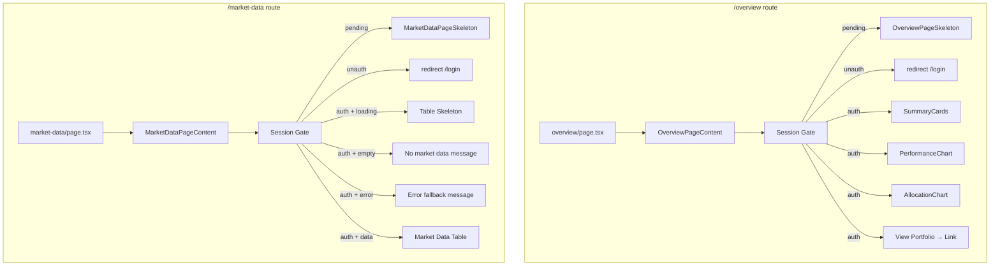
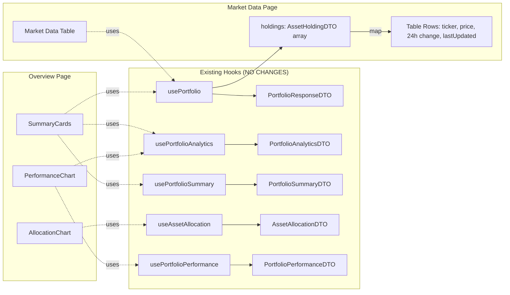

# Design Document: UI Polish — Overview & Market Data Pages

## Overview

This feature replaces the placeholder stubs on the `/overview` and `/market-data` dashboard routes with fully functional, session-gated client components. Both new components follow the established `PortfolioPageContent` pattern: a `"use client"` directive, a `useSession()` gate with skeleton → redirect → render flow, and composition of existing UI primitives and data hooks.

No new hooks, API calls, or backend changes are introduced. The Overview page composes `SummaryCards`, `PerformanceChart`, and `AllocationChart` into a high-level snapshot with a "View Portfolio →" link. The Market Data page derives a price ticker table from the existing `usePortfolio()` hook's `holdings` array.

### Design Decisions

1. **Reuse over creation** — Both pages consume existing TanStack Query hooks (`usePortfolio`, `usePortfolioAnalytics`, `usePortfolioSummary`, `useAssetAllocation`, `usePortfolioPerformance`) and existing chart/card components. This avoids cache duplication and keeps bundle size minimal.
2. **Session gate pattern** — Identical to `PortfolioPageContent`: `useSession()` + `useEffect` redirect. This keeps auth behavior consistent across all dashboard pages.
3. **Market data derived from holdings** — Rather than introducing a new API endpoint, the market data table maps over `AssetHoldingDTO[]` from `usePortfolio()`. Each holding already carries `ticker`, `currentPrice`, `change24hPercent`, `change24hAbsolute`, and `lastUpdatedAt`.
4. **No HoldingsTable on Overview** — The Overview page is intentionally a summary view. The detailed holdings table remains exclusive to `/portfolio`, with a "View Portfolio →" link bridging the two.

## Architecture

### Component Hierarchy



### Data Flow



Both pages share the TanStack Query cache — navigating between Overview, Portfolio, and Market Data reuses cached data without redundant network requests.

## Components and Interfaces

### OverviewPageContent

**File:** `frontend/src/components/overview/OverviewPageContent.tsx`

```typescript
// "use client" component
// No props — self-contained with session gate

export function OverviewPageContent(): JSX.Element;
```

**Internal structure:**

- `OverviewPageSkeleton` — loading state matching the Overview layout (3 summary card skeletons, 2-col + 1-col chart skeletons, link placeholder skeleton)
- Session gate: `useSession()` + `useRouter()` + `useEffect` redirect pattern
- Authenticated render:
  - Row 1: `<SummaryCards />` in `grid-cols-1 sm:grid-cols-3`
  - Row 2: `<PerformanceChart />` (col-span-2) + `<AllocationChart />` (col-span-1) in `grid-cols-1 lg:grid-cols-3`
  - Row 3: Card with `<Link href="/portfolio">` containing "View Portfolio →" text

**Imports (all existing):**

- `useSession` from `@/lib/auth-client`
- `useRouter` from `next/navigation`
- `useEffect` from `react`
- `SummaryCards` from `@/components/portfolio/SummaryCards`
- `PerformanceChart` from `@/components/charts/PerformanceChart`
- `AllocationChart` from `@/components/charts/AllocationChart`
- `Card`, `CardContent`, `CardHeader`, `Skeleton` from UI primitives
- `Link` from `next/link`

### MarketDataPageContent

**File:** `frontend/src/components/market/MarketDataPageContent.tsx`

```typescript
// "use client" component
// No props — self-contained with session gate

export function MarketDataPageContent(): JSX.Element;
```

**Internal structure:**

- `MarketDataPageSkeleton` — session-pending skeleton (card with header + row placeholders)
- `MarketDataTableSkeleton` — data-loading skeleton (table rows inside a Card)
- Session gate: same `useSession()` + `useRouter()` + `useEffect` pattern
- Authenticated render:
  - Calls `usePortfolio()` to get `holdings: AssetHoldingDTO[]`
  - Loading state: `MarketDataTableSkeleton`
  - Empty state: "No market data available" message inside a Card
  - Error state: "Unable to load market data" fallback message inside a Card
  - Data state: `Card` > `Table` with columns:
    - **Ticker** — `holding.ticker` (monospace Badge)
    - **Current Price** — `formatCurrency(holding.currentPrice)`
    - **24h Change** — `formatPercent(holding.change24hPercent)` + `formatSignedCurrency(holding.change24hAbsolute)`, green for positive / red for negative
    - **Last Updated** — `formatDate(holding.lastUpdatedAt)`

**Imports (all existing):**

- `useSession` from `@/lib/auth-client`
- `useRouter` from `next/navigation`
- `useEffect` from `react`
- `usePortfolio` from `@/lib/hooks/usePortfolio`
- `Card`, `CardContent`, `CardHeader`, `CardTitle`, `CardDescription` from UI primitives
- `Table`, `TableHeader`, `TableBody`, `TableRow`, `TableHead`, `TableCell` from UI primitives
- `Badge`, `Skeleton` from UI primitives
- `formatCurrency`, `formatPercent`, `formatSignedCurrency`, `formatDate` from `@/lib/utils/format`
- `cn` from `@/lib/utils/cn`

### Route Page Modifications

**`frontend/src/app/(dashboard)/overview/page.tsx`:**

- Import and render `<OverviewPageContent />`
- Retain "Overview" heading as page title

**`frontend/src/app/(dashboard)/market-data/page.tsx`:**

- Import and render `<MarketDataPageContent />`
- Retain "Market Data" heading as page title

## Data Models

No new data models are introduced. Both components consume existing types:

| Type                    | Source                            | Used By                                    |
| ----------------------- | --------------------------------- | ------------------------------------------ |
| `AssetHoldingDTO`       | `frontend/src/types/portfolio.ts` | MarketDataPageContent (table rows)         |
| `PortfolioResponseDTO`  | `frontend/src/types/portfolio.ts` | MarketDataPageContent (via `usePortfolio`) |
| `PortfolioSummaryDTO`   | `frontend/src/types/portfolio.ts` | SummaryCards (existing)                    |
| `PortfolioAnalyticsDTO` | `frontend/src/types/portfolio.ts` | SummaryCards, PerformanceChart (existing)  |
| `AllocationSliceDTO`    | `frontend/src/types/portfolio.ts` | AllocationChart (existing)                 |
| `PerformanceDataPoint`  | `frontend/src/types/portfolio.ts` | PerformanceChart (existing)                |

**Key fields used by MarketDataPageContent from `AssetHoldingDTO`:**

- `ticker: string` — displayed in a Badge
- `currentPrice: number` — formatted as currency
- `change24hPercent: number` — formatted as percent, color-coded
- `change24hAbsolute: number` — formatted as signed currency
- `lastUpdatedAt: string` — formatted as date

## Correctness Properties

_A property is a characteristic or behavior that should hold true across all valid executions of a system — essentially, a formal statement about what the system should do. Properties serve as the bridge between human-readable specifications and machine-verifiable correctness guarantees._

### Property 1: Holdings-to-rows data integrity

_For any_ array of `AssetHoldingDTO` objects returned by `usePortfolio()`, the MarketDataPageContent table SHALL render exactly one row per holding, and each row SHALL contain the holding's `ticker`, `formatCurrency(currentPrice)`, `formatPercent(change24hPercent)`, and `formatSignedCurrency(change24hAbsolute)` values.

**Validates: Requirements 5.2**

### Property 2: Change indicator color correctness

_For any_ `AssetHoldingDTO` with a numeric `change24hPercent` value, the 24h change cell SHALL apply green (profit) styling when `change24hPercent >= 0` and red (loss) styling when `change24hPercent < 0`.

**Validates: Requirements 5.3, 5.4**

## Error Handling

| Scenario              | Component             | Behavior                                                                                                                                                                           |
| --------------------- | --------------------- | ---------------------------------------------------------------------------------------------------------------------------------------------------------------------------------- |
| Session pending       | OverviewPageContent   | Render `OverviewPageSkeleton` — skeleton cards, chart placeholders, link placeholder                                                                                               |
| Session pending       | MarketDataPageContent | Render `MarketDataPageSkeleton` — skeleton card with header and row placeholders                                                                                                   |
| Unauthenticated       | Both                  | `router.replace("/login")`, render `null`                                                                                                                                          |
| Portfolio loading     | MarketDataPageContent | Render `MarketDataTableSkeleton` inside a Card (table row skeletons)                                                                                                               |
| Empty holdings        | MarketDataPageContent | Render "No market data available" message inside a Card                                                                                                                            |
| Portfolio fetch error | MarketDataPageContent | Render "Unable to load market data" fallback message inside a Card (no crash)                                                                                                      |
| Child component error | OverviewPageContent   | Existing components (SummaryCards, PerformanceChart, AllocationChart) handle their own loading/error states internally — no additional error boundary needed at the Overview level |

Note: The existing chart and card components already handle their own loading and empty states (e.g., `SummaryCards` shows its own skeleton, `PerformanceChart` shows "No performance data available"). The Overview page delegates error handling to these children.

## Testing Strategy

### Unit Tests (Vitest + Testing Library)

Unit tests cover specific scenarios and edge cases. These are example-based tests using mocked hooks.

**OverviewPageContent tests:**

- Renders skeleton when session is pending
- Redirects to `/login` when unauthenticated
- Renders nothing (null) after redirect
- Renders SummaryCards, PerformanceChart, AllocationChart when authenticated
- Does NOT render HoldingsTable
- Renders "View Portfolio →" link with `href="/portfolio"`
- Page title "Overview" is present

**MarketDataPageContent tests:**

- Renders skeleton when session is pending
- Redirects to `/login` when unauthenticated
- Renders table skeleton when portfolio is loading
- Renders "No market data" fallback when holdings array is empty
- Renders error fallback when usePortfolio returns an error
- Renders table with correct column headers (Ticker, Current Price, 24h Change, Last Updated)
- Renders correct number of rows matching holdings count
- Renders Card and Table UI primitives

**Route integration tests:**

- `overview/page.tsx` renders OverviewPageContent
- `market-data/page.tsx` renders MarketDataPageContent

### Property-Based Tests (Vitest + fast-check)

Property-based tests verify universal properties across randomly generated inputs. Each test runs a minimum of 100 iterations.

**Library:** `fast-check` (already compatible with Vitest)

**Property Test 1:** Holdings-to-rows data integrity

- Generate random arrays of `AssetHoldingDTO` objects (varying length 1–50, random tickers, prices, change values)
- Render `MarketDataPageContent` with mocked `usePortfolio` returning the generated holdings
- Assert: number of table rows equals number of holdings
- Assert: each row contains the formatted ticker, price, and change values
- Tag: `Feature: ui-polish-overview-market-data, Property 1: Holdings-to-rows data integrity`
- Minimum iterations: 100

**Property Test 2:** Change indicator color correctness

- Generate random `AssetHoldingDTO` objects with `change24hPercent` drawn from the full numeric range (negative, zero, positive)
- Render the market data table row for each holding
- Assert: when `change24hPercent >= 0`, the change cell contains the profit color class (`text-profit` or green indicator)
- Assert: when `change24hPercent < 0`, the change cell contains the loss color class (`text-loss` or red indicator)
- Tag: `Feature: ui-polish-overview-market-data, Property 2: Change indicator color correctness`
- Minimum iterations: 100

### E2E Tests (Playwright)

E2E tests are out of scope for this feature — the existing Playwright suite already covers session gating and navigation. The new pages follow the same patterns and will be covered by future E2E additions if needed.
