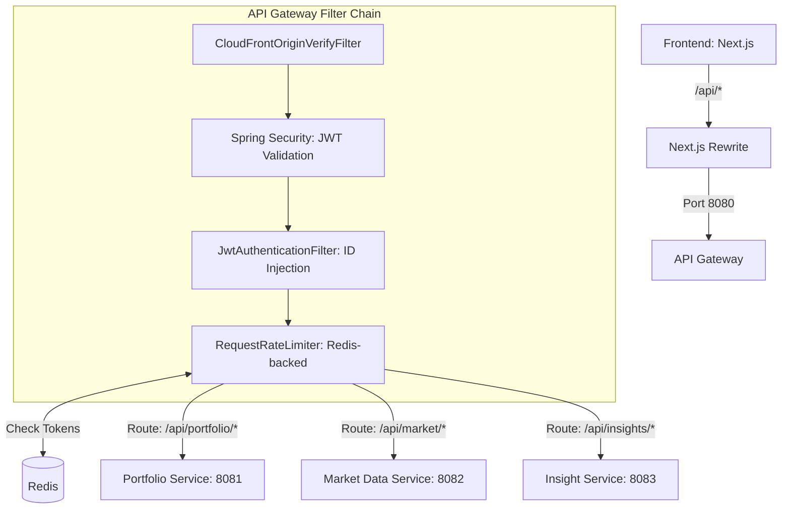

# API Gateway Service End-to-End (E2E) Flow

This document describes the flow of data and control for the `api-gateway-service` in the Wealth Management and Portfolio Tracker application, which serves as the entry point for all frontend requests to the microservice ecosystem.

## 1. Frontend Entry Point (Next.js)
The frontend application (Next.js) is configured via `frontend/next.config.ts` to rewrite all requests matching `/api/:path*` to the **API Gateway** running at `http://127.0.0.1:8080`.

- This abstraction allows the frontend to interact with a single endpoint, hiding the complexity of the backend microservice architecture.

## 2. API Gateway: Spring Cloud Gateway
The `api-gateway` is a Spring Boot application using **Spring Cloud Gateway**. Its primary responsibilities include routing, authentication, security filtering, and rate limiting.

### Routing Rules
Defined in `api-gateway/src/main/resources/application.yml`, the gateway routes traffic to downstream services based on the URL path:
- `/api/portfolio/**` → `http://localhost:8081` (`portfolio-service`)
- `/api/market/**` → `http://localhost:8082` (`market-data-service`)
- `/api/insights/**` → `http://localhost:8083` (`insight-service`)
- `/api/chat/**` → `http://localhost:8083` (`insight-service`)

## 3. Security Filter Chain
The Gateway implements a series of filters to ensure every request is valid and authenticated before being forwarded.

### A. CloudFront Origin Verification (`CloudFrontOriginVerifyFilter`)
- **Order**: `HIGHEST_PRECEDENCE`
- **Function**: Validates the `X-Origin-Verify` header against a configured secret (`CLOUDFRONT_ORIGIN_SECRET`). 
- **Purpose**: Prevents requests from bypassing the CloudFront distribution and hitting the backend infrastructure directly. In local development, this filter is a no-op if no secret is set.

### B. JWT Authentication (`JwtDecoderConfig` & `SecurityConfig`)
- **Function**: Validates the `Authorization: Bearer <JWT>` header.
- **Local Dev**: Uses a symmetric key (`AUTH_JWT_SECRET`) for JWT verification.
- **Production (AWS)**: Uses an asymmetric JWK set via `AUTH_JWK_URI`.

### C. User Identity Injection (`JwtAuthenticationFilter`)
- **Order**: `HIGHEST_PRECEDENCE + 2`
- **Function**: 
    1.  Strips any existing `X-User-Id` header to prevent spoofing.
    2.  Extracts the `sub` claim (Subject) from the validated JWT.
    3.  Injects the extracted user ID as a new `X-User-Id` header.
- **Result**: Downstream services can trust the `X-User-Id` header for authorization and personalization without needing to re-validate the JWT.

## 4. Rate Limiting (`GatewayRateLimitConfig`)
The Gateway implements request rate limiting to protect the system from abuse and ensure stability.

- **Storage**: Uses **Redis** (configured in `application-local.yml`) to maintain bucket tokens.
- **Key Resolution**: 
    - **Authenticated**: Uses the user's `sub` claim as the unique key.
    - **Anonymous**: Falls back to the client's IP address (extracted from `X-Forwarded-For` or the remote connection).
- **Default Limits**: 20 requests per second with a burst capacity of 40 tokens.

## Summary Flow Diagram

