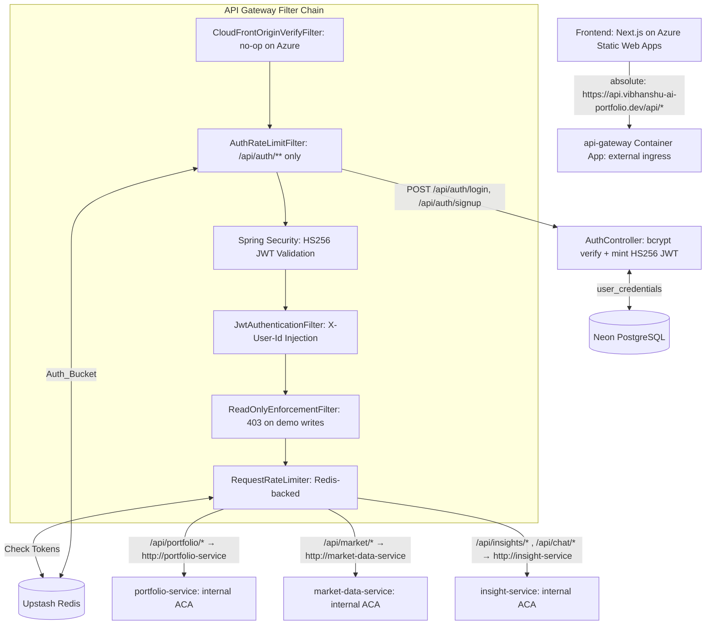

# API Gateway Service End-to-End (E2E) Flow

This document describes the flow of data and control for the `api-gateway` in the Wealth Management and Portfolio Tracker application, which serves as the single entry point for all frontend requests to the microservice ecosystem.

> **Deployment context (June 2026):** The platform is multi-cloud via Terraform, with **Azure as the active (live) cloud** and **AWS as a soft-disabled standby**. This document describes the live Azure topology; the AWS path is summarized at the end for reference. See `README.md` for the full multi-cloud overview.

## 1. Frontend Entry Point (Next.js 16 / React 19)
The frontend is a Next.js 16 / React 19 app, statically exported (`output: "export"` in `frontend/next.config.ts`) and hosted on **Azure Static Web Apps**.

Because the frontend (Static Web Apps) and the API (Container Apps) live on **separate subdomains**, the production build injects an **absolute** API origin at build time:

- **Local development:** `NEXT_PUBLIC_API_BASE_URL=http://127.0.0.1:8080` → the browser calls the gateway directly on port 8080 (Docker Compose).
- **Production (Azure):** `NEXT_PUBLIC_API_BASE_URL=https://api.vibhanshu-ai-portfolio.dev` (set in `deploy-azure.yml`) → the browser calls the api-gateway Container App directly via its custom subdomain.

The `apiPath()` helper (`frontend/src/lib/config/api.ts`) returns an absolute URL when `NEXT_PUBLIC_API_BASE_URL` is set, otherwise a relative `/api/*` path. In both supported environments the value is set, so all calls target a known gateway origin.

## 2. API Gateway: Spring Cloud Gateway
The `api-gateway` is a Spring Boot 4.1 application using **Spring Cloud Gateway (WebFlux)**. Its primary responsibilities are routing, authentication, security filtering, and rate limiting.

### Routing Rules
Routes are defined in `api-gateway/src/main/resources/application.yml`. Each route's target is indirected through an `${app.routes.*-url}` property so a target change touches exactly one line. Those properties resolve from environment variables (defaults shown for local Docker Compose):

| Route predicate | Property | Env var (default) |
| --------------- | -------- | ----------------- |
| `/api/portfolio/**` | `app.routes.portfolio-url` | `PORTFOLIO_SERVICE_URL` (`http://localhost:8081`) |
| `/api/market/**` | `app.routes.market-data-url` | `MARKET_DATA_SERVICE_URL` (`http://localhost:8082`) |
| `/api/insights/**` and `/api/chat/**` | `app.routes.insight-url` | `INSIGHT_SERVICE_URL` (`http://localhost:8083`) |
| `/api/internal/**` | (per-service) | seeder routes — see note below |

In production on Azure, these env vars are set to **ACA internal DNS names** (`http://portfolio-service`, `http://market-data-service`, `http://insight-service`); the ACA environment maps port 80 → each app's `target_port` (8080). Only the api-gateway has external ingress.

> **Internal seeder routes:** `/api/internal/**` routes are a "dumb router" path — no JWT, no origin verification, no `X-User-Id` injection at the gateway. Each downstream service validates an `X-Internal-Api-Key` itself (`InternalApiKeyFilter`). These exist for the Golden-State E2E seeder.

> **Auth endpoints are not routes:** `POST /api/auth/login` and `POST /api/auth/signup` are handled by `AuthController` **inside** the gateway, not proxied to a downstream service. This is why they are throttled by a dedicated `WebFilter` rather than a per-route `RequestRateLimiter` (see §3B and §4).

## 3. Security Filter Chain
The gateway runs a series of filters so every request is validated and authenticated before being forwarded.

### A. Origin Verification (`CloudFrontOriginVerifyFilter`)
- **Order:** `HIGHEST_PRECEDENCE`
- **Function:** Validates the `X-Origin-Verify` header against the `CLOUDFRONT_ORIGIN_SECRET` environment variable, rejecting requests that bypass the configured CDN.
- **On Azure (current):** `CLOUDFRONT_ORIGIN_SECRET` is **not set**, so this filter is a **no-op** — the api-gateway Container App is reachable directly at `api.vibhanshu-ai-portfolio.dev`. Origin protection on Azure relies on JWT authentication and CORS rather than a shared origin secret.
- **On AWS (standby):** CloudFront injects the secret header on every origin request, and the filter rejects any request hitting the Lambda Function URL directly.

### B. Auth Endpoint Throttling (`AuthRateLimitFilter`)
- **Order:** `HIGHEST_PRECEDENCE + 1`
- **Function:** Throttles `POST /api/auth/login` and `POST /api/auth/signup` against a shared `Auth_Bucket` key, using the `authRateLimiter` bean. Because these are controller endpoints rather than proxied routes, Spring Cloud Gateway's per-route `RequestRateLimiter` filter never sees them — hence a plain `WebFilter` ahead of the routing machinery.
- **Wiring note:** the `RedisRateLimiter` dependency **must** be `@Qualifier("authRateLimiter")`. An unqualified parameter silently resolves to the `@Primary` `standardRateLimiter` bean and enforces 10x-more-permissive limits while `Retry-After` still looks correct.

### C. Credential Verification & Token Minting (`AuthController` → `AuthenticationService` / `SignupService`)
- **Function:** The gateway **mints** the HS256 JWT (`JwtSigner`) after verifying a bcrypt-hashed credential from PostgreSQL. Claims: `sub` (user id), `email`, `name`, and `ro` (read-only flag).
- **Login failures are uniform:** every reason — unknown email, wrong password, blank fields, malformed stored hash — returns a byte-identical 401, and `AuthenticationService` burns equivalent CPU against a fixed dummy bcrypt hash so no branch is distinguishable by timing.
- **Signup:** `POST /api/auth/signup` inserts the `users` and `user_credentials` rows in a single transaction and returns 201 with a JWT; a duplicate email returns 409.
- **Datasource is opt-in per profile:** `GatewayAuthDataConfig` is gated on `spring.datasource.url` being present. Where it is absent, `GatewayAuthFallbackAutoConfiguration` supplies beans that fail **closed** with a 503 — the gateway still boots and still proxies, but no login can succeed.

### D. JWT Validation (`JwtDecoderConfig` & `SecurityConfig`)
- **Function:** Validates the `Authorization: Bearer <JWT>` header on every non-auth request.
- **All active profiles (local + production):** symmetric **HS256** verification using `AUTH_JWT_SECRET` (must be ≥ 32 bytes), the same secret the gateway signs with in §3C.
- **`AUTH_JWK_URI`:** present in config but **reserved for a future external-IdP profile** — it is not active in the current auth path.

### E. User Identity Injection (`JwtAuthenticationFilter`)
- **Order:** `HIGHEST_PRECEDENCE + 2` (after origin verification and Spring Security's JWT validation, before routing)
- **Function:**
    1. Strips any inbound `X-User-Id` header to prevent spoofing.
    2. Extracts the `sub` claim from the validated JWT.
    3. Injects it as a fresh `X-User-Id` header.
- **Result:** Downstream services trust `X-User-Id` for authorization/personalization without re-validating the JWT.

### F. Read-Only Account Enforcement (`ReadOnlyEnforcementFilter`)
- **Order:** `HIGHEST_PRECEDENCE + 3` (after identity injection, so the validated principal is available)
- **Function:** Rejects portfolio/market **write** methods with a 403 when the JWT carries `ro: true` — the read-only demo account used for the recruiter-facing showcase. AI routes (`/api/chat/**`, `/api/insights/generate/**`) are allowlisted so the demo can still exercise the assistant.
- **Reactive-composition caveat:** this filter and `JwtAuthenticationFilter` both once composed `switchIfEmpty` directly around a branch returning `chain.filter(exchange)`. Since `Mono<Void>` always completes empty, that re-subscribed the entire downstream chain a second time on every successful request — truncating chunked responses and, worse, forwarding a write downstream even while returning 403. Both now resolve the branch to a value before a single terminal `flatMap`. `ReadOnlyEnforcementFilterChainTest` and `JwtAuthenticationFilterChainTest` assert the subscription count. See `docs/changes/CHANGES_NEW_USER_SIGNUP_PROFILE_2026-08-12.md` (Phases 2–3).

## 4. Rate Limiting (`GatewayRateLimitConfig`)
The gateway supports Redis-backed request rate limiting (Lettuce; **Upstash** TLS `rediss://` in managed deployments, the `redis` Docker Compose service locally).

- **Key resolution:** authenticated requests key on the `sub` claim; anonymous requests fall back to client IP. In prod, the resolver takes the right-most (ingress-appended) `X-Forwarded-For` hop when `app.rate-limit.trust-xff-last-hop=true`, preventing bucket-spoofing.
- **Three named limiter beans**, all `@Profile("prod")` and wired by explicit SpEL per route — never a blanket `default-filters`:
  - `standardRateLimiter` (10 req/s, burst 20) — portfolio and market-data routes.
  - `strictRateLimiter` (~10 req/min, burst 5) — cost-sensitive AI routes.
  - `authRateLimiter` — `/api/auth/login` and `/api/auth/signup`, applied by `AuthRateLimitFilter` (§3B) rather than a route filter.
- **Profile awareness:** the `local` profile declares a `RequestRateLimiter` default-filter in `application-local.yml`; production enforcement landed in PR #82 — see `docs/changes/CHANGES_PRODUCTION_RATE_LIMITING_2026-07-05.md`.
- **Fail-open:** Redis unreachability never blocks gateway startup or rejects traffic; `RedisRateLimitStateLogger` logs `[INFRA-DEGRADED]` / `[INFRA-OK]` transitions. 429 responses carry a `Retry-After` header and a JSON body via `RateLimitDenialResponseCustomizer`.

## Summary Flow Diagram (Azure — live)

```mermaid
graph TD
    A[Frontend: Next.js on Azure Static Web Apps] -->|"absolute: https://api.vibhanshu-ai-portfolio.dev/api/*"| C[api-gateway Container App: external ingress]

    subgraph "API Gateway Filter Chain"
        C1[CloudFrontOriginVerifyFilter: no-op on Azure]
        CA[AuthRateLimitFilter: /api/auth/** only]
        C2[Spring Security: HS256 JWT Validation]
        C3[JwtAuthenticationFilter: X-User-Id Injection]
        CR[ReadOnlyEnforcementFilter: 403 on demo writes]
        C4[RequestRateLimiter: Redis-backed]

        C1 --> CA
        CA --> C2
        C2 --> C3
        C3 --> CR
        CR --> C4
    end

    CA -->|"POST /api/auth/login, /api/auth/signup"| AC["AuthController: bcrypt verify + mint HS256 JWT"]
    AC <-->|"user_credentials"| PG[(Neon PostgreSQL)]

    C4 <-->|Check Tokens| D[(Upstash Redis)]
    CA <-->|Auth_Bucket| D

    C4 -->|"/api/portfolio/* → http://portfolio-service"| E[portfolio-service: internal ACA]
    C4 -->|"/api/market/* → http://market-data-service"| F[market-data-service: internal ACA]
    C4 -->|"/api/insights/* , /api/chat/* → http://insight-service"| G[insight-service: internal ACA]
```

## 5. Production Deployment Topology

### Azure — Active (Live)
The api-gateway is built as a container image (pushed to ACR) and deployed as an **Azure Container App** with **external ingress** in Central India. Provisioned by `infrastructure/terraform/azure` (`module.api_gateway`):

- **Profiles:** `SPRING_PROFILES_ACTIVE=prod,azure` (activates the Azure overlay — CORS, Redis health).
- **Ingress:** external; fronted by the `api.vibhanshu-ai-portfolio.dev` custom domain (Azure-managed TLS, Cloudflare DNS). Downstream services run with **internal** ingress only and are reached via ACA internal DNS.
- **Service discovery:** `PORTFOLIO_SERVICE_URL`, `MARKET_DATA_SERVICE_URL`, `INSIGHT_SERVICE_URL` are set to bare ACA app names (`http://portfolio-service`, etc.).
- **CORS:** `APP_CORS_ALLOWED_ORIGIN_PATTERNS` drives allowed origins (Static Web Apps hostname / custom domain).
- **Scaling:** `max_replicas = 3`; `min_replicas` is `var.api_gateway_min_replicas` (defaults to 0 / scale-to-zero). There is no active cold-start warming on Azure (the EventBridge warming module is AWS-only and parked); a daily synthetic monitor provides a liveness signal.
- **Rate-limit backend:** Upstash Redis (`rediss://`) via `SPRING_DATA_REDIS_*`.

### AWS — Soft-Disabled Standby
The original AWS stack remains provisioned via `infrastructure/terraform/aws` but is disabled at the DNS layer (apex CNAME renamed `_disabled-apex` in Cloudflare; deploy workflows are `workflow_dispatch`-only):

- api-gateway packaged as a container image and deployed as **AWS Lambda on arm64 / Graviton2** via the **Lambda Web Adapter**, with a `live` alias and a `Function URL` (`AuthType = NONE`).
- A single **CloudFront** distribution (`PriceClass_100`) fronts the Function URL and the static frontend bucket, injecting `X-Origin-Verify` (validated by `CloudFrontOriginVerifyFilter`).
- Downstream routing points at peer Lambda Function URLs (`*_SERVICE_URL` env vars); rate limiting uses the same Upstash Redis.
- `reserved_concurrent_executions` is intentionally omitted (ap-south-1 account cap is 10 unreserved); cold-start mitigation is the `warming` module (EventBridge + API Destinations → `/actuator/health`) plus optional provisioned concurrency.
