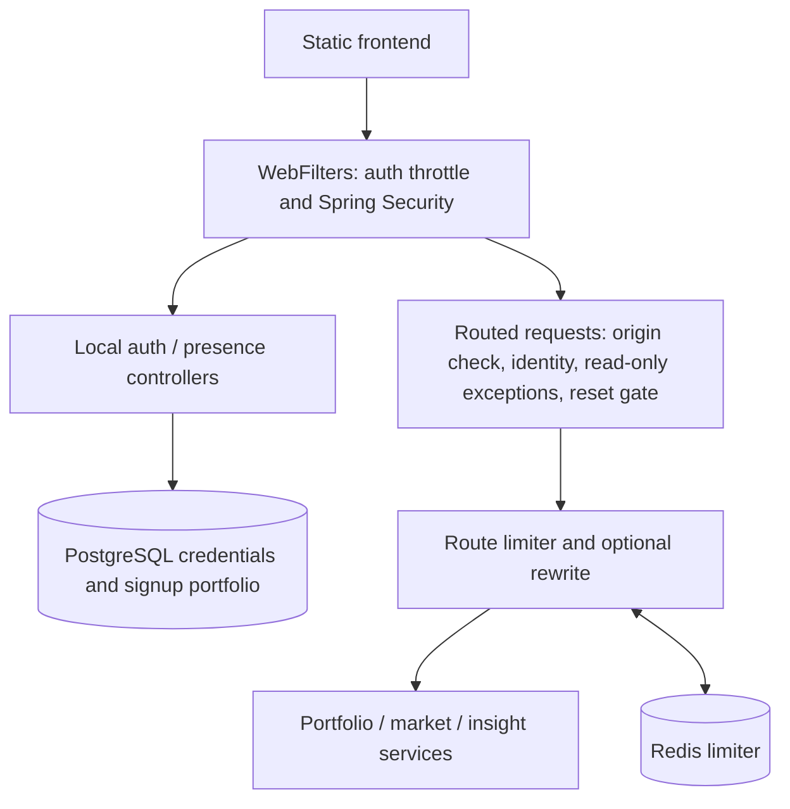

# API Gateway Service End-to-End Flow

**Source audit:** 2026-09-26 UTC against `main@8aa4035b`. This is an implementation guide,
not a new live test or cloud inventory. Runtime acceptance and known limitations remain in the
[demo dashboard](../plans/ASSET_PICKER_DEMO_PREPARATION_PLAN.md). Azure is the accepted demo
environment; AWS configuration is retained but is not a currently verified rollback target.

## 1. Browser entry and routing

The frontend is a Next.js static export, not a server-side Next.js API proxy.
[apiPath](../../frontend/src/lib/config/api.ts) builds URLs from the build-time
`NEXT_PUBLIC_API_BASE_URL`. The Azure deployment uses `https://api.vibhanshu-ai-portfolio.dev`;
local development must explicitly target the local gateway, normally port 8080. If unset,
the helper returns relative `/api/*` paths; this is not a proxy supplied by the static export.

Routes are defined in [base configuration](../../api-gateway/src/main/resources/application.yml)
and redeclared in [prod configuration](../../api-gateway/src/main/resources/application-prod.yml).
The prod list replaces the base list rather than merging into it.

| Public path | Handler / destination |
|---|---|
| `POST /api/auth/login`, `POST /api/auth/signup` | Gateway `AuthController`; not proxied routes |
| `GET /api/presence/demo` | Gateway `PresenceController`; authenticated |
| `/api/portfolio/**`, `/api/assets/**` | `PORTFOLIO_SERVICE_URL` |
| `/api/market/**` | `MARKET_DATA_SERVICE_URL` |
| `/api/insights/**`, `/api/chat/**` | `INSIGHT_SERVICE_URL` |
| `PUT /api/portfolio/demo-reset` | Higher-priority `demo-reset-manual` route to portfolio-service; rewrites to `/api/internal/portfolio/demo-reset` |
| `/api/internal/portfolio/**`, `/api/internal/market-data/**`, `/api/internal/insight/**` | Internal-key-gated downstream operations |

Base JVM targets default to localhost ports 8081/8082/8083. Root Docker Compose overrides them
with container hostnames and those ports. Azure uses bare internal ACA names such as
`http://portfolio-service`; internal ingress forwards to each service's port 8080.
[Terraform](../../infrastructure/terraform/azure/main.tf) configures external ingress only for
the gateway. Internal ingress is not an application-level authorization guarantee.

## 2. Authentication and controller requests

[AuthController](../../api-gateway/src/main/java/com/wealth/gateway/AuthController.java) owns login
and signup. JDBC/password work is delegated off the reactive event loop.

- Login verifies bcrypt credentials. Invalid credentials have a uniform 401 response; the service
  uses dummy bcrypt work for missing/invalid credential paths. This is a mitigation, not proof
  that network timing cannot disclose anything.
- [SignupService](../../api-gateway/src/main/java/com/wealth/gateway/auth/SignupService.java)
  transactionally inserts a user, credential and **empty portfolio**, and returns 201 with a JWT.
  Invalid fields produce 400, duplicate email 409, and provisioning failure 503.
- Auth beans depend on datasource configuration. The fallback configuration fails auth closed
  when the credential store is not configured; this does not make downstream routes disappear.
- [JwtSigner](../../api-gateway/src/main/java/com/wealth/gateway/JwtSigner.java) issues HS256 JWTs
  with `sub`, `email`, `name`, `ro`, `jti`, issue time and a one-hour expiry.
  [JwtDecoderConfig](../../api-gateway/src/main/java/com/wealth/gateway/JwtDecoderConfig.java)
  uses the shared secret (at least 32 UTF-8 bytes). The current path is not external-JWK login.
- Successful showcase login may invoke the bounded
  [DemoLoginResetOrchestrator](../../api-gateway/src/main/java/com/wealth/gateway/DemoLoginResetOrchestrator.java):
  eligibility observation precedes a versioned reset; optional reset failure does not fail login.
  The login response waits for that optional flow to finish or time out: the default overall
  bound is 60 seconds, including observation/reset. Do not assume every login resets the portfolio.
- Client logout clears the local session; it does **not** revoke an already issued JWT.
  Post-logout token acceptance remains a recorded, accepted demo limitation.

[SecurityConfig](../../api-gateway/src/main/java/com/wealth/gateway/SecurityConfig.java) permits
auth, actuator health, the three service health routes and `/api/internal/**`. Other API requests
require authentication; non-health actuator paths are denied even to authenticated users.
[PresenceController](../../api-gateway/src/main/java/com/wealth/gateway/presence/PresenceController.java)
returns `anotherSessionActive` for the showcase presence hint; it is not a lock or exclusive lease.

## 3. Routed-request security

Spring Security and the auth throttle are **WebFilters**. The following are Gateway
**GlobalFilters** and run only for requests matching a gateway route, not local AuthController,
PresenceController or actuator handlers. Their order numbers do not place them ahead of the
Spring Security WebFilter chain.

1. [CloudFrontOriginVerifyFilter](../../api-gateway/src/main/java/com/wealth/gateway/CloudFrontOriginVerifyFilter.java),
   order `HIGHEST_PRECEDENCE`: when the origin secret is required, checks and strips
   `X-Origin-Verify` on routed requests; internal paths bypass it. Azure's configured path does
   not require this CloudFront secret. CORS is a browser policy, **not** caller authentication.
2. [JwtAuthenticationFilter](../../api-gateway/src/main/java/com/wealth/gateway/JwtAuthenticationFilter.java),
   order `+2`: strips caller-supplied `X-User-Id`, then injects the validated JWT subject on
   protected routes. Public health/internal routes are stripped but receive no injected identity.
   Downstream services trust this boundary rather than revalidating the browser JWT.
3. [ReadOnlyEnforcementFilter](../../api-gateway/src/main/java/com/wealth/gateway/ReadOnlyEnforcementFilter.java),
   order `+3`: blocks protected portfolio/market mutating methods for `ro=true`, **except**
   the exact B2 pairs `PUT /api/portfolio/holdings` and `PUT /api/portfolio/demo-reset`.
   AI routes remain usable. The claim is not a blanket prohibition on all writes.
4. [DemoResetAuthorizationFilter](../../api-gateway/src/main/java/com/wealth/gateway/DemoResetAuthorizationFilter.java),
   order `+4`: manual reset additionally requires the showcase subject and the selected
   `demo-reset-manual` route. It removes browser Authorization/user-ID headers and injects the
   downstream internal API key; that key is not returned to the browser. The **response** carries
   an opaque `X-Gateway-Replica-Token`, including refusal responses; this is not the internal key.
   Other subjects receive 403; a missing configured internal key returns 503.
5. Per-route rate limiting and path rewriting precede downstream forwarding.

Direct internal seed/reset endpoints are reachable through the public gateway's internal routes,
which permit requests without a JWT. Their downstream `InternalApiKeyFilter` requires the internal
API key; an "internal" route name is not a private-network guarantee. They are operational write
surfaces, not ungated visitor APIs. Listing a route here grants no
permission to seed, reset or repair live data.
These direct prod routes have no route rate limiter and bypass origin verification; shared-key
authorization is not JWT authorization or private ingress. At the audited `8aa4035b` baseline,
the ordinary public market price POST was authenticated/rate-limited but **not operator-authorized**;
the internal-key filter did not cover it. The route is now removed, deployed and live-validated,
as recorded in the CLOSED
[shared-price write defect](../todos/backlog/public-market-price-write-authorization/README.md).

## 4. Throttling and failure behavior

[GatewayRateLimitConfig](../../api-gateway/src/main/java/com/wealth/gateway/GatewayRateLimitConfig.java)
declares prod token buckets:

| Bucket | Wiring | Configured sustained rate / burst |
|---|---|---|
| Standard | Portfolio, asset discovery, market, public manual-reset routes | 10 requests/s; burst 20 |
| Strict | Insights and chat routes | About 10 requests/min; burst 5 |
| Auth | Shared login/signup route ID in `AuthRateLimitFilter` | About 5 requests/min; burst 5 |

[AuthRateLimitFilter](../../api-gateway/src/main/java/com/wealth/gateway/AuthRateLimitFilter.java)
is a prod WebFilter (order `HIGHEST_PRECEDENCE+1`), explicitly qualified to the auth limiter.
It charges POST login/signup, not CORS preflights; it keys by trusted-hop IP. Authenticated routed
requests use the JWT subject. The right-most-XFF strategy assumes the configured trusted ingress;
it is not safe evidence for an arbitrary proxy topology. Internal routes have no prod route bucket.

429 responses include retry guidance; auth denials also add browser-readable CORS headers.
Redis limiter failure is designed to fail open, with degradation logging; this increases cost
exposure and does not guarantee availability of authentication or downstream dependencies.
The local profile uses a default route limiter rather than prod's three-bucket wiring.

## 5. Request split

```mermaid
flowchart TD
    B[Static frontend] --> W[WebFilters: auth throttle and Spring Security]
    W --> A[Local auth / presence controllers]
    A --> P[(PostgreSQL credentials and signup portfolio)]
    W --> G[Routed requests: origin check, identity, read-only exceptions, reset gate]
    G --> L[Route limiter and optional rewrite]
    L --> S[Portfolio / market / insight services]
    L <--> R[(Redis limiter)]
```

## 6. Deployment and verification boundary

Azure profiles are `prod,azure`; the gateway may scale to zero. Redis/JDBC contributors are
disabled in the Azure health aggregate, so a 200 health response is **not** a credential-store
or all-dependencies check. The three `/api/*/health` handlers report service UP, not complete
end-to-end business readiness.

[Current operations](../runbooks/CURRENT_OPERATIONS.md) describes the bounded operator warm-up
and dispatch rules. Synthetics are manual-dispatch only; there is no daily automatic monitor or
permanent warming guarantee. Deploys enter through `deploy.yml`, not direct child workflows.

The retained AWS path uses Lambda Web Adapter/CloudFront and different cloud configuration.
Its resource, account-limit and warming state have not been freshly verified by this audit.
Use the [root overview](../../README.md) and runbooks before considering reactivation.
