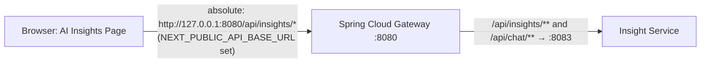
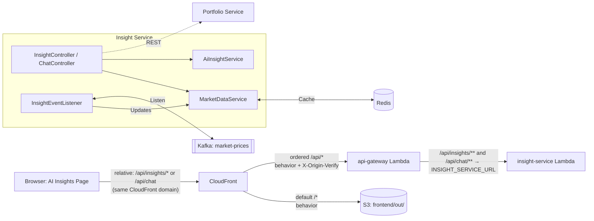

# Insight Service End-to-End (E2E) Flow

This document describes the flow of data and control for the `insight-service` in the Wealth Management and Portfolio Tracker application, starting from the frontend.

## 1. Frontend Layer (Next.js)
The flow begins in the **AI Insights Page** (`frontend/src/app/(dashboard)/ai-insights/page.tsx`), which serves as an entry point for users to view market summaries and interact with an AI-powered chat.

*   **`MarketSummaryGrid`**: A client-side component that uses a TanStack Query hook (`useMarketSummary`) to fetch a map of all tracked tickers.
*   **`ChatInterface`**: A conversational UI component that allows users to ask about specific tickers or their portfolio, using Next.js Server Actions or direct API calls.

## 2. API Call & Routing

> **Note:** `next.config.ts` is configured for static export (`output: "export"`) only. It contains **no rewrite or proxy rules**. There is no Next.js proxy layer in this project.

### Path Construction (`frontend/src/lib/config/api.ts`)
All API calls go through the `apiPath()` helper, which inspects `NEXT_PUBLIC_API_BASE_URL` at build time:
*   **If set** (local development): returns an **absolute URL**, e.g. `http://127.0.0.1:8080/api/insights/market-summary`. The browser calls the Spring Cloud Gateway directly on port 8080.
*   **If unset** (production static build): returns a **relative path**, e.g. `/api/insights/market-summary`. The browser sends the request to the same origin that served the page (the CloudFront domain), and CloudFront's behavior rules take over.

### Local Development
`NEXT_PUBLIC_API_BASE_URL=http://127.0.0.1:8080` is set in `frontend/.env.local`. The browser resolves `apiPath("/insights/market-summary")` to `http://127.0.0.1:8080/api/insights/market-summary` and hits the Spring Cloud Gateway directly — no intermediary proxy.

### Production (AWS / CloudFront)
`NEXT_PUBLIC_API_BASE_URL` is **not set** at production build time. The static site is served from S3 via CloudFront. The CloudFront distribution (`infrastructure/terraform/modules/cdn/main.tf`) has two origins and two cache behaviors:
*   **Default behavior (`/*`)** → S3 origin — serves static HTML, JS, CSS from `frontend/out/`. A CloudFront Function rewrites extensionless paths (e.g. `/ai-insights` → `/ai-insights.html`).
*   **Ordered behavior (`/api/*`)** → api-gateway Lambda Function URL origin — forwards API requests with full method support. CloudFront injects the `X-Origin-Verify` secret header on every request to this origin; the `CloudFrontOriginVerifyFilter` in the api-gateway validates it and rejects any request that bypasses CloudFront.

### Spring Cloud Gateway → Downstream Services
The Spring Cloud Gateway (`api-gateway/src/main/resources/application.yml`) routes based on path predicates:
*   `/api/insights/**` → `${INSIGHT_SERVICE_URL:http://localhost:8083}` (local port 8083 / Lambda Function URL in production)
*   `/api/chat/**` → `${INSIGHT_SERVICE_URL:http://localhost:8083}` (same target as `/api/insights/**`)

**Authentication**: The Gateway validates the JWT on all public routes and injects the `X-User-Id` header into every downstream request.

## 3. Insight Service Controllers
The `insight-service` exposes REST controllers to handle incoming requests:
*   **`InsightController`**: Handles `/api/insights/market-summary`. It orchestrates the retrieval of market data and enriches it with AI-generated sentiment.
*   **`ChatController`**: Handles `/api/chat`. It extracts ticker symbols from natural language messages, fetches current prices, and generates a conversational response using AI.

## 4. Data Layer & Real-time Integration (Redis & Kafka)
The `insight-service` maintains its own view of market data for low-latency access:
*   **Redis Storage**: `MarketDataService` manages `market:latest:{ticker}` (current price) and `market:history:{ticker}` (last 10 prices) in Redis.
*   **Kafka Listener**: The `InsightEventListener` listens to the `market-prices` Kafka topic. When a `PriceUpdatedEvent` is received, it updates the Redis cache.

## 5. AI Enrichment (AiInsightService)
The `AiInsightService` provides sentiment analysis and is implemented via two profile-scoped adapters:
*   **`MockAiInsightService`**: Default implementation (`@Profile("!bedrock")`) — active for local development and CI. Zero-latency deterministic responses.
*   **`BedrockAiInsightService`**: AWS Bedrock (Claude Haiku 4.5) integration (`@Profile("bedrock")`) — active on Lambda (`SPRING_PROFILES_ACTIVE=prod,aws,bedrock`) or for opt-in local smoke-testing (`local,bedrock`).

## 6. Portfolio Analysis (Downstream REST Call)
For portfolio-level analysis (e.g., `/api/insights/{userId}/analyze`):
*   **`InsightService`**: Fetches the user's holdings from the **`portfolio-service`** via a REST call to `/api/portfolio`.
*   **`InsightAdvisor`**: Processes the portfolio data to generate risk and diversification advice.

## Summary Flow Diagram

### Local Development

### Production (AWS)

## 7. Production Deployment Topology (AWS / Terraform)
The `insight-service` is packaged as a container image (ECR) and deployed as an **AWS Lambda function on arm64 / Graviton2** via the **Lambda Web Adapter** sidecar. Provisioned by `infrastructure/terraform/modules/compute`:

- **Lambda alias `live`** is published per deploy; the **Function URL** (`AuthType = NONE`) attaches to the `live` alias rather than `$LATEST`.
- **Origin protection**: the Function URL is protected by the `X-Origin-Verify` header injected by CloudFront on the api-gateway hop. Direct invocation without the header returns 403.
- **External managed dependencies** (no in-VPC AWS resources): **Aiven Kafka** (`SPRING_KAFKA_BOOTSTRAP_SERVERS`, mTLS via the canonical `truststore.jks` shipped from `common-dto`/`TruststoreExtractor`) and **Upstash Redis** (`rediss://`, TLS).
- **AI Profile**: production runs with `SPRING_PROFILES_ACTIVE=prod,aws,bedrock`, activating `BedrockAiInsightService` against the Claude Haiku 4.5 model. Local development defaults to the deterministic `MockAiInsightService` (`@Profile("!bedrock")`).
- **Cold-start mitigation**: when `enable_warming = true`, the Terraform `warming` module uses EventBridge Rules + API Destinations (`rate(5 minutes)`) to GET `/actuator/health` on the Function URL; a CloudWatch alarm on `ConcurrentExecutions ≥ 8` notifies SNS. Optional escalation: provisioned concurrency on the `live` alias via `enable_provisioned_concurrency`.
- **Concurrency**: `reserved_concurrent_executions` is intentionally **omitted** (ap-south-1 account cap is 10 unreserved executions; reserving any would block other functions).
