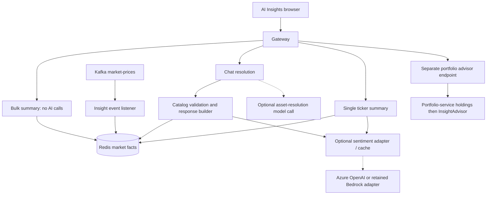

# Insight Service End-to-End Flow

**Source audit:** 2026-09-26 UTC against `main@8aa4035b`. This is source reconciliation, not
a fresh Azure OpenAI call, cache read or endpoint test. The
[demo dashboard](../plans/ASSET_PICKER_DEMO_PREPARATION_PLAN.md) retains accepted evidence and
unverified edges, including natural-language resolution and broader model-text reliability.

## 1. Browser entry and distinct requests

The AI Insights page combines `MarketSummaryGrid` and `ChatInterface`.
[useInsights](../../frontend/src/lib/hooks/useInsights.ts) and
[insights.ts](../../frontend/src/lib/api/insights.ts) call the static frontend's configured gateway
origin. There is no Next.js server proxy. The gateway routes `/api/insights/**` and `/api/chat/**`
to `INSIGHT_SERVICE_URL`: base localhost:8083, Compose `insight-service:8083`, or Azure internal
`http://insight-service` (ingress forwards to port 8080). JWT and rate-limit rules are in the
[gateway flow](api-gateway-service-e2e.md).

[InsightController](../../insight-service/src/main/java/com/wealth/insight/InsightController.java)
and [ChatController](../../insight-service/src/main/java/com/wealth/insight/ChatController.java)
serve different pipelines:

| Method / path | Behavior |
|---|---|
| `GET /api/insights/market-summary` | Redis-backed bulk price/trend map with catalog quote currency; **no per-ticker AI sentiment calls** |
| `GET /api/insights/market-summary/{ticker}` | One stored ticker summary plus sentiment from the active adapter; no price yields 404; adapter unavailability leaves sentiment absent |
| `POST /api/chat` | Stateless asset-resolution turn, then stored facts and optional sentiment |
| `GET /api/insights/{userId}/analyze` | Separate advisor path fetching portfolio holdings; not the current chat's portfolio-context pipeline |
| `GET /api/insights/health` | Public service-UP handler, not a successful model or Redis acceptance test |

The bulk cards' “Sentiment Unavailable” is expected when that endpoint supplies no sentiment;
it is not, by itself, evidence that Azure OpenAI failed.

## 2. Redis market projection, not live Yahoo fetch

[InsightEventListener](../../insight-service/src/main/java/com/wealth/insight/InsightEventListener.java)
consumes Kafka `market-prices`.
[MarketDataService](../../insight-service/src/main/java/com/wealth/insight/MarketDataService.java)
maintains:

| Redis key | Purpose |
|---|---|
| `market:latest:{ticker}` | Latest received price |
| `market:obs:{ticker}` | Sorted set of observation timestamp identities, capped at 10 |
| `market:obs:price:{ticker}` | Hash mapping those timestamps to price strings |
| `market:tracked-tickers` | Sorted set scored by update **receipt time**, used for bulk inclusion |
| `market:history:{ticker}` | Legacy last-10-price list retained for compatibility |

Observation identity is the ticker plus millisecond-truncated `observedAt`, not the price.
A replay does not add another observation; a new timestamp at the same price is distinct.
Undated events update latest/legacy structures but do not invent dated observations.
The latest key, observation structures and tracked set are separate Redis commands, **not**
one atomic snapshot or an exactly-once/monotonic-latest guarantee.

Trend requires at least two distinct observations and usable prices. It is first-to-last change
over the stored window (at most 10 prices), **not a 24-hour return**. Legacy-only history has no
distinct-observation guarantee and yields null trend. The cards label the actual window.

Bulk summaries filter tracked entries using a 24-hour received-update window on read; old entries
are also pruned on writes. That is not the portfolio's 50-hour observation-age rule. A direct
single-ticker read is not subject to the same bulk inclusion filter. Separate Mongo/PostgreSQL/
Redis views can lag each other; no browser request refreshes Yahoo data.

## 3. Stateless chat resolution and response building

The request is `{message, ticker?}`; the response is
`{response, sentimentSource}`.
[ChatResolutionService](../../insight-service/src/main/java/com/wealth/insight/ChatResolutionService.java)
uses:

1. Optional explicit ticker normalization and catalog validation.
2. Deterministic token normalization, comparison guard and discovery shortcuts.
3. When needed, an `AssetResolutionClient` model call; proposed symbols are checked against
   the catalog. Invented symbols are not accepted as facts.
4. On resolution-model failure, deterministic exact/catalog-derived forms only; arbitrary
   names do not become guessed tickers. Ambiguity leads to clarification.
5. [ChatResponseBuilder](../../insight-service/src/main/java/com/wealth/insight/chat/ChatResponseBuilder.java)
   handles resolved/no-data, clarification, discovery, comparison redirect and greeting outcomes.

A resolved turn gets numeric price/trend facts from Redis. Currency comes from the catalog;
FOREX is presented with pair context, not an indiscriminate dollar prefix. The model contributes
sentiment prose, not the structured numeric fact fields. The service remains one-asset-at-a-time;
comparison requests redirect rather than performing comparative FA/TA.

The pipeline can make a resolution call **and** a separate sentiment call; deterministic resolution
or cached sentiment can avoid those calls. Browser transcript display does not mean the backend
has conversation memory, portfolio context or a multi-turn reasoning session.

## 4. Adapter attribution, caching and failures

The sentiment/advisor adapters and asset resolver do **not** have identical profile coverage:

| Profile selection | Sentiment / portfolio advisor | Asset-resolution client |
|---|---|---|
| Neither `bedrock` nor `azure-ai` | Deterministic local/CI adapters, no cloud LLM | Mock resolver returning `UNKNOWN` |
| `azure-ai` | Azure OpenAI adapters, Managed Identity/Entra configured in the demo stack | Azure OpenAI resolver |
| `bedrock`, without `azure-ai` | Retained AWS Bedrock adapters | Mock resolver returning `UNKNOWN`, not a Bedrock resolver |

[MockAssetResolutionClient](../../insight-service/src/main/java/com/wealth/insight/infrastructure/ai/MockAssetResolutionClient.java)
is selected by `!azure-ai`. Deterministic ticker/catalog preflight still works in local/Bedrock
profiles; name questions needing the model resolver end in clarification rather than guessed
tickers. Enabling or changing provider profiles is not part of this audit.

[AzureOpenAiInsightService](../../insight-service/src/main/java/com/wealth/insight/infrastructure/ai/AzureOpenAiInsightService.java)
caches sentiment under a provider-qualified key such as `AZURE_OPENAI:{ticker}`.
[CacheConfig](../../insight-service/src/main/java/com/wealth/insight/infrastructure/redis/CacheConfig.java)
sets sentiment TTL to 60 minutes and portfolio-analysis TTL to 30 minutes. Cache-abstraction
errors are treated as misses; this does not make the underlying Redis market-data reads immune
to failure. A miss can incur model latency and cost.

[SentimentSource](../../insight-service/src/main/java/com/wealth/insight/SentimentSource.java)
declares `AZURE_OPENAI`, `BEDROCK` or `RULE_BASED`; responses without sentiment have null source.
The UI renders source wording from this field rather than guessing from prose. It attributes
the sentiment implementation, **not** the asset resolver. An Azure-labelled response may be
cached; it does not prove this request invoked the model or that its prose is correct.

Resolution fallback and sentiment unavailability are distinct: in the Azure sentiment adapter,
provider failure raises `AdvisorUnavailableException`; the response builder keeps stored facts
and adds an unavailable note. It does not silently switch the Azure adapter to the rule-based
profile. Rule-based source denotes the deterministic adapter.

## 5. Separate portfolio advisor path and limits

[InsightService](../../insight-service/src/main/java/com/wealth/insight/InsightService.java) calls
`GET /api/portfolio` at its configured portfolio-service URL, setting `X-User-Id` from the
`/{userId}/analyze` path argument, and delegates the first returned portfolio to `InsightAdvisor`.
It does not feed that result into `POST /api/chat`.

This is a source-confirmed **cross-user authorization flaw (IDOR)**: the gateway requires a valid
login, including the restricted showcase login, but this path never compares its target ID with
the gateway-authenticated subject. A caller knowing another user's ID can request that user's
derived risk score, concentration warnings and rebalancing suggestions when dependencies work;
the response/error path can also disclose portfolio existence. Random UUIDs are not authorization.
It is tracked as [OPEN security work](../todos/backlog/portfolio-advisor-cross-user-authorization/README.md),
not closed or accepted as harmless by the earlier portfolio-isolation suite.

Reachability is environment-dependent. The checked-in Azure insight-service environment does not
set `PORTFOLIO_SERVICE_URL`; its application default is `http://localhost:8081`, so the fetch is
expected to fail absent another override. This is **not live-verified** and not a security control.
Compose and retained AWS configuration supply the portfolio URL. Correct authorization before
making this advisor reachable or adding the missing Azure setting. No live exploit, code fix or
configuration change was performed here.

Formal per-user Sharpe/Sortino metrics, richer FA/TA conversation and exploratory analysis are
[deferred v5 requests](../../roadmap_enhancements_v5.md). Source availability of an advisor or a
name resolver is not acceptance of those future capabilities or all natural-language/model edges.

## 6. Request and event flow

```mermaid
flowchart TD
    B[AI Insights browser] --> G[Gateway]
    G --> S[Bulk summary: no AI calls]
    G --> C[Chat resolution]
    G --> T[Single ticker summary]
    S --> R[(Redis market facts)]
    C --> V[Catalog validation and response builder]
    V --> R
    V --> A[Optional sentiment adapter / cache]
    T --> R
    T --> A
    C -.-> L[Optional asset-resolution model call]
    A -.-> O[Azure OpenAI or retained Bedrock adapter]
    K[Kafka market-prices] --> E[Insight event listener]
    E --> R
    G --> P[Separate portfolio advisor endpoint]
    P --> H[Portfolio-service holdings then InsightAdvisor]
```

## 7. Deployment and evidence boundary

Azure profiles are `prod,azure,azure-ai`, with internal ingress and scale-to-zero. Terraform
configures Azure OpenAI access for the managed identity plus Aiven Kafka and Upstash Redis.
Internal ACA reachability is not limited to the gateway alone: authorized peer services and Jobs
share the environment. The retained Lambda/Bedrock path is not newly cloud-verified.

Use [current operations](../runbooks/CURRENT_OPERATIONS.md) for bounded warm-up and cold-start
handling. Warming does not eliminate model latency. Live chat tests can call billable providers
and populate caches; none were run or authorized by this docs audit. In the accepted targeted
check the raw response was not captured, so recorded label/number observations do not establish
a fresh model invocation.
