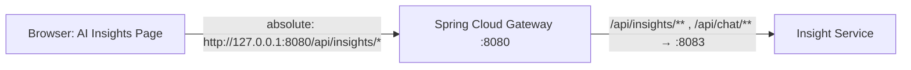
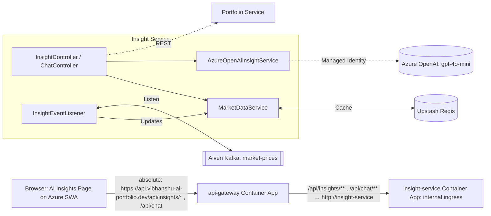

# Insight Service End-to-End (E2E) Flow

This document describes the flow of data and control for the `insight-service` in the Wealth Management and Portfolio Tracker application, starting from the frontend.

> **Deployment context (June 2026):** Multi-cloud via Terraform, with **Azure active (live)** and **AWS a soft-disabled standby**. Production AI runs on **Azure OpenAI**; Amazon Bedrock is the standby path. See `README.md`.

## 1. Frontend Layer (Next.js)
The flow begins in the **AI Insights Page** (`frontend/src/app/(dashboard)/ai-insights/page.tsx`), where users view market summaries and interact with an AI-powered chat.

*   **`MarketSummaryGrid`**: A client component using the TanStack Query hook `useMarketSummary` to fetch a map of tracked tickers.
*   **`ChatInterface`**: A conversational UI that lets users ask about specific tickers or their portfolio.

## 2. API Call & Routing

> **Note:** `next.config.ts` is configured for static export (`output: "export"`). It contains **no rewrite or proxy rules** — there is no Next.js proxy layer.

### Path Construction (`frontend/src/lib/config/api.ts`)
All API calls go through `apiPath()`, which inspects `NEXT_PUBLIC_API_BASE_URL` (embedded at build time):
*   **Set** (both local and Azure production): returns an **absolute URL**.
    *   Local: `http://127.0.0.1:8080/api/insights/market-summary`
    *   Azure: `https://api.vibhanshu-ai-portfolio.dev/api/insights/market-summary`
*   **Unset** (fallback only): returns a relative `/api/*` path. Not used by the supported environments.

### Local Development
`NEXT_PUBLIC_API_BASE_URL=http://127.0.0.1:8080` (in `frontend/.env.local`). The browser hits the Spring Cloud Gateway directly on port 8080 — no intermediary proxy.

### Production (Azure)
`NEXT_PUBLIC_API_BASE_URL=https://api.vibhanshu-ai-portfolio.dev` is injected by `deploy-azure.yml` at build time. The frontend is a static export hosted on **Azure Static Web Apps**; the browser calls the **api-gateway Container App** directly via the `api.` subdomain (separate from the SWA frontend domain). There is no CloudFront and no same-origin relative routing on Azure.

### Spring Cloud Gateway → Insight Service
The gateway routes based on path predicates (targets are env-driven `${app.routes.insight-url}` → `INSIGHT_SERVICE_URL`):
*   `/api/insights/**` → `INSIGHT_SERVICE_URL` (`http://localhost:8083` local / `http://insight-service` ACA internal DNS)
*   `/api/chat/**` → same target

**Authentication:** the gateway validates the HS256 JWT and injects the `X-User-Id` header into every downstream request.

## 3. Insight Service Controllers
*   **`InsightController`**: Handles `/api/insights/market-summary` — retrieves market data and enriches it with AI-generated sentiment.
*   **`ChatController`**: Handles `/api/chat` — delegates to the LLM-grounded resolution pipeline (`ChatResolutionService`) that resolves natural-language asset names to canonical tickers, fetches current prices, and generates a conversational response.

## 4. Data Layer & Real-time Integration (Redis & Kafka)
The `insight-service` maintains its own low-latency view of market data:
*   **Redis Storage:** `MarketDataService` manages `market:latest:{ticker}` (current price) and `market:history:{ticker}` (recent prices) in Redis.
*   **Kafka Listener:** `InsightEventListener` consumes the `market-prices` topic; each `PriceUpdatedEvent` updates the Redis cache. Listener observation is enabled for distributed tracing.

## 5. AI Enrichment (`AiInsightService`)
`AiInsightService` is an interface with three profile-scoped adapters:
*   **`MockAiInsightService`** — `@Profile("!bedrock & !azure-ai")`: the default for **local development and CI**. Zero-latency deterministic responses, no cloud LLM required.
*   **`AzureOpenAiInsightService`** — `@Profile("azure-ai")`: **active in production** (Azure). Uses Azure OpenAI (`gpt-4o-mini` deployment) via the consolidated Spring AI `spring-ai-starter-model-openai` starter, authenticated with **Entra ID / Managed Identity** (no API key).
*   **`BedrockAiInsightService`** — `@Profile("bedrock")`: the AWS standby path (Amazon Bedrock, Anthropic Claude Haiku); also usable for opt-in local smoke tests (`local,bedrock`).

## 6. Portfolio Analysis (Downstream REST Call)
For portfolio-level analysis (e.g. `/api/insights/{userId}/analyze`):
*   **`InsightService`**: Fetches the user's holdings from `portfolio-service` via REST (`PORTFOLIO_SERVICE_URL`).
*   **`InsightAdvisor`**: Generates risk and diversification advice from the portfolio data.

## Summary Flow Diagram

### Local Development

```mermaid
graph LR
    A[Browser: AI Insights Page] -->|"absolute: http://127.0.0.1:8080/api/insights/*"| C[Spring Cloud Gateway :8080]
    C -->|"/api/insights/** , /api/chat/** → :8083"| D[Insight Service]
```

### Production (Azure)

```mermaid
graph LR
    A[Browser: AI Insights Page on Azure SWA] -->|"absolute: https://api.vibhanshu-ai-portfolio.dev/api/insights/* , /api/chat"| C[api-gateway Container App]
    C -->|"/api/insights/** , /api/chat/** → http://insight-service"| D[insight-service Container App: internal ingress]

    subgraph "Insight Service"
        D1[InsightController / ChatController]
        D2[MarketDataService]
        D3[AzureOpenAiInsightService]
        D4[InsightEventListener]

        D1 --> D2
        D1 --> D3
        D4 -->|Updates| D2
    end

    D2 <-->|Cache| E[(Upstash Redis)]
    D4 <-->|Listen| F[[Aiven Kafka: market-prices]]
    D3 -.->|Managed Identity| H[(Azure OpenAI: gpt-4o-mini)]
    D1 -.->|REST| G[Portfolio Service]
```

## 7. Production Deployment Topology

### Azure — Active (Live)
The `insight-service` is built as a container image (ACR) and deployed as an **Azure Container App** with **internal ingress** (reachable only from the api-gateway within the ACA environment). Provisioned by `infrastructure/terraform/azure` (`module.insight_service`):

- **Profiles:** `SPRING_PROFILES_ACTIVE=prod,azure,azure-ai` — activates the Azure infra overlay plus the Azure OpenAI overlay (`application-azure-ai.yml`).
- **AI auth:** the Container App's **system-assigned managed identity** authenticates to Azure OpenAI (`DefaultAzureCredential` → bearer token); `AZURE_OPENAI_ENDPOINT` and `AZURE_OPENAI_DEPLOYMENT` (=`gpt-4o-mini`) are injected as non-sensitive env vars. No API key is stored.
- **Managed dependencies:** **Aiven Kafka** (mTLS via the canonical `truststore.jks` from `common-dto`/`TruststoreExtractor`) and **Upstash Redis** (`rediss://`, TLS — no custom truststore needed for Upstash).
- **Scaling:** `min_replicas = 0` (scale-to-zero), `max_replicas = 3`.

### AWS — Soft-Disabled Standby
- Packaged as a container image and deployed as **AWS Lambda on arm64 / Graviton2** via the **Lambda Web Adapter**, with a `live` alias and a `Function URL` (`AuthType = NONE`) protected by the `X-Origin-Verify` header injected by CloudFront on the api-gateway hop.
- **AI profile:** `SPRING_PROFILES_ACTIVE=prod,aws,bedrock` activates `BedrockAiInsightService` (Anthropic Claude Haiku) — IAM execution role grants Bedrock invoke; no API keys.
- Same managed Aiven Kafka / Upstash Redis dependencies.
- Cold-start mitigation via the `warming` module (when `enable_warming = true`); `reserved_concurrent_executions` omitted (ap-south-1 cap).
