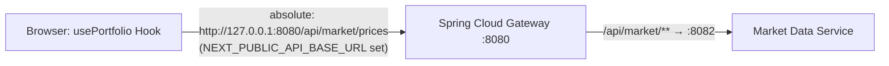
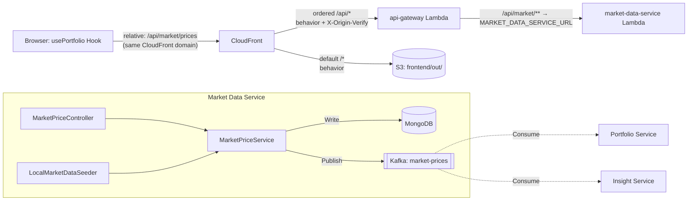

# Market Data Service End-to-End (E2E) Flow

This document describes the flow of data and control for the `market-data-service` in the Wealth Management and Portfolio Tracker application, starting from the frontend.

## 1. Frontend Layer (Next.js)
The frontend consumes market data to display current asset prices and calculate portfolio valuations.

*   **`usePortfolio` Hook**: This hook (located in `frontend/src/lib/hooks/usePortfolio.ts`) is the primary consumer. It fetches the user's holdings from the `portfolio-service` and then calls the `market-data-service` to get the latest prices for all tickers in the portfolio.
*   **API Client**: The `fetchPortfolio` function in `frontend/src/lib/api/portfolio.ts` uses `fetchJson` to call `GET /api/market/prices?tickers=...`.

## 2. API Call & Routing

> **Note:** `next.config.ts` is configured for static export (`output: "export"`) only. It contains **no rewrite or proxy rules**. There is no Next.js proxy layer in this project.

### Path Construction (`frontend/src/lib/config/api.ts`)
All API calls go through the `apiPath()` helper, which inspects `NEXT_PUBLIC_API_BASE_URL` at build time:
*   **If set** (local development): returns an **absolute URL**, e.g. `http://127.0.0.1:8080/api/market/prices`. The browser calls the Spring Cloud Gateway directly on port 8080.
*   **If unset** (production static build): returns a **relative path**, e.g. `/api/market/prices`. The browser sends the request to the same origin that served the page (the CloudFront domain), and CloudFront's behavior rules take over.

### Local Development
`NEXT_PUBLIC_API_BASE_URL=http://127.0.0.1:8080` is set in `frontend/.env.local`. The browser resolves `apiPath("/market/prices")` to `http://127.0.0.1:8080/api/market/prices` and hits the Spring Cloud Gateway directly — no intermediary proxy.

### Production (AWS / CloudFront)
`NEXT_PUBLIC_API_BASE_URL` is **not set** at production build time. The static site is served from S3 via CloudFront. The CloudFront distribution (`infrastructure/terraform/modules/cdn/main.tf`) has two origins and two cache behaviors:
*   **Default behavior (`/*`)** → S3 origin — serves static HTML, JS, CSS from `frontend/out/`. A CloudFront Function rewrites extensionless paths (e.g. `/market` → `/market.html`).
*   **Ordered behavior (`/api/*`)** → api-gateway Lambda Function URL origin — forwards API requests with full method support. CloudFront injects the `X-Origin-Verify` secret header on every request to this origin; the `CloudFrontOriginVerifyFilter` in the api-gateway validates it and rejects any request that bypasses CloudFront.

### Spring Cloud Gateway → Downstream Services
The Spring Cloud Gateway (`api-gateway/src/main/resources/application.yml`) routes based on path predicates:
*   `/api/market/**` → `${MARKET_DATA_SERVICE_URL:http://localhost:8082}` (local port 8082 / Lambda Function URL in production)

**Authentication**: The Gateway validates the JWT on all public routes and injects the `X-User-Id` header into every downstream request.

## 3. Market Data Service Controllers
The `market-data-service` exposes a REST controller for querying and updating prices:
*   **`MarketPriceController`**:
    *   `GET /api/market/prices`: Returns a list of current prices. It accepts a `tickers` query parameter to filter by specific symbols.
    *   `POST /api/market/prices/{ticker}`: Manually updates the price for a specific ticker (primarily used for testing or manual overrides).

## 4. Service Layer & Business Logic
The core logic resides in the `MarketPriceService`:
*   **`MarketPriceService`**:
    1.  **Persistence**: Saves the latest price into **MongoDB** (the `market_prices` collection).
    2.  **Event Distribution**: Publishes a `PriceUpdatedEvent` to the **`market-prices`** Kafka topic. The ticker symbol is used as the Kafka message key to ensure that updates for the same asset are processed in order by downstream consumers.

## 5. Data Layer (MongoDB)
Unlike other services that use Postgres, the `market-data-service` uses **MongoDB** for its primary data store:
*   **`AssetPrice`**: A document entity representing the current state of a ticker, including its symbol, current price, and last updated timestamp.
*   **`AssetPriceRepository`**: A Spring Data MongoDB repository for CRUD operations.

## 6. Real-time Event Streaming (Kafka)
The `market-data-service` acts as the **Source of Truth** for asset prices in the system:
*   **Producer**: It produces `PriceUpdatedEvent` messages to Kafka whenever a price changes.
*   **Consumers**: Other services listen to this topic to update their own read-models:
    *   **`portfolio-service`**: Listens to update the `market_prices` table in Postgres for fast valuation lookups.
    *   **`insight-service`**: Listens to update its Redis cache for low-latency AI-driven market analysis.

## 7. Data Seeding & Refresh
*   **`LocalMarketDataSeeder`** (`@Profile("local")`, also gated by `market.seed.enabled`): An `ApplicationRunner` that backfills missing tickers in MongoDB from a JSON fixture (`MarketSeedFixture`) at startup. Idempotent across restarts — only inserts tickers not already present in Mongo. Never instantiated in `aws` or `prod` profiles; additionally, `application-aws.yml` sets `market.seed.enabled: false` as a redundant safeguard.
*   **`BaselineSeeder`** (profile-agnostic, gated by `market-data.baseline-seed.enabled`, `matchIfMissing = true`): Ensures every ticker in `market.baseline.tickers` has a shell `AssetPrice` document in Mongo without setting a price. Enabled in local by default. **Disabled in the AWS profile** (`application-aws.yml` sets `baseline-seed.enabled: false`), so it does not run in the Lambda production environment.
*   **`StartupHydrationService`** (gated by `market-data.hydration.enabled`, `matchIfMissing = true`): An `ApplicationRunner` that runs on every startup and re-publishes a `PriceUpdatedEvent` to Kafka for every ticker that already has a non-null price in MongoDB. Does not mutate MongoDB state — read-only. This is the primary production mechanism for rehydrating downstream caches (insight-service Redis, portfolio-service Postgres projection) after Lambda cold starts. Enabled by default and explicitly `true` in both `application-aws.yml` and `application-prod.yml`.
*   **`MarketDataRefreshJob`** (`@Scheduled` cron, gated by `market-data.refresh.enabled`): Periodically calls the external provider (Yahoo Finance), upserts current prices into Mongo, and re-publishes `PriceUpdatedEvent` records to Kafka so all downstream read-models stay current. Default cron: `0 0 */1 * * *` (every hour). **Disabled on AWS Lambda** (`application-aws.yml` sets `refresh.enabled: false`) because Lambda is not long-lived enough for cron jobs. Active in local and any long-lived deployment target (e.g. container/VM).

## Summary Flow Diagram

### Local Development

### Production (AWS)

## 8. Production Deployment Topology (AWS / Terraform)
The `market-data-service` is packaged as a container image (ECR) and deployed as an **AWS Lambda function on arm64 / Graviton2** via the **Lambda Web Adapter** sidecar. Provisioned by `infrastructure/terraform/modules/compute`:

- **Lambda alias `live`** is published per deploy; the **Function URL** (`AuthType = NONE`) attaches to the `live` alias rather than `$LATEST`.
- **Origin protection**: the Function URL is fronted only via CloudFront → api-gateway, which injects `X-Origin-Verify`. The api-gateway forwards verified requests to `MARKET_DATA_SERVICE_URL`.
- **LWA readiness override**: `AWS_LWA_READINESS_CHECK_PATH = /actuator/health/liveness` (set in the compute module) bypasses the Spring `MongoHealthIndicator`, which otherwise fails LWA's readiness probe with `AtlasError 8000` against MongoDB Atlas free-tier databases.
- **Managed MongoDB**: `SPRING_MONGODB_URI` (and the legacy `SPRING_DATA_MONGODB_URI` alias) point at **MongoDB Atlas**; truststore is loaded from `common-dto`'s canonical `truststore.jks` via `TruststoreExtractor` to work around Lambda's read-only filesystem.
- **Managed Kafka**: producer connects to **Aiven Kafka** over mTLS using the same canonical truststore.
- **Cold-start mitigation**: when `enable_warming = true`, the Terraform `warming` module uses EventBridge Rules + API Destinations (`rate(5 minutes)`) to GET `/actuator/health` on the Function URL; CloudWatch alarm on `ConcurrentExecutions ≥ 8` → SNS. Optional escalation: `enable_provisioned_concurrency` on the `live` alias.
- **Concurrency**: `reserved_concurrent_executions` is intentionally **omitted** (ap-south-1 account cap is 10 unreserved executions).
- **Seeding in production**: `LocalMarketDataSeeder` is `@Profile("local")` and never instantiates under `aws`/`prod`. Production data hydration runs through the profile-agnostic `BaselineSeeder` (inserts ticker shells from `market.baseline.tickers`) and the `MarketDataRefreshJob` `@Scheduled` cron (default hourly, gated by `market-data.refresh.enabled`), which calls the external provider, upserts prices in Mongo, and re-publishes `PriceUpdatedEvent` records to Kafka.
