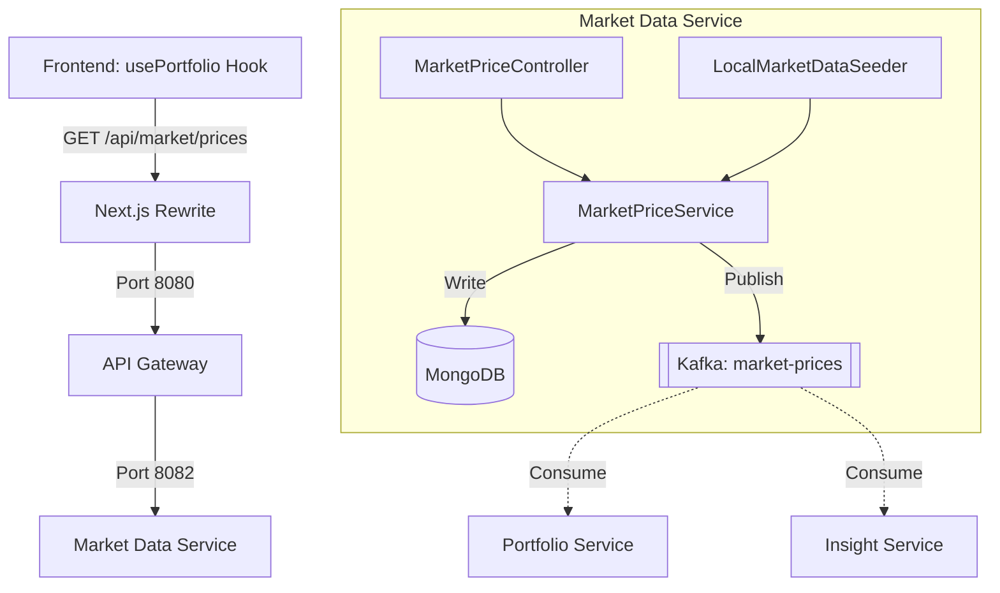

# Market Data Service End-to-End (E2E) Flow

This document describes the flow of data and control for the `market-data-service` in the Wealth Management and Portfolio Tracker application, starting from the frontend.

## 1. Frontend Layer (Next.js)
The frontend consumes market data to display current asset prices and calculate portfolio valuations.

*   **`usePortfolio` Hook**: This hook (located in `frontend/src/lib/hooks/usePortfolio.ts`) is the primary consumer. It fetches the user's holdings from the `portfolio-service` and then calls the `market-data-service` to get the latest prices for all tickers in the portfolio.
*   **API Client**: The `fetchPortfolio` function in `frontend/src/lib/api/portfolio.ts` uses `fetchJson` to call `GET /api/market/prices?tickers=...`.

## 2. API Call & Routing
*   **Local Proxy**: The frontend makes requests to `/api/market/**`.
*   **Next.js Rewrite**: `next.config.ts` rewrites these calls to the **API Gateway** running at `http://127.0.0.1:8080`.
*   **API Gateway**: The Spring Cloud Gateway (`api-gateway/src/main/resources/application.yml`) routes requests based on the path:
    *   `/api/market/**` → `http://localhost:8082` (`market-data-service`)
*   **Authentication**: The Gateway validates the JWT and ensures the request is authorized before forwarding it downstream.

## 3. Market Data Service Controllers
The `market-data-service` exposes a REST controller for querying and updating prices:
*   **`MarketPriceController`**:
    *   `GET /api/market/prices`: Returns a list of current prices. It accepts a `tickers` query parameter to filter by specific symbols.
    *   `POST /api/market/prices/{ticker}`: Manually updates the price for a specific ticker (primarily used for testing or manual overrides).

## 4. Service Layer & Business Logic
The core logic resides in the `MarketPriceService`:
*   **`MarketPriceService`**:
    1.  **Persistence**: Saves the latest price into **MongoDB** (the `market_prices` collection).
    2.  **Event Distribution**: Publishes a `PriceUpdatedEvent` to the **`market-prices`** Kafka topic. The ticker symbol is used as the Kafka message key to ensure that updates for the same asset are processed in order by downstream consumers.

## 5. Data Layer (MongoDB)
Unlike other services that use Postgres, the `market-data-service` uses **MongoDB** for its primary data store:
*   **`AssetPrice`**: A document entity representing the current state of a ticker, including its symbol, current price, and last updated timestamp.
*   **`AssetPriceRepository`**: A Spring Data MongoDB repository for CRUD operations.

## 6. Real-time Event Streaming (Kafka)
The `market-data-service` acts as the **Source of Truth** for asset prices in the system:
*   **Producer**: It produces `PriceUpdatedEvent` messages to Kafka whenever a price changes.
*   **Consumers**: Other services listen to this topic to update their own read-models:
    *   **`portfolio-service`**: Listens to update the `market_prices` table in Postgres for fast valuation lookups.
    *   **`insight-service`**: Listens to update its Redis cache for low-latency AI-driven market analysis.

## 7. Data Seeding (Local Development)
For local development and testing, the service includes a seeding mechanism:
*   **`LocalMarketDataSeeder`**: An `ApplicationRunner` that populates the MongoDB database with initial price data from a fixture (`MarketSeedFixture`) if the database is empty.

## Summary Flow Diagram

