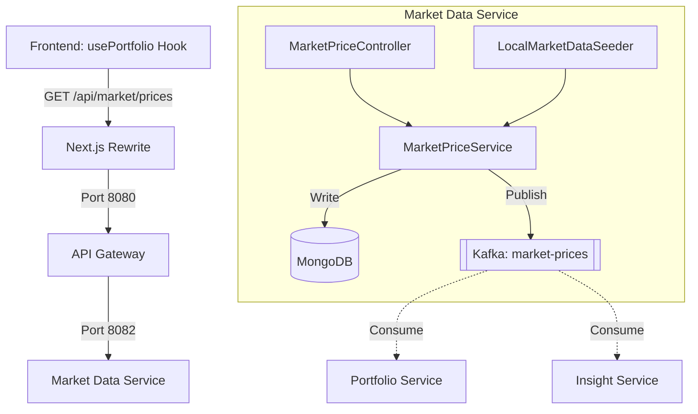

# Market Data Service End-to-End (E2E) Flow

This document describes the flow of data and control for the `market-data-service` in the Wealth Management and Portfolio Tracker application, starting from the frontend.

## 1. Frontend Layer (Next.js)
The frontend consumes market data to display current asset prices and calculate portfolio valuations.

*   **`usePortfolio` Hook**: This hook (located in `frontend/src/lib/hooks/usePortfolio.ts`) is the primary consumer. It fetches the user's holdings from the `portfolio-service` and then calls the `market-data-service` to get the latest prices for all tickers in the portfolio.
*   **API Client**: The `fetchPortfolio` function in `frontend/src/lib/api/portfolio.ts` uses `fetchJson` to call `GET /api/market/prices?tickers=...`.

## 2. API Call & Routing
*   **Local Proxy**: The frontend makes requests to `/api/market/**`.
*   **Next.js Rewrite**: `next.config.ts` rewrites these calls to the **API Gateway** at `http://127.0.0.1:8080` (local) or to `https://vibhanshu-ai-portfolio.dev` (production CloudFront origin).
*   **API Gateway**: The Spring Cloud Gateway (`api-gateway/src/main/resources/application.yml`) routes requests based on the path:
    *   `/api/market/**` → `http://localhost:8082` (local) / `MARKET_DATA_SERVICE_URL` Lambda Function URL (production)
*   **Authentication**: The Gateway validates the JWT and ensures the request is authorized before forwarding it downstream.

## 3. Market Data Service Controllers
The `market-data-service` exposes a REST controller for querying and updating prices:
*   **`MarketPriceController`**:
    *   `GET /api/market/prices`: Returns a list of current prices. It accepts a `tickers` query parameter to filter by specific symbols.
    *   `POST /api/market/prices/{ticker}`: Manually updates the price for a specific ticker (primarily used for testing or manual overrides).

## 4. Service Layer & Business Logic
The core logic resides in the `MarketPriceService`:
*   **`MarketPriceService`**:
    1.  **Persistence**: Saves the latest price into **MongoDB** (the `market_prices` collection).
    2.  **Event Distribution**: Publishes a `PriceUpdatedEvent` to the **`market-prices`** Kafka topic. The ticker symbol is used as the Kafka message key to ensure that updates for the same asset are processed in order by downstream consumers.

## 5. Data Layer (MongoDB)
Unlike other services that use Postgres, the `market-data-service` uses **MongoDB** for its primary data store:
*   **`AssetPrice`**: A document entity representing the current state of a ticker, including its symbol, current price, and last updated timestamp.
*   **`AssetPriceRepository`**: A Spring Data MongoDB repository for CRUD operations.

## 6. Real-time Event Streaming (Kafka)
The `market-data-service` acts as the **Source of Truth** for asset prices in the system:
*   **Producer**: It produces `PriceUpdatedEvent` messages to Kafka whenever a price changes.
*   **Consumers**: Other services listen to this topic to update their own read-models:
    *   **`portfolio-service`**: Listens to update the `market_prices` table in Postgres for fast valuation lookups.
    *   **`insight-service`**: Listens to update its Redis cache for low-latency AI-driven market analysis.

## 7. Data Seeding & Refresh
*   **`LocalMarketDataSeeder`** (`@Profile("local")`): An `ApplicationRunner` that backfills missing tickers in MongoDB from a JSON fixture (`MarketSeedFixture`) at startup. Idempotent across restarts.
*   **`BaselineSeeder`** (profile-agnostic, gated by `market-data.baseline-seed.enabled`): Ensures every ticker in `market.baseline.tickers` has a shell `AssetPrice` document in Mongo without setting a price. Runs in both local and production.
*   **`MarketDataRefreshJob`** (`@Scheduled` cron, gated by `market-data.refresh.enabled`): Periodically calls the external provider, upserts current prices into Mongo, and re-publishes `PriceUpdatedEvent` records to Kafka so all downstream read-models (portfolio Postgres projection, insight Redis cache) stay current.

## Summary Flow Diagram

## 8. Production Deployment Topology (AWS / Terraform)
The `market-data-service` is packaged as a container image (ECR) and deployed as an **AWS Lambda function on arm64 / Graviton2** via the **Lambda Web Adapter** sidecar. Provisioned by `infrastructure/terraform/modules/compute`:

- **Lambda alias `live`** is published per deploy; the **Function URL** (`AuthType = NONE`) attaches to the `live` alias rather than `$LATEST`.
- **Origin protection**: the Function URL is fronted only via CloudFront → api-gateway, which injects `X-Origin-Verify`. The api-gateway forwards verified requests to `MARKET_DATA_SERVICE_URL`.
- **LWA readiness override**: `AWS_LWA_READINESS_CHECK_PATH = /actuator/health/liveness` (set in the compute module) bypasses the Spring `MongoHealthIndicator`, which otherwise fails LWA's readiness probe with `AtlasError 8000` against MongoDB Atlas free-tier databases.
- **Managed MongoDB**: `SPRING_MONGODB_URI` (and the legacy `SPRING_DATA_MONGODB_URI` alias) point at **MongoDB Atlas**; truststore is loaded from `common-dto`'s canonical `truststore.jks` via `TruststoreExtractor` to work around Lambda's read-only filesystem.
- **Managed Kafka**: producer connects to **Aiven Kafka** over mTLS using the same canonical truststore.
- **Cold-start mitigation**: when `enable_warming = true`, the Terraform `warming` module uses EventBridge Rules + API Destinations (`rate(5 minutes)`) to GET `/actuator/health` on the Function URL; CloudWatch alarm on `ConcurrentExecutions ≥ 8` → SNS. Optional escalation: `enable_provisioned_concurrency` on the `live` alias.
- **Concurrency**: `reserved_concurrent_executions` is intentionally **omitted** (ap-south-1 account cap is 10 unreserved executions).
- **Seeding in production**: `LocalMarketDataSeeder` is `@Profile("local")` and never instantiates under `aws`/`prod`. Production data hydration runs through the profile-agnostic `BaselineSeeder` (inserts ticker shells from `market.baseline.tickers`) and the `MarketDataRefreshJob` `@Scheduled` cron (default hourly, gated by `market-data.refresh.enabled`), which calls the external provider, upserts prices in Mongo, and re-publishes `PriceUpdatedEvent` records to Kafka.
