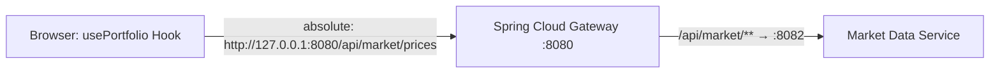
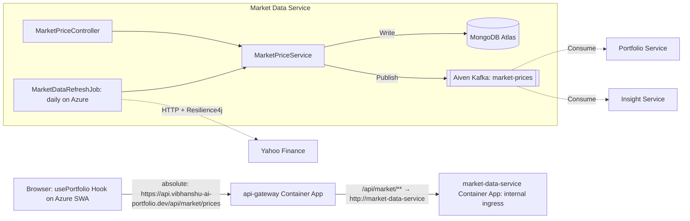

# Market Data Service End-to-End (E2E) Flow

This document describes the flow of data and control for the `market-data-service` in the Wealth Management and Portfolio Tracker application, starting from the frontend.

> **Deployment context (June 2026):** Multi-cloud via Terraform, with **Azure active (live)** and **AWS a soft-disabled standby**. See `README.md`.

## 1. Frontend Layer (Next.js)
The frontend consumes market data to display current asset prices and calculate portfolio valuations.

*   **`usePortfolio` Hook** (`frontend/src/lib/hooks/usePortfolio.ts`): the primary consumer. It fetches the user's holdings from `portfolio-service`, then calls `market-data-service` for the latest prices of all portfolio tickers.
*   **API Client:** `fetchPortfolio` in `frontend/src/lib/api/portfolio.ts` uses `fetchJson` to call `GET /api/market/prices?tickers=...`.

## 2. API Call & Routing

> **Note:** `next.config.ts` is configured for static export (`output: "export"`). It contains **no rewrite or proxy rules** — there is no Next.js proxy layer.

### Path Construction (`frontend/src/lib/config/api.ts`)
All API calls go through `apiPath()`, which inspects `NEXT_PUBLIC_API_BASE_URL` (embedded at build time):
*   **Set** (both local and Azure production): returns an **absolute URL**.
    *   Local: `http://127.0.0.1:8080/api/market/prices`
    *   Azure: `https://api.vibhanshu-ai-portfolio.dev/api/market/prices`
*   **Unset** (fallback only): returns a relative `/api/*` path. Not used by the supported environments.

### Local Development
`NEXT_PUBLIC_API_BASE_URL=http://127.0.0.1:8080` (in `frontend/.env.local`). The browser hits the Spring Cloud Gateway directly on port 8080.

### Production (Azure)
`NEXT_PUBLIC_API_BASE_URL=https://api.vibhanshu-ai-portfolio.dev` is injected by `deploy-azure.yml`. The static frontend is hosted on **Azure Static Web Apps**; the browser calls the **api-gateway Container App** directly via the `api.` subdomain.

### Spring Cloud Gateway → Market Data Service
The gateway routes based on path predicates (target is env-driven `${app.routes.market-data-url}` → `MARKET_DATA_SERVICE_URL`):
*   `/api/market/**` → `MARKET_DATA_SERVICE_URL` (`http://localhost:8082` local / `http://market-data-service` ACA internal DNS)

**Authentication:** the gateway validates the HS256 JWT and injects the `X-User-Id` header into every downstream request.

## 3. Market Data Service Controllers
*   **`MarketPriceController`**:
    *   `GET /api/market/prices`: Returns current prices, filterable by a `tickers` query parameter.
    *   `POST /api/market/prices/{ticker}`: Manually updates a ticker's price (testing / manual overrides).

## 4. Service Layer & Business Logic
Core logic resides in `MarketPriceService`:
1.  **Persistence:** Upserts the latest price into **MongoDB** (the `market_prices` / asset-price collection).
2.  **Event Distribution:** Publishes an enriched `PriceUpdatedEvent` to the **`market-prices`** Kafka topic, keyed by ticker so per-asset updates stay ordered for consumers.

## 5. Data Layer (MongoDB)
The `market-data-service` uses **MongoDB** for its primary data store:
*   **`AssetPrice`**: A document for a ticker's current state (symbol, price, quote currency, timestamps, reference price).
*   **`AssetPriceRepository`**: A Spring Data MongoDB repository.

## 6. Real-time Event Streaming (Kafka)
The `market-data-service` is the **source of truth** for asset prices:
*   **Producer:** emits `PriceUpdatedEvent` messages whenever a price changes (template observation enabled for tracing).
*   **Consumers:**
    *   **`portfolio-service`**: updates the `market_prices` projection table in Postgres for fast valuation lookups.
    *   **`insight-service`**: updates its Redis cache for low-latency AI-driven analysis.

## 7. Data Seeding & Refresh
*   **`LocalMarketDataSeeder`** (`@Profile("local")`, gated by `market.seed.enabled`): An `ApplicationRunner` that backfills missing tickers in MongoDB from a JSON fixture at startup. Idempotent. Never instantiated in `aws`/`azure`/`prod`.
*   **`BaselineSeeder`** (profile-agnostic, gated by `market-data.baseline-seed.enabled`, `matchIfMissing = true`): Ensures every baseline ticker has a shell `AssetPrice` document in Mongo without setting a price. Disabled on AWS (`application-aws.yml` sets `baseline-seed.enabled: false`).
*   **`StartupHydrationService`** (gated by `market-data.hydration.enabled`, `matchIfMissing = true`): On every startup, re-publishes a `PriceUpdatedEvent` for every ticker that already has a non-null price in MongoDB (read-only on Mongo). This rehydrates downstream caches (insight-service Redis, portfolio-service Postgres projection) after a cold start.
*   **`MarketDataRefreshJob`** (`@Scheduled` cron, gated by `market-data.refresh.enabled`): Calls the external provider (Yahoo Finance), upserts current prices into Mongo, and re-publishes `PriceUpdatedEvent` records to Kafka. Default cron `0 0 */1 * * *` (hourly).
    *   **Azure (active):** **enabled** — ACA runs long-lived containers. To control scale-to-zero wake-ups and cost, `application-azure.yml` overrides the schedule to **daily** (`0 0 8 * * *`); prices can therefore be up to ~24h stale between refreshes (acceptable for the demo profile — see `docs/changes/CHANGES_AZURE_COST_SPIKE_FIX_2026-05-17.md`).
    *   **AWS (standby):** **disabled** (`application-aws.yml` sets `refresh.enabled: false`) because Lambda is not long-lived enough for cron jobs; production hydration there relies on `StartupHydrationService` + `BaselineSeeder`.

## Summary Flow Diagram

### Local Development

```mermaid
graph LR
    A[Browser: usePortfolio Hook] -->|"absolute: http://127.0.0.1:8080/api/market/prices"| C[Spring Cloud Gateway :8080]
    C -->|"/api/market/** → :8082"| D[Market Data Service]
```

### Production (Azure)

```mermaid
graph LR
    A[Browser: usePortfolio Hook on Azure SWA] -->|"absolute: https://api.vibhanshu-ai-portfolio.dev/api/market/prices"| C[api-gateway Container App]
    C -->|"/api/market/** → http://market-data-service"| D[market-data-service Container App: internal ingress]

    subgraph "Market Data Service"
        D1[MarketPriceController]
        D2[MarketPriceService]
        D3[MarketDataRefreshJob: daily on Azure]

        D1 --> D2
        D3 --> D2
        D2 -->|Write| E[(MongoDB Atlas)]
        D2 -->|Publish| F[[Aiven Kafka: market-prices]]
    end

    D3 -.->|HTTP + Resilience4j| Y[Yahoo Finance]
    F -.->|Consume| G[Portfolio Service]
    F -.->|Consume| H[Insight Service]
```

## 8. Production Deployment Topology

### Azure — Active (Live)
The `market-data-service` is built as a container image (ACR) and deployed as an **Azure Container App** with **internal ingress**. Provisioned by `infrastructure/terraform/azure` (`module.market_data_service`):

- **Profiles:** `SPRING_PROFILES_ACTIVE=prod,azure`.
- **Managed MongoDB:** `SPRING_MONGODB_URI` points at **MongoDB Atlas**; TLS uses the canonical `truststore.jks` from `common-dto` via `TruststoreExtractor`.
- **Managed Kafka:** producer connects to **Aiven Kafka** over mTLS using the same canonical truststore.
- **Scheduled refresh:** enabled (long-lived containers), throttled to a daily cron on the Azure overlay (see §7).
- **Scaling:** `min_replicas = 0` (scale-to-zero), `max_replicas = 3`.

### AWS — Soft-Disabled Standby
- Packaged as a container image and deployed as **AWS Lambda on arm64 / Graviton2** via the **Lambda Web Adapter** (`live` alias, `Function URL` `AuthType = NONE`, fronted only via CloudFront → api-gateway with `X-Origin-Verify`).
- **LWA readiness override:** `AWS_LWA_READINESS_CHECK_PATH = /actuator/health/liveness` bypasses the Spring `MongoHealthIndicator`, which otherwise fails LWA's readiness probe against Atlas free-tier (`AtlasError 8000`).
- Scheduled refresh **disabled** (Lambda is short-lived); `reserved_concurrent_executions` omitted (ap-south-1 cap); cold-start mitigation via the `warming` module when enabled.
