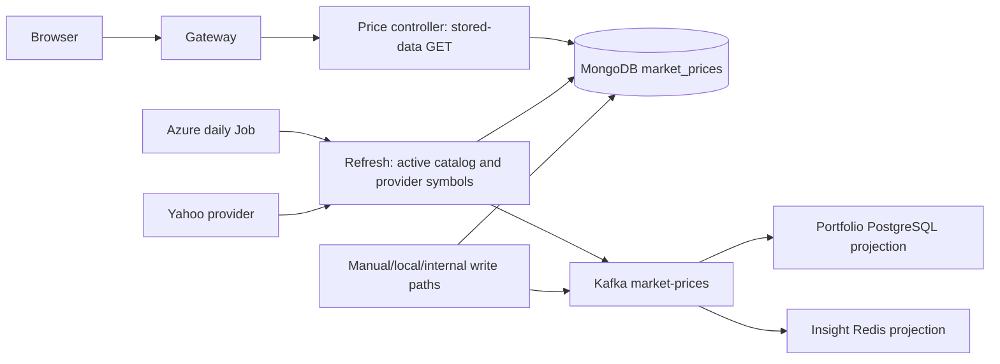

# Market Data Service End-to-End Flow

**Source audit:** 2026-09-26 UTC against `main@8aa4035b`. These are source/configuration facts,
not fresh provider, database or cloud verification. Accepted live evidence and unresolved
limitations are in the [demo dashboard](../plans/ASSET_PICKER_DEMO_PREPARATION_PLAN.md).

## 1. Browser reads stored prices

The Portfolio and Market Data views use
[portfolio.ts](../../frontend/src/lib/api/portfolio.ts); Edit Holdings uses
[useDraftPrices](../../frontend/src/lib/hooks/useDraftPrices.ts) for tickers in the draft.
`usePortfolio` combines the caller's portfolio with stored market-price reads; it does not ask
Yahoo for a fresh quote on page load.

`loadMarketPrices` deduplicates and splits requested tickers into **25-ticker batches**, fetches
them concurrently and merges successful responses. A failed batch degrades to unavailable
prices without logging the user out. This frontend batch size is not the server's request cap.

[apiPath](../../frontend/src/lib/config/api.ts) supplies the configured gateway origin.
Static export has no Next.js proxy. Azure uses the `api.` domain; local configuration targets
port 8080. The gateway routes `/api/market/**` to `MARKET_DATA_SERVICE_URL`: base JVM default
`http://localhost:8082`, Compose `http://market-data-service:8082`, Azure internal
`http://market-data-service`. See the [gateway flow](api-gateway-service-e2e.md) for auth,
identity, public health exceptions and the read-only-account write rules.

## 2. HTTP contract

[MarketPriceController](../../market-data-service/src/main/java/com/wealth/market/MarketPriceController.java)
reads MongoDB through `AssetPriceRepository`.

| Method / path | Current behavior |
|---|---|
| `GET /api/market/prices?tickers=...` | Up to 200 distinct, trimmed tickers; more returns 400. Each requested ticker gets a row, including explicit unavailable rows for missing data. |
| `GET /api/market/prices` (no filter) | Returns at most 100 stored documents; it is not a complete-catalog listing. |
| `POST /api/market/prices/{ticker}` | Manual price update from a JSON decimal body; persists and submits an asynchronous Kafka send. A 200 does not prove broker acknowledgment. This is a write, not part of normal page reads. |
| `GET /api/market/health` | Public service-UP handler; not a Yahoo-price or Kafka-delivery acceptance test. |

[MarketPriceDto](../../market-data-service/src/main/java/com/wealth/market/MarketPriceDto.java)
includes nullable `currentPrice`, `quoteCurrency`, observation/reference timestamps
and nullable change fields. Missing requested tickers have null data fields, not a fabricated zero
price or a fabricated observation time. The change uses a stored previous reference;
`WITHIN_24H_WINDOW` versus `SINCE_PREVIOUS_SNAPSHOT` qualifies its age (18–36 hour window).
A previous snapshot is not necessarily an exact 24-hour market return.

## 3. Writes and propagation

[AssetPrice](../../market-data-service/src/main/java/com/wealth/market/AssetPrice.java) is stored in
MongoDB's `market_prices` collection, keyed by ticker. It holds current price, quote currency,
update/observation time, and the prior reference price/time.

[MarketPriceService](../../market-data-service/src/main/java/com/wealth/market/MarketPriceService.java)
rolls the prior observation into reference fields, saves MongoDB, then sends
`PriceUpdatedEvent(ticker, newPrice, quoteCurrency, observedAt, previousReferencePrice,
previousReferenceAt)` to Kafka topic `market-prices`, keyed by ticker.

The scheduled refresh has its own write loop in `MarketDataRefreshService`, not a call through
`MarketPriceService`. Both paths persist before publishing. MongoDB and Kafka are **not one
atomic transaction**; this is not an outbox or an exactly-once end-to-end delivery guarantee.
A new observation can have the same price as the previous one and is still published.
The manual HTTP path does not await its Kafka send future; a later send failure is not reflected
in an already returned 200. The scheduled refresh has different completion semantics below.

Consumers maintain separate views:

- Portfolio-service projects latest prices/history into PostgreSQL for valuation.
- Insight-service writes Redis latest prices and observation windows for summaries/chat.

Propagation is asynchronous. MongoDB, PostgreSQL and Redis can disagree transiently; a successful
Mongo read alone does not prove downstream convergence. See the
[portfolio flow](portfolio-service-e2e.md) and [insight flow](insight-service-e2e.md).

## 4. Refresh: active catalog and provider-symbol mapping

[MarketDataRefreshService](../../market-data-service/src/main/java/com/wealth/market/MarketDataRefreshService.java)
takes the tracked set from the shared catalog's **ACTIVE** entries, not every MongoDB document.
The current catalog has 159 ACTIVE entries and one DEPRECATED entry. Catalog/provider symbols
may differ: the Yahoo lookup uses the configured `providerSymbol`, then maps results back to
the application's canonical ticker. Renaming a provider symbol does not rename a holding.

The [Yahoo client](../../market-data-service/src/main/java/com/wealth/market/YahooFinanceExternalMarketDataClient.java)
fetches sequential batches (default 50) and accumulates results before returning. If **any batch
ultimately fails after the configured retries**, the complete fetch throws: even successful
batches from that fetch are discarded, and the refresh writes/publishes none of their prices.
The refresh catches this provider failure and returns normally with last-known data unchanged;
therefore a successful Job exit does not prove prices updated. A missing ticker in a successful
fetch is skipped, preserving its prior value/time. Per-ticker persistence failures are logged/
counted and can also leave incomplete coverage.

After Mongo writes, the refresh flushes and waits for all collected Kafka send futures. A send
failure (or flush failure) propagates to the Job runner, which exits 1; the completed Mongo writes
are **not rolled back**. Azure's Job sets `replica_retry_limit=0` (no Job-level retry), distinct from
provider/producer internal retries. Always distinguish Job completion from price coverage and
downstream convergence.

For a previously absent ticker the refresh constructs `AssetPrice(ticker, null)` and does not
assign a quote currency. Its new Mongo document/event therefore has null `quoteCurrency`;
existing documents retain their currency. Catalog-derived currency in downstream views is not
evidence that the refresh populated this Mongo field.

### Azure: separate Container Apps Job

[Azure Terraform](../../infrastructure/terraform/azure/main.tf) defines
`market-data-refresh-job` with a **five-field `0 8 * * *` schedule (08:00 UTC)**.
It runs the market image with `prod,azure`, no web application, and
`MARKET_DATA_JOB_RUNNER_ENABLED=true`.
[MarketDataRefreshJobRunner](../../market-data-service/src/main/java/com/wealth/market/MarketDataRefreshJobRunner.java)
invokes one refresh, flushes available tracing, then exits.

The API Container App's [Azure profile](../../market-data-service/src/main/resources/application-azure.yml)
sets `market-data.refresh.enabled=false`; its retained Spring cron text is **inactive**.
The Job, not an in-app daily timer in a scale-to-zero API replica, is the Azure refresh path.

### Local / retained AWS

[MarketDataRefreshJob](../../market-data-service/src/main/java/com/wealth/market/MarketDataRefreshJob.java)
is the conditional Spring `@Scheduled` adapter, with hourly default cron when enabled.
The AWS overlay disables this adapter. Retaining AWS configuration does not establish a working
scheduled AWS refresh or authorize reactivation.

## 5. Seeding and startup: separate from real market observations

- [LocalMarketDataSeeder](../../market-data-service/src/main/java/com/wealth/market/LocalMarketDataSeeder.java)
  is `@Profile("local")` and checks `market.seed.enabled`; it reads the local fixture and
  backfills missing tickers through the price-write service.
- [MarketDataSeedService](../../market-data-service/src/main/java/com/wealth/market/seed/MarketDataSeedService.java)
  is a conditional internal golden-state operation. It writes deterministic active-catalog
  prices and sends synthetic prior/current observations. These are **test data**, not Yahoo
  market history. The Azure overlay disables `market-data.seed.enabled`.
- The earlier guides named `BaselineSeeder` and `StartupHydrationService`. Neither class exists
  in this source tree; leftover configuration/comments do not implement automatic cold-start
  republishing. Do not rely on an API wake to rehydrate all projections.

Seed, manual override, repair and refresh dispatch are operational writes. This guide authorizes
none of them; use the separately reviewed [operations guidance](../runbooks/CURRENT_OPERATIONS.md).

## 6. Data-flow split

```mermaid
flowchart LR
    B[Browser] --> G[Gateway]
    G --> Q[Price controller: stored-data GET]
    Q --> M[(MongoDB market_prices)]
    J[Azure daily Job] --> F[Refresh: active catalog and provider symbols]
    Y[Yahoo provider] --> F
    F --> M
    F --> K[Kafka market-prices]
    W[Manual/local/internal write paths] --> M
    W --> K
    K --> P[Portfolio PostgreSQL projection]
    K --> I[Insight Redis projection]
```

## 7. Deployment and freshness boundary

Azure API profiles are `prod,azure`, with internal ingress and scale-to-zero; managed dependencies
are MongoDB Atlas and Aiven Kafka. A cold API replica delays reads; it does not trigger a fresh
provider price or establish consumer catch-up. The Mongo health configuration uses a database
ping, not complete business-flow verification.

Portfolio freshness uses its own configurable 50-hour default and observation time; Redis bulk
summary inclusion uses a separate 24-hour received-update window. Neither promises prices will
never exceed 24 hours old. The operator warm-up keeps services awake for a bounded demo session,
not indefinitely, and does not replace scheduled refresh.
