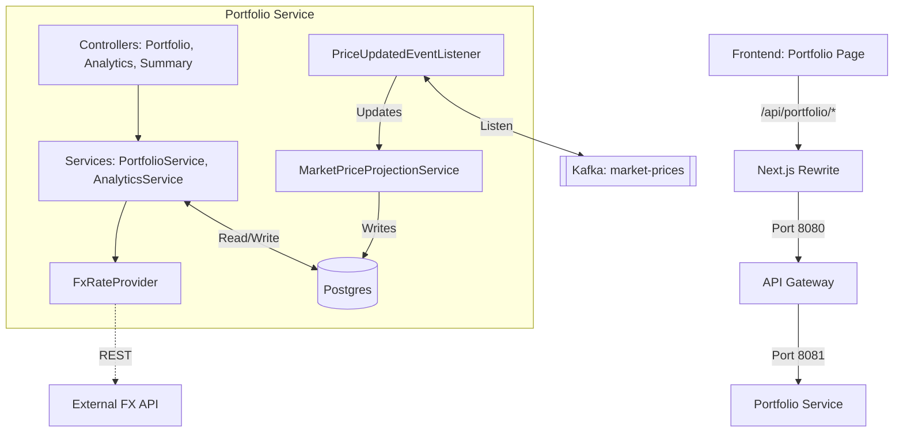

# Portfolio Service End-to-End (E2E) Flow

This document describes the flow of data and control for the `portfolio-service` in the Wealth Management and Portfolio Tracker application, starting from the frontend.

## 1. Frontend Layer (Next.js)
The flow begins in the **Portfolio Page** (`frontend/src/app/(dashboard)/portfolio/page.tsx`), which serves as the primary dashboard for viewing user holdings and performance.

*   **`PortfolioPageContent`**: A client-side component that gates data components behind a confirmed session. It composes the following sub-components:
    *   **`SummaryCards`**: Displays high-level metrics (Total Value, Unrealized P&L, 24h Change).
    *   **`PerformanceChart`**: Visualizes historical portfolio performance.
    *   **`AllocationChart`**: Shows asset class distribution.
    *   **`HoldingsTable`**: Lists individual holdings with detailed metrics (Quantity, Price, Value, P&L, 24h Change).

### Frontend Hooks & API Clients
*   **`usePortfolio`**: Fetches the core portfolio holdings via `fetchPortfolio` in `frontend/src/lib/api/portfolio.ts`. It performs client-side aggregation by combining `portfolio-service` data with `market-data-service` prices.
*   **`usePortfolioAnalytics`**: Fetches pre-computed analytics (best/worst performers, performance series) from `GET /api/portfolio/analytics`.
*   **`usePortfolioSummary`**: Fetches a lightweight summary from `GET /api/portfolio/summary`.

## 2. API Call & Routing
*   **Local Proxy**: The frontend makes requests to `/api/portfolio/**`.
*   **Next.js Rewrite**: `next.config.ts` rewrites these calls to the **API Gateway** at `http://127.0.0.1:8080` (local) or to `https://vibhanshu-ai-portfolio.dev` (production CloudFront origin).
*   **API Gateway**: The Spring Cloud Gateway (`api-gateway/src/main/resources/application.yml`) routes requests based on the path:
    *   `/api/portfolio/**` → `http://localhost:8081` (local) / `PORTFOLIO_SERVICE_URL` Lambda Function URL (production)
*   **Authentication**: The Gateway validates the JWT and injects the `X-User-Id` header into downstream requests.

## 3. Portfolio Service Controllers
The `portfolio-service` exposes three main REST controllers:
*   **`PortfolioController`**: Handles `/api/portfolio` (GET/POST) for retrieving and creating portfolios, and adding/updating holdings.
*   **`PortfolioAnalyticsController`**: Handles `/api/portfolio/analytics` (GET). It provides high-fidelity analytics including unrealized P&L and historical performance points.
*   **`PortfolioSummaryController`**: Handles `/api/portfolio/summary` (GET). It provides a lightweight summary of total value and holdings count.

## 4. Service Layer & Logic
The business logic is orchestrated by two primary services:
*   **`PortfolioService`**: Manages the lifecycle of `Portfolio` and `AssetHolding` entities. It also computes the portfolio summary, performing FX conversion using an `FxRateProvider`.
*   **`PortfolioAnalyticsService`**: Computes complex analytics using a single SQL round-trip (CTE + UNION ALL) to retrieve holdings, 24h-ago prices, and historical series. It applies FX conversion per holding and caches results per-user.

## 5. Data Layer & Real-time Integration
The service relies on a Postgres database and real-time Kafka updates:
*   **Postgres Storage**:
    *   `portfolios`: Stores portfolio metadata.
    *   `asset_holdings`: Stores user-specific holdings (ticker, quantity).
    *   `market_prices`: Read-model of latest ticker prices (updated via Kafka).
    *   `market_price_history`: Historical price points for performance charting.
*   **Kafka Listener**:
    *   **`PriceUpdatedEventListener`**: Listens to the `market-prices` Kafka topic.
    *   **`MarketPriceProjectionService`**: Idempotently upserts the latest price into the `market_prices` table upon receiving a `PriceUpdatedEvent` (`INSERT ... ON CONFLICT ... IS DISTINCT FROM`), so duplicate deliveries are no-ops.
    *   **Dead-Letter Topic**: `MalformedEventException` is registered as non-retryable on Spring Kafka's `DefaultErrorHandler`; poison records are routed to `market-prices.DLT` with the original key preserved.

## 6. Currency Conversion (FX)
*   **`FxRateProvider`**: An interface for fetching exchange rates.
*   **`EcbFxRateProvider`**: Implements the interface by calling an external FX API (e.g., European Central Bank).
*   **`FxProperties`**: Configures the base currency (e.g., USD) for all portfolio valuations.

## Summary Flow Diagram

## 7. Production Deployment Topology (AWS / Terraform)
The `portfolio-service` is packaged as a container image (ECR) and deployed as an **AWS Lambda function on arm64 / Graviton2** via the **Lambda Web Adapter** sidecar. Provisioned by `infrastructure/terraform/modules/compute`:

- **Lambda alias `live`** is published per deploy; the **Function URL** (`AuthType = NONE`) attaches to the `live` alias rather than `$LATEST`.
- **Origin protection**: the Function URL is fronted only via CloudFront → api-gateway, which injects `X-Origin-Verify`. The api-gateway forwards verified requests to `PORTFOLIO_SERVICE_URL`.
- **Managed Postgres**: `SPRING_DATASOURCE_URL` points at an external managed Postgres (e.g., Neon/Supabase) since AWS RDS is outside the free-tier budget. JDBC TLS uses the canonical `truststore.jks` shipped from `common-dto` via `TruststoreExtractor`.
- **Managed Kafka**: consumer connects to **Aiven Kafka** over mTLS using the same canonical truststore. The DLT (`market-prices.DLT`) lives on the same broker.
- **`insight-service` callback**: `insight-service` calls portfolio-service for portfolio context using `PORTFOLIO_SERVICE_URL` (Lambda Function URL → Lambda Function URL, both `AuthType = NONE`, both protected by `X-Origin-Verify` enforcement at the edge).
- **Cold-start mitigation**: when `enable_warming = true`, the Terraform `warming` module uses EventBridge Rules + API Destinations (`rate(5 minutes)`) to GET `/actuator/health` on the Function URL; CloudWatch alarm on `ConcurrentExecutions ≥ 8` → SNS. Optional escalation: `enable_provisioned_concurrency` on the `live` alias.
- **Concurrency**: `reserved_concurrent_executions` is intentionally **omitted** (ap-south-1 account cap is 10 unreserved executions).
