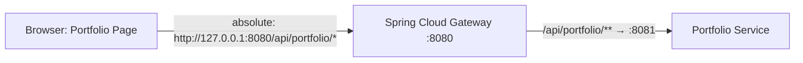
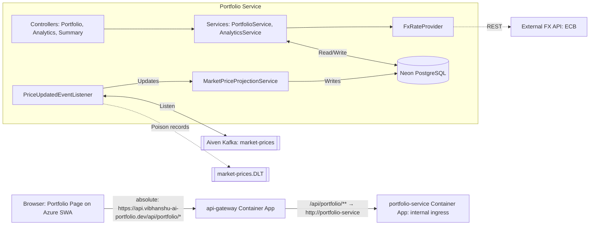

# Portfolio Service End-to-End (E2E) Flow

This document describes the flow of data and control for the `portfolio-service` in the Wealth Management and Portfolio Tracker application, starting from the frontend.

> **Deployment context (June 2026):** Multi-cloud via Terraform, with **Azure active (live)** and **AWS a soft-disabled standby**. See `README.md`.

## 1. Frontend Layer (Next.js)
The flow begins in the **Portfolio Page** (`frontend/src/app/(dashboard)/portfolio/page.tsx`), the primary dashboard for viewing holdings and performance.

*   **`PortfolioPageContent`**: A client component that gates data components behind a confirmed session. It composes:
    *   **`SummaryCards`**: high-level metrics (Total Value, Unrealized P&L, 24h Change).
    *   **`PerformanceChart`**: historical portfolio performance.
    *   **`AllocationChart`**: asset-class distribution.
    *   **`HoldingsTable`**: per-holding detail (quantity, price, value, P&L, 24h change).

### Frontend Hooks & API Clients
*   **`usePortfolio`**: fetches holdings via `fetchPortfolio` (`frontend/src/lib/api/portfolio.ts`), combining `portfolio-service` data with `market-data-service` prices client-side.
*   **`usePortfolioAnalytics`**: fetches pre-computed analytics from `GET /api/portfolio/analytics`.
*   **`usePortfolioSummary`**: fetches a lightweight summary from `GET /api/portfolio/summary`.

## 2. API Call & Routing

> **Note:** `next.config.ts` is configured for static export (`output: "export"`). It contains **no rewrite or proxy rules** — there is no Next.js proxy layer.

### Path Construction (`frontend/src/lib/config/api.ts`)
All API calls go through `apiPath()`, which inspects `NEXT_PUBLIC_API_BASE_URL` (embedded at build time):
*   **Set** (both local and Azure production): returns an **absolute URL**.
    *   Local: `http://127.0.0.1:8080/api/portfolio`
    *   Azure: `https://api.vibhanshu-ai-portfolio.dev/api/portfolio`
*   **Unset** (fallback only): returns a relative `/api/*` path. Not used by the supported environments.

### Local Development
`NEXT_PUBLIC_API_BASE_URL=http://127.0.0.1:8080` (in `frontend/.env.local`). The browser hits the Spring Cloud Gateway directly on port 8080.

### Production (Azure)
`NEXT_PUBLIC_API_BASE_URL=https://api.vibhanshu-ai-portfolio.dev` is injected by `deploy-azure.yml`. The static frontend is hosted on **Azure Static Web Apps**; the browser calls the **api-gateway Container App** directly via the `api.` subdomain.

### Spring Cloud Gateway → Portfolio Service
The gateway routes based on path predicates (targets are env-driven `${app.routes.*-url}`):
*   `/api/portfolio/**` → `PORTFOLIO_SERVICE_URL` (`http://localhost:8081` local / `http://portfolio-service` ACA internal DNS)
*   `/api/market/**` → `MARKET_DATA_SERVICE_URL`
*   `/api/insights/**` and `/api/chat/**` → `INSIGHT_SERVICE_URL`

**Authentication:** the gateway validates the HS256 JWT and injects the `X-User-Id` header into every downstream request.

## 3. Portfolio Service Controllers
*   **`PortfolioController`**: `/api/portfolio` (GET/POST) — retrieve/create portfolios, add/update holdings.
*   **`PortfolioAnalyticsController`**: `/api/portfolio/analytics` (GET) — unrealized P&L and historical performance points.
*   **`PortfolioSummaryController`**: `/api/portfolio/summary` (GET) — lightweight total value and holdings count.

## 4. Service Layer & Logic
*   **`PortfolioService`**: Manages `Portfolio` and `AssetHolding` entities and computes the summary, performing FX conversion via an `FxRateProvider`.
*   **`PortfolioAnalyticsService`**: Computes analytics in a single SQL round-trip (CTE + UNION ALL) for holdings, 24h-ago prices, and historical series; applies per-holding FX conversion and caches results per user.

## 5. Data Layer & Real-time Integration
The service relies on a PostgreSQL database (Flyway-migrated) and real-time Kafka updates:
*   **Postgres tables:**
    *   `portfolios`: portfolio metadata.
    *   `asset_holdings`: user holdings (ticker, quantity, cost basis).
    *   `market_prices`: read-model of latest ticker prices (updated via Kafka).
    *   `market_price_history`: historical price points for performance charting.
*   **Kafka consumer:**
    *   **`PriceUpdatedEventListener`**: consumes the `market-prices` topic (listener observation enabled for tracing).
    *   **`MarketPriceProjectionService`**: idempotently upserts the latest price into `market_prices` (`INSERT ... ON CONFLICT ... IS DISTINCT FROM`), so duplicate deliveries are no-ops, and appends to `market_price_history` per new `(ticker, observed_at)`.
    *   **Dead-Letter Topic:** `MalformedEventException` is registered as non-retryable on Spring Kafka's `DefaultErrorHandler`; poison records are routed to `market-prices.DLT` (key preserved) via `DeadLetterPublishingRecoverer`.

## 6. Currency Conversion (FX)
*   **`FxRateProvider`**: interface for fetching exchange rates.
*   **`EcbFxRateProvider`**: calls an external FX API (European Central Bank).
*   **`FxProperties`**: configures the base currency for valuations.

## Summary Flow Diagram

### Local Development

```mermaid
graph LR
    A[Browser: Portfolio Page] -->|"absolute: http://127.0.0.1:8080/api/portfolio/*"| C[Spring Cloud Gateway :8080]
    C -->|"/api/portfolio/** → :8081"| D[Portfolio Service]
```

### Production (Azure)

```mermaid
graph LR
    A[Browser: Portfolio Page on Azure SWA] -->|"absolute: https://api.vibhanshu-ai-portfolio.dev/api/portfolio/*"| C[api-gateway Container App]
    C -->|"/api/portfolio/** → http://portfolio-service"| D[portfolio-service Container App: internal ingress]

    subgraph "Portfolio Service"
        D1[Controllers: Portfolio, Analytics, Summary]
        D2[Services: PortfolioService, AnalyticsService]
        D3[MarketPriceProjectionService]
        D4[PriceUpdatedEventListener]
        D5[FxRateProvider]

        D1 --> D2
        D2 --> D5
        D4 -->|Updates| D3
        D3 -->|Writes| E[(Neon PostgreSQL)]
        D2 <-->|Read/Write| E
    end

    D4 <-->|Listen| F[[Aiven Kafka: market-prices]]
    D4 -.->|Poison records| DLT[[market-prices.DLT]]
    D5 -.->|REST| G[External FX API: ECB]
```

## 7. Production Deployment Topology

### Azure — Active (Live)
The `portfolio-service` is built as a container image (ACR) and deployed as an **Azure Container App** with **internal ingress**. Provisioned by `infrastructure/terraform/azure` (`module.portfolio_service`):

- **Profiles:** `SPRING_PROFILES_ACTIVE=prod,azure`.
- **Managed Postgres:** persists to **Neon PostgreSQL**; JDBC TLS uses the canonical `truststore.jks` from `common-dto` via `TruststoreExtractor`. Flyway migrations run on startup.
- **Managed Kafka:** consumer connects to **Aiven Kafka** over mTLS using the same canonical truststore; the DLT (`market-prices.DLT`) lives on the same broker.
- **Scaling:** `min_replicas = 0` (scale-to-zero), `max_replicas = 3`.
- **`insight-service` callback:** `insight-service` calls back to portfolio-service for portfolio context via the ACA internal DNS name (`http://portfolio-service`).

### AWS — Soft-Disabled Standby
- Packaged as a container image and deployed as **AWS Lambda on arm64 / Graviton2** via the **Lambda Web Adapter** (`live` alias, `Function URL` `AuthType = NONE`, fronted only via CloudFront → api-gateway with `X-Origin-Verify`).
- **Managed Postgres:** `SPRING_DATASOURCE_URL` points at the external managed Postgres (RDS is outside the free-tier budget).
- **Managed Kafka:** Aiven Kafka over mTLS; DLT on the same broker.
- `reserved_concurrent_executions` omitted (ap-south-1 cap); cold-start mitigation via the `warming` module when enabled.
