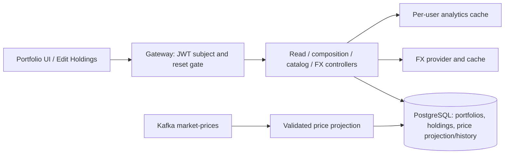

# Portfolio Service End-to-End Flow

**Source audit:** 2026-09-26 UTC against `main@8aa4035b`. This guide describes source behavior,
not a new database read or live suite. The [demo dashboard](../plans/ASSET_PICKER_DEMO_PREPARATION_PLAN.md)
retains the accepted `PASS_WITH_EXPECTED_DEFECTS` verdict and its evidence limitations.

## 1. Session-gated browser reads

[PortfolioPageContent](../../frontend/src/components/portfolio/PortfolioPageContent.tsx) composes
summary, performance, allocation, holdings, freshness and feature-flagged edit/reset controls.
[usePortfolio](../../frontend/src/lib/hooks/usePortfolio.ts) scopes portfolio/summary/analytics
query keys by authenticated user. The frontend is statically exported and calls the configured
gateway origin through `apiPath`; there is no Next.js API proxy.

[portfolio.ts](../../frontend/src/lib/api/portfolio.ts) selects the caller's portfolio, preserves
string quantities, and enriches holdings using stored Mongo prices in 25-ticker batches.
The compatibility adapter accepts legacy numeric quantities but flags their fidelity as
unverified. Empty lists represent no portfolio; ambiguous/nonmatching nonempty lists raise a
contract error rather than silently choosing someone else's portfolio.

Analytics and summary are separate PostgreSQL-based reads. UI query invalidation is not the
same thing as eviction of the backend analytics cache, and Mongo prices may temporarily differ
from the PostgreSQL projection.

## 2. Endpoints and trust boundary

The gateway validates the JWT and overwrites `X-User-Id`. Ordinary portfolio endpoints use that
header, not a caller-selected portfolio/user ID. Downstream service access must remain behind
the trusted gateway/network boundary; the header alone is not cryptographic authentication.
**Exception:** insight-service's advisor takes a caller-selected path user ID and forwards it as
this trusted header, without checking the gateway subject. That source-confirmed
[IDOR](../todos/backlog/portfolio-advisor-cross-user-authorization/README.md) is not covered by
the normal portfolio endpoint's subject-binding claim.
Base JVM target is localhost:8081, Compose uses `portfolio-service:8081`, and Azure uses the
internal ACA name at ingress port 80, forwarded to service port 8080.

| Method / path | Handler and current purpose |
|---|---|
| `GET /api/portfolio` | `PortfolioController`: list the caller's portfolios, including version and holdings |
| `PUT /api/portfolio/holdings` | `CompositionController`: replace the caller's complete desired holdings set |
| `GET /api/assets` | `AssetCatalogController`: catalog metadata/lifecycle, version/ETag and conditional 304 |
| `GET /api/portfolio/summary` | `PortfolioSummaryController`: total value, coverage and freshness |
| `GET /api/portfolio/analytics` | `PortfolioAnalyticsController`: valuations, P&L, change and performance |
| `GET /api/portfolio/fx-rates?currencies=INR,JPY` | `FxRatesController`: display-estimate conversion rates into the base currency |
| `PUT /api/portfolio/demo-reset` | Gateway-authorized public reset bridge; not a generic user reset |
| `GET /api/portfolio/health` | Service-UP handler; not a complete database/valuation check |

There is no public PortfolioController POST that creates portfolios or incrementally adds
holdings. Gateway signup transactionally creates an empty portfolio. The composition operation
also has an explicitly versioned no-portfolio creation case.

Sources: [controllers](../../portfolio-service/src/main/java/com/wealth/portfolio/PortfolioController.java),
[composition](../../portfolio-service/src/main/java/com/wealth/portfolio/composition/CompositionController.java),
[catalog](../../portfolio-service/src/main/java/com/wealth/portfolio/AssetCatalogController.java),
[FX rates](../../portfolio-service/src/main/java/com/wealth/portfolio/FxRatesController.java).

The [exception mapper](../../portfolio-service/src/main/java/com/wealth/portfolio/GlobalExceptionHandler.java)
distinguishes these common outcomes (not an exhaustive HTTP/error map):

| Status | Meaning |
|---|---|
| 400 | Missing required user header, malformed/missing version, invalid quantity or duplicate ticker |
| 404 | Unknown portfolio user |
| 409 | Optimistic version conflict; response includes `currentVersion` |
| 422 | Unsupported asset or disallowed catalog lifecycle |
| 503 | Required FX conversion unavailable |

Gateway authentication/authorization failures are separate 401/403 outcomes; guarded internal
operations can also return 503 when their API key is not configured.

## 3. Edit Holdings: exact desired state, version and persistence

The [save adapter](../../frontend/src/lib/api/assetPickerSave.ts) sends
`{expectedVersion, holdings: [{ticker, quantity}]}` to the composition PUT.
Quantities are decimal **strings** on the write wire, not floating-point JSON numbers.
Removing a ticker from the desired set removes that holding; an empty set is an empty portfolio.
Canceling the draft sends no composition write.

[CompositionWriteService](../../portfolio-service/src/main/java/com/wealth/portfolio/composition/CompositionWriteService.java)
uses the shared transactional
[HoldingReplacementService](../../portfolio-service/src/main/java/com/wealth/portfolio/composition/HoldingReplacementService.java).
It checks optimistic version, validates quantity/catalog/lifecycle rules and replaces holdings
while preserving portfolio identity. Version conflict returns 409 with `currentVersion`;
invalid intent returns a contract error without a partial save. No-portfolio creation requires
`expectedVersion=0`; existing portfolios require their observed version. Responses are 200 for
existing state or 201 for creation, with the persisted version and holdings.
An identical complete tuple set is a no-op and retains the version; a real change advances it.

The [response DTO](../../portfolio-service/src/main/java/com/wealth/portfolio/PortfolioResponse.java)
serializes quantities with the plain-string serializer. The frontend reconciles from that
response and invalidates relevant reads; it does not declare the submitted draft to be truth
before persistence succeeds. Conflict handling does not silently retry with a fresh version.

New holdings use [add-time cost basis](../../portfolio-service/src/main/java/com/wealth/portfolio/composition/AddTimeCostBasisCapturer.java)
from a positive stored price when available; otherwise basis is unavailable. This is a demo
valuation anchor, not execution-price accounting or a transaction ledger.

The gateway's `ro` filter explicitly exempts the exact holdings PUT and public demo-reset PUT.
Do not describe the showcase's read-only claim as an absolute block on all portfolio writes.
The [gateway guide](api-gateway-service-e2e.md) explains the additional reset authorization.

## 4. Analytics, chart and partial data

[PortfolioService](../../portfolio-service/src/main/java/com/wealth/portfolio/PortfolioService.java)
computes summary/freshness from PostgreSQL latest-price rows.
[PortfolioAnalyticsService](../../portfolio-service/src/main/java/com/wealth/portfolio/PortfolioAnalyticsService.java)
uses a CTE/UNION query for holdings, reference prices and daily history, then applies FX:

- Price/value/P&L fields can be null when prices, FX or cost basis are unavailable; unavailable
  is not zero. Coverage and partial flags qualify aggregates.
- Change uses a reference in the 18–36 hour tolerance window or a labelled older snapshot.
  Stale latest observations are excluded from 24h totals and best/worst selection.
- Daily history chooses the latest row **per ticker per UTC date**, preventing same-day
  duplicates from multiplying value. The default history window is 50 days.
- The series revalues **current quantities** against historical prices and the available current
  FX map. It is not a cash-flow-adjusted, transaction-history or historical-FX return series.
- Fewer than seven distinct history dates produces a backend synthetic series marked
  `performanceCoverage.synthetic=true`; incomplete history has coverage metadata.
  [PerformanceChart](../../frontend/src/components/charts/PerformanceChart.tsx) prefers analytics;
  its separate client fallback also generates a display series. A visible chart alone is not
  proof that real complete historical analytics were returned.

The [analytics cache](../../portfolio-service/src/main/java/com/wealth/portfolio/CacheConfig.java)
is per-user: Caffeine on Azure/local and Redis on AWS, with 30-second expiry. Immediate
server-side eviction after a composition write is not established; the accepted cache-staleness
finding remains open. Sharpe/Sortino analysis is deferred in
[enhancements v5](../../roadmap_enhancements_v5.md), not an existing metric.

[AssetPriceFreshness](../../portfolio-service/src/main/java/com/wealth/portfolio/freshness/AssetPriceFreshness.java)
returns MISSING for absent price rows, UNKNOWN for absent observation time, and STALE only when
age **exceeds** the configured threshold (default 50 hours). Exactly 50 hours is still fresh.
Reading freshness does not fetch a new market price.

## 5. FX conversion and Edit Holdings estimates

Despite its name, [EcbFxRateProvider](../../portfolio-service/src/main/java/com/wealth/portfolio/fx/EcbFxRateProvider.java)
uses the configured `open.er-api.com` USD-rate map on Azure/AWS, **not the ECB endpoint**.
It derives cross-rates from a cached bulk response. The local profile uses `StaticFxRateProvider`.
The Azure profile sets 06:00 cache eviction; the Spring scheduler has no explicit timezone.
The next cache miss fetches rates; the shared cache also has 30-second expiry.

Equal currencies use rate 1. On provider failure the fallback map is USD-only; an unresolved
non-equal conversion raises `FxRateUnavailableException`, not a fabricated 1:1 rate.
`/fx-rates` accepts at most 64 distinct requested codes and returns null for unresolved rates.
The API has no provider rate timestamp. The dialog uses the same provider for display estimates;
estimates are not trade execution prices. FX-pair holding semantics remain an open product
question; unknown-currency and analytics-unavailable cases are not newly live-verified here.

## 6. Kafka price projection

[MarketPriceProjectionService](../../portfolio-service/src/main/java/com/wealth/portfolio/MarketPriceProjectionService.java)
transactionally writes `market_prices` and `market_price_history`:

- Latest tuples include price, quote currency and observation time; newer observations replace
  older latest rows. Equal-time identical payloads are idempotent; conflicts are rejected.
- History identity is `(ticker, observed_at)`, normalized to millisecond precision.
  Duplicate identical history is ignored; conflicting payloads fail.
- Undated legacy events do not fabricate an observation time or append dated history.
- Catalog/currency validation gates unsupported events; malformed/rejected records are handled
  through the Kafka error/DLT configuration. This is not a universal exactly-once guarantee.

`PriceUpdatedEventListener` consumes `market-prices`; rejected poison records go to
`market-prices.DLT`. PostgreSQL is the portfolio valuation projection, not a request-time Yahoo
lookup. Event tracing is enabled, but delivery/lag is not rechecked by this document audit.

## 7. Reset is a holdings operation, not market-history generation

[DemoResetService](../../portfolio-service/src/main/java/com/wealth/portfolio/demo/DemoResetService.java)
targets the fixed showcase identity with the shared versioned replacement primitive and
golden-state tuples. It preserves portfolio identity and advances the version only if the tuple
set changes (an already identical reset is a no-op). The public bridge
requires that subject and route; the internal endpoint requires the internal API key.
Login-triggered reset first observes eligibility and may skip; manual reset still uses the
submitted version. Neither presence hints nor reset automatically authorize a rehearsal.

Normal demo reset does not need to seed Mongo/Redis or append synthetic market-price history.
Internal golden-state seeding is a distinct operational action and can write deterministic data;
do not substitute it for a normal demo restore. See [current operations](../runbooks/CURRENT_OPERATIONS.md).

## 8. Data-flow split and deployment

```mermaid
flowchart LR
    B[Portfolio UI / Edit Holdings] --> G[Gateway: JWT subject and reset gate]
    G --> C[Read / composition / catalog / FX controllers]
    C --> D[(PostgreSQL: portfolios, holdings, price projection/history)]
    C --> F[FX provider and cache]
    K[Kafka market-prices] --> P[Validated price projection]
    P --> D
    C --> A[Per-user analytics cache]
```

Azure profiles are `prod,azure`; Flyway migrations run on startup and the service has internal
ingress and scale-to-zero. Source defines Neon PostgreSQL and Aiven Kafka integration. The
retained AWS Lambda configuration is restart context, not a newly verified standby deployment.
The advisor **fetch** from insight-service selects the user from its public analyze-path argument,
not a callback or the browser chat's portfolio-context pipeline. Its authorization flaw and the
unverified Azure URL/reachability limitation are recorded in the
[insight guide](insight-service-e2e.md#5-separate-portfolio-advisor-path-and-limits).
