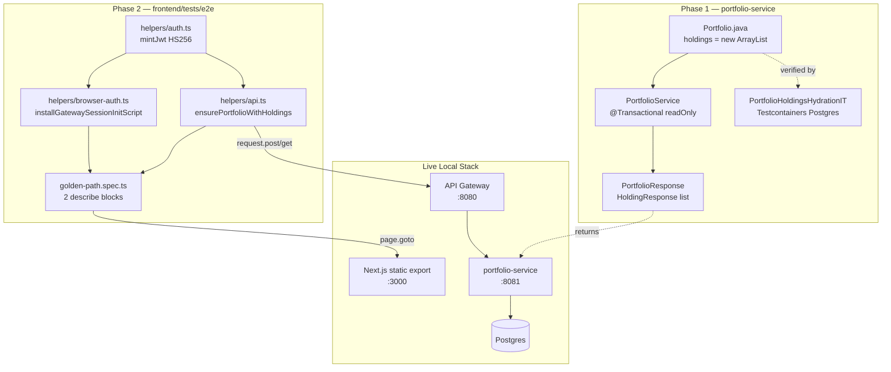
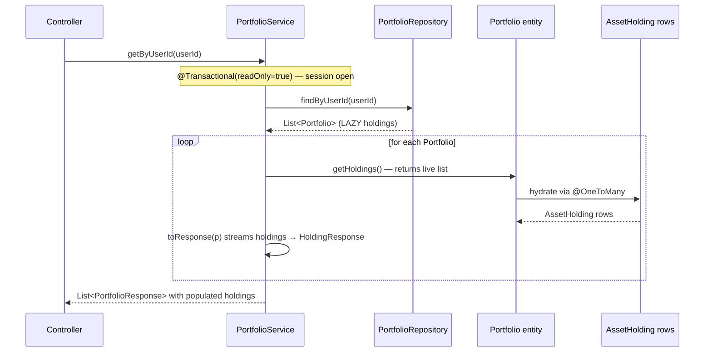
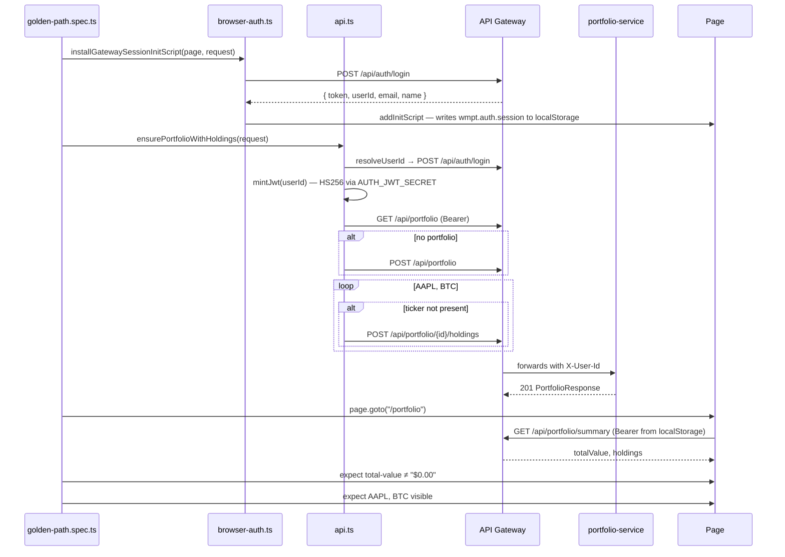

# Design Document: Backend Remediation & Playwright Golden-Path E2E

## Overview

This feature covers two coupled concerns. **Phase 1** remediates two subtle backend logical bugs:
a residual risk of raw `ObjectMapper` usage outside the Spring Boot 4 preferred `JsonMapper`
convention, and an over-defensive `Portfolio.getHoldings()` that wrapped the JPA-managed
collection in `Collections.unmodifiableList(...)`, breaking dirty-checking and cascade hydration
so the REST API returned empty `holdings` arrays. **Phase 2** introduces a Playwright
golden-path E2E suite that exercises the full create → persist → read cycle against the live
local stack (Spring Boot + Docker Compose + Next.js static export) with no MSW mocks, proving
the end-to-end data pipeline and preventing regressions of the Phase 1 fixes.

---

## Architecture

Phase 1 changes are entirely contained inside the `portfolio-service` module. Phase 2 adds
spec and helper files under `frontend/tests/e2e/` and interacts with the already-running
services through the API Gateway; no application code changes are required on the frontend.



---

## Sequence Diagrams

### Phase 1 — Portfolio Read Path (after fix)



### Phase 2 — Golden-Path Test Execution



---

## Components and Interfaces

### Phase 1

#### Portfolio (updated)

**Purpose**: Aggregate root owning the mutable `holdings` collection that JPA populates via the
`@OneToMany(mappedBy = "portfolio")` association.

**Interface** (`portfolio-service/src/main/java/com/wealth/portfolio/Portfolio.java`):

```java
@OneToMany(mappedBy = "portfolio", cascade = CascadeType.ALL, orphanRemoval = true)
private List<AssetHolding> holdings = new ArrayList<>();

public List<AssetHolding> getHoldings() { return holdings; }

void addHolding(AssetHolding h) {
    holdings.add(h);
    h.setPortfolio(this);
}
```

**Responsibilities**:

- Holds `holdings` as a live, mutable `ArrayList` so JPA can hydrate and dirty-check.
- Returns the live reference from `getHoldings()`; callers must not assume immutability.
- Exposes a package-private `addHolding(AssetHolding)` helper so service-layer code never
  mutates the collection directly and the back-reference is always set symmetrically.

---

#### PortfolioService (verified)

**Purpose**: Read/write transaction boundary around the `Portfolio` aggregate.

**Key annotations and method**:

```java
@Transactional(readOnly = true)
public List<PortfolioResponse> getByUserId(String userId) {
    requireUserExists(userId);
    return portfolioRepository.findByUserId(userId).stream().map(this::toResponse).toList();
}

private PortfolioResponse toResponse(Portfolio portfolio) {
    var holdings = portfolio.getHoldings().stream()
        .map(h -> new PortfolioResponse.HoldingResponse(
            h.getId(), h.getAssetTicker(), h.getQuantity()))
        .toList();
    return new PortfolioResponse(
        portfolio.getId(), portfolio.getUserId(), portfolio.getCreatedAt(), holdings);
}
```

**Responsibilities**:

- `@Transactional(readOnly = true)` on `getByUserId` keeps the JPA session open for the
  duration of the stream pipeline so each `portfolio.getHoldings()` call can trigger lazy
  hydration against the live reference.
- `toResponse` streams the live holdings and maps each to a `PortfolioResponse.HoldingResponse`.
  No defensive copy is required because the stream terminal `toList()` returns an immutable
  list owned by the response DTO.

---

#### PortfolioHoldingsHydrationIT (new)

**Purpose**: Prove that `Portfolio` → `AssetHolding` hydration survives a first-level cache
evict and that the REST endpoint returns populated `holdings` arrays.

**Interface**:

```java
@SpringBootTest
@AutoConfigureMockMvc
@Testcontainers
@Tag("integration")
class PortfolioHoldingsHydrationIT {
    @Test void reloadedPortfolioHasTwoHoldings();
    @Test void restEndpointReturnsHoldingsArrayWithTwoElements();
}
```

**Responsibilities**:

- Spin up a Postgres Testcontainer and persist a `Portfolio` with two `AssetHolding` rows.
- Call `entityManager.clear()` to evict the aggregate from the L1 cache.
- Reload via `portfolioRepository.findById(...)` and assert `getHoldings().size() == 2`.
- Invoke `GET /api/portfolio` via `MockMvc` with a stubbed `X-User-Id` header and assert the
  JSON response contains a `holdings` array with two elements.

### Phase 2

#### helpers/auth.ts — `mintJwt`

**Purpose**: Mint an HS256 JWT signed with `AUTH_JWT_SECRET` so helpers and specs can obtain a
token the API Gateway will accept without going through any login UI.

**Interface** (`frontend/tests/e2e/helpers/auth.ts`):

```typescript
export function mintJwt(userId?: string): string;
```

**Responsibilities**:

- Read `AUTH_JWT_SECRET` at call time (treating empty strings as missing — CI secrets can be
  set to `""`) with fallback `local-dev-secret-change-me-min-32-chars`.
- Emit an HS256 JWT with claims `{ sub, name, email, iat, exp = iat + 3600 }`.
- Default `sub` to `user-001`, matching the Flyway V3 seed migration.

---

#### helpers/browser-auth.ts — `installGatewaySessionInitScript`

**Purpose**: Make the Next.js static-export frontend treat the Playwright browser as an
authenticated Better Auth session before any React code runs, without driving the login form.

**Interface** (`frontend/tests/e2e/helpers/browser-auth.ts`):

```typescript
export async function installGatewaySessionInitScript(
  page: Page,
  request: APIRequestContext,
): Promise<void>;
```

**Design note — deviation from the requirement's literal wording**:

Requirement 3.2 originally referenced `next-auth` session injection. During implementation the
frontend migrated to **Better Auth** with a gateway-hosted `/api/auth/login` endpoint. The
design preserves the *intent* of the requirement (programmatic authentication, no UI) with the
following substitutions:

| Original requirement wording            | Actual implementation                               |
| --------------------------------------- | --------------------------------------------------- |
| `next-auth.session-token` cookie        | `wmpt.auth.session` key in `localStorage`           |
| Direct token synthesis in the browser   | Gateway `POST /api/auth/login` + init-script write  |
| NextAuth session provider recognition   | Better Auth session payload recognised by frontend  |

**Responsibilities**:

- Call `POST {GATEWAY_URL}/api/auth/login` with the dev user credentials to obtain a
  `{ token, userId, email, name }` payload minted by the gateway.
- Register a Playwright `addInitScript` that writes the payload into `localStorage` under
  `wmpt.auth.session` before any frame loads, eliminating the hydration race that plagued the
  earlier storage-state approach on statically-exported pages.

---

#### helpers/api.ts — `ensurePortfolioWithHoldings`

**Purpose**: Idempotent backend-API test-data fixture. Guarantees that by the time the spec
navigates to `/portfolio`, the authenticated user owns exactly one portfolio containing at
least an `AAPL` and a `BTC` holding.

**Interface** (`frontend/tests/e2e/helpers/api.ts`):

```typescript
export async function ensurePortfolioWithHoldings(
  request: APIRequestContext,
  token?: string,
): Promise<string>; // returns portfolioId

export { mintJwt };
```

**Responsibilities**:

- Resolve the active `userId` dynamically: call `POST /api/auth/login` against the gateway and
  use the returned `userId`; on any failure fall back to `user-001` (the Flyway seed).
- Mint an HS256 JWT via `mintJwt(userId)` so the `sub` claim matches the owning user and the
  gateway routes writes to the correct portfolio row.
- `GET /api/portfolio` → if the list is empty, `POST /api/portfolio` to create one.
- For each of `{ AAPL: 12, BTC: 0.75 }`, `POST /api/portfolio/{id}/holdings` unless the ticker
  is already present in the fetched portfolio.
- Final sanity probe: `GET /api/portfolio/summary` must return `200` — this catches the
  `requireUserExists` regression in the service layer before the spec continues.

---

#### golden-path.spec.ts (new)

**Purpose**: Single spec file containing two `test.describe` blocks exercising the live stack.

**Interface** (`frontend/tests/e2e/golden-path.spec.ts`):

```typescript
test.describe("Golden Path — Data Creation", () => {
  test.beforeEach(/* installGatewaySessionInitScript + ensurePortfolioWithHoldings */);
  test("portfolio holdings are persisted and returned by the API", /* ... */);
});

test.describe("Golden Path — Analytics Validation", () => {
  test.beforeEach(/* same seed — idempotent */);
  test("total-value is not $0.00 after holdings are seeded", /* ... */);
  test("holdings table contains AAPL and BTC tickers", /* ... */);
});
```

**Responsibilities**:

- Each `beforeEach` calls `installGatewaySessionInitScript(page, request)` then
  `ensurePortfolioWithHoldings(request)` to guarantee authenticated-session + seeded-data
  preconditions per test, keeping tests independent and order-insensitive.
- Data-Creation tests assert `AAPL` and `BTC` are visible on `/portfolio`, proving the full
  write → read cycle succeeded.
- Analytics-Validation test asserts `page.getByTestId("total-value")` is not `"$0.00"` using
  Playwright's auto-waiting — no `waitForTimeout` calls — with a 30 s ceiling for the summary
  endpoint round-trip.
- No MSW handler is imported or activated anywhere in this spec.

---

## Data Models

### Portfolio / AssetHolding (unchanged schema)

```sql
CREATE TABLE portfolios (
    id         UUID PRIMARY KEY DEFAULT gen_random_uuid(),
    user_id    VARCHAR NOT NULL,
    created_at TIMESTAMP NOT NULL DEFAULT now()
);

CREATE TABLE asset_holdings (
    id           UUID PRIMARY KEY DEFAULT gen_random_uuid(),
    portfolio_id UUID NOT NULL REFERENCES portfolios(id) ON DELETE CASCADE,
    asset_ticker VARCHAR(20) NOT NULL,
    quantity     NUMERIC(19, 8) NOT NULL DEFAULT 0,
    UNIQUE (portfolio_id, asset_ticker)
);
```

The schema is untouched by this feature; Phase 1 is purely a code-side correction to how JPA
interacts with an already-correct relational model.

### PortfolioResponse (unchanged)

```java
public record PortfolioResponse(
    UUID id, String userId, Instant createdAt, List<HoldingResponse> holdings
) {
    public record HoldingResponse(UUID id, String assetTicker, BigDecimal quantity) {}
}
```

### Gateway session payload (Phase 2 browser-side)

```typescript
// localStorage["wmpt.auth.session"]
interface SessionPayload {
  token: string;   // HS256 JWT from gateway
  userId: string;  // e.g. "user-001"
  email: string;
  name: string;
}
```

---

## Key Functions with Formal Specifications

### `Portfolio.getHoldings()`

```java
List<AssetHolding> getHoldings()
```

**Preconditions:**

- `this` is a persisted `Portfolio` instance managed by an open JPA session, OR a freshly
  constructed transient instance where `holdings` is the initial empty `ArrayList`.

**Postconditions:**

- Returns the **same `List<AssetHolding>` reference** stored in the `holdings` field on every
  invocation; never a defensive copy and never `null`.
- After the first read inside an active session, the list is fully hydrated with all
  `AssetHolding` rows associated by the `portfolio_id` foreign key.
- The returned list supports mutation; mutations are observed by JPA on transaction flush
  (dirty-checking + cascade).

**Loop Invariants:** N/A

---

### `PortfolioService.getByUserId(userId)`

```java
@Transactional(readOnly = true)
List<PortfolioResponse> getByUserId(String userId)
```

**Preconditions:**

- `userId` is non-null and corresponds to an existing user row (enforced by
  `requireUserExists`, which throws `UserNotFoundException` otherwise).

**Postconditions:**

- Returns a list of `PortfolioResponse` records whose `holdings` field contains every
  `AssetHolding` row persisted under the user's portfolios.
- If the user owns no portfolios, returns an empty list (not `null`).
- If a portfolio owns zero holdings, its `holdings` field is an empty list (not `null`).
- No write to any entity occurs (`readOnly = true`).

**Loop Invariants:**

- At every iteration of the stream over `findByUserId(userId)`, the JPA session is open and
  `portfolio.getHoldings()` returns the hydrated live list.

---

### `ensurePortfolioWithHoldings(request, token?)`

```typescript
async function ensurePortfolioWithHoldings(
  request: APIRequestContext, token?: string,
): Promise<string>
```

**Preconditions:**

- The API Gateway is reachable at `GATEWAY_URL` (default `http://localhost:8080`).
- The `portfolio-service` is healthy and connected to Postgres.

**Postconditions:**

- Exactly one portfolio exists for the resolved `userId`.
- That portfolio contains at least one `AAPL` and one `BTC` holding.
- `GET /api/portfolio/summary` returns HTTP 200 for the resolved `userId`.
- Returns the `portfolioId` string of the affected portfolio.

**Idempotency invariant:**

- Repeated invocations with the same state converge: portfolios are not duplicated, and
  tickers already present are skipped. The function is safe to call from both `beforeAll`
  and `beforeEach` hooks without side-effects on the test output.

---

## Configuration

### portfolio-service (no config changes)

Phase 1 is a pure source-code change. No `application.yml` keys are added or modified. The
existing `@Transactional` infrastructure and `@OneToMany` mapping are sufficient.

### frontend / Playwright

`frontend/playwright.config.ts` requires no structural change. The following existing
settings are load-bearing for this feature:

| Key                            | Value                                 | Relied on by |
| ------------------------------ | ------------------------------------- | ------------ |
| `testDir`                      | `"./tests/e2e"`                       | Picks up `golden-path.spec.ts` automatically. |
| `webServer.url`                | `http://localhost:3000`               | Matches `BASE_URL` used by specs. |
| `webServer.env.GATEWAY_BASE_URL` | `http://localhost:8080`             | Propagated to `helpers/api.ts` and `helpers/browser-auth.ts`. |
| `webServer.reuseExistingServer` | `process.env.CI !== "true"`          | Local reruns reuse a running dev server; CI always spawns a fresh one. |
| `use.baseURL`                  | `http://localhost:3000`               | `page.goto("/portfolio")` resolves against the Next.js export. |

### Environment variables

| Variable            | Purpose                                                   | Default                                        |
| ------------------- | --------------------------------------------------------- | ---------------------------------------------- |
| `AUTH_JWT_SECRET`   | HS256 signing secret shared with API Gateway              | `local-dev-secret-change-me-min-32-chars`      |
| `GATEWAY_BASE_URL`  | Origin for gateway login + API calls from Node fixtures   | `http://localhost:8080`                        |
| `BASE_URL`          | Origin for `page.goto` in specs                           | `http://localhost:3000`                        |

---

## Error Handling

### Scenario 1 — Portfolio with no holdings

**Condition**: A user's portfolio has zero `AssetHolding` rows.
**Response**: `portfolio.getHoldings()` returns an empty `ArrayList`. `toResponse` emits
`holdings: []` in the JSON body.
**Recovery**: None required — empty arrays are a valid steady state.

### Scenario 2 — Session closed before holdings access (regression guard)

**Condition**: A caller accesses `portfolio.getHoldings()` outside any `@Transactional` scope.
**Response**: Hibernate throws `LazyInitializationException`.
**Recovery**: The `@Transactional(readOnly = true)` on `getByUserId` prevents this for the
read path. `PortfolioHoldingsHydrationIT` pins the behaviour so regressions surface in CI.

### Scenario 3 — Gateway login failure during Phase 2 setup

**Condition**: `POST /api/auth/login` returns a non-2xx status.
**Response — `installGatewaySessionInitScript`**: throws `[e2e] login failed: <status> <body>`
so the spec fails fast with actionable diagnostics.
**Response — `ensurePortfolioWithHoldings.resolveUserId`**: catches the failure and falls
back to `user-001`, allowing the suite to still validate the Flyway-seeded dataset when the
gateway's login endpoint is intentionally offline.

### Scenario 4 — Holdings POST returns non-201

**Condition**: `POST /api/portfolio/{id}/holdings` returns any status other than `201`.
**Response**: `ensurePortfolioWithHoldings` throws with the full response body included so
the Playwright report captures the root cause without requiring an interactive debug session.

### Scenario 5 — Summary endpoint still broken after seed

**Condition**: `GET /api/portfolio/summary` returns non-200 after seeding.
**Response**: The fixture throws before the spec navigates; this is the design guard against
the `requireUserExists` regression noted in the `total-value-skeleton-e2e` backlog item.

---

## Testing Strategy

### Unit Testing (Phase 1)

- Existing `PortfolioServiceTest` continues to exercise the service layer with mocked
  repositories; no changes required.
- No new unit test is added for `Portfolio.getHoldings()` because the behaviour under test is
  an interaction with the JPA session, which is inherently an integration concern.

### Integration Testing (Phase 1) — `PortfolioHoldingsHydrationIT`

**Tag**: `@Tag("integration")`
**Infrastructure**: `org.testcontainers:postgresql` + Spring Boot `@ServiceConnection`.
**Assertions**:

1. After `entityManager.clear()` and `findById`, `portfolio.getHoldings().size() == 2`.
2. `MockMvc` `GET /api/portfolio` with `X-User-Id` returns HTTP 200 and a JSON body whose
   `$[0].holdings` array has length `2`.

### End-to-End Testing (Phase 2) — `golden-path.spec.ts`

**Infrastructure**: Live Docker Compose stack (Postgres + Kafka + Redis) + Spring services
(API Gateway + portfolio-service + market-data-service) + Next.js static-export server.
**No MSW**. No `waitForTimeout`. Only Playwright auto-waiting.

**Assertions**:

1. `page.getByText("AAPL").first()` is visible after navigating to `/portfolio`.
2. `page.getByText("BTC").first()` is visible after navigating to `/portfolio`.
3. `page.getByTestId("total-value")` does **not** have text `"$0.00"` within 30 s.

**Runner**: `npm run test:e2e` from `frontend/` — no additional configuration.

---

## Dependencies

### Phase 1 — no new runtime dependencies

The fix uses only the existing `spring-boot-starter-data-jpa`, `spring-tx`, and
`jakarta.persistence` APIs already on the `portfolio-service` classpath.

### Phase 1 — integration test

`org.testcontainers:postgresql` and `spring-boot-testcontainers` are already present in
`portfolio-service/build.gradle` from the market-data resiliency work; no new pins are
required.

### Phase 2 — no new frontend dependencies

`@playwright/test` and `node:crypto` are already on the `frontend/` test classpath. No new
`package.json` entries are added.

---

## Security Considerations

- `AUTH_JWT_SECRET` is only used for local and CI test flows. The default fallback string is
  explicitly non-production (`local-dev-secret-change-me-min-32-chars`) and is rejected by
  production gateway configurations.
- The dev user credentials (`dev@localhost.local` / `password`) are seeded by Better Auth
  only when the `local` Spring profile is active. Production deployments disable the seed
  migration, so `installGatewaySessionInitScript` cannot succeed against a production gateway
  using these credentials.
- Test fixtures never write the JWT secret to disk; they sign in-memory and discard.

## Performance Considerations

- Returning the live `holdings` list (instead of `Collections.unmodifiableList`) removes one
  allocation per `getHoldings()` call on the read path — a marginal but non-zero improvement.
- `@Transactional(readOnly = true)` allows Hibernate to skip auto-flush checks, keeping read
  latency close to a pure SQL round-trip.
- The golden-path spec performs at most four HTTP round-trips per `beforeEach` (login, list,
  optional create, up to two adds, summary probe) — total wall-clock cost typically under 2 s
  against the local stack.

---

## Correctness Properties

_A property is a characteristic or behavior that should hold true across all valid executions of a system — essentially, a formal statement about what the system should do. Properties serve as the bridge between human-readable specifications and machine-verifiable correctness guarantees._

### Property 1: No raw `ObjectMapper` instantiation in production code

For every `.java` file under any service's `src/main/java/` tree, the text `new ObjectMapper(` SHALL NOT appear. All Jackson mapper instances SHALL be obtained via `JsonMapper.builder().build()` or injected as a Spring-managed bean.

**Validates: Requirements 1.1, 1.2, 1.3**

---

### Property 2: `Portfolio.holdings` is always a mutable live reference

For every `Portfolio` instance — transient or managed — `getHoldings()` SHALL return the same `List<AssetHolding>` reference stored in the `holdings` field. The returned list SHALL support `add`, `remove`, and iterator-based mutation without throwing `UnsupportedOperationException`.

**Validates: Requirements 2.1, 2.3**

---

### Property 3: JPA hydrates the holdings collection from persistence

For every `Portfolio` row whose `id` maps to `N ≥ 0` `asset_holdings` rows via the `portfolio_id` foreign key, `portfolioRepository.findById(id).get().getHoldings().size()` SHALL equal `N` when observed inside an open JPA session.

**Validates: Requirement 2.2**

---

### Property 4: REST API returns actual holdings, never an empty stub

For every authenticated `GET /api/portfolio` call made on behalf of a user owning at least one `Portfolio` with at least one `AssetHolding`, the JSON response SHALL contain a top-level array whose first element's `holdings` field is a non-empty array of objects matching the `{ id, assetTicker, quantity }` shape.

**Validates: Requirements 2.4, 2.5**

---

### Property 5: Empty holdings serialise as `[]`, never `null`

For every `Portfolio` whose `holdings` field contains zero elements, the serialised `PortfolioResponse` SHALL emit `"holdings": []` (JSON empty array), never `"holdings": null` and never omit the field.

**Validates: Requirement 2.6**

---

### Property 6: Auth helper produces gateway-accepted credentials without UI

For every invocation of `installGatewaySessionInitScript(page, request)` against a healthy local stack, a subsequent `page.goto("/portfolio")` SHALL NOT be redirected to `/login`, and the minted token emitted by `mintJwt()` SHALL be accepted by the gateway for `GET /api/portfolio` with HTTP 200.

**Validates: Requirements 3.1, 3.2, 3.3, 3.4**

---

### Property 7: Golden-path test data is deterministic and idempotent

For every invocation of `ensurePortfolioWithHoldings(request)` against any starting state (no portfolio, portfolio without holdings, portfolio with partial holdings, portfolio with both `AAPL` and `BTC`), after the call returns the authenticated user SHALL own exactly one portfolio containing both `AAPL` and `BTC` with quantities `≥ 12` and `≥ 0.75` respectively, and `GET /api/portfolio/summary` SHALL return HTTP 200.

**Validates: Requirements 4.1, 4.2, 4.3, 4.4, 4.5, 4.6, 6.3**

---

### Property 8: Analytics reflect persisted data

After `ensurePortfolioWithHoldings` has returned successfully and the browser has navigated to `/portfolio`, the element `[data-testid="total-value"]` SHALL display text other than `"$0.00"` within 30 seconds, and the Holdings Table SHALL contain rows whose text content includes `"AAPL"` and `"BTC"`.

**Validates: Requirements 5.1, 5.2, 5.3, 5.4, 5.5, 5.6**

---

### Property 9: E2E suite is mock-free and CI-runnable

For every execution of `npm run test:e2e` from the `frontend/` directory that targets `golden-path.spec.ts`, no MSW handler SHALL be imported or activated, all HTTP traffic SHALL resolve against `http://localhost:3000` (Next.js) or `http://localhost:8080` (API Gateway), and the spec file SHALL be located at `frontend/tests/e2e/golden-path.spec.ts`.

**Validates: Requirements 6.1, 6.2, 6.4, 6.5**
