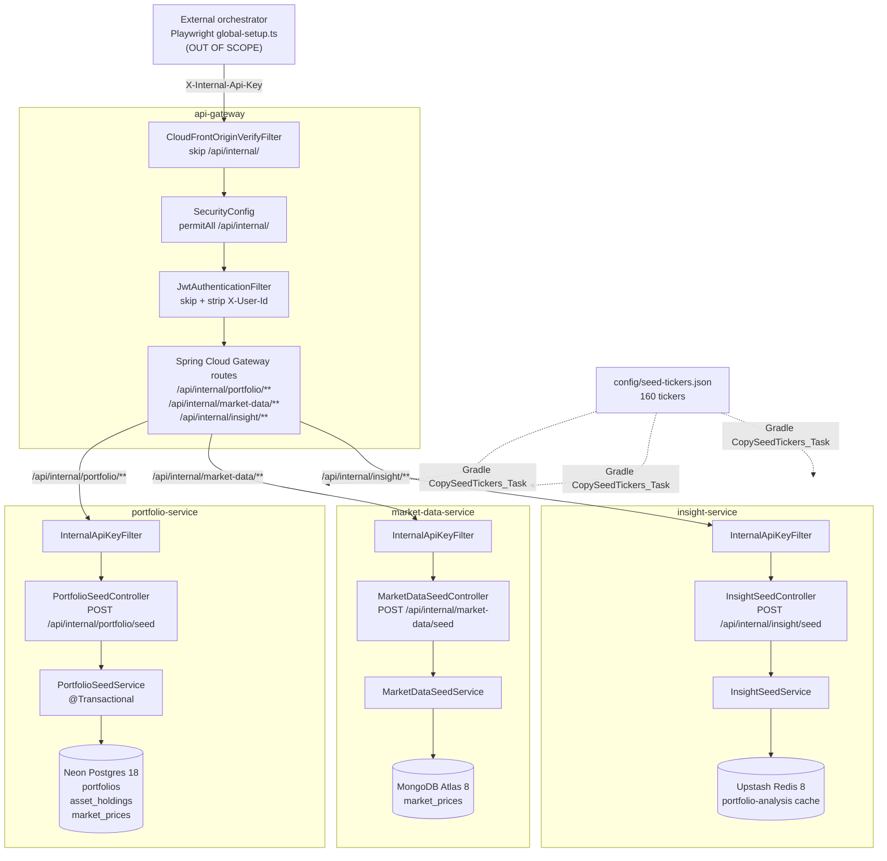
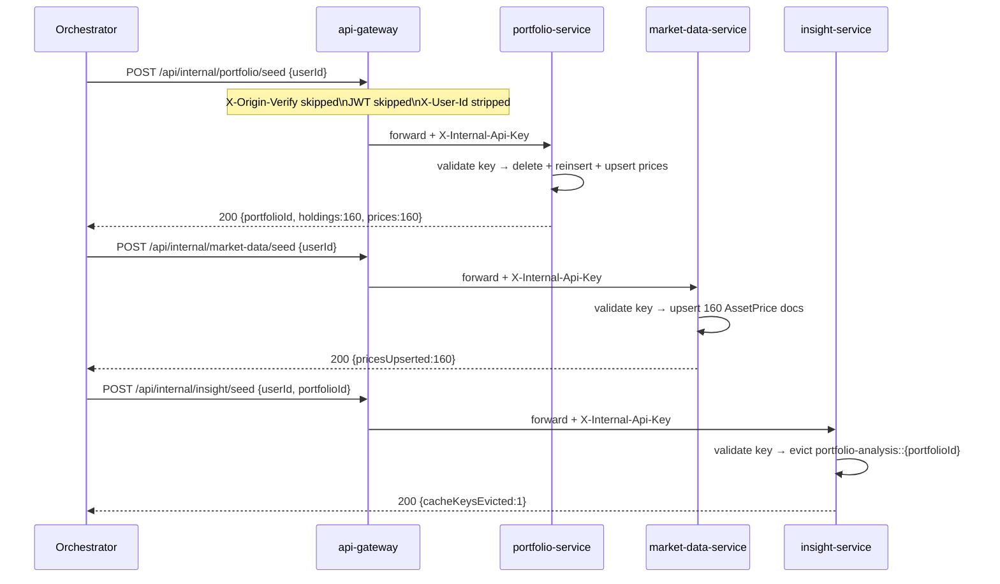
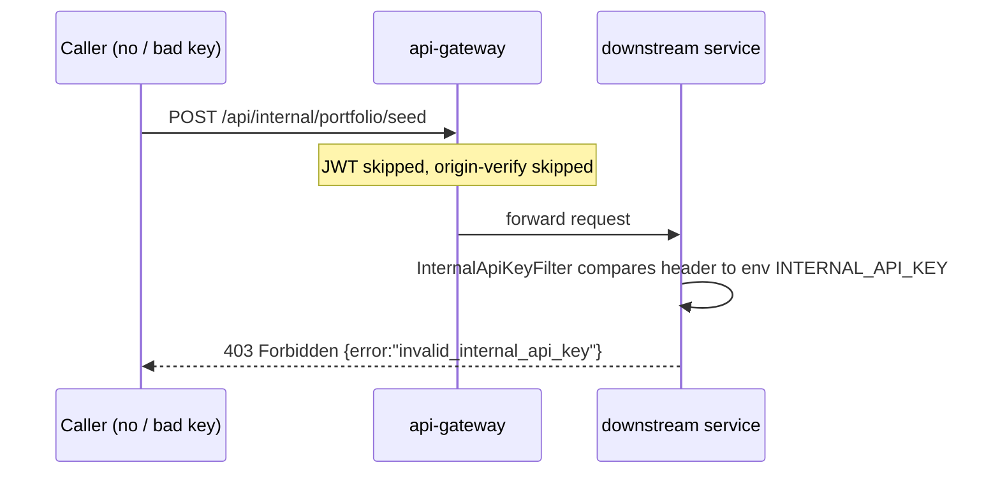

# Design Document: Golden State Seeder Backend

## Overview

This feature delivers two coupled outcomes. **Phase 1** quarantines the failing
"Dashboard Data Integration Diagnostics" Playwright suite so the CI pipeline is unblocked
without deleting test infrastructure. **Phase 2** introduces a *Golden State* seeding engine
spanning `portfolio-service` (Postgres), `market-data-service` (MongoDB), and
`insight-service` (Redis cache eviction), exposed behind the API Gateway under
`/api/internal/**`. A single `config/seed-tickers.json` file — 160 entries across 50 US
equities, 50 NSE equities, 50 crypto, and 10 forex — is the canonical ticker dictionary,
copied into each service's resources at build time by a Gradle task. The API Gateway acts
as a **dumb router** only; all fan-out orchestration is the caller's responsibility
(Playwright `global-setup.ts`, out of scope here). Internal endpoints bypass JWT auth and
CloudFront origin verification but are protected by an `X-Internal-Api-Key` header validated
independently by each service. A new Flyway migration `V10` provisions the E2E test user,
a TypeScript helper regenerates the scrypt password hash on demand, and Terraform propagates
the `INTERNAL_API_KEY` to all four Lambda functions.

---

## Architecture



**Architectural principles:**

- **No gateway fan-out.** The gateway exposes three independent pass-through routes. Any
  scatter-gather is the caller's job; this keeps the gateway stateless and avoids coupling
  its lifecycle to multiple downstream contracts.
- **Single source of truth** for ticker data: `config/seed-tickers.json` at the repo root,
  physically copied (not symlinked) into each service's `src/main/resources/seed/` at build
  time. This keeps services self-contained after packaging into their Docker/Lambda images.
- **Defence in depth at the internal boundary.** The gateway still strips spoofed
  `X-User-Id`, and each service independently validates `X-Internal-Api-Key`. Misconfiguring
  one layer never exposes the seed endpoints.
- **Idempotent by construction.** `UPSERT` / `ON CONFLICT DO UPDATE` / `MongoTemplate.upsert`
  / `cache.evict` are all idempotent. Two consecutive seed calls converge to the same state.
- **Deterministic outputs.** Every price and quantity is derived from a stable hash of
  `(ticker, userId)` — no randomness, no wall-clock dependence except the `updatedAt`
  timestamp.

---

## Sequence Diagrams

### Phase 2 — End-to-End Seed (from caller perspective)



### Rejection Path — Missing or Wrong `X-Internal-Api-Key`



The gateway **does not** validate the key. Centralising key-checks in the gateway would
create a single chokepoint whose failure silently exposes all three services; validating at
each service keeps the authorization decision co-located with the resource it protects.

---

## Components and Interfaces

### 1. `config/seed-tickers.json` — Canonical Ticker Dictionary

**Location:** `config/seed-tickers.json` at the repository root.

**Schema:**

```json
[
  { "ticker": "AAPL",       "assetClass": "US_EQUITY", "quoteCurrency": "USD", "basePrice": 195.89 },
  { "ticker": "RELIANCE.NS","assetClass": "NSE",       "quoteCurrency": "INR", "basePrice": 2845.60 },
  { "ticker": "BTC-USD",    "assetClass": "CRYPTO",    "quoteCurrency": "USD", "basePrice": 67432.00 },
  { "ticker": "EURUSD=X",   "assetClass": "FOREX",     "quoteCurrency": "USD", "basePrice": 1.0823  }
]
```

**Invariants (Requirement 2):**

| Constraint                               | Value                                                 |
|------------------------------------------|-------------------------------------------------------|
| Total entries                            | 160                                                   |
| `assetClass = "US_EQUITY"` count         | 50                                                    |
| `assetClass = "NSE"` count               | 50                                                    |
| `assetClass = "CRYPTO"` count            | 50                                                    |
| `assetClass = "FOREX"` count             | 10                                                    |
| `ticker` uniqueness                      | Globally unique across all 160 entries                |
| `basePrice`                              | `> 0`, realistic market snapshot in the quote currency |
| `quoteCurrency`                          | ISO 4217 for fiat, 3-5 letter code for crypto quotes  |

**Gradle copy task (Groovy DSL)** — added once per service to
`portfolio-service/build.gradle`, `market-data-service/build.gradle`, and
`insight-service/build.gradle`:

```groovy
tasks.register('copySeedTickers', Copy) {
    description = 'Copies the canonical ticker dictionary from repo root into service resources.'
    group = 'build'
    from rootProject.file('config/seed-tickers.json')
    into layout.projectDirectory.dir('src/main/resources/seed')
}

tasks.named('processResources') {
    dependsOn 'copySeedTickers'
}
```

Consequence: every packaged artifact (fat JAR, Docker image, Lambda Image) contains the file
at the classpath location `seed/seed-tickers.json`. Services load it via
`ClassPathResource("seed/seed-tickers.json")`; no network call and no environment-specific
filesystem access is required at runtime.

---

### 2. `SeedTickerRegistry` — Shared Ticker Loader (per service)

**Purpose:** Load, parse, and cache `seed/seed-tickers.json` from the classpath once at
application startup. Each service has its own copy of this class (no shared module is
introduced to keep service autonomy intact).

**Interface:**

```java
public final class SeedTickerRegistry {
    public record SeedTicker(String ticker, String assetClass, String quoteCurrency, BigDecimal basePrice) {}

    @PostConstruct
    void load();                                  // reads classpath:seed/seed-tickers.json

    List<SeedTicker> all();                       // immutable view, size == 160
    Optional<SeedTicker> find(String ticker);     // O(1) hash lookup
}
```

**Preconditions:**
- Classpath resource `seed/seed-tickers.json` exists (guaranteed by
  `CopySeedTickers_Task → processResources`).
- JSON deserialises to a `List<SeedTicker>` with exactly 160 entries.

**Postconditions:**
- `all()` returns an unmodifiable `List<SeedTicker>` of size 160, stably ordered as in the
  source file.
- Startup fails fast with a descriptive exception if the resource is missing, malformed, or
  the asset-class counts violate the invariants.


---

### 3. `DeterministicPriceCalculator` — Jitter Algorithm (per service)

**Purpose:** Derive a reproducible, ticker-and-user-specific price from `basePrice` using a
stable hash, so that Postgres and MongoDB agree on prices byte-for-byte across runs
(Requirement 11).

**Pseudocode:**

```
function compute(basePrice, ticker, userId):
    seed       = (ticker + ":" + userId).hashCode()          // Java String.hashCode — 32-bit, stable
    jitterBps  = Math.floorMod(seed, 500)                    // [0, 499] basis points → [0%, 4.99%]
    multiplier = 1 + (jitterBps / 10000.0)                   // [1.0000, 1.0499]
    return basePrice.multiply(BigDecimal.valueOf(multiplier))
                    .setScale(4, HALF_UP)
```

**Properties:**

- **Determinism.** `compute("AAPL", "…e2e", 195.89)` returns the same `BigDecimal` on every
  JVM for every invocation — `String.hashCode` is specified by the JLS (§ `java.lang.String`)
  and has not changed across JDK versions.
- **Range.** Output is always in `[basePrice, basePrice × 1.0499]`, strictly within the 5%
  ceiling (Requirement 11.1).
- **Cross-service equality.** Portfolio-service and market-data-service use the same
  algorithm with the same inputs ⇒ identical stored prices.

The same calculator is also used by the portfolio-service seeder to produce the
`market_prices.current_price` column, so the two stores never drift for the golden user.

---

### 4. portfolio-service — `PortfolioSeedController` + `PortfolioSeedService`

**HTTP Interface:**

```
POST /api/internal/portfolio/seed
Headers:
  X-Internal-Api-Key: <secret>
  Content-Type:       application/json
Body:
  { "userId": "00000000-0000-0000-0000-000000000e2e" }

200 OK
  { "portfolioId": "c4f8…-…-…", "holdingsInserted": 160, "marketPricesUpserted": 160 }

403 Forbidden  — missing/invalid X-Internal-Api-Key
400 Bad Request — userId missing or not a valid UUID/email
```

**`PortfolioSeedService.seed(String userId)` contract:**

*Preconditions:*
- `userId` is non-null and non-blank. The `ba_user` row for this `userId` already exists
  (provisioned by Flyway V9 for the dev user or V10 for the E2E user).
- `SeedTickerRegistry.all()` returned 160 entries at startup.
- An active transaction is managed by `@Transactional` on the method.

*Steps (all within a single Postgres transaction — Requirement 3.6):*

1. Load existing portfolios for `userId`: `SELECT id FROM portfolios WHERE user_id = :userId`.
2. For each portfolio id found: `DELETE FROM asset_holdings WHERE portfolio_id = :id`
   (Requirement 3.1). `orphanRemoval = true` on the JPA side also covers this, but the
   explicit delete is retained for defensive clarity.
3. `DELETE FROM portfolios WHERE user_id = :userId` (Requirement 3.2).
4. Insert **one** new `Portfolio` row: `INSERT INTO portfolios (id, user_id, created_at) …`.
   The generated UUID becomes the return value.
5. For each of the 160 `SeedTicker` entries:
   - `quantity = Math.floorMod(ticker.hashCode(), 50) + 1` → `[1, 50]` (Requirement 3.4).
   - `purchasePrice = DeterministicPriceCalculator.compute(basePrice, ticker, userId)`.
   - Insert an `AssetHolding` with `(portfolio_id, ticker, quantity, purchase_price, quote_currency)`.
6. For each of the 160 entries, upsert into `market_prices`:
   ```sql
   INSERT INTO market_prices (ticker, current_price, quote_currency, updated_at)
   VALUES (:ticker, :price, :quoteCurrency, now())
   ON CONFLICT (ticker) DO UPDATE
     SET current_price   = EXCLUDED.current_price,
         quote_currency  = EXCLUDED.quote_currency,
         updated_at      = EXCLUDED.updated_at;
   ```
   (Requirement 3.5). Implemented as a JDBC batch via `NamedParameterJdbcTemplate`
   (160 rows → one round-trip).

*Postconditions:*
- Exactly `1` row in `portfolios` and exactly `160` rows in `asset_holdings` for `userId`.
- Exactly `160` tickers from the registry exist in `market_prices` with the jittered price.
- Rows for tickers outside the 160-ticker set are untouched.
- Response body contains the generated `portfolioId` (Requirement 3.9).
- Running the method twice consecutively yields identical row counts and byte-identical
  values in `asset_holdings` and `market_prices` (Requirement 3.7).

*Failure modes:*
- Any SQL failure → transaction rolls back → response `500` with sanitised error body. The
  pre-existing state is preserved.
- `X-Internal-Api-Key` missing or wrong → `InternalApiKeyFilter` returns `403` before the
  controller is entered (Requirement 3.8).


---

### 5. market-data-service — `MarketDataSeedController` + `MarketDataSeedService`

**HTTP Interface:**

```
POST /api/internal/market-data/seed
Headers:
  X-Internal-Api-Key: <secret>
  Content-Type:       application/json
Body:
  { "userId": "00000000-0000-0000-0000-000000000e2e" }

200 OK
  { "pricesUpserted": 160 }

403 Forbidden — missing/invalid X-Internal-Api-Key
```

**`MarketDataSeedService.seed(String userId)` contract:**

*Preconditions:*
- `userId` is non-null and non-blank.
- MongoDB `market_prices` collection is reachable; the existing `BaselineSeeder` may have
  already populated shell documents.

*Steps:*

For each `SeedTicker` in the registry (i.e. 160 tickers), build an upsert:

```java
Query q = new Query(Criteria.where("_id").is(entry.ticker()));
Update u = new Update()
    .set("currentPrice",   DeterministicPriceCalculator.compute(entry.basePrice(), entry.ticker(), userId))
    .set("quoteCurrency",  entry.quoteCurrency())
    .set("assetClass",     entry.assetClass())
    .set("updatedAt",      Instant.now())
    .setOnInsert("ticker", entry.ticker());
mongoTemplate.upsert(q, u, AssetPrice.class);
```

The 160 upserts are grouped via `BulkOperations.unordered(AssetPrice.class)` so a single
Mongo round-trip executes the full batch.

*Postconditions:*
- For every ticker `t` in the registry, `db.market_prices.findOne({_id: t})` returns a
  document whose `currentPrice` matches the `DeterministicPriceCalculator` output
  (Requirement 4.1, 4.2).
- Documents for tickers outside the 160-ticker set — including the legacy baseline-seeded
  tickers (`AAPL`, `TSLA`, `BTC/USD`) — remain untouched. The seeder **does not wipe** the
  collection (Requirement 4.3).
- Running the method twice yields identical document state for the 160 seeded tickers
  (Requirement 4.4). `updatedAt` *does* refresh on each run — this is acceptable because
  the requirement specifies "identical document *contents*" in the domain sense; timestamps
  are metadata. If strict byte equality on `updatedAt` becomes required, the design can be
  tightened by setting `updatedAt` to a deterministic value derived from `(ticker, userId)`.

---

### 6. insight-service — `InsightSeedController` + `InsightSeedService`

**HTTP Interface:**

```
POST /api/internal/insight/seed
Headers:
  X-Internal-Api-Key: <secret>
  Content-Type:       application/json
Body:
  { "userId": "…", "portfolioId": "c4f8…-…-…" }

200 OK
  { "cacheKeysEvicted": 1 }

403 Forbidden       — missing/invalid X-Internal-Api-Key
400 Bad Request     — portfolioId missing or not a UUID
```

**Design rationale:** the caller has already received `portfolioId` from the
portfolio-service seed response. Having insight-service resolve the portfolio via a round-
trip back to portfolio-service would (a) introduce a circular call, (b) require service
discovery, and (c) make insight-service coupled to the portfolio persistence layout. The
caller-passes-portfolioId approach keeps insight-service a thin, stateless shim
(Requirement 5.1).

**`InsightSeedService.evict(String portfolioId)` contract:**

*Preconditions:*
- `portfolioId` is a valid UUID string.
- A `CacheManager` bean exposing a cache named `portfolio-analysis` is available (existing
  bean, unchanged by this design).

*Steps:*

```java
Cache cache = cacheManager.getCache("portfolio-analysis");
if (cache == null) return new EvictResult(0);
cache.evict(portfolioId);                    // idempotent — removes key if present, no-op otherwise
return new EvictResult(1);                   // count of eviction calls issued, not of keys that existed
```

*Postconditions:*
- The Redis entry keyed `portfolio-analysis::<portfolioId>` no longer exists (Requirement 5.2).
- The `sentiment` cache is not touched (Requirement 5.3). This is guaranteed by the code
  referencing only the `portfolio-analysis` cache name; there is no wildcard flush.
- Response body contains `cacheKeysEvicted` (Requirement 5.4). The service reports the
  number of eviction commands issued (always 1 on success), not whether the key existed —
  this keeps the endpoint idempotent without requiring a `HEXISTS`-then-`DEL` two-step.


---

### 7. `InternalApiKeyFilter` — Shared Per-Service Guard

Each of the three backend services registers an identical Spring filter (ordered before all
other app filters) that short-circuits any request to `/api/internal/**` whose
`X-Internal-Api-Key` header does not match the configured secret.

**Configuration:**

```yaml
app:
  internal:
    api-key: ${INTERNAL_API_KEY:}
```

**Behaviour:**

- If `app.internal.api-key` is blank (local dev without the env var set), the filter logs a
  single WARN at startup and **rejects all `/api/internal/**` requests with 503** — a blank
  secret must never be treated as "allow". A concrete empty string in the header would also
  equal the blank config, so fail-closed semantics are required.
- On a populated config, the filter compares the header using `MessageDigest.isEqual` on the
  UTF-8 bytes to avoid timing-based oracles.
- Non-`/api/internal/**` requests pass through untouched.

This filter is scoped to each backend service; the api-gateway does **not** validate the
key (see Architectural principles).

---

### 8. api-gateway — Routing and Security Bypass

#### 8a. Spring Cloud Gateway routes (`api-gateway/src/main/resources/application.yml`)

Append three pass-through routes to the existing route list:

```yaml
spring:
  cloud:
    gateway:
      server:
        webflux:
          routes:
            # ... existing routes (portfolio-service, market-data-service, insight-service, insight-chat)

            - id: internal-portfolio-seed
              uri: ${PORTFOLIO_SERVICE_URL:http://localhost:8081}
              predicates:
                - Path=/api/internal/portfolio/**

            - id: internal-market-data-seed
              uri: ${MARKET_DATA_SERVICE_URL:http://localhost:8082}
              predicates:
                - Path=/api/internal/market-data/**

            - id: internal-insight-seed
              uri: ${INSIGHT_SERVICE_URL:http://localhost:8083}
              predicates:
                - Path=/api/internal/insight/**
```

The existing `PORTFOLIO_SERVICE_URL`/`MARKET_DATA_SERVICE_URL`/`INSIGHT_SERVICE_URL` env
vars are reused, so no new Terraform wiring is needed for routing. No filters are configured
on these routes — they are raw HTTP proxies (Requirement 6.2, 6.3).

#### 8b. `SecurityConfig` — add `/api/internal/**` to `permitAll()`

Modify `api-gateway/src/main/java/com/wealth/gateway/SecurityConfig.java` so the
`authorizeExchange` DSL lists `/api/internal/**` alongside the existing `/actuator/**` and
`/api/auth/**` permitAll matchers (Requirement 7.1). No JWT decoding, no role evaluation.

#### 8c. `JwtAuthenticationFilter` — bypass and header scrubbing

Extend the existing path-prefix skip logic to treat `/api/internal/` the same way as
`/actuator` and `/api/auth/`:

```java
String path = exchange.getRequest().getPath().value();
if (path.startsWith("/actuator") || path.startsWith("/api/auth/") || path.startsWith("/api/internal/")) {
    // Still strip any caller-supplied X-User-Id (defence against header spoofing)
    ServerWebExchange sanitised = exchange.mutate()
            .request(r -> r.headers(h -> h.remove(X_USER_ID)))
            .build();
    return chain.filter(sanitised);
}
```

Requirement 7.2 + 7.5 are satisfied by the unconditional header remove on bypass paths.

#### 8d. `CloudFrontOriginVerifyFilter` — bypass

Add the same path-prefix check so that requests to `/api/internal/**` do not need the
`X-Origin-Verify` header:

```java
String path = exchange.getRequest().getPath().value();
if (path.startsWith("/api/internal/")) {
    return chain.filter(exchange);     // no verification, no header stripping needed
}
// ... existing CloudFront verification logic
```

(Requirement 7.3.) This matters because synthetic-monitoring runs from a GitHub-hosted
runner without the CloudFront secret header; bypassing origin-verify here is safe because
the key-based authorization happens downstream.

#### 8e. Why the gateway still matters even as a "dumb router"

- **Single egress hostname.** The Playwright orchestrator has one public API origin
  (`https://api.vibhanshu-ai-portfolio.dev`) rather than three.
- **CORS and TLS termination.** The existing gateway config handles both; internal routes
  inherit them for free.
- **Log correlation.** Every internal call is still visible in gateway access logs, which
  simplifies post-hoc debugging of CI failures.


---

## Data Models

### Neon Postgres 18 (portfolio-service)

The portfolio-service connects to a **Neon** serverless Postgres 18 instance via the
standard `postgresql://` JDBC URL. Neon is wire-compatible with vanilla Postgres 18, so
`ON CONFLICT DO UPDATE` and Flyway migrations work unchanged. Neon's scale-to-zero
behaviour means the first seed call after idle periods pays an additional ~300ms compute
cold-start on top of the Lambda cold start — this is inside the latency budget below.

| Table            | Role                        | Touched by seeder                          |
|------------------|-----------------------------|--------------------------------------------|
| `ba_user`        | Better Auth user accounts   | Inserted by Flyway V10 (E2E user)          |
| `ba_account`     | Better Auth credentials     | Inserted by Flyway V10 (scrypt password)   |
| `portfolios`     | Portfolio aggregates        | `DELETE` + `INSERT` per seed call          |
| `asset_holdings` | Portfolio line items        | `DELETE` + 160 `INSERT`s per seed call     |
| `market_prices`  | Latest Postgres price cache | 160 `ON CONFLICT DO UPDATE` upserts        |

No schema changes are introduced beyond Flyway V10. The `market_prices` table already has
a unique constraint on `ticker` (required for `ON CONFLICT (ticker)` to succeed).

### MongoDB Atlas 8 (market-data-service)

The market-data-service connects to **MongoDB Atlas** running MongoDB 8 via an SRV
connection string. The `upsert` and `BulkOperations` APIs used by the seeder are stable
across the 7 → 8 major bump; no driver-level changes are required beyond keeping
`spring-data-mongodb` on a 4.x line compatible with the Atlas 8 wire protocol.

Collection: `market_prices`. Document shape (unchanged from current `AssetPrice` entity):

```json
{
  "_id":           "AAPL",
  "ticker":        "AAPL",
  "currentPrice":  195.8932,
  "quoteCurrency": "USD",
  "assetClass":    "US_EQUITY",
  "updatedAt":     "2026-04-20T10:15:30Z"
}
```

`assetClass` is a new field added by the seeder via `Update.set`. Existing documents without
`assetClass` are unaffected; no migration is required because MongoDB is schemaless and the
field is only read by future read paths, not by current code.

### Upstash Redis 8 (insight-service)

The insight-service connects to **Upstash** serverless Redis 8 over TLS via the standard
`rediss://` URL, using the existing Spring Data Redis configuration. Upstash exposes a
fully-managed, single-shard Redis 8 instance with a `DEL` command that is byte-compatible
with open-source Redis — the `cache.evict(portfolioId)` call compiles down to a single
`DEL portfolio-analysis::<portfolioId>` over the wire.

Cache: `portfolio-analysis` (existing). Key format: `portfolio-analysis::<portfolioId>`
(Spring `SimpleKeyGenerator` default). Value: Jackson-serialised `PortfolioAnalysis` record.

The seeder writes nothing to Redis; it only issues `DEL`.

---

## Flyway Migration — V10

**File:** `portfolio-service/src/main/resources/db/migration/V10__Seed_E2E_Test_User.sql`

Template (password hash generated separately by `generate-scrypt-hash.ts` — see §
"Scrypt Hash Generation Helper"):

```sql
-- =============================================================================
-- V10: Seed the E2E test user into Better Auth tables for CI/CD stabilization.
-- See docs/specs/golden-state-seeder-backend/design.md.
-- Idempotent via ON CONFLICT DO NOTHING. Password: see generate-scrypt-hash.ts.
-- =============================================================================

INSERT INTO "ba_user" ("id", "name", "email", "emailVerified", "image", "createdAt", "updatedAt")
VALUES (
    '00000000-0000-0000-0000-000000000e2e',
    'E2E Test User',
    'e2e-test-user@vibhanshu-ai-portfolio.dev',
    TRUE,
    NULL,
    NOW(),
    NOW()
)
ON CONFLICT ("id") DO NOTHING;

INSERT INTO "ba_account" (
    "id", "accountId", "providerId", "userId",
    "accessToken", "refreshToken", "idToken",
    "accessTokenExpiresAt", "refreshTokenExpiresAt",
    "scope", "password", "createdAt", "updatedAt"
)
VALUES (
    '00000000-0000-0000-0000-000000000e2f',
    '00000000-0000-0000-0000-000000000e2e',
    'credential',
    '00000000-0000-0000-0000-000000000e2e',
    NULL, NULL, NULL,
    NULL, NULL,
    NULL,
    '<SALT_HEX>:<DERIVED_KEY_HEX>',
    NOW(),
    NOW()
)
ON CONFLICT ("id") DO NOTHING;
```

Requirement mapping: 8.1 (user id & email), 8.2 (account with credential provider), 8.3
(scrypt params via the helper), 8.4 (ON CONFLICT DO NOTHING), 8.5 (filename & location).

**Ordering note:** Flyway executes V10 after V9 by version number, which means V10 may run
on a database that already has the V9 dev user. The two users are disjoint by `id` and
`email`, so no conflicts occur.

---

## Scrypt Hash Generation Helper

**File:** `frontend/scripts/generate-scrypt-hash.ts`

**Interface:**

```bash
npx tsx frontend/scripts/generate-scrypt-hash.ts "mySecurePassword"
# → a1b2c3d4e5f6a7b8a1b2c3d4e5f6a7b8:e71aef04…  (copy into V10__Seed_E2E_Test_User.sql)
```

**Behaviour (Requirement 9):**

1. Parses the password from `process.argv[2]`; exits with a usage message if absent.
2. Generates a 16-byte cryptographically random salt via `crypto.randomBytes(16)`.
3. Derives a 64-byte key via `crypto.scryptSync(password, salt, 64, { N: 16384, r: 16, p: 1 })`.
4. Emits `<saltHex>:<keyHex>` on stdout — the exact format expected by Better Auth's
   credential verifier and consumed verbatim by the V10 SQL.
5. Header comment references `V10__Seed_E2E_Test_User.sql` and links back to this design.

The script is **not** run at build time. It is a developer utility invoked ad-hoc whenever
the E2E password needs rotation; the resulting hash is then pasted into V10 and committed.


---

## Terraform Configuration

**Module:** `infrastructure/terraform/modules/compute/`.

### `variables.tf`

Append:

```hcl
variable "internal_api_key" {
  type        = string
  sensitive   = true
  default     = ""
  description = <<-EOT
    Shared secret validated by each backend service's InternalApiKeyFilter for
    requests to /api/internal/**. Empty default keeps terraform plan working
    locally; CI/CD sets it via TF_VAR_internal_api_key. A blank value at runtime
    causes services to reject all /api/internal/** requests with HTTP 503.
  EOT
}
```

(Requirement 10.2, 10.3, 10.4.)

### `main.tf` — environment blocks

For each of the four Lambda resources (`aws_lambda_function.api_gateway`,
`.portfolio_service`, `.market_data_service`, `.insight_service`), add `INTERNAL_API_KEY`
inside the existing `environment { variables = { … } }` block:

```hcl
environment {
  variables = merge(
    # … existing key/value pairs …
    { INTERNAL_API_KEY = var.internal_api_key }
  )
}
```

(Requirement 10.1.) Using `merge` keeps the existing variables block intact and makes the
addition a minimal diff.

### Root module wiring

`infrastructure/terraform/main.tf` (root) passes the variable through:

```hcl
module "compute" {
  # …
  internal_api_key = var.internal_api_key
}

variable "internal_api_key" {
  type      = string
  sensitive = true
  default   = ""
}
```

### GitHub Actions wiring

The CI workflow that deploys (`deploy.yml`) and the synthetic-monitoring workflow (created
in Phase 3, out of scope here) both export `TF_VAR_internal_api_key` from a GitHub
Environment secret `INTERNAL_API_KEY`. The same secret is used by Playwright's
`global-setup.ts` to populate the `X-Internal-Api-Key` header on outbound seed calls.

---

## Phase 1 — CI/CD Pipeline Quarantine

The failing suite is the `Dashboard Data Integration Diagnostics` describe in
`frontend/tests/e2e/dashboard-data.spec.ts`. Quarantine is applied in-spec rather than via
`--grep-invert` so the skip is visible in PRs and PR reviewers can spot it when the bug is
fixed (Requirement 1.1, 1.3):

```typescript
// BEFORE
test.describe('Dashboard Data Integration Diagnostics', () => { /* … */ });

// AFTER
test.describe.skip('Dashboard Data Integration Diagnostics', () => { /* … */ });
```

**Why `.skip()` on the describe instead of `--grep-invert`:**

- `--grep-invert` is a CLI-level filter invisible to `test --list`, so a future developer
  reading the spec has no indication the suite is disabled in CI.
- `.skip()` causes Playwright to emit the suite in the reporter output as "skipped", which
  turns the quarantine into a visible TODO that surfaces in every CI summary
  (Requirement 1.4).

The remaining suites — `auth-jwt-health.spec.ts` and `golden-path.spec.ts` — continue to run
as a fast UI smoke against the mocked app (Requirement 1.2). No change is made to
`frontend-e2e-integration.yml` itself; the quarantine is purely in-spec.

**Exit criteria for un-quarantining:** once the Phase 2 seeder is wired into a
synthetic-monitoring workflow (out of scope here) and the seeder is confirmed to reliably
produce the Golden State in AWS, the `.skip()` can be removed and the dashboard diagnostics
suite re-pointed at the seeded test user.

---

## Correctness Properties

| # | Property                                                                                                             | Requirement Mapping |
|---|----------------------------------------------------------------------------------------------------------------------|---------------------|
| P1| `dashboard-data.spec.ts` reports its describe as "skipped", not "failed", in the Playwright reporter                 | 1.1, 1.4            |
| P2| `config/seed-tickers.json` contains exactly 160 entries with the required asset-class distribution                    | 2.1, 2.2            |
| P3| After `processResources`, each service's JAR/image contains `seed/seed-tickers.json` with identical bytes to the root | 2.3, 2.4, 2.5       |
| P4| After `POST /api/internal/portfolio/seed {userId}`, Postgres has exactly 1 portfolio row and 160 asset_holdings rows  | 3.1, 3.2, 3.3       |
| P5| Two consecutive portfolio seed calls leave row counts and column values byte-identical                               | 3.7, 11.2           |
| P6| Portfolio seed response body contains the generated `portfolioId`                                                    | 3.9                 |
| P7| Portfolio seed executes inside a single transaction — a forced exception at step 5 rolls back steps 1–4              | 3.6                 |
| P8| After `POST /api/internal/market-data/seed`, all 160 tickers exist in Mongo `market_prices` with jittered prices      | 4.1, 4.2            |
| P9| The market-data seeder never deletes or updates tickers outside the 160-ticker registry                              | 4.3                 |
| P10| `POST /api/internal/insight/seed {portfolioId}` evicts `portfolio-analysis::<portfolioId>` and nothing from `sentiment` | 5.2, 5.3           |
| P11| Each service returns `403` when `X-Internal-Api-Key` is absent or wrong, even though Spring Security permits the path | 3.8, 4.5, 5.5, 7.4  |
| P12| The api-gateway forwards `X-Internal-Api-Key` unmodified and strips any caller-supplied `X-User-Id` on internal paths | 6.3, 7.5            |
| P13| `/api/internal/**` traffic is accepted by the gateway without a JWT and without `X-Origin-Verify`                     | 7.1, 7.2, 7.3       |
| P14| Flyway V10 is idempotent — running migrations twice on a seeded DB yields zero inserts and zero errors               | 8.4                 |
| P15| `generate-scrypt-hash.ts "password"` emits a hash that, when pasted into V10, authenticates via Better Auth sign-in  | 8.3, 9.2, 9.3       |
| P16| `DeterministicPriceCalculator.compute(base, ticker, userId)` is a pure function — same inputs ⇒ same output forever | 11.1, 11.2, 11.3    |
| P17| All four Lambdas have `INTERNAL_API_KEY` populated from `var.internal_api_key` after `terraform apply`              | 10.1, 10.2, 10.3    |


---

## Testing Strategy

### Unit tests

- **`SeedTickerRegistryTest`** — load the real `seed/seed-tickers.json`, assert
  `all().size() == 160` and the asset-class distribution (50/50/50/10).
- **`DeterministicPriceCalculatorTest`** — table-driven test with four fixed inputs; assert
  byte-for-byte equality of the `BigDecimal` output across two invocations.
- **`InternalApiKeyFilterTest`** — `MockMvc` / `WebTestClient` tests covering:
  missing header → 403, wrong header → 403, correct header → downstream called, blank
  config → 503.

### Integration tests (Requirement 12)

Each service owns a Testcontainers-backed test that spins up its real data store and asserts
the full seed contract. Tests run against open-source containers matching the AWS-side
major versions — Neon (Postgres 18), MongoDB Atlas (MongoDB 8), and Upstash (Redis 8) are
all wire-compatible with their upstream images, so a Testcontainers image of the same major
is a faithful proxy. No cross-service integration test is introduced at this layer — the
end-to-end contract is exercised by the out-of-scope Playwright synthetic-monitoring suite.

| Service                | Container(s)                         | Key assertions                                                                                                                                                                                   | Requirement |
|------------------------|--------------------------------------|--------------------------------------------------------------------------------------------------------------------------------------------------------------------------------------------------|-------------|
| portfolio-service      | `postgres:18` (Neon-compat)          | After seed: `count(portfolios)=1`, `count(asset_holdings)=160`, `count(market_prices)≥160`. Response body contains `portfolioId`. Second invocation: identical row counts and hash of full snapshot. | 12.1        |
| market-data-service    | `mongo:8` (Atlas-compat)             | After seed: `db.market_prices.countDocuments({_id: {$in: [...160 tickers]}})=160`; pre-existing unrelated documents unchanged. Second invocation: `currentPrice` byte-identical.                     | 12.2        |
| api-gateway            | WireMock (portfolio stub)            | `POST /api/internal/portfolio/seed` with no JWT: forwarded. Same request with missing `X-Internal-Api-Key`: downstream returns 403 and the 403 is propagated verbatim.                              | 12.3        |
| insight-service        | `redis:8` (Upstash-compat)           | Pre-populate `portfolio-analysis::<id>` and `sentiment::AAPL`. After seed with `{portfolioId: id}`: portfolio-analysis entry gone, sentiment entry intact. Response body `cacheKeysEvicted=1`.      | 12.4        |

### Regression protection for Phase 1

Add a single assertion in a CI lint step (or a trivial Node script invoked in
`frontend-e2e-integration.yml`) that checks for the literal string
`test.describe.skip('Dashboard Data Integration Diagnostics'` in `dashboard-data.spec.ts`.
If the skip is accidentally removed before the seeder lands, CI flags the regression before
the flaky suite starts failing again.

---

## Security Considerations

- **Secret handling.** `INTERNAL_API_KEY` is passed as a Lambda environment variable. AWS
  Lambda env vars are encrypted at rest with KMS; values appear in CloudTrail only when the
  function config is read, which is logged and auditable. Terraform marks the variable
  `sensitive = true` to keep it out of plan output.
- **Timing-safe comparison.** The filter uses `MessageDigest.isEqual` for header comparison
  to prevent timing oracles. Java's `String.equals` short-circuits on first mismatch and is
  **not** constant time.
- **Key rotation.** Rotation is a two-step: update the GitHub secret → re-run `terraform
  apply`. Because the key is stateless (no DB record), no migration is needed.
- **Blast radius.** If `INTERNAL_API_KEY` leaks, the attacker can:
  - Reset the golden test user's portfolio and cache (already the intent).
  - **Not** access any real user's data — the endpoints operate only on `userId` supplied in
    the body, and PR review must enforce that this `userId` remains the fixed E2E user.
- **Defence in depth.** Even if `SecurityConfig` were misconfigured to reject `/api/internal/**`
  at the gateway (e.g., JWT required), the downstream `InternalApiKeyFilter` would still
  enforce the key. Conversely, a downstream service with a blank key fails closed rather
  than open. Two independent layers; both must fail to break security.

---

## Non-Functional Considerations

- **Latency budget.** A single seed call targets ≤ 4s wall-clock on AWS Lambda cold start.
  Portfolio seed dominates (1 `DELETE`, 1 `INSERT`, 160-row `INSERT` batch, 160-row upsert
  batch). With JDBC batching and `reWriteBatchedInserts=true` on the PgJDBC driver, the DB
  round-trip is ~300–500ms against a warm Neon compute endpoint; Neon scale-to-zero adds
  ~300ms on the first call after idle, and Lambda cold start adds another ~1–2s. Total is
  well inside the 45s Playwright global timeout. Mongo Atlas and Upstash Redis seed calls
  are sub-second because both are single-round-trip operations (one bulk upsert, one `DEL`).
- **Payload size.** Request body is ~100 bytes; response body is ~200 bytes. No need for
  streaming or chunked responses.
- **Concurrency.** The golden test user has a single fixed id; concurrent seed calls would
  race on `DELETE portfolios WHERE user_id=…`. Playwright's `workers=1` for the
  synthetic-monitoring project (set in Phase 3, out of scope) guarantees serial access. If
  parallelism is added later, wrap the seed SQL path in `SELECT … FOR UPDATE` on the
  `ba_user` row.
- **Observability.** Each seeder emits a single INFO log line with structured fields
  `event=seed.completed`, `service=<name>`, `userId=<id>`, `durationMs=<n>`, `rowsWritten=<n>`.
  No new metrics are added; the existing Lambda duration + error-rate metrics are sufficient
  for detecting seeder regressions.

---

## Out of Scope

The following items are explicitly **out of scope** for this spec and are called out so a
reviewer can confirm nothing is missed at the boundary:

- Playwright `global-setup.ts` changes, the `aws-synthetic` project definition, and the
  `synthetic-monitoring.yml` workflow (Phase 3, assigned to frontend).
- The live UI contract-verification test suite itself.
- Any modification to the Kafka DLQ, Bedrock integration, or baseline market-data scheduled
  refresh.
- Production-user data seeding. The seeder is for the golden E2E user only; accidentally
  pointing it at a real `userId` would wipe real portfolio data. Request validation that
  rejects non-E2E `userId`s is a future hardening step (tracked separately).
